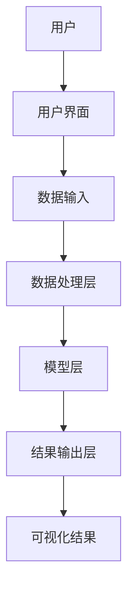
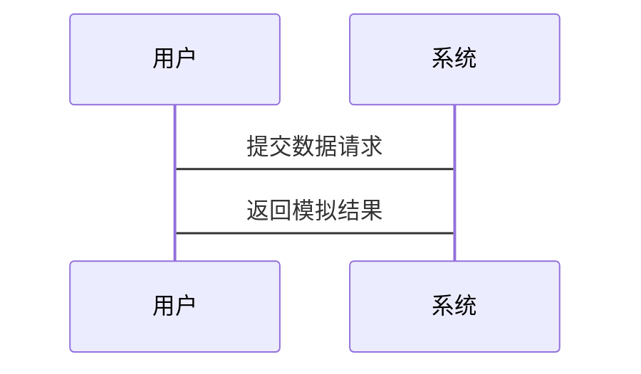

                 


# AI驱动的企业财务战略情景模拟系统

## 关键词：AI驱动，企业财务，战略情景模拟系统，财务决策，人工智能，情景分析

## 摘要：本文介绍了一种基于人工智能的企业财务战略情景模拟系统，探讨了如何利用AI技术构建情景模拟模型，分析复杂的财务环境，优化企业财务战略，帮助企业在不确定性和竞争中做出明智的决策。

---

## 第一部分: AI驱动的企业财务战略情景模拟系统概述

### 第1章: 问题背景与核心概念

#### 1.1 问题背景
- 1.1.1 传统企业财务战略的局限性：
  - 依赖人工经验，难以处理复杂多变的市场环境。
  - 数据处理能力有限，难以实时分析海量信息。
  - 战略调整滞后，无法快速应对市场变化。

- 1.1.2 AI技术对企业财务管理的影响：
  - 提高数据处理和分析效率。
  - 实现财务预测和决策的自动化。
  - 支持更精准的市场趋势分析。

- 1.1.3 情景模拟在财务决策中的重要性：
  - 通过模拟不同市场条件下的财务表现，优化战略选择。
  - 帮助企业在不确定性中制定更稳健的财务计划。

#### 1.2 核心概念
- 1.2.1 AI驱动的定义：
  - 利用人工智能技术（如机器学习、深度学习）构建财务模型和分析工具。

- 1.2.2 企业财务战略的内涵：
  - 企业为了实现长期目标而制定的财务计划和策略。

- 1.2.3 情景模拟系统的特征：
  - 数据驱动：基于大量历史数据和实时数据。
  - 智能分析：利用AI算法进行预测和优化。
  - 多维度：涵盖财务、市场、运营等多个维度。

#### 1.3 问题解决与边界
- 1.3.1 问题的解决思路：
  - 利用AI技术构建情景模拟系统，分析不同情景下的财务表现，辅助决策。

- 1.3.2 系统的边界与外延：
  - 系统专注于财务战略分析，不涉及企业运营的其他方面。
  - 边界包括数据输入、模型构建和结果输出。

- 1.3.3 核心要素组成：
  - 数据层：历史财务数据、市场数据、行业数据。
  - 模型层：AI算法、财务模型、预测模型。
  - 用户界面：可视化界面、交互工具。

---

## 第二部分: 核心概念与联系

### 第2章: 核心概念与联系

#### 2.1 核心概念原理
- 2.1.1 AI模型的基本原理：
  - 通过训练数据，AI模型学习财务数据的模式和趋势。
  - 利用这些模式进行预测和模拟。

- 2.1.2 财务战略的实现机制：
  - 数据输入：企业财务数据、市场数据。
  - 模型分析：AI算法生成情景分析结果。
  - 结果输出：财务战略建议、风险预警。

- 2.1.3 情景模拟的核心算法：
  - 概率模型：预测不同情景发生的可能性。
  - 回归分析：分析变量之间的关系。
  - 神经网络：处理复杂的非线性关系。

#### 2.2 核心要素对比
- 2.2.1 AI模型与财务战略的对比分析：
  | 要素       | AI模型               | 财务战略             |
  |------------|----------------------|----------------------|
  | 输入数据   | 结构化和非结构化数据 | 结构化财务数据        |
  | 输出结果   | 预测值和模拟结果     | 战略建议和行动计划    |
  | 处理能力   | 高速、自动化        | 依赖人工经验          |

- 2.2.2 不同情景模拟系统的特征对比：
  | 特征       | 基于规则的系统       | 基于AI的系统         |
  |------------|----------------------|----------------------|
  | 处理能力   | 低效、有限           | 高效、灵活           |
  | 可扩展性   | 低                   | 高                   |

- 2.2.3 核心要素的属性特征表格：
  | 要素       | 属性                 | 特征                 |
  |------------|----------------------|----------------------|
  | 数据       | 来源                 | 多样性               |
  | 模型       | 类型                 | 复杂性               |
  | 结果       | 格式                 | 可解释性             |

#### 2.3 系统架构
- 2.3.1 ER实体关系图：
  ```mermaid
  ERDiagram {
    company(CID, CName, Industry, Revenue)
    market(MID, MName, MarketSize, GrowthRate)
    financial_data(FID, CID, Time, Revenue, Profit)
    scenario(SID, CID, ScenarioName, PredictedRevenue, PredictedProfit)
    company<->many financial_data
    company<->many scenario
    market<->many financial_data
  }
  ```

- 2.3.2 系统架构图：
  ```mermaid
  graph TD
      A[用户] --> B[用户界面]
      B --> C[数据输入]
      C --> D[数据处理层]
      D --> E[模型层]
      E --> F[结果输出层]
      F --> G[可视化结果]
  ```

---

## 第三部分: 算法原理与数学模型

### 第3章: 算法原理

#### 3.1 算法概述
- 3.1.1 概率论基础：
  - 事件概率、条件概率、贝叶斯定理。

- 3.1.2 回归分析：
  - 线性回归、逻辑回归。

- 3.1.3 神经网络简介：
  - 深度学习、神经网络结构。

#### 3.2 算法流程图：
  ```mermaid
  graph TD
      A[开始] --> B[数据预处理]
      B --> C[选择算法]
      C --> D[训练模型]
      D --> E[测试模型]
      E --> F[输出结果]
      F --> G[结束]
  ```

### 第4章: 数学模型与公式

#### 4.1 数学模型
- 4.1.1 概率模型：
  - 事件A发生的概率：$P(A)$。

- 4.1.2 线性回归模型：
  $$y = \beta_0 + \beta_1x + \epsilon$$

- 4.1.3 神经网络模型：
  $$f(x) = \sigma(wx + b)$$
  其中，$\sigma$ 是sigmoid函数。

### 第5章: 代码实现与案例

#### 5.1 环境安装
- Python 3.8+
- TensorFlow、Keras、Pandas、NumPy。

#### 5.2 核心实现代码：
```python
import numpy as np
import pandas as pd
import tensorflow as tf
from tensorflow.keras import layers

# 数据加载
data = pd.read_csv('financial_data.csv')

# 数据预处理
X = data[['revenue', 'profit']]
Y = data['predicted_profit']

# 模型构建
model = tf.keras.Sequential([
    layers.Dense(64, activation='relu'),
    layers.Dense(1, activation='linear')
])

# 编译模型
model.compile(optimizer='adam', loss='mean_squared_error')

# 训练模型
model.fit(X, Y, epochs=100, batch_size=32)
```

#### 5.3 案例分析
- 数据来源：企业财务数据。
- 模型训练：利用历史数据训练AI模型。
- 情景模拟：预测不同市场条件下的财务表现。

---

## 第四部分: 系统分析与架构设计

### 第6章: 系统分析与架构设计

#### 6.1 问题场景介绍
- 企业面临复杂的市场环境，需要优化财务战略。

#### 6.2 系统功能设计
- 数据输入：财务数据、市场数据。
- 数据处理：清洗、转换。
- 模型分析：AI算法生成情景模拟结果。
- 结果输出：可视化报告、财务建议。

#### 6.3 系统架构图：


#### 6.4 接口设计
- 数据接口：API接口，接收数据请求。
- 结果接口：API接口，返回模拟结果。

#### 6.5 交互序列图：


---

## 第五部分: 项目实战

### 第7章: 项目实战

#### 7.1 环境安装
- Python 3.8+
- TensorFlow、Pandas、NumPy。

#### 7.2 核心实现代码
```python
import numpy as np
import pandas as pd
import tensorflow as tf
from tensorflow.keras import layers

# 数据加载
data = pd.read_csv('financial_data.csv')

# 数据预处理
X = data[['revenue', 'profit']]
Y = data['predicted_profit']

# 模型构建
model = tf.keras.Sequential([
    layers.Dense(64, activation='relu'),
    layers.Dense(1, activation='linear')
])

# 编译模型
model.compile(optimizer='adam', loss='mean_squared_error')

# 训练模型
model.fit(X, Y, epochs=100, batch_size=32)
```

#### 7.3 案例分析
- 数据来源：企业财务数据。
- 模型训练：利用历史数据训练AI模型。
- 情景模拟：预测不同市场条件下的财务表现。

#### 7.4 项目小结
- AI驱动的企业财务战略情景模拟系统能够显著提高财务分析的效率和准确性。
- 通过情景模拟，企业可以更好地应对复杂市场环境，优化财务决策。

---

## 第六部分: 高级应用与最佳实践

### 第8章: 高级应用与最佳实践

#### 8.1 系统优化
- 数据清洗：处理缺失值、异常值。
- 模型优化：选择合适的算法，调整超参数。

#### 8.2 案例分析
- 某制造企业利用AI驱动的情景模拟系统优化库存管理。

#### 8.3 最佳实践
- 数据质量：确保数据的准确性和完整性。
- 模型选择：根据具体需求选择合适的AI算法。
- 结果解读：结合业务背景解读模型结果。

#### 8.4 未来展望
- 结合更多AI技术，如自然语言处理，分析非结构化数据。
- 拓展应用场景，如风险评估、投资决策。

---

## 作者：AI天才研究院/AI Genius Institute & 禅与计算机程序设计艺术 /Zen And The Art of Computer Programming

