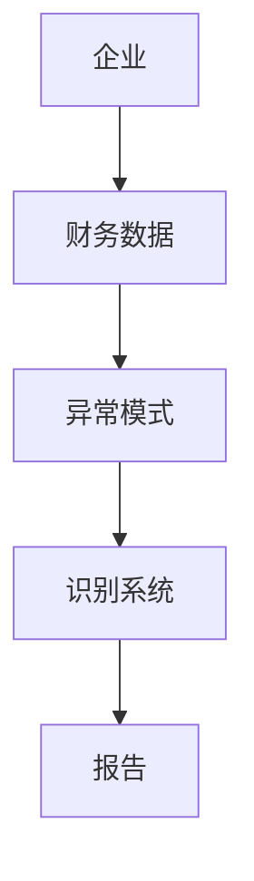
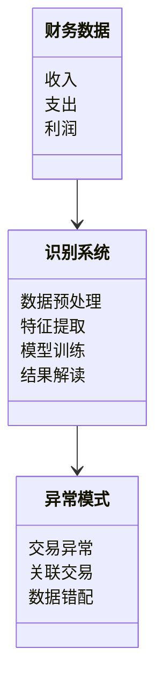
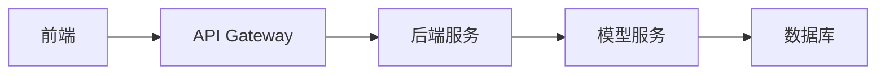

                 


# AI驱动的企业财务报表异常模式识别系统

## 关键词：AI、财务报表、异常模式识别、机器学习、深度学习

## 摘要：
本文探讨了AI在企业财务报表异常模式识别中的应用，分析了传统方法的局限性，并详细介绍了基于机器学习和深度学习的解决方案。文章从背景、核心概念、算法原理到系统架构和项目实战，全面阐述了AI驱动的财务分析系统，最后给出了实际案例分析和优化建议。

---

## 第1章：背景介绍

### 1.1 问题背景
财务报表是企业经济活动的核心记录，识别异常模式对于企业健康和合规性至关重要。传统方法依赖人工审计，效率低且容易出错。

### 1.2 问题描述
异常模式包括虚构交易、关联交易、数据错配等，需识别隐藏在大量数据中的异常。

### 1.3 解决方案
AI技术，特别是机器学习和深度学习，通过模式识别和自动化分析，显著提升了异常检测的效率和准确性。

### 1.4 边界与外延
系统适用于企业财务数据，与审计系统集成，未来可扩展至实时监控和预测分析。

### 1.5 核心概念
涉及数据预处理、特征提取、模型训练、结果解读和反馈优化。

---

## 第2章：核心概念与联系

### 2.1 AI在财务分析中的应用
- 机器学习用于分类预测，深度学习处理复杂关系，NLP分析财务文本。

### 2.2 核心算法对比
| 算法 | 监督 | 特征 | 优点 |
|------|------|------|------|
| 随机森林 | 监督 | 非线性 | 鲁棒，特征重要性分析 |
| 神经网络 | 监督 | 高维 | 高准确性，复杂模式识别 |
| K-means | 无监督 | 聚类 | 发现隐藏结构 |

### 2.3 实体关系图


---

## 第3章：算法原理

### 3.1 监督学习
分类函数：
$$ f(x) = arg\,max_y \, y \cdot w^T x $$
损失函数：
$$ L = -\sum y^{true}\log(y^{pred}) $$

### 3.2 随机森林实现
```python
from sklearn.ensemble import RandomForestClassifier
model = RandomForestClassifier(n_estimators=100)
model.fit(X_train, y_train)
```

### 3.3 神经网络
网络结构：
$$ y = \sigma(w_2 \cdot \sigma(w_1 x + b_1) + b_2) $$

---

## 第4章：系统分析与架构设计

### 4.1 领域模型


### 4.2 系统架构


---

## 第5章：项目实战

### 5.1 环境安装
安装Python和相关库：
```bash
pip install scikit-learn tensorflow pandas
```

### 5.2 核心实现
数据预处理和特征提取：
```python
import pandas as pd
data = pd.read_csv('financial_data.csv')
```

### 5.3 案例分析
使用随机森林模型识别关联交易异常，分析结果并优化模型。

---

## 第6章：最佳实践

### 6.1 小结
AI显著提升了财务报表分析的效率和准确性，但需注意数据质量和模型解释性。

### 6.2 注意事项
确保数据隐私，选择合适算法，定期更新模型。

### 6.3 拓展阅读
推荐学习深度学习和实时监控技术。

---

## 作者：AI天才研究院/AI Genius Institute & 禅与计算机程序设计艺术 /Zen And The Art of Computer Programming

