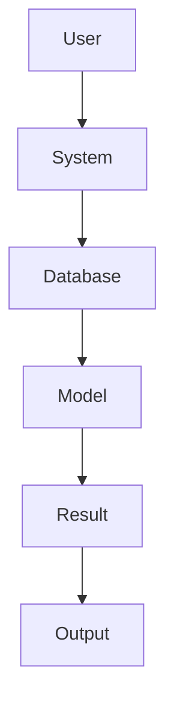
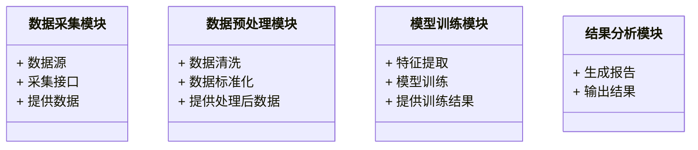
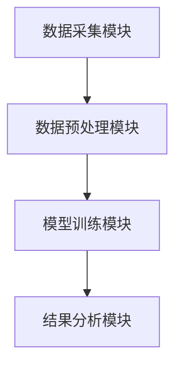
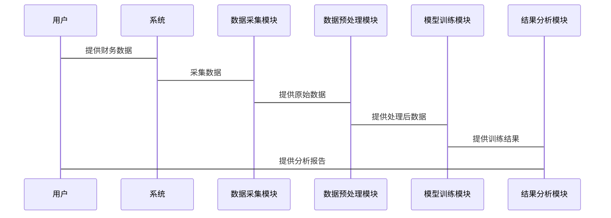

                 


# AI驱动的企业财务报表比较分析系统

> 关键词：AI驱动，财务报表分析，机器学习，企业财务管理，比较分析系统

> 摘要：本文详细介绍了AI驱动的企业财务报表比较分析系统的构建与应用。通过分析传统财务报表分析的局限性，提出了一种基于机器学习的解决方案，涵盖数据预处理、特征提取、模型训练与优化等关键步骤，并结合实际案例展示了系统的实现与应用效果。

---

# 第一部分: 背景介绍与核心概念

## 第1章: 问题背景与需求分析

### 1.1 问题背景

#### 1.1.1 传统财务报表分析的局限性
传统财务报表分析依赖人工处理，存在以下问题：
- 数据量大，处理复杂。
- 分析耗时，效率低下。
- 易受主观因素影响，结果不够客观。

#### 1.1.2 AI技术在财务分析中的应用潜力
AI技术，特别是机器学习，能够通过自动化处理大量数据，发现潜在模式，提供更精准的分析结果。

#### 1.1.3 企业财务报表比较分析的核心价值
比较分析能够识别企业间的财务差异，帮助企业做出更明智的决策。

### 1.2 问题描述

#### 1.2.1 财务报表比较分析的主要挑战
- 数据多样性与复杂性。
- 分析结果的客观性与准确性。

#### 1.2.2 AI技术如何解决这些挑战
AI通过自动化处理和深度学习，能够有效应对数据复杂性和提高分析准确性。

#### 1.2.3 企业的实际需求与目标
企业希望通过AI技术提升财务分析效率和准确性，优化财务管理。

---

## 第2章: 核心概念与系统架构

### 2.1 核心概念

#### 2.1.1 AI驱动的财务报表分析系统定义
AI驱动的财务报表比较分析系统利用机器学习算法，对企业的财务数据进行自动化分析和比较。

#### 2.1.2 系统的核心要素与功能模块
- 数据采集模块：收集企业财务数据。
- 数据预处理模块：清洗和标准化数据。
- 特征提取模块：提取关键特征。
- 模型训练模块：训练并优化机器学习模型。
- 结果分析模块：生成分析结果并提供决策支持。

#### 2.1.3 系统的边界与外延
系统边界包括数据输入、模型训练和结果输出。外延部分涉及数据来源的扩展和分析结果的应用场景。

### 2.2 核心概念对比分析

#### 2.2.1 数据预处理方法对比
| 方法 | 描述 | 优缺点 |
|------|------|--------|
| 清洗 | 去除无效数据 | 时间消耗大 |
| 标准化 | 转换数据格式 | 改善模型性能 |
| 填补缺失值 | 补全缺失数据 | 可能引入偏差 |

#### 2.2.2 特征提取方法对比
| 方法 | 描述 | 优缺点 |
|------|------|--------|
| 主成分分析 | 降维技术 | 提高计算效率 |
| 词袋模型 | 提取文本特征 | 易受数据稀疏性影响 |

#### 2.2.3 模型选择与优化方法对比
| 方法 | 描述 | 优缺点 |
|------|------|--------|
| 支持向量机 | 分类算法 | 适合中小数据集 |
| 随机森林 | 集成算法 | 鲁棒性强 |
| 神经网络 | 深度学习 | 训练时间长 |

### 2.3 系统架构设计

#### 2.3.1 实体关系图
```mermaid
er
  actor: 用户
  system: AI驱动的财务分析系统
  database: 财务数据库
  relationship: 用户通过系统访问数据库
```

#### 2.3.2 系统架构图


---

## 第3章: 算法原理与数学模型

### 3.1 数据预处理与特征提取

#### 3.1.1 数据清洗与标准化
- 使用Python的pandas库进行数据清洗，去除无效数据并填充缺失值。
- 使用sklearn库的标准化方法对数据进行预处理。

#### 3.1.2 特征选择与降维
- 使用主成分分析（PCA）进行特征降维，减少数据维度。

### 3.2 模型训练与优化

#### 3.2.1 支持向量机（SVM）
- 使用sklearn库中的SVC进行模型训练。
- 通过网格搜索（GridSearchCV）进行参数优化。

#### 3.2.2 随机森林（Random Forest）
- 使用sklearn库中的RandomForestClassifier进行模型训练。
- 通过调整树的数量和深度优化模型性能。

#### 3.2.3 神经网络（ANN）
- 使用Keras构建深度学习模型，包括输入层、隐藏层和输出层。
- 使用Adam优化器和交叉熵损失函数进行训练。

### 3.3 算法对比与选择

#### 3.3.1 不同算法的优缺点对比
| 方法 | 优点 | 缺点 |
|------|------|------|
| SVM | 高准确性 | 数据量大时性能差 |
| 随机森林 | 鲁棒性强 | 易受参数影响 |
| 神经网络 | 高灵活性 | 需大量数据 |

---

## 第4章: 系统分析与架构设计

### 4.1 问题场景介绍

#### 4.1.1 系统目标与功能需求
- 自动化处理财务数据。
- 提供多维度的比较分析。

#### 4.1.2 系统的输入输出分析
- 输入：企业财务数据。
- 输出：分析结果报告。

#### 4.1.3 系统的边界与交互
- 用户输入数据，系统处理并输出结果。

### 4.2 项目介绍

#### 4.2.1 系统功能设计
- 数据采集模块：从数据库中提取财务数据。
- 数据预处理模块：清洗和标准化数据。
- 模型训练模块：训练机器学习模型。
- 结果分析模块：生成分析报告。

#### 4.2.2 领域模型（类图）


#### 4.2.3 系统架构设计


#### 4.2.4 系统接口设计
- 数据采集接口：接收财务数据。
- 模型训练接口：接收预处理后的数据，返回训练结果。
- 结果输出接口：返回分析报告。

#### 4.2.5 系统交互设计


---

## 第5章: 项目实战

### 5.1 环境安装

#### 5.1.1 安装Python
```bash
python --version
pip install --upgrade pip
```

#### 5.1.2 安装相关库
```bash
pip install numpy pandas scikit-learn matplotlib keras
```

### 5.2 核心代码实现

#### 5.2.1 数据预处理
```python
import pandas as pd
from sklearn.preprocessing import StandardScaler

# 数据清洗
data = pd.read_csv('financial_data.csv')
data.dropna(inplace=True)

# 数据标准化
scaler = StandardScaler()
scaled_data = scaler.fit_transform(data)
```

#### 5.2.2 模型训练
```python
from sklearn.svm import SVC
from sklearn.ensemble import RandomForestClassifier
from sklearn.neural_network import MLPClassifier
from sklearn.model_selection import GridSearchCV

# 支持向量机
svm_model = SVC()
svm_params = {'C': [1, 10], 'kernel': ['linear', 'rbf']}
grid_svm = GridSearchCV(svm_model, svm_params, cv=5)
grid_svm.fit(X_train, y_train)
best_svm = grid_svm.best_estimator_

# 随机森林
rf_model = RandomForestClassifier(n_estimators=100)
rf_model.fit(X_train, y_train)

# 神经网络
mlp_model = MLPClassifier(hidden_layer_sizes=(64, 64), max_iter=1000)
mlp_model.fit(X_train, y_train)
```

#### 5.2.3 模型评估
```python
from sklearn.metrics import accuracy_score, precision_score, recall_score

# 支持向量机评估
y_pred_svm = best_svm.predict(X_test)
print(f"SVM准确率：{accuracy_score(y_test, y_pred_svm)}")

# 随机森林评估
y_pred_rf = rf_model.predict(X_test)
print(f"随机森林准确率：{accuracy_score(y_test, y_pred_rf)}")

# 神经网络评估
y_pred_mlp = mlp_model.predict(X_test)
print(f"神经网络准确率：{accuracy_score(y_test, y_pred_mlp)}")
```

### 5.3 实际案例分析

#### 5.3.1 数据来源与预处理
使用企业公开的财务数据，清洗并标准化后进行分析。

#### 5.3.2 模型选择与优化
通过网格搜索选择最佳模型参数，优化模型性能。

#### 5.3.3 结果分析与解读
根据模型输出的结果，分析企业间的财务差异，提供决策支持。

### 5.4 项目小结

#### 5.4.1 核心代码实现要点
- 数据预处理：清洗和标准化。
- 模型选择：支持向量机、随机森林和神经网络。
- 模型优化：网格搜索调参。

#### 5.4.2 项目成果展示
展示不同模型的准确率和分析结果。

#### 5.4.3 项目总结与经验分享
总结项目实施过程中的经验教训，提出改进建议。

---

## 第6章: 最佳实践与小结

### 6.1 最佳实践

#### 6.1.1 数据质量的重要性
数据清洗和预处理是模型准确性的关键。

#### 6.1.2 模型选择与调优
根据数据特点选择合适的算法，并通过调参优化模型性能。

#### 6.1.3 结果解释与可解释性
模型结果需要能够被业务人员理解和应用。

### 6.2 小结

#### 6.2.1 全文总结
本文详细介绍了AI驱动的企业财务报表比较分析系统的构建与应用，展示了如何利用机器学习技术提高财务分析的效率和准确性。

#### 6.2.2 未来展望
随着技术进步，AI在财务分析中的应用将更加广泛和深入。

### 6.3 注意事项

#### 6.3.1 数据隐私与安全
确保数据处理过程中的隐私和安全。

#### 6.3.2 模型解释性
模型结果需具备可解释性，以便业务人员理解和应用。

#### 6.3.3 持续优化
定期更新模型，确保其适应数据变化和业务需求。

### 6.4 拓展阅读

#### 6.4.1 推荐书目
- 《机器学习实战》
- 《深度学习入门：基于Python的理论与实现》

#### 6.4.2 技术博客与资源
- TensorFlow官方文档
- Keras官方文档
- scikit-learn官方文档

---

# 作者：AI天才研究院 & 禅与计算机程序设计艺术

---

以上就是《AI驱动的企业财务报表比较分析系统》的完整目录大纲和文章内容。

