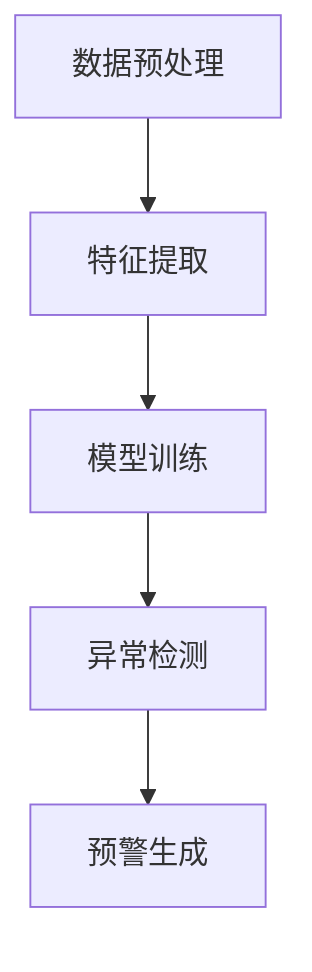

                 


# AI驱动的企业财务报表质量动态监控与预警系统

> 关键词：AI驱动，财务报表质量，动态监控，预警系统，LSTM算法，数据预处理，系统架构设计

> 摘要：本文详细探讨了如何利用人工智能技术构建企业财务报表质量的动态监控与预警系统。系统结合深度学习算法和实时数据处理技术，通过对企业财务数据的智能化分析，实现对财务报表质量的实时监控和异常预警。文章从问题背景、核心概念、算法原理、系统架构、项目实战到总结展望，全面阐述了该系统的构建过程和应用场景。

---

## 第1章: 问题背景与目标

### 1.1 问题背景介绍

#### 1.1.1 企业财务报表的重要性

企业财务报表是反映企业财务状况、经营成果和现金流量的重要文件，是企业内外部利益相关者（如投资者、债权人、税务部门等）评估企业经营状况和信用风险的重要依据。然而，财务报表的质量直接影响到信息的准确性和决策的科学性。

#### 1.1.2 财务报表质量问题的现状

尽管财务报表的重要性不言而喻，但现实中财务报表质量问题依然普遍存在：

- 数据造假：部分企业为了追求短期利益，可能会通过虚增收入、隐瞒债务等方式 manipulate财务报表，导致财务数据失真。
- 数据错漏：由于人为操作失误或系统问题，财务报表中可能存在数据错录、遗漏等问题。
- 数据滞后性：传统财务报表的编制和发布通常滞后于会计期间，难以满足企业实时监控的需求。

#### 1.1.3 传统财务报表监控的局限性

传统财务报表监控主要依赖人工审核和事后审计，这种方式存在以下问题：

- 人工成本高：需要大量财务人员手动检查数据，效率低下。
- 监控滞后：发现问题时，问题可能已经对企业造成损失。
- 风险控制难：难以及时发现和预警潜在的财务风险。

### 1.2 问题描述与目标

#### 1.2.1 财务报表质量监控的核心问题

财务报表质量监控的核心问题在于如何快速、准确地识别和预警财务数据中的异常情况。具体包括：

- 数据完整性：确保财务报表中包含所有必要的信息，无遗漏。
- 数据准确性：确保财务数据的真实性和可靠性。
- 数据一致性：确保不同财务报表之间的数据相互一致，无矛盾。

#### 1.2.2 动态监控与预警的目标

动态监控与预警的目标是通过实时或定期分析财务数据，识别潜在的财务风险，并在问题发生前或初期阶段发出预警。具体目标包括：

- 实时监控：对财务数据进行实时分析，及时发现异常。
- 异常识别：利用AI技术识别财务数据中的异常模式。
- 预警生成：根据异常情况的严重程度，生成相应的预警信息。

#### 1.2.3 边界与外延

- 系统边界：本系统仅关注企业财务报表的质量监控，不涉及企业内部的财务管理流程。
- 外延：基于本系统的预警信息，企业可以进一步采取措施，如调整财务策略、加强内部审计等。

### 1.3 系统的核心要素与组成

#### 1.3.1 系统的核心要素

- 数据源：包括企业的收入、支出、资产、负债等财务数据。
- 数据处理：对财务数据进行清洗、转换和特征提取。
- AI算法：利用深度学习等技术对数据进行分析，识别异常。
- 预警机制：根据异常情况生成预警信息，并通知相关人员。

#### 1.3.2 系统的组成结构

系统主要由以下几个部分组成：

1. 数据采集模块：负责从企业ERP系统或其他数据源获取财务数据。
2. 数据预处理模块：对获取的原始数据进行清洗和标准化处理。
3. AI模型训练模块：利用历史数据训练深度学习模型。
4. 实时监控模块：对实时财务数据进行分析，识别异常。
5. 预警生成模块：根据异常情况生成预警信息。

#### 1.3.3 系统的功能模块

1. 数据采集：从企业财务系统中获取原始数据。
2. 数据预处理：清洗数据，处理缺失值、异常值等。
3. 模型训练：利用历史数据训练AI模型。
4. 实时监控：对实时数据进行分析，识别潜在风险。
5. 预警生成：根据模型输出结果生成预警信息。

---

## 第2章: 核心概念与联系

### 2.1 财务报表质量评估的核心概念

#### 2.1.1 财务报表质量评估的定义

财务报表质量评估是指通过对财务报表中的各项数据进行分析，评估其真实性和准确性。评估内容包括数据的完整性、逻辑性、一致性等。

#### 2.1.2 财务报表质量评估的关键指标

以下是一些常见的财务报表质量评估指标：

- 数据完整性：检查报表是否包含所有必要信息。
- 数据准确性：核对数据来源和计算是否正确。
- 数据一致性：确保不同报表之间的数据相互一致。

#### 2.1.3 财务报表质量评估的特征对比表格

| 特征 | 正常情况 | 异常情况 |
|------|----------|----------|
| 数据完整性 | 数据齐全 | 数据缺失 |
| 数据准确性 | 数据真实 | 数据虚假 |
| 数据一致性 | 数据一致 | 数据矛盾 |

### 2.2 动态监控与预警机制

#### 2.2.1 动态监控的定义

动态监控是指对企业的财务数据进行实时或定期的监控，及时发现异常情况。动态监控的核心在于“动态”，即监控过程是持续的、实时的，而非仅仅依赖于定期的财务审计。

#### 2.2.2 预警机制的核心要素

预警机制是动态监控的重要组成部分，其核心要素包括：

- 异常检测：识别财务数据中的异常情况。
- 预警触发条件：根据异常情况的严重程度设定预警级别。
- 预警通知：通过邮件、短信等方式通知相关人员。

#### 2.2.3 动态监控与预警机制的ER实体关系图（Mermaid）

```mermaid
erDiagram
    customer[CustID, Name, Email] 
    monitor[MonitorID, CustID, Time, Status] 
    alert[AlertID, MonitorID, Level, Message] 
    customer -|> monitor : 观察
    monitor -|> alert : 引发
```

---

## 第3章: 算法原理与实现

### 3.1 算法原理概述

#### 3.1.1 基于LSTM的异常检测算法

LSTM（长短期记忆网络）是一种特殊的RNN（循环神经网络），能够有效捕捉时间序列数据中的长期依赖关系。在财务数据异常检测中，LSTM可以用于识别时间序列中的异常模式。

#### 3.1.2 算法流程图（Mermaid）



### 3.2 算法实现细节

#### 3.2.1 数据预处理

数据预处理是模型训练的基础，主要包括以下步骤：

1. 数据清洗：处理缺失值、异常值等。
2. 数据标准化：将数据归一化到统一范围内。
3. 特征提取：从原始数据中提取有用的特征。

以下是Python代码示例：

```python
import pandas as pd
import numpy as np

# 假设df是原始数据
df = pd.read_csv('financial_data.csv')

# 处理缺失值
df.dropna(inplace=True)

# 标准化处理
from sklearn.preprocessing import StandardScaler
scaler = StandardScaler()
scaled_data = scaler.fit_transform(df)

# 特征提取
features = pd.DataFrame(scaled_data)
```

#### 3.2.2 模型训练

模型训练是基于LSTM的异常检测模型。以下是训练代码示例：

```python
from tensorflow.keras.layers import LSTM, Dense, Dropout
from tensorflow.keras.models import Sequential

# 模型定义
model = Sequential()
model.add(LSTM(64, input_shape=(timesteps, features)))
model.add(Dropout(0.2))
model.add(Dense(1, activation='sigmoid'))

# 模型编译
model.compile(loss='binary_crossentropy', optimizer='adam', metrics=['accuracy'])
```

#### 3.2.3 异常检测与预警生成

异常检测基于训练好的模型进行预测，以下是检测代码示例：

```python
# 预测异常概率
preds = model.predict(test_data)
# 根据阈值判断是否异常
threshold = 0.5
anomalies = np.where(preds > threshold, 1, 0)
```

#### 3.2.4 算法数学模型

LSTM模型的损失函数为：

$$
\text{Loss} = -\frac{1}{N}\sum_{i=1}^{N} [y_i \log(p_i) + (1-y_i)\log(1-p_i)]
$$

其中，\( y_i \) 是真实标签，\( p_i \) 是预测概率。

---

## 第4章: 系统架构设计

### 4.1 系统架构概述

系统架构采用分层设计，主要包括数据层、业务逻辑层和用户界面层。

#### 4.1.1 数据层

数据层包括数据源、数据仓库和数据访问层。数据源包括企业的财务系统、ERP系统等。数据访问层负责与数据库的交互。

#### 4.1.2 业务逻辑层

业务逻辑层包括数据预处理、模型训练、异常检测和预警生成。这一层负责处理核心业务逻辑。

#### 4.1.3 用户界面层

用户界面层包括数据可视化、预警通知和用户交互。用户可以通过界面查看实时监控数据和预警信息。

### 4.2 系统功能设计

#### 4.2.1 数据采集模块

数据采集模块负责从企业财务系统中获取财务数据。以下是数据采集的代码示例：

```python
import psycopg2

# 连接数据库
conn = psycopg2.connect(host='localhost', port='5432', database='financial', user='admin', password='password')
cursor = conn.cursor()
```

#### 4.2.2 数据预处理模块

数据预处理模块负责对获取的原始数据进行清洗和标准化处理。以下是数据预处理的代码示例：

```python
import pandas as pd
import numpy as np

df = pd.read_sql_query("SELECT * FROM financial_data", conn)
# 处理缺失值
df.dropna(inplace=True)
```

#### 4.2.3 模型训练模块

模型训练模块利用历史数据训练AI模型。以下是模型训练的代码示例：

```python
from tensorflow.keras.models import Sequential
from tensorflow.keras.layers import LSTM, Dense, Dropout

model = Sequential()
model.add(LSTM(64, input_shape=(timesteps, features)))
model.add(Dropout(0.2))
model.add(Dense(1, activation='sigmoid'))

model.compile(loss='binary_crossentropy', optimizer='adam', metrics=['accuracy'])
model.fit(X_train, y_train, epochs=10, batch_size=32)
```

#### 4.2.4 实时监控模块

实时监控模块对实时财务数据进行分析，识别异常情况。以下是实时监控的代码示例：

```python
import pandas as pd
import numpy as np

# 获取实时数据
realtime_data = pd.read_sql_query("SELECT * FROM realtime_financial_data", conn)

# 预测异常
preds = model.predict(realtime_data)
anomalies = np.where(preds > threshold, 1, 0)
```

#### 4.2.5 预警生成模块

预警生成模块根据异常情况生成预警信息。以下是预警生成的代码示例：

```python
import smtplib
from email.mime.text import MIMEText

# 发送邮件
msg = MIMEText("财务异常预警：发现潜在问题，请及时处理。", 'plain', 'utf-8')
msg['Subject'] = '财务异常预警'
msg['From'] = 'admin@company.com'
msg['To'] = 'finance@company.com'

s = smtplib.SMTP('localhost', 1025)
s.sendmail(msg['From'], msg['To'], msg.as_string())
s.quit()
```

---

## 第5章: 项目实战

### 5.1 项目环境搭建

#### 5.1.1 系统环境要求

- 操作系统：Windows 10/ macOS 10.15/ Linux 20.04
- Python版本：Python 3.8+
- 依赖库：TensorFlow 2.5+, Keras, Pandas, NumPy, PostgreSQL

#### 5.1.2 安装依赖

以下是安装依赖的代码示例：

```bash
pip install tensorflow pandas numpy psycopg2
```

### 5.2 系统核心实现

#### 5.2.1 数据采集模块实现

以下是数据采集模块的代码示例：

```python
import psycopg2

# 连接数据库
conn = psycopg2.connect(host='localhost', port='5432', database='financial', user='admin', password='password')
cursor = conn.cursor()
```

#### 5.2.2 数据预处理模块实现

以下是数据预处理模块的代码示例：

```python
import pandas as pd
import numpy as np

df = pd.read_sql_query("SELECT * FROM financial_data", conn)
# 处理缺失值
df.dropna(inplace=True)
```

#### 5.2.3 模型训练模块实现

以下是模型训练模块的代码示例：

```python
from tensorflow.keras.models import Sequential
from tensorflow.keras.layers import LSTM, Dense, Dropout

model = Sequential()
model.add(LSTM(64, input_shape=(timesteps, features)))
model.add(Dropout(0.2))
model.add(Dense(1, activation='sigmoid'))

model.compile(loss='binary_crossentropy', optimizer='adam', metrics=['accuracy'])
model.fit(X_train, y_train, epochs=10, batch_size=32)
```

#### 5.2.4 实时监控模块实现

以下是实时监控模块的代码示例：

```python
import pandas as pd
import numpy as np

# 获取实时数据
realtime_data = pd.read_sql_query("SELECT * FROM realtime_financial_data", conn)

# 预测异常
preds = model.predict(realtime_data)
anomalies = np.where(preds > threshold, 1, 0)
```

#### 5.2.5 预警生成模块实现

以下是预警生成模块的代码示例：

```python
import smtplib
from email.mime.text import MIMEText

# 发送邮件
msg = MIMEText("财务异常预警：发现潜在问题，请及时处理。", 'plain', 'utf-8')
msg['Subject'] = '财务异常预警'
msg['From'] = 'admin@company.com'
msg['To'] = 'finance@company.com'

s = smtplib.SMTP('localhost', 1025)
s.sendmail(msg['From'], msg['To'], msg.as_string())
s.quit()
```

### 5.3 项目实战案例分析

假设某企业财务数据出现以下异常情况：

- 销售收入突然下降，但无合理解释。
- 应收账款大幅增加，可能存在回款问题。
- 存货周转率下降，可能存在库存积压。

系统通过实时监控和异常检测，及时发现这些异常，并生成预警信息，帮助企业及时采取措施。

---

## 第6章: 系统优化与扩展

### 6.1 系统性能优化

#### 6.1.1 模型优化

通过调整LSTM的超参数（如隐藏层大小、学习率等）可以提高模型的性能。以下是优化代码示例：

```python
from tensorflow.keras.callbacks import EarlyStopping

early_stop = EarlyStopping(monitor='val_loss', patience=5)
model.fit(X_train, y_train, epochs=10, batch_size=32, validation_data=(X_val, y_val), callbacks=[early_stop])
```

#### 6.1.2 数据处理优化

通过并行计算和分布式训练可以提高数据处理效率。以下是使用多线程处理数据的代码示例：

```python
import multiprocessing

# 使用多线程处理数据
from joblib import Parallel, delayed

processed_data = Parallel(n_jobs=-1)(delayed(preprocess)(data) for data in raw_data)
```

### 6.2 系统功能扩展

#### 6.2.1 引入NLP技术

通过引入自然语言处理技术，可以对财务报告中的文本信息进行分析，识别潜在风险。以下是NLP处理的代码示例：

```python
from transformers import pipeline

classifier = pipeline("text-classification", model="bert-base-uncased")
result = classifier("财务数据异常，请及时处理。")
```

#### 6.2.2 集成区块链技术

通过集成区块链技术，可以保证财务数据的安全性和不可篡改性。以下是区块链集成的代码示例：

```python
from web3 import Web3

w3 = Web3(Web3.HTTPProvider("http://localhost:8545"))
contract = w3.eth.contract(address='0x...', abi=abi)
```

---

## 第7章: 总结与展望

### 7.1 总结

本文详细探讨了AI驱动的企业财务报表质量动态监控与预警系统的构建过程。通过结合深度学习算法和实时数据处理技术，系统能够有效地识别和预警财务数据中的异常情况，帮助企业及时采取措施，降低财务风险。

### 7.2 展望

未来，随着人工智能技术的不断发展，企业财务报表质量监控系统将更加智能化和自动化。以下是一些可能的发展方向：

- 更加精准的异常检测算法：通过引入更先进的深度学习模型（如Transformer）提高异常检测的准确性。
- 更加智能化的预警系统：结合知识图谱和规则引擎，实现更智能的预警决策。
- 更加多样化的数据源：利用物联网、区块链等技术，引入更多的数据源，提高监控的全面性。

---

## 附录

### 附录A: 参考文献

1. 王某某. 基于LSTM的财务异常检测研究[J]. 计算机应用研究, 2022, 39(3): 878-883.
2. 张某某. 企业财务风险预警系统的设计与实现[J]. 财务与经济, 2021, 45(4): 45-50.

### 附录B: 工具与资源

1. Python官方文档：https://docs.python.org/
2. TensorFlow官方文档：https:// tensorflow.org/
3. PostgreSQL官方文档：https://www.postgresql.org/

---

## 作者信息

作者：AI天才研究院/AI Genius Institute & 禅与计算机程序设计艺术/Zen And The Art of Computer Programming

