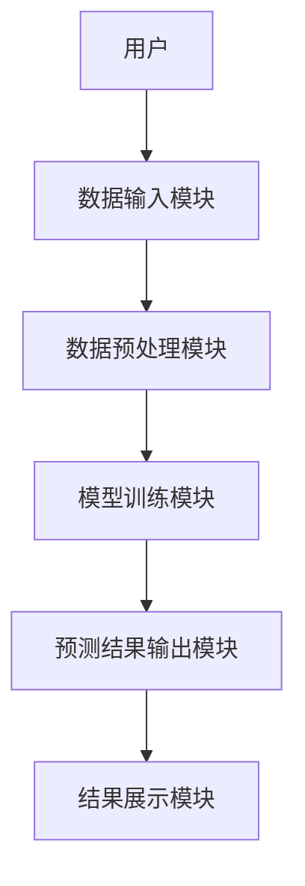
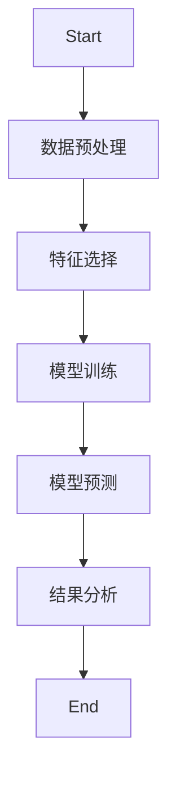
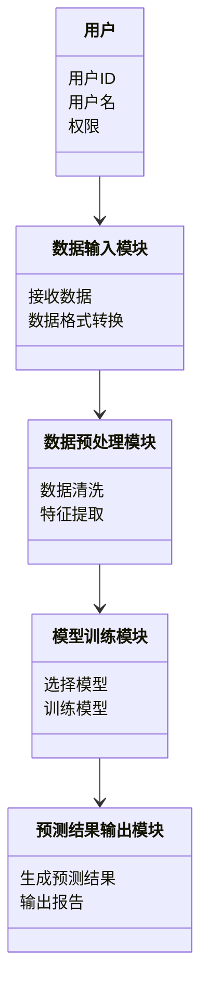
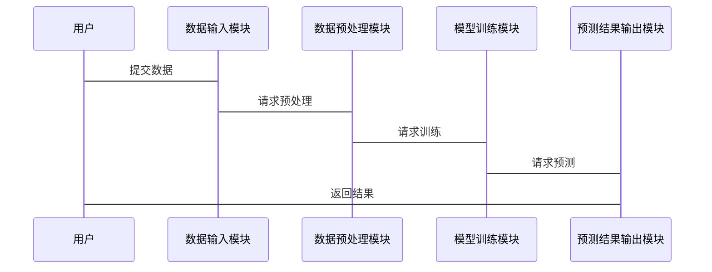

                 


# AI驱动的企业财务报表预测与分析系统

> 关键词：AI技术，财务预测，系统架构，机器学习算法，财务数据分析

> 摘要：本文深入探讨了AI技术在企业财务报表预测与分析中的应用，结合技术原理、系统设计和实际案例，全面分析了AI驱动的财务预测系统的核心概念、算法实现和系统架构，揭示了其在企业决策中的价值和未来发展趋势。

---

# 第1章: 背景介绍与核心概念

## 1.1 问题背景与目标

### 1.1.1 传统财务报表分析的局限性
传统财务报表分析主要依赖人工经验，存在以下问题：
- 数据量大，分析耗时
- 人为主观因素影响结果
- 预测精度有限，难以捕捉复杂趋势

### 1.1.2 AI技术在财务分析中的应用前景
AI技术的引入为财务预测带来了新的可能性：
- 自动化处理海量数据
- 提高预测精度
- 快速响应市场变化

### 1.1.3 企业财务预测与分析的痛点
- 数据复杂性
- 模型选择困难
- 实时性要求高

## 1.2 核心概念与问题描述

### 1.2.1 财务报表预测的定义与目标
通过AI技术对企业的财务数据进行建模，预测未来财务状况。

### 1.2.2 AI驱动的财务预测系统的核心要素
- 数据采集模块
- 数据预处理模块
- 模型训练模块
- 预测结果展示模块

### 1.2.3 问题的边界与外延
- 预测范围：财务数据
- 模型类型：回归、分类、时间序列
- 数据来源：财务报表、行业数据

## 1.3 问题解决与系统价值

### 1.3.1 AI在财务预测中的优势
- 高效性
- 准确性
- 实时性

### 1.3.2 系统实现的创新点
- 数据自动化处理
- 模型自适应优化

### 1.3.3 对企业决策的支持作用
- 提供数据支持
- 支持战略决策

## 1.4 本章小结

---

# 第2章: AI驱动的财务预测系统核心概念与联系

## 2.1 核心概念原理

### 2.1.1 财务数据的特征分析
- 数据类型：数值型、时间序列
- 数据分布：正态分布、偏态分布

### 2.1.2 AI模型的预测机制
- 机器学习模型：线性回归、随机森林
- 深度学习模型：LSTM

### 2.1.3 系统的输入输出关系
- 输入：财务数据、外部数据
- 输出：预测结果、可视化报告

## 2.2 核心概念属性特征对比

### 2.2.1 财务数据与AI模型的对比
| 特性    | 财务数据       | AI模型          |
|---------|---------------|----------------|
| 类型     | 数值型         | 回归、分类      |
| 处理方式 | 预处理         | 特征工程        |

### 2.2.2 不同AI模型的性能对比
| 模型     | 线性回归       | 随机森林       | LSTM          |
|---------|---------------|----------------|---------------|
| 优点     | 简单、易解释    | 高精度         | 时间依赖性强   |
| 缺点     | 模拟复杂关系差  | 易过拟合         | 计算复杂       |

### 2.2.3 系统功能模块的对比
| 功能模块 | 数据输入       | 数据预处理     | 模型训练      |
|----------|----------------|---------------|---------------|
| 描述     | 获取原始数据    | 清洗、转换数据  | 训练预测模型    |

## 2.3 ER实体关系图与系统架构



## 2.4 本章小结

---

# 第3章: AI模型的算法原理与数学模型

## 3.1 算法原理

### 3.1.1 线性回归模型
$$ y = \beta_0 + \beta_1 x + \epsilon $$

### 3.1.2 随机森林模型
- 基于决策树的集成学习方法

### 3.1.3 LSTM网络模型
$$ h_t = \text{激活}(f_t \cdot h_{t-1}) $$
$$ f_t = \text{激活}(W_f \cdot [h_{t-1}, x_t]) $$

## 3.2 算法流程图



## 3.3 数学模型与公式

### 3.3.1 线性回归
$$ \text{损失函数} = \sum_{i=1}^n (y_i - \hat{y}_i)^2 $$

### 3.3.2 随机森林
$$ \text{预测值} = \frac{1}{N} \sum_{i=1}^N y_i $$

### 3.3.3 LSTM
$$ \text{门控机制} = \text{sigmoid}(W_g \cdot [h_{t-1}, x_t]) $$

---

# 第4章: 系统架构设计与实现

## 4.1 问题场景介绍

## 4.2 项目介绍

## 4.3 系统功能设计

### 4.3.1 领域模型设计



### 4.3.2 系统架构设计

```mermaid
graph TD
    User[用户] --> API Gateway[API网关]
    API Gateway --> DataInput[数据输入模块]
    DataInput --> DataPreprocessing[数据预处理模块]
    DataPreprocessing --> ModelTraining[模型训练模块]
    ModelTraining --> Prediction[预测结果输出模块]
    Prediction --> ResultDisplay[结果展示模块]
```

## 4.4 系统接口设计

## 4.5 系统交互设计



---

# 第5章: 项目实战与详细解读

## 5.1 环境安装

```bash
pip install numpy pandas scikit-learn keras tensorflow
```

## 5.2 核心实现

```python
import numpy as np
import pandas as pd
from sklearn.ensemble import RandomForestRegressor
from sklearn.metrics import mean_squared_error

# 数据加载
data = pd.read_csv('financial_data.csv')

# 特征选择
features = data[[' revenue', 'net_income', 'total_assets']]
target = data[' stock_price']

# 数据分割
from sklearn.model_selection import train_test_split
X_train, X_test, y_train, y_test = train_test_split(features, target, test_size=0.2)

# 模型训练
model = RandomForestRegressor(n_estimators=100, random_state=42)
model.fit(X_train, y_train)

# 模型预测
y_pred = model.predict(X_test)

# 评估指标
 mse = mean_squared_error(y_test, y_pred)
 print(f'MSE: {mse}')
```

---

# 第6章: 实际案例分析

## 6.1 案例分析

### 6.1.1 某制造企业案例

### 6.1.2 某零售企业案例

## 6.2 案例对比

---

# 第7章: 系统扩展与未来展望

## 7.1 系统优化方向

### 7.1.1 模型优化

### 7.1.2 系统性能优化

## 7.2 未来AI技术趋势

## 7.3 对企业的价值

---

# 作者：AI天才研究院

---

感谢您的阅读！如需进一步了解，请访问我们的官方网站或联系技术支持。

