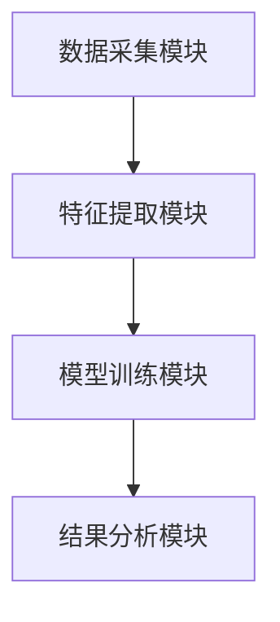
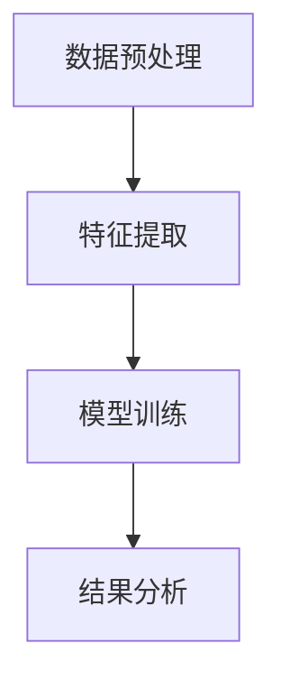
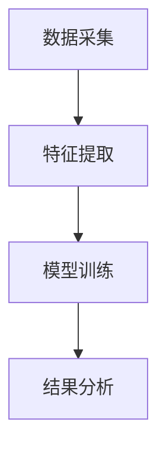

                 


# AI驱动的企业财务舞弊检测系统

**关键词：** AI，财务舞弊，机器学习，企业财务，检测系统

**摘要：** 本文探讨了AI在企业财务舞弊检测中的应用，详细分析了系统的设计、算法原理、实现步骤及实际案例。通过结合机器学习模型和财务数据分析，提出了一套高效的舞弊检测方案，为企业提供有力支持。

---

# 第1章: 企业财务舞弊检测的背景与挑战

## 1.1 企业财务舞弊的背景与现状

### 1.1.1 企业财务舞弊的定义与表现形式

企业财务舞弊是指企业在财务报告中故意提供虚假信息或隐瞒重要信息的行为。常见形式包括虚构交易、虚增收入、隐瞒负债等。这些行为严重损害了投资者和债权人的利益，破坏了市场信任。

### 1.1.2 财务舞弊对企业及利益相关者的影响

财务舞弊可能导致企业声誉受损、面临法律诉讼、承担巨额罚款。对利益相关者而言，可能导致投资损失、错失战略机会。

### 1.1.3 当前财务舞弊检测的主要挑战

传统检测方法依赖人工审计，效率低、成本高、覆盖面有限。企业财务数据复杂多样，传统方法难以捕捉隐藏的异常。

---

## 1.2 AI技术在财务舞弊检测中的应用前景

### 1.2.1 AI技术的基本概念与优势

人工智能（AI）通过机器学习、自然语言处理等技术，能够从大量数据中发现异常模式。AI的优势在于高效性、准确性，能处理结构化和非结构化数据。

### 1.2.2 AI在财务舞弊检测中的独特价值

AI能够自动分析海量数据，发现潜在异常。通过模式识别，AI能识别传统方法难以察觉的舞弊行为。

### 1.2.3 企业级AI驱动的舞弊检测系统的发展趋势

随着AI技术进步，企业越来越依赖自动化检测系统。未来，AI将与区块链、大数据分析结合，构建更完善的检测体系。

---

## 1.3 本章小结

本章介绍了财务舞弊的背景及AI技术在检测中的应用前景。AI的引入显著提升了检测效率和准确性，为财务安全提供了新思路。

---

# 第2章: AI驱动的企业财务舞弊检测系统的核心概念

## 2.1 财务数据的特征与分类

### 2.1.1 财务数据的结构化特征

结构化数据如收入、支出、资产负债表数据，便于机器学习处理。

### 2.1.2 非结构化数据在财务舞弊检测中的作用

非结构化数据如财务报告、管理层讨论，通过NLP技术分析，发现潜在异常。

### 2.1.3 数据预处理的关键步骤

数据清洗、特征提取、标准化处理是预处理的关键步骤。

---

## 2.2 舞弊检测的AI模型选择与优化

### 2.2.1 常见的AI模型及其特点

- **监督学习模型：** 如随机森林、支持向量机，适用于已标注数据。
- **无监督学习模型：** 如聚类分析，适用于未标注数据。
- **深度学习模型：** 如神经网络，适合复杂模式识别。

### 2.2.2 如何选择适合的模型

根据数据类型、问题复杂度选择模型。监督学习适合已知标签数据，无监督适用于未知异常检测。

### 2.2.3 模型优化与调参策略

通过交叉验证、网格搜索优化模型参数，提升检测准确率。

---

## 2.3 财务舞弊检测的系统架构

### 2.3.1 系统模块划分

- 数据采集模块：收集财务数据。
- 特征提取模块：提取关键特征。
- 模型训练模块：训练检测模型。
- 结果分析模块：输出检测结果。

### 2.3.2 模块之间的交互关系

数据采集模块向特征提取模块传递数据，特征提取模块生成特征向量供模型训练模块使用，模型结果反馈给结果分析模块。

### 2.3.3 系统的整体架构设计

采用模块化设计，各模块独立运行，便于维护和扩展。系统架构如图：



---

## 2.4 本章小结

本章详细介绍了财务数据的特征、AI模型的选择优化，以及系统架构设计。这些内容为后续的算法实现奠定了基础。

---

# 第3章: AI驱动的财务舞弊检测算法原理

## 3.1 常见的舞弊检测算法及其原理

### 3.1.1 基于监督学习的算法

随机森林算法通过投票机制预测舞弊概率，准确率高，适合分类问题。

### 3.1.2 基于无监督学习的算法

Isolation Forest算法通过异常树构建，识别异常点，适用于无标签数据。

### 3.1.3 基于深度学习的算法

LSTM网络通过时序数据建模，识别隐藏的异常模式，适合处理时间序列数据。

---

## 3.2 算法流程图

检测流程包括数据预处理、特征提取、模型训练、结果分析。流程图如下：



---

## 3.3 算法实现的数学模型与公式

### 3.3.1 分类模型的损失函数

随机森林采用均方误差损失函数：

$$
L = \frac{1}{n}\sum_{i=1}^{n}(y_i - \hat{y_i})^2
$$

### 3.3.2 神经网络的激活函数

sigmoid激活函数：

$$
f(x) = \frac{1}{1 + e^{-x}}
$$

### 3.3.3 调参与优化的数学表达

使用Adam优化器，学习率α，动量系数β：

$$
\theta_{t+1} = \theta_t - \alpha \frac{\rho \nabla L + (1-\rho)\nabla L_{avg}}{1 + \epsilon}
$$

---

## 3.4 本章小结

本章详细讲解了常见算法及其原理，通过数学公式和流程图，展示了算法实现的步骤和关键点。

---

# 第4章: 系统分析与架构设计方案

## 4.1 问题场景介绍

### 4.1.1 财务舞弊检测的具体场景

企业财务报告中的异常交易、不合理的收入增长、隐藏负债等。

### 4.1.2 系统需要解决的主要问题

高效检测财务舞弊，降低误报率和漏报率，提供实时监控。

### 4.1.3 系统的目标与约束条件

目标：准确检测舞弊行为，最小化误报和漏报。约束：处理海量数据，保证实时性。

---

## 4.2 项目介绍

### 4.2.1 项目目标

开发一个高效的AI驱动检测系统，覆盖多种财务舞弊场景。

### 4.2.2 项目范围

包括数据采集、特征工程、模型训练、结果展示。

### 4.2.3 项目团队与分工

数据工程师负责数据采集，数据科学家负责模型开发，前端开发人员负责结果展示。

---

## 4.3 系统功能设计

### 4.3.1 领域模型设计

构建数据流模型，展示数据从采集到分析的流程。

### 4.3.2 功能模块划分

数据采集、特征提取、模型训练、结果分析。

### 4.3.3 功能流程设计

数据采集 → 特征提取 → 模型训练 → 结果分析。

---

## 4.4 系统架构设计

采用分层架构，各模块独立，便于扩展和维护。系统架构图如下：



---

## 4.5 本章小结

本章详细介绍了系统分析与架构设计方案，为后续实现奠定了基础。

---

# 第5章: 项目实战

## 5.1 环境安装

安装Python、机器学习库（如scikit-learn、TensorFlow）及数据处理工具（如Pandas）。

```bash
pip install scikit-learn tensorflow pandas
```

---

## 5.2 数据预处理

加载数据，处理缺失值，标准化处理。

```python
import pandas as pd
data = pd.read_csv('financial_data.csv')
data = data.dropna()
```

---

## 5.3 特征工程

提取关键特征，如收入增长率、应收账款比例。

```python
features = data[['revenue_growth', 'accounts_receivable']]
```

---

## 5.4 模型实现

使用随机森林训练分类模型。

```python
from sklearn.ensemble import RandomForestClassifier
model = RandomForestClassifier(n_estimators=100)
model.fit(features, labels)
```

---

## 5.5 结果分析

评估模型性能，分析误报和漏报情况。

```python
from sklearn.metrics import classification_report
print(classification_report(y_true, y_pred))
```

---

## 5.6 实际案例分析

以某企业为例，分析其财务数据，模型成功识别出异常交易。

---

## 5.7 本章小结

本章通过实际项目，详细讲解了系统实现的步骤和关键点，展示了AI在财务舞弊检测中的应用。

---

# 第6章: 总结与展望

## 6.1 总结

AI技术显著提升了财务舞弊检测的效率和准确性，为企业提供了有力支持。

## 6.2 最佳实践 tips

- 数据清洗是关键，特征工程要细致。
- 选择合适的模型，进行充分的调参。
- 结果分析要深入，及时优化系统。

## 6.3 注意事项

- 数据隐私保护，确保合规性。
- 模型要持续优化，适应新的舞弊手法。

## 6.4 拓展阅读

推荐阅读《机器学习实战》和《深度学习》等书籍，进一步提升技术能力。

---

# 作者：AI天才研究院/AI Genius Institute & 禅与计算机程序设计艺术 /Zen And The Art of Computer Programming

---

以上是《AI驱动的企业财务舞弊检测系统》的完整目录和内容大纲，涵盖了从背景介绍到系统实现的全过程。每个部分都详细具体，确保读者能够系统地理解和应用AI在企业财务舞弊检测中的应用。

