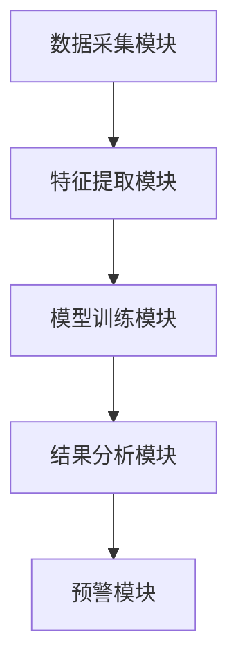

                 


# AI驱动的企业财务舞弊模式演化跟踪系统

> 关键词：AI驱动，企业财务舞弊，模式演化，跟踪系统，机器学习，深度学习

> 摘要：本文详细探讨了如何利用人工智能技术构建企业财务舞弊模式演化跟踪系统。通过分析财务舞弊模式的特征，结合机器学习和深度学习算法，设计了一套完整的系统架构，涵盖数据采集、特征提取、模型训练、结果分析等关键环节，并通过实际案例展示了系统的应用场景和优势。

---

# 第一部分: 背景与概述

# 第1章: AI驱动的企业财务舞弊模式概述

## 1.1 问题背景与现状

### 1.1.1 企业财务舞弊的现状与挑战

企业财务舞弊是指企业在财务报表或其他财务资料中故意提供虚假信息，以误导利益相关者的行为。随着企业规模的扩大和全球化程度的加深，财务舞弊的形式和手段日益复杂，传统的财务审计方法往往难以及时发现和预警潜在的舞弊行为。

近年来，AI技术的快速发展为财务舞弊检测提供了新的可能性。通过机器学习和深度学习算法，可以对海量财务数据进行实时分析，识别异常模式和潜在风险。

### 1.1.2 AI技术在财务舞弊检测中的应用前景

AI技术在财务舞弊检测中的应用前景广阔。通过自然语言处理（NLP）技术，可以分析企业年报、财务报告等文本数据，识别潜在的舞弊迹象。此外，基于时间序列的深度学习模型（如LSTM）可以捕捉财务数据中的异常波动，预测未来可能的舞弊行为。

### 1.1.3 本系统的目标与意义

本系统的目标是构建一个能够实时跟踪企业财务舞弊模式演化的AI驱动系统。通过对财务数据的深度分析，系统能够识别不同类型的舞弊模式，并根据模式的变化趋势提供预警和建议。

## 1.2 问题描述与解决思路

### 1.2.1 财务舞弊模式的定义与分类

财务舞弊模式是指企业在财务数据中表现出的异常特征，这些特征可能暗示企业存在舞弊行为。常见的舞弊模式包括虚构收入、虚增资产、隐瞒债务等。

### 1.2.2 AI驱动模式演化跟踪的核心问题

AI驱动的模式演化跟踪系统需要解决以下核心问题：

1. 如何从海量财务数据中提取有用的特征？
2. 如何训练高效的机器学习模型来识别舞弊模式？
3. 如何实时跟踪模式的演化，并提供预警？

## 1.3 系统目标与架构

### 1.3.1 系统设计目标

系统设计目标包括：

- 实时采集企业财务数据；
- 自动提取特征并训练模型；
- 实时跟踪舞弊模式的演化；
- 提供可视化界面和预警功能。

### 1.3.2 系统架构的初步设想

系统架构的初步设想包括以下几个模块：

1. 数据采集模块：负责从企业财务系统中获取数据；
2. 特征提取模块：对数据进行预处理和特征提取；
3. 模型训练模块：训练机器学习或深度学习模型；
4. 结果分析模块：对模型输出的结果进行分析和可视化；
5. 预警模块：根据分析结果发出预警信号。

---

# 第二部分: 核心概念与技术原理

# 第2章: AI驱动模式演化的核心概念

## 2.1 财务舞弊模式的特征分析

### 2.1.1 财务舞弊模式的分类

财务舞弊模式可以分为以下几类：

1. **虚构收入**：通过虚构销售交易虚增收入；
2. **虚增资产**：通过虚增资产价值虚增资产；
3. **隐瞒债务**：通过隐瞒债务虚减负债；
4. **操控利润**：通过操控成本和收入调整利润。

### 2.1.2 不同模式的特征对比

不同模式的财务舞弊行为在数据特征上存在显著差异。例如，虚构收入通常表现为收入激增但应收账款大幅增加，而虚增资产可能表现为资产增长与现金流不匹配。

### 2.1.3 财务舞弊模式的演化趋势

财务舞弊模式的演化趋势主要体现在以下几个方面：

- 舞弊手段的隐蔽性增强；
- 舞弊行为的跨领域特征明显；
- 舞弊模式的地域性差异缩小。

## 2.2 AI技术在模式演化中的应用

### 2.2.1 机器学习在模式识别中的应用

机器学习在模式识别中的应用主要体现在以下方面：

- **监督学习**：用于分类任务，如识别正常和异常的财务数据；
- **无监督学习**：用于聚类任务，发现隐藏的模式；
- **半监督学习**：结合少量标注数据和大量未标注数据进行学习。

### 2.2.2 深度学习在模式演化中的优势

深度学习在模式演化中的优势主要体现在其强大的特征提取能力和对复杂模式的捕捉能力。例如，LSTM网络可以有效捕捉时间序列数据中的长-term依赖关系，适用于跟踪舞弊模式的演化趋势。

### 2.2.3 核心概念的ER实体关系图

以下是一个简单的ER实体关系图：

```mermaid
erd
    企业(企业ID, 企业名称, 行业)
    财务数据(财务数据ID, 企业ID, 财务指标, 时间戳)
    舞弊模式(模式ID, 模式名称, 模式特征)
    关系1: 企业 -- 财务数据
    关系2: 财务数据 -- 舞弊模式
```

---

# 第3章: 算法原理与数学模型

## 3.1 算法原理

### 3.1.1 聚类分析在模式识别中的应用

聚类分析是一种无监督学习方法，常用于识别数据中的自然分组。在财务舞弊检测中，聚类分析可以用于识别不同类型的财务模式。

#### 聚类分析的步骤

1. 数据预处理：对数据进行标准化或归一化处理；
2. 特征提取：选择具有代表性的特征；
3. 选择聚类算法：如K-means、DBSCAN等；
4. 执行聚类：将数据划分为不同的簇；
5. 结果分析：对聚类结果进行分析和解释。

#### 聚类分析的数学模型

聚类分析的数学模型通常采用距离度量和目标函数优化。例如，K-means算法的目标函数如下：

$$
\text{目标函数} = \sum_{i=1}^{k} \sum_{j=1}^{n_i} (x_j - c_i)^2
$$

其中，$k$是簇的数量，$n_i$是第$i$个簇中的样本数量，$x_j$是样本，$c_i$是第$i$个簇的中心点。

### 3.1.2 时间序列分析在模式演化中的应用

时间序列分析是一种统计方法，用于分析随时间变化的数据。在财务舞弊检测中，时间序列分析可以用于识别财务数据中的异常波动。

#### 时间序列分析的步骤

1. 数据预处理：对时间序列数据进行平稳化处理；
2. 选择模型：如ARIMA、LSTM等；
3. 模型训练：利用历史数据训练模型；
4. 预测与分析：利用模型预测未来的财务数据，识别异常波动。

#### 时间序列分析的数学模型

ARIMA（自回归积分滑动平均模型）是一种常用的时间序列分析模型，其数学表达式如下：

$$
\phi(\theta) \cdot (1 - B)^d X_t = \theta(B) \cdot Z_t
$$

其中，$\phi(\theta)$和$\theta(B)$是多项式系数，$d$是差分的阶数，$B$是延迟算子，$Z_t$是白噪声序列。

---

# 第4章: 系统设计与架构

## 4.1 系统功能

### 4.1.1 数据采集模块

数据采集模块负责从企业财务系统中获取财务数据。常见的数据来源包括企业的财务报表、银行对账单、销售数据等。

### 4.1.2 特征提取模块

特征提取模块负责从原始数据中提取有用的特征。例如，可以从财务数据中提取收入增长率、资产周转率、负债率等关键指标。

### 4.1.3 模型训练模块

模型训练模块负责训练机器学习或深度学习模型。例如，可以使用随机森林、支持向量机（SVM）或LSTM网络进行训练。

### 4.1.4 结果分析模块

结果分析模块负责对模型输出的结果进行分析和可视化。例如，可以将模型识别的异常模式以图表形式展示，帮助用户直观理解。

### 4.1.5 预警模块

预警模块负责根据分析结果发出预警信号。例如，当模型识别出某企业存在潜在舞弊行为时，系统会向财务审计部门发出预警。

---

## 4.2 系统架构图

以下是一个简化的系统架构图：



---

## 4.3 系统接口设计

系统接口设计主要涉及以下几个部分：

1. 数据采集模块接口：负责与企业财务系统对接，获取数据；
2. 模型训练模块接口：负责与机器学习框架（如TensorFlow、PyTorch）对接；
3. 结果分析模块接口：负责与数据可视化工具（如Tableau、Power BI）对接；
4. 预警模块接口：负责与企业内部管理系统对接，发送预警信息。

---

# 第五部分: 项目实战

# 第5章: 项目实战

## 5.1 环境安装与配置

### 5.1.1 安装Python环境

```bash
python --version
pip install numpy pandas scikit-learn tensorflow
```

### 5.1.2 数据集准备

需要准备以下数据集：

- 企业的财务数据：包括收入、成本、利润等指标；
- 标签数据：标注了是否为舞弊行为的数据。

## 5.2 核心代码实现

### 5.2.1 数据预处理

```python
import pandas as pd
import numpy as np

# 读取数据
data = pd.read_csv('financial_data.csv')

# 数据清洗
data.dropna(inplace=True)
data = data[~data.duplicated()]
```

### 5.2.2 特征提取

```python
from sklearn.preprocessing import StandardScaler

# 特征选择
features = data[['revenue', 'cost', 'profit', 'assets', 'liabilities']]
scaler = StandardScaler()
features_scaled = scaler.fit_transform(features)
```

### 5.2.3 模型训练

```python
from sklearn.ensemble import RandomForestClassifier
from sklearn.metrics import accuracy_score

# 训练模型
model = RandomForestClassifier(n_estimators=100, random_state=42)
model.fit(features_scaled, labels)

# 模型评估
y_pred = model.predict(features_scaled)
print("Accuracy:", accuracy_score(labels, y_pred))
```

### 5.2.4 结果分析

```python
import matplotlib.pyplot as plt

# 绘制混淆矩阵
from sklearn.metrics import confusion_matrix
import seaborn as sns

cm = confusion_matrix(labels, y_pred)
sns.heatmap(cm, annot=True, fmt='d')
plt.xlabel('Predicted')
plt.ylabel('Actual')
plt.show()
```

## 5.3 案例分析与解读

### 5.3.1 案例背景

假设我们有一个企业的财务数据，包括2018年至2022年的财务指标。我们需要检测这五年间是否存在财务舞弊行为。

### 5.3.2 数据分析

通过对数据的分析，我们发现该企业在2020年和2021年收入增长迅速，但应收账款也大幅增加。这可能暗示企业存在虚构收入的舞弊行为。

### 5.3.3 模型输出与解读

模型预测结果显示，该企业的财务数据存在较高的异常概率。进一步分析发现，异常数据主要集中在收入和应收账款方面。

---

# 第六部分: 最佳实践与总结

## 6.1 最佳实践

### 6.1.1 数据质量的重要性

数据质量是影响模型性能的关键因素。在实际应用中，需要确保数据的完整性、准确性和一致性。

### 6.1.2 模型选择的注意事项

在选择模型时，需要考虑数据的特性和问题的类型。例如，对于时间序列数据，LSTM网络可能比传统的机器学习模型更合适。

### 6.1.3 系统维护与优化

系统需要定期维护和优化，包括更新模型、调整参数、处理新的数据等。

## 6.2 小结

通过本文的介绍，我们了解了如何利用AI技术构建企业财务舞弊模式演化跟踪系统。从数据采集到模型训练，再到结果分析，整个系统的设计和实现都离不开AI技术的支持。

## 6.3 注意事项

- 数据隐私和安全问题需要特别注意；
- 模型的可解释性需要进一步优化；
- 系统的实时性和响应速度需要满足实际需求。

## 6.4 未来展望

随着AI技术的不断发展，企业财务舞弊模式演化跟踪系统将更加智能化和自动化。未来，我们可以期待更多基于AI的创新应用。

---

# 作者

作者：AI天才研究院/AI Genius Institute & 禅与计算机程序设计艺术 /Zen And The Art of Computer Programming

