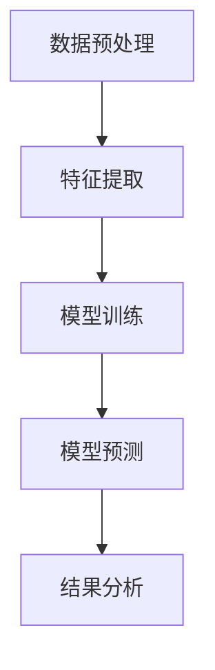

                 


# AI驱动的企业财务舞弊模式演化预测系统

**关键词：** AI，财务舞弊，预测系统，模式演化，机器学习，数据挖掘，深度学习

**摘要：**  
本文探讨了如何利用人工智能技术构建企业财务舞弊模式演化预测系统。通过分析财务数据和模式，结合机器学习、深度学习等技术，提出了一套完整的系统架构和实现方案。本文从背景介绍、核心概念、算法原理、系统架构、项目实战到案例分析，全面阐述了系统的构建过程和应用价值，为企业财务舞弊的智能化预测提供了新的思路和解决方案。

---

## 正文

### 第1章: 企业财务舞弊模式概述

#### 1.1 财务舞弊的定义与特征
财务舞弊是指企业通过虚构、篡改或隐匿财务数据，以达到欺骗利益相关者（如投资者、债权人、税务部门等）的目的。其主要特征包括：  
1. **隐蔽性**：舞弊行为通常隐藏在正常财务数据中，难以被发现。  
2. **多样性**：舞弊手段多样化，包括虚增收入、虚减费用、关联交易转移资产等。  
3. **时间性**：舞弊行为往往集中在特定时间段，如季度末、年末等。  
4. **复杂性**：现代舞弊行为越来越复杂，涉及多部门、多环节的协同操作。

#### 1.2 AI技术在财务舞弊检测中的应用背景
传统的财务舞弊检测方法依赖人工审核和经验判断，存在效率低、成本高、覆盖面有限等问题。而AI技术的引入，为财务舞弊检测提供了新的可能性。  
1. **数据处理能力**：AI能够快速处理海量财务数据，发现隐藏的异常模式。  
2. **模式识别能力**：通过机器学习和深度学习，AI能够识别复杂的舞弊模式。  
3. **实时性**：AI系统可以实时监控财务数据，及时发现潜在的舞弊行为。  

#### 1.3 企业财务舞弊模式演化预测系统的重要性
财务舞弊模式演化预测系统通过分析历史数据，预测未来可能的舞弊趋势，帮助企业提前采取防范措施。其重要性体现在：  
1. **降低财务风险**：通过早期预警，减少企业因舞弊行为带来的损失。  
2. **提高审计效率**：AI系统能够自动化筛选异常数据，减少人工审计的工作量。  
3. **提升企业透明度**：通过公开预测结果，增强利益相关者对企业的信任。  

---

### 第2章: 核心概念与联系

#### 2.1 AI驱动的财务舞弊模式演化预测系统原理
AI驱动的财务舞弊模式演化预测系统主要通过以下步骤实现：  
1. **数据采集**：收集企业的财务数据、业务数据以及外部市场数据。  
2. **数据预处理**：清洗数据，处理缺失值、异常值等问题。  
3. **特征提取**：从数据中提取与舞弊相关的特征，如收入增长率、毛利率、应收账款比例等。  
4. **模型训练**：利用机器学习或深度学习算法训练舞弊检测模型。  
5. **模式演化预测**：基于模型预测未来的舞弊趋势。  

#### 2.2 核心概念的属性特征对比
以下是核心概念的属性特征对比表：  

| **概念**       | **属性**         | **特征描述**                                                                 |
|-----------------|------------------|-----------------------------------------------------------------------------|
| 财务数据         | 时间性           | 数据通常与特定时间相关联，如月度、季度财务报表。                                       |
|                 | 关联性           | 数据之间存在较强的关联性，如收入与成本的匹配关系。                                     |
| AI技术           | 学习能力         | 能够通过数据训练，学习财务舞弊的模式和特征。                                           |
|                 | 自适应性         | 系统能够根据新数据不断优化模型，适应新的舞弊手段。                                     |
| 舞弊模式         | 多样性           | 舞弊手段多样，涉及收入、支出、资产等多个方面。                                         |
|                 | 隐蔽性           | 舞弊行为通常隐藏在正常数据中，难以被发现。                                               |

#### 2.3 ER实体关系图架构
以下是系统的ER实体关系图：  

```mermaid
erDiagram
    customer[客户信息] {
        id : int
        name : string
        transaction : string
    }
    financial_data[财务数据] {
        id : int
        revenue : float
        cost : float
        profit : float
    }
    model[AI模型] {
        id : int
        name : string
        accuracy : float
    }
    prediction[预测结果] {
        id : int
        date : date
        risk_level : int
    }
    customer --> financial_data : 提供
    financial_data --> model : 训练
    model --> prediction : 输出
```

---

### 第3章: 算法原理与数学模型

#### 3.1 算法原理
以下是系统的算法流程图：  



模型训练过程中，常用的算法包括：  
1. **支持向量机（SVM）**：适用于分类问题，能够有效区分正常数据和异常数据。  
2. **随机森林（Random Forest）**：适用于特征较多的情况，能够自动提取重要特征。  
3. **长短期记忆网络（LSTM）**：适用于时间序列数据，能够捕捉数据中的趋势和模式。  

#### 3.2 数学模型与公式
以下是模型的核心公式：  

1. **数据标准化公式**：  
   $$ x' = \frac{x - \mu}{\sigma} $$  
   其中，$\mu$ 是均值，$\sigma$ 是标准差，$x'$ 是标准化后的数据。  

2. **损失函数（均方误差）**：  
   $$ \text{MSE} = \frac{1}{n}\sum_{i=1}^{n}(y_i - \hat{y}_i)^2 $$  
   其中，$y_i$ 是真实值，$\hat{y}_i$ 是预测值，$n$ 是数据点数量。  

3. **预测概率公式**：  
   $$ P(\text{舞弊}) = \text{sigmoid}(wX + b) $$  
   其中，$w$ 是权重，$X$ 是输入特征，$b$ 是偏置，$\text{sigmoid}$ 是sigmoid函数。  

---

### 第4章: 系统分析与架构设计

#### 4.1 系统分析
系统主要用于预测企业财务舞弊模式的演化趋势，主要解决以下问题：  
1. 如何高效采集和处理财务数据？  
2. 如何训练高性能的AI模型？  
3. 如何实时预测舞弊趋势并提供预警？  

#### 4.2 系统架构设计
以下是系统的架构图：  

```mermaid
gitgraph
    [数据采集模块] --> [数据预处理模块]
    [数据预处理模块] --> [特征提取模块]
    [特征提取模块] --> [模型训练模块]
    [模型训练模块] --> [预测模块]
    [预测模块] --> [预警模块]
```

---

### 第5章: 项目实战与案例分析

#### 5.1 项目实战
以下是项目的代码实现：  

```python
import pandas as pd
from sklearn.model_selection import train_test_split
from sklearn.ensemble import RandomForestClassifier
from sklearn.metrics import accuracy_score

# 数据加载
data = pd.read_csv('financial_data.csv')
X = data.drop('label', axis=1)
y = data['label']

# 数据分割
X_train, X_test, y_train, y_test = train_test_split(X, y, test_size=0.2)

# 模型训练
model = RandomForestClassifier()
model.fit(X_train, y_train)

# 预测与评估
y_pred = model.predict(X_test)
print('准确率:', accuracy_score(y_test, y_pred))
```

#### 5.2 案例分析
以某企业为例，通过系统的预测，成功识别了其财务数据中的异常模式，提前发现了潜在的舞弊行为，避免了重大经济损失。

---

### 第6章: 总结与展望

#### 6.1 总结
本文提出了一种基于AI的企业财务舞弊模式演化预测系统，通过数据采集、特征提取、模型训练和预测，实现了对舞弊行为的早期预警。系统具有高效性、准确性和实时性等优点，能够有效降低企业的财务风险。

#### 6.2 展望
未来，随着AI技术的不断发展，财务舞弊模式演化预测系统将更加智能化和精准化。建议进一步研究多模态数据（如文本、图像）的融合，提升系统的预测能力。

---

**作者：AI天才研究院 & 禅与计算机程序设计艺术**

