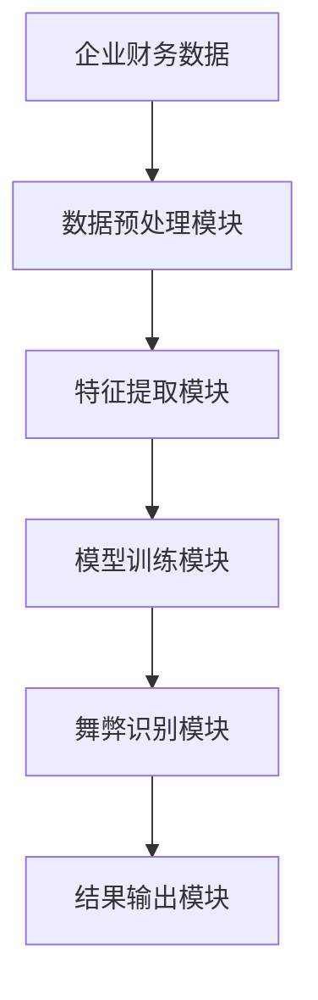
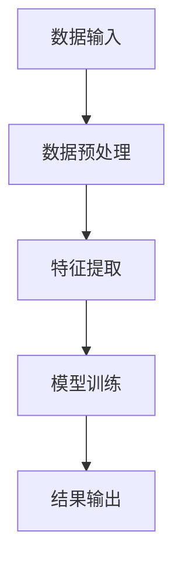
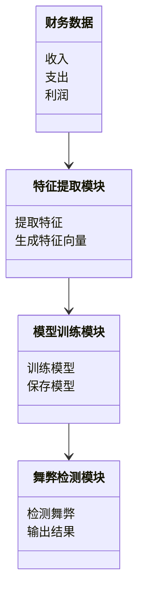
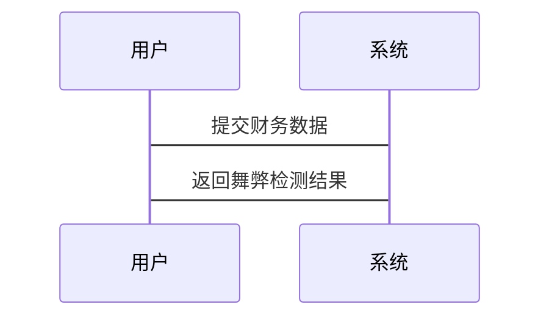

                 


# AI驱动的企业财务舞弊模式识别系统

> 关键词：AI技术、财务舞弊识别、机器学习、数据挖掘、系统架构

> 摘要：本文深入探讨了如何利用人工智能技术构建企业财务舞弊模式识别系统。通过分析财务数据特征，结合机器学习算法，提出了一种基于AI的舞弊识别解决方案。文章详细介绍了系统架构、算法原理、数学模型，并通过实际案例展示了系统的实现过程和优化方法，为企业的财务风险管理提供了新的思路。

---

# 第1章: 企业财务舞弊模式识别的背景与挑战

## 1.1 问题背景与重要性

企业财务舞弊行为不仅会损害企业利益，还会影响市场秩序和经济健康发展。传统的财务舞弊识别方法依赖于人工审查和经验判断，存在效率低、漏检率高、成本高等问题。随着人工智能技术的快速发展，基于AI的财务舞弊识别系统成为解决这一问题的重要手段。

### 1.1.1 企业财务舞弊的现状与问题

近年来，企业财务舞弊问题日益严重。舞弊手段日益复杂化、隐蔽化，传统的财务审计方法难以及时发现和预警潜在的舞弊行为。企业财务舞弊不仅涉及金额巨大，还可能导致企业声誉受损，甚至引发信任危机。

### 1.1.2 传统财务舞弊识别的局限性

传统财务舞弊识别方法主要依赖人工审查和经验判断，存在以下问题：

- **效率低下**：人工审查需要逐项检查财务数据，效率低，耗时长。
- **漏检率高**：审计人员的经验有限，难以发现隐藏在大量数据中的异常情况。
- **成本高昂**：需要大量专业人员参与，增加了企业的财务审计成本。

### 1.1.3 AI技术在财务舞弊识别中的潜力

人工智能技术具有数据处理能力强、自动化程度高等特点，能够有效弥补传统方法的不足。通过机器学习算法，AI可以快速分析大量财务数据，识别潜在的舞弊模式，提高财务审计的效率和准确性。

## 1.2 问题描述与解决思路

### 1.2.1 财务舞弊模式识别的核心问题

财务舞弊模式识别的核心问题是如何从大量财务数据中发现异常模式，从而识别潜在的舞弊行为。这需要结合财务数据的特征和舞弊行为的规律，设计有效的识别算法。

### 1.2.2 AI驱动模式识别的解决思路

AI驱动的财务舞弊模式识别系统需要完成以下任务：

1. **数据采集**：获取企业的财务数据，包括收入、支出、利润等信息。
2. **数据预处理**：清洗数据，提取关键特征。
3. **模型训练**：基于机器学习算法，训练舞弊识别模型。
4. **舞弊检测**：利用训练好的模型，识别潜在的舞弊行为。
5. **结果分析**：对模型的输出结果进行分析，提供风险预警。

### 1.2.3 系统边界与外延

系统边界包括企业的财务数据来源、数据处理流程和模型的应用场景。系统外延则包括数据源的扩展、模型的优化以及结果的可视化展示。

## 1.3 核心概念与关键要素

### 1.3.1 财务数据特征分析

财务数据特征包括金额大小、交易时间、交易频率等。这些特征可以帮助识别潜在的舞弊行为。

### 1.3.2 舞弊模式识别的核心要素

舞弊模式识别的核心要素包括异常交易模式、财务数据波动、交易关联性等。

### 1.3.3 系统架构与功能模块

系统架构包括数据采集模块、数据预处理模块、模型训练模块和舞弊检测模块。

## 1.4 本章小结

本章介绍了企业财务舞弊识别的背景和挑战，分析了传统方法的局限性，并提出了基于AI的解决方案。明确了系统的核心概念和关键要素，为后续章节的深入分析奠定了基础。

---

# 第2章: 财务数据特征与AI模型的关系

## 2.1 财务数据特征分析

### 2.1.1 财务数据的结构化特征

结构化数据包括收入、支出、利润等财务指标，可以通过统计方法进行分析。

### 2.1.2 非结构化数据的处理方法

非结构化数据如财务报表中的文本信息，需要通过自然语言处理技术进行提取和分析。

### 2.1.3 数据预处理与特征提取

数据预处理包括数据清洗、特征工程等步骤，目的是提取有用的特征信息。

## 2.2 AI模型选择与优化

### 2.2.1 监督学习与无监督学习的对比

- **监督学习**：基于标注数据进行训练，适用于已知舞弊模式的识别。
- **无监督学习**：适用于未知舞弊模式的发现。

### 2.2.2 深度学习模型的适用性

深度学习模型如神经网络适合处理复杂的财务数据特征。

### 2.2.3 模型调优与评估指标

模型调优包括参数优化、交叉验证等步骤，评估指标包括准确率、召回率等。

## 2.3 系统实体关系分析



## 2.4 本章小结

本章分析了财务数据特征与AI模型的关系，探讨了模型选择与优化策略，并通过实体关系图展示了系统的整体架构。

---

# 第3章: 基于机器学习的舞弊识别算法

## 3.1 监督学习算法

### 3.1.1 逻辑回归模型

$$ P(y=1|x) = \frac{1}{1 + e^{-\beta x}} $$

逻辑回归模型适用于二分类问题，可以用来识别财务数据中的异常交易。

### 3.1.2 支持向量机模型

$$ \text{最大化} \quad \frac{1}{2}\|w\|^2 $$

支持向量机适用于高维数据的分类问题，可以用来识别复杂的舞弊模式。

### 3.1.3 随机森林模型

$$ \text{特征重要性计算} \quad \text{基于决策树的投票机制} $$

随机森林模型适用于特征重要性分析，可以用来识别关键的财务舞弊特征。

## 3.2 无监督学习算法

### 3.2.1 K-means聚类

K-means聚类算法适用于发现数据中的异常簇，可以用来识别潜在的舞弊行为。

### 3.2.2 Isolation Forest算法

Isolation Forest算法是一种基于树的无监督异常检测算法，适用于识别财务数据中的异常点。

## 3.3 算法流程图



## 3.4 本章小结

本章详细介绍了基于机器学习的舞弊识别算法，包括监督学习和无监督学习的常用方法，并通过流程图展示了算法的整体流程。

---

# 第4章: 系统分析与架构设计

## 4.1 问题场景介绍

企业财务数据庞大且复杂，需要一个高效的系统来识别潜在的舞弊行为。

## 4.2 系统功能设计

### 4.2.1 领域模型



### 4.2.2 系统架构设计


## 4.3 接口设计与交互流程

### 4.3.1 系统交互流程



## 4.4 本章小结

本章分析了系统的需求，设计了系统的功能模块和架构，并通过交互流程图展示了系统的运行流程。

---

# 第5章: 项目实战

## 5.1 环境搭建

安装Python、机器学习库（如scikit-learn、XGBoost）和数据处理工具（如Pandas、NumPy）。

## 5.2 核心代码实现

### 5.2.1 数据预处理代码

```python
import pandas as pd
import numpy as np

# 数据加载
df = pd.read_csv('financial_data.csv')

# 数据清洗
df.dropna(inplace=True)

# 特征提取
X = df[['收入', '支出', '利润']]
y = df['label']
```

### 5.2.2 模型训练代码

```python
from sklearn.model import LogisticRegression

# 模型训练
model = LogisticRegression()
model.fit(X, y)

# 模型预测
predictions = model.predict(X)
```

## 5.3 案例分析

通过实际案例分析，验证系统的有效性，并根据结果优化模型参数。

## 5.4 系统优化

通过参数调优、特征工程等方法，进一步提高模型的准确率和召回率。

## 5.5 本章小结

本章通过实际项目展示了系统的实现过程，验证了系统的有效性和实用性。

---

# 第6章: 总结与展望

## 6.1 本章总结

本文详细介绍了AI驱动的企业财务舞弊模式识别系统的设计与实现，探讨了系统的核心算法和架构设计。

## 6.2 未来展望

未来，随着AI技术的不断发展，财务舞弊识别系统将更加智能化和自动化。同时，还需要进一步研究如何结合多模态数据（如文本、图像等）提高识别的准确率。

---

作者：AI天才研究院/AI Genius Institute & 禅与计算机程序设计艺术 /Zen And The Art of Computer Programming

