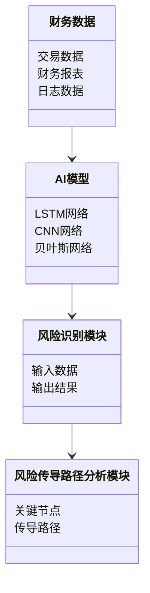
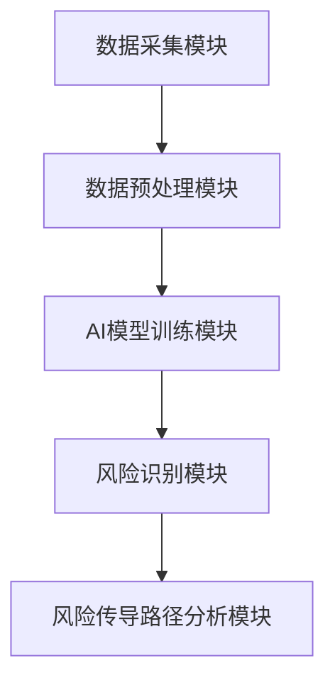
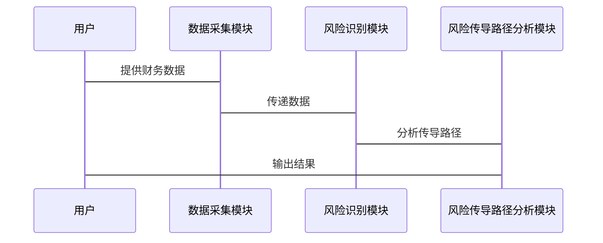

                 


# AI驱动的企业财务舞弊风险传导路径识别系统

**关键词**：AI技术、财务舞弊、风险识别、深度学习、传导路径、系统架构、NLP技术

**摘要**：  
随着企业财务舞弊问题的日益复杂化，传统的财务风险管理方法已难以应对新型的舞弊手段。本文提出了一种基于人工智能的财务舞弊风险传导路径识别系统，通过深度学习和自然语言处理技术，结合企业财务数据的特征和风险传导机制，构建了一个高效的舞弊风险识别模型。该系统能够自动识别潜在的财务舞弊行为，并通过分析风险传导路径，为企业提供早期预警和风险控制策略。本文详细阐述了系统的架构设计、算法实现、项目实战案例以及最佳实践方法。

---

# 第1章：企业财务舞弊风险识别的背景与挑战

## 1.1 企业财务舞弊的现状与问题

### 1.1.1 财务舞弊的定义与类型  
财务舞弊是指通过虚构、篡改或隐匿财务信息，误导利益相关者（如股东、债权人、监管机构等）的行为。常见的舞弊类型包括：

- **虚假收入确认**：通过虚构交易或提前确认收入来夸大财务表现。
- **资产虚增**：通过高估资产价值或隐瞒资产损失来掩盖财务问题。
- **费用隐藏**：将费用延迟或隐藏，以虚增利润。
- **关联交易舞弊**：通过关联交易转移资金或利润，逃避监管或税负。

### 1.1.2 传统财务舞弊识别的局限性  
传统的财务舞弊识别方法主要依赖于审计人员的经验和人工分析，存在以下问题：

- **效率低下**：人工审计耗时长、成本高，难以应对海量数据。
- **主观性强**：审计结果受审计人员主观判断影响，存在人为误差。
- **覆盖面有限**：传统方法难以覆盖复杂、隐蔽的舞弊行为。

### 1.1.3 AI技术在财务舞弊识别中的潜力  
人工智能技术（AI）通过深度学习、自然语言处理（NLP）和大数据分析，能够从海量财务数据中发现异常模式，识别潜在的舞弊行为。AI的优势在于：

- **高效性**：AI能够快速处理大量数据，发现传统方法难以察觉的异常。
- **准确性**：通过训练模型，AI能够识别复杂的舞弊模式，降低误判率。
- **实时性**：AI系统可以实时监控财务数据，提供早期预警。

---

## 1.2 财务舞弊风险传导路径的复杂性

### 1.2.1 财务舞弊的传播机制  
财务舞弊行为通常不会孤立存在，而是通过企业内部或外部的传导路径扩散。例如：

- **内部传导**：舞弊行为从一个部门（如销售部门）传递到另一个部门（如财务部门）。
- **外部传导**：舞弊行为通过关联交易、供应链等传递到外部企业或合作伙伴。
- **系统性传导**：舞弊行为通过企业内部的管理系统扩散到多个业务单元。

### 1.2.2 风险传导的关键节点  
识别财务舞弊风险传导的关键节点，有助于提前采取防控措施。关键节点包括：

- **财务数据录入点**：如销售订单、采购订单的录入环节。
- **财务报表编制环节**：如资产负债表、利润表的编制过程。
- **关联交易环节**：如与关联方的交易可能存在利益输送。

### 1.2.3 风险传导路径的动态特征  
财务舞弊风险的传导路径具有动态变化的特点，主要受以下因素影响：

- **企业组织结构**：不同组织结构下，风险传导路径不同。
- **业务模式**：企业的业务模式复杂化，增加了风险传导的可能性。
- **监管环境**：监管政策的变化会影响舞弊行为的隐蔽性。

---

# 第2章：AI驱动的财务舞弊风险识别系统的核心概念

## 2.1 财务数据的特征与属性

### 2.1.1 财务数据的结构化特征  
财务数据通常具有高度的结构化特征，包括：

- **时间序列性**：财务数据通常按时间顺序排列，如月度或季度财务报表。
- **数值性**：财务数据以数值为主，便于量化分析。
- **关联性**：不同财务数据之间存在内在联系，如收入与成本的匹配性。

### 2.1.2 数据的时序特性  
财务数据的时间序列特性为AI模型提供了分析的基础。通过时间序列分析，可以发现数据中的趋势、周期性变化和异常波动。

### 2.1.3 异常数据的识别特征  
异常数据是财务舞弊的重要标志。常见的异常特征包括：

- **突变性**：数据在短时间内发生突变，如收入突然大幅增长。
- **偏离性**：数据偏离历史平均水平或趋势。
- **不一致性**：不同财务数据之间存在不合理的不一致。

## 2.2 AI模型在风险识别中的应用

### 2.2.1 监督学习与无监督学习的对比  
在财务舞弊识别中，监督学习和无监督学习各有优劣：

- **监督学习**：需要标注的训练数据，适合已知类型的问题（如分类问题）。
- **无监督学习**：适用于未知类型的问题，能够发现数据中的隐藏模式。

### 2.2.2 深度学习模型的优势  
深度学习模型在处理复杂财务数据时具有明显优势：

- **特征提取能力**：深度学习能够自动提取数据中的高层次特征。
- **非线性建模能力**：深度学习能够捕捉数据中的非线性关系。
- **鲁棒性**：深度学习模型对噪声具有较强的鲁棒性。

### 2.2.3 强化学习在风险传导路径中的应用  
强化学习（Reinforcement Learning）通过模拟决策过程，能够有效应对复杂的风险传导路径问题。

---

## 2.3 系统架构的核心要素

### 2.3.1 数据采集模块  
数据采集模块负责从企业财务系统中获取数据，包括：

- **来源**：财务报表、交易数据、日志数据等。
- **格式**：结构化数据、半结构化数据、非结构化数据。

### 2.3.2 风险识别模块  
风险识别模块利用AI模型对数据进行分析，识别潜在的舞弊行为。

### 2.3.3 风险传导路径分析模块  
该模块通过图论方法，分析风险的传导路径，确定关键节点和影响范围。

---

# 第3章：基于深度学习的财务舞弊识别算法

## 3.1 深度学习模型的选择与优化

### 3.1.1 LSTM网络在时间序列分析中的应用  
LSTM（长短期记忆网络）是一种适用于时间序列分析的深度学习模型。其核心在于引入记忆单元，能够捕捉长期依赖关系。

### 3.1.2 CNN在财务数据特征提取中的应用  
卷积神经网络（CNN）适用于局部特征提取，特别适合处理时间序列数据中的局部模式。

### 3.1.3 模型调优与参数优化  
模型调优包括选择合适的超参数（如学习率、批量大小）和优化算法（如Adam、SGD）。

## 3.2 风险传导路径的建模方法

### 3.2.1 图论在风险传导路径中的应用  
通过构建图模型，分析节点之间的连接关系，识别关键节点。

### 3.2.2 马尔可夫链模型的构建  
马尔可夫链模型适用于分析风险传导的动态过程。

### 3.2.3 贝叶斯网络在风险传导中的应用  
贝叶斯网络能够建模变量之间的条件概率关系，适合分析复杂的风险传导路径。

---

## 3.3 算法实现的数学模型

### 3.3.1 LSTM网络的数学表达式  
LSTM的基本结构包括输入门、遗忘门和输出门：

$$
i = \sigma(W_i x_t + U_i h_{t-1})
$$

$$
f = \sigma(W_f x_t + U_f h_{t-1})
$$

$$
o = \sigma(W_o x_t + U_o h_{t-1})
$$

$$
c_t = i \cdot \tanh(W_c x_t + U_c h_{t-1}) + f \cdot c_{t-1}
$$

$$
h_t = o \cdot \tanh(c_t)
$$

---

# 第4章：系统分析与架构设计方案

## 4.1 问题场景介绍

### 4.1.1 项目介绍  
本项目旨在构建一个基于AI的企业财务舞弊风险识别系统，利用深度学习和自然语言处理技术，识别潜在的舞弊行为，并分析风险的传导路径。

### 4.1.2 系统功能设计  
系统功能包括：

- **数据采集**：从企业财务系统中获取数据。
- **风险识别**：利用AI模型识别潜在的舞弊行为。
- **风险传导路径分析**：分析风险的传导路径，确定关键节点。

## 4.2 系统架构设计

### 4.2.1 领域模型类图  
以下是一个简化的领域模型类图：



### 4.2.2 系统架构图  
以下是系统的总体架构图：



### 4.2.3 系统接口设计  
系统接口包括：

- 数据输入接口：用于接收财务数据。
- 模型训练接口：用于训练AI模型。
- 结果输出接口：用于输出识别结果和传导路径分析报告。

### 4.2.4 系统交互序列图  
以下是系统交互的序列图：



---

# 第5章：项目实战与案例分析

## 5.1 环境安装

### 5.1.1 安装Python环境  
使用Python 3.8及以上版本。

### 5.1.2 安装深度学习框架  
安装TensorFlow或Keras框架。

### 5.1.3 安装NLP处理库  
安装NLTK或spaCy库。

## 5.2 系统核心实现源代码

### 5.2.1 数据预处理代码  
```python
import pandas as pd
import numpy as np

# 读取数据
df = pd.read_csv('financial_data.csv')

# 数据清洗
df = df.dropna()
df = df.replace({np.nan: 0})
```

### 5.2.2 LSTM模型实现代码  
```python
from tensorflow.keras.models import Sequential
from tensorflow.keras.layers import LSTM, Dense, Dropout

model = Sequential()
model.add(LSTM(64, input_shape=(timesteps, features)))
model.add(Dropout(0.5))
model.add(Dense(1, activation='sigmoid'))
model.compile(loss='binary_crossentropy', optimizer='adam', metrics=['accuracy'])
```

### 5.2.3 风险传导路径分析代码  
```python
import networkx as nx

G = nx.DiGraph()
G.add_edges_from([('销售部门', '财务部门'), ('财务部门', '管理层')])
nx.draw(G, node_color='blue', edge_color='red')
```

## 5.3 实际案例分析与解读

### 5.3.1 数据处理与分析  
通过分析某企业的财务数据，识别出销售收入与成本之间的异常匹配。

### 5.3.2 模型训练与验证  
训练LSTM模型，验证其在识别财务舞弊行为中的准确性。

### 5.3.3 结果解释与风险控制  
根据模型识别的结果，制定相应的风险控制措施，如加强关联交易的监管。

---

# 第6章：最佳实践与总结

## 6.1 小结  
本文提出了一种基于AI的企业财务舞弊风险识别系统，利用深度学习和图论方法，分析风险的传导路径，为企业提供早期预警和风险控制策略。

## 6.2 注意事项  
- 数据隐私保护：在处理财务数据时，需注意数据的安全性和隐私性。
- 模型可解释性：需提高模型的可解释性，以便更好地理解和优化模型。
- 模型实时性：需优化模型的运行效率，确保其能够实时处理财务数据。

## 6.3 拓展阅读  
- 《Deep Learning》—— Ian Goodfellow
- 《Networks and濡Network Flows》—— Thomas H. Cormen

---

# 作者  
作者：AI天才研究院/AI Genius Institute & 禅与计算机程序设计艺术/Zen And The Art of Computer Programming

