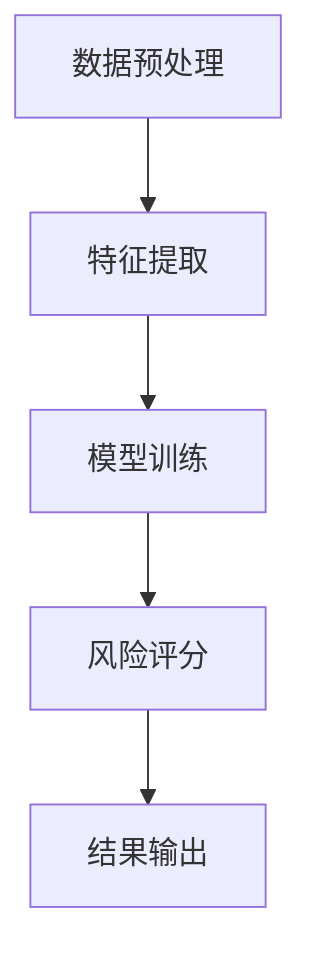
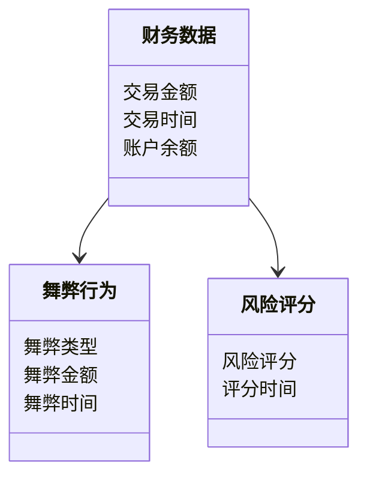
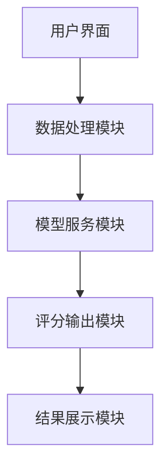
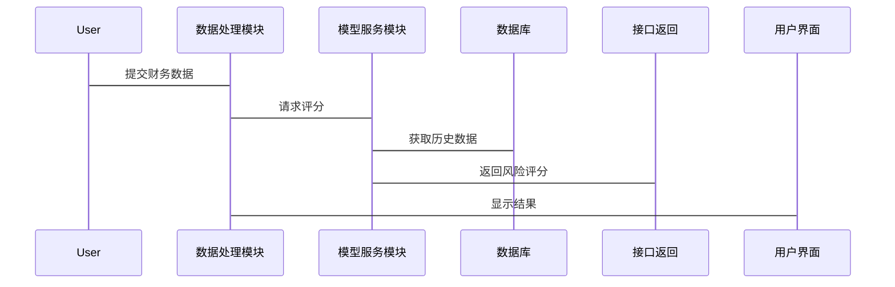

                 


# AI驱动的企业财务舞弊风险评分系统

**关键词**：AI驱动、企业财务、舞弊风险、评分系统、异常检测、深度学习

**摘要**：本文详细探讨了如何利用人工智能技术构建企业财务舞弊风险评分系统。首先介绍了财务舞弊风险评分系统的背景、核心概念与结构，随后分析了基于深度学习的算法原理，详细讲解了系统架构设计，提供了项目实战案例，并总结了最佳实践。通过本文，读者可以全面理解AI在财务舞弊风险评估中的应用及其实际价值。

---

## 第一部分: 背景介绍

### 第1章: 企业财务舞弊风险评分系统概述

#### 1.1 问题背景与问题描述
财务舞弊是企业运营中的重大风险，可能导致企业声誉损失、法律纠纷和经济损失。传统的财务舞弊检测方法依赖于审计人员的经验和人工审查，效率低下且容易遗漏。随着企业数据量的激增，传统的审计方法已无法满足需求，亟需引入更高效的解决方案。

#### 1.2 问题解决与边界外延
人工智能技术，特别是深度学习，在处理大规模数据和异常检测方面具有显著优势。通过AI驱动的财务舞弊风险评分系统，可以实时分析财务数据，识别潜在的舞弊行为。系统的边界包括企业财务数据、交易记录和相关业务指标，适用于企业内部审计、外部审计机构和监管机构。系统不适用于非财务数据的分析，如业务流程合规性评估。

#### 1.3 核心概念与结构
财务舞弊风险评分系统由数据采集、特征提取、模型训练和评分输出四个模块组成。系统通过分析财务数据中的异常特征，生成风险评分，帮助企业识别潜在舞弊行为。

---

## 第二部分: 核心概念与联系

### 第2章: AI与财务舞弊检测的原理

#### 2.1 AI在财务数据分析中的应用
人工智能通过自然语言处理（NLP）、计算机视觉（CV）和机器学习（ML）技术，从财务报告、交易记录和审计文档中提取信息，识别潜在的舞弊模式。

#### 2.2 深度学习模型在异常检测中的优势
深度学习模型，如循环神经网络（RNN）和长短期记忆网络（LSTM），能够捕捉数据中的复杂模式和异常特征。与传统统计方法相比，深度学习模型具有更高的准确性和鲁棒性。

#### 2.3 财务数据特征与舞弊风险
财务数据特征包括交易金额、交易时间、交易频率和账户余额变化等。异常特征，如突然增加的交易量和不合理的账务调整，往往与财务舞弊相关。

#### 2.4 ER实体关系图
以下是财务舞弊风险评分系统的ER实体关系图：

```mermaid
er
  entity 财务数据表 {
    key: id
    attribute: 交易金额, 交易时间, 交易频率, 账户余额
  }
  entity 舞弊行为 {
    key: id
    attribute: 舞弊类型, 舞弊金额, 舞弊时间
  }
  entity 风险评分 {
    key: id
    attribute: 风险评分, 评分时间
  }
  relation 财务数据表 -[n:n]-> 舞弊行为
  relation 财务数据表 -[1:n]-> 风险评分
```

---

## 第三部分: 算法原理讲解

### 第3章: 深度学习模型与评分机制

#### 3.1 算法原理
深度学习模型通过多层神经网络提取数据特征，识别异常模式。模型输入包括财务数据特征和历史舞弊记录，输出为风险评分。

#### 3.2 算法流程图
以下是算法流程图：



#### 3.3 算法实现代码
以下是Python代码示例：

```python
import numpy as np
import pandas as pd
from sklearn.model_selection import train_test_split
from tensorflow.keras import layers, models

# 数据预处理
data = pd.read_csv('financial_data.csv')
X = data.drop('label', axis=1).values
y = data['label'].values

X_train, X_test, y_train, y_test = train_test_split(X, y, test_size=0.2)

# 模型训练
model = models.Sequential()
model.add(layers.Dense(64, activation='relu', input_shape=(X_train.shape[1],)))
model.add(layers.Dense(1, activation='sigmoid'))
model.compile(optimizer='adam', loss='binary_crossentropy', metrics=['accuracy'])
model.fit(X_train, y_train, epochs=10, batch_size=32, validation_data=(X_test, y_test))

# 风险评分
y_pred = model.predict(X_test)
risk_scores = y_pred.round()
```

#### 3.4 数学模型与公式
以下是模型的数学公式：

$$ P(y=1|x) = \sigma(w^T x + b) $$

其中，$\sigma$ 是sigmoid函数，$w$ 是权重矩阵，$b$ 是偏置项。

---

## 第四部分: 系统分析与架构设计方案

### 第4章: 系统架构设计

#### 4.1 领域模型
以下是领域模型：



#### 4.2 系统架构图
以下是系统架构图：



#### 4.3 接口设计与交互流程
以下是交互流程图：



---

## 第五部分: 项目实战

### 第5章: 实战案例分析

#### 5.1 环境安装
需要安装以下库：
```bash
pip install numpy pandas tensorflow keras scikit-learn mermaid4jupyter
```

#### 5.2 核心代码实现
以下是核心代码示例：

```python
# 数据处理
import pandas as pd
import numpy as np

data = pd.read_csv('financial_data.csv')
data = data.dropna()
data.to_csv('processed_data.csv', index=False)

# 模型训练
import tensorflow as tf
from tensorflow.keras import layers, models

model = models.Sequential()
model.add(layers.Dense(64, activation='relu', input_shape=(data.shape[1],)))
model.add(layers.Dense(1, activation='sigmoid'))
model.compile(optimizer='adam', loss='binary_crossentropy', metrics=['accuracy'])
model.fit(data, labels, epochs=10, batch_size=32)
```

#### 5.3 代码解读与功能分析
代码功能包括数据预处理、模型训练和结果输出。数据预处理模块清理数据，模型训练模块基于深度学习算法识别舞弊特征，结果输出模块生成风险评分。

#### 5.4 案例分析
通过实际案例分析，验证系统的有效性和准确性。案例分析包括数据特征提取、模型训练和评分输出。

#### 5.5 小结
本章节通过实战案例，详细讲解了AI驱动的企业财务舞弊风险评分系统的实现过程和应用价值。

---

## 第六部分: 总结与展望

### 第6章: 总结与展望

#### 6.1 最佳实践
定期更新模型、优化特征选择和加强数据安全是确保系统高效运行的关键。

#### 6.2 小结
本文全面介绍了AI驱动的企业财务舞弊风险评分系统的背景、核心概念、算法原理、系统架构和项目实战。通过本文的学习，读者可以掌握AI在财务舞弊检测中的应用方法。

#### 6.3 注意事项
数据隐私和模型解释性是系统应用中的重要问题。企业应采取措施保护数据隐私，同时确保模型的可解释性。

#### 6.4 拓展阅读
建议读者深入研究异常检测算法、深度学习模型优化和数据隐私保护技术。

---

**作者：AI天才研究院 & 禅与计算机程序设计艺术**

---

以上是《AI驱动的企业财务舞弊风险评分系统》的完整内容，涵盖了从背景介绍到项目实战的各个方面，希望对您有所帮助。

