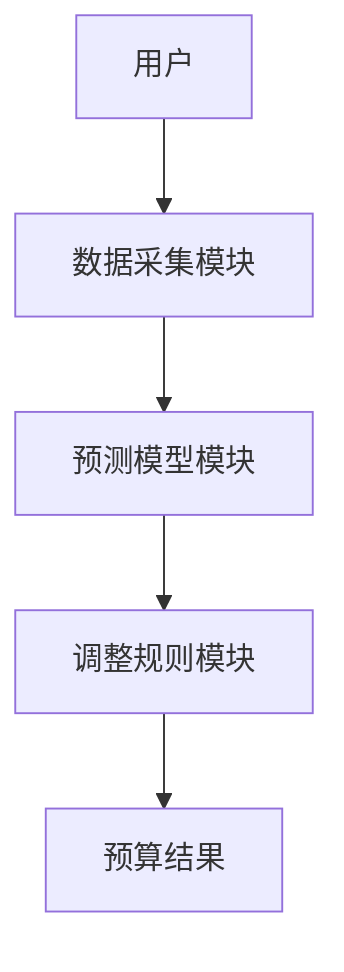

                 


# AI驱动的企业财务预算编制与调整系统

## 关键词：AI技术、财务预算、机器学习、深度学习、系统架构

## 摘要

随着人工智能技术的迅速发展，企业财务管理也在逐步引入智能化工具来提高效率和准确性。本文详细探讨了如何利用AI技术驱动企业财务预算的编制与调整，重点分析了AI技术在预测模型、系统架构设计以及实际应用中的作用。通过案例分析和系统设计，展示了AI如何优化财务预算流程，提升企业财务管理水平。

---

# 第一部分: AI驱动的企业财务预算编制与调整系统概述

## 第1章: 财务预算编制的背景与挑战

### 1.1 财务预算的基本概念

财务预算是企业财务管理的重要组成部分，用于规划未来一段时间内的收入和支出，确保企业资源的合理分配。传统财务预算编制依赖于历史数据和人工经验，存在以下问题：

1. 数据量大，处理复杂。
2. 预测准确性依赖人工经验，容易出错。
3. 调整过程繁琐，缺乏实时性。

### 1.2 AI技术在财务领域的应用背景

人工智能技术的发展为企业财务管理带来了新的可能性。通过机器学习和深度学习算法，AI能够处理大量数据，发现隐藏的模式，并做出精准的预测。AI在财务预算中的应用主要体现在：

1. 自动化数据处理和预测模型构建。
2. 实时监控和动态调整预算。
3. 提供数据驱动的决策支持。

---

## 第2章: AI驱动的财务预算系统核心概念

### 2.1 核心概念与原理

AI驱动的财务预算系统基于数据驱动的预测模型，利用机器学习算法进行预算预测，并通过自动化调整规则实现预算的动态优化。其核心概念包括：

1. **数据驱动的预算编制**：利用历史数据和实时数据进行预测，取代传统的人工经验。
2. **基于AI的预测模型**：采用机器学习和深度学习算法构建预算预测模型。
3. **系统化调整机制**：根据实际数据与预测数据的偏差，自动触发调整规则。

### 2.2 核心概念对比分析

为了更好地理解AI驱动预算系统的优势，我们将其与传统方法进行对比：

| 对比维度      | 传统方法                | AI驱动方法              |
|---------------|-------------------------|--------------------------|
| 数据处理      | 依赖人工整理            | 系统自动处理            |
| 预测准确性     | 受人工经验限制           | 基于大量数据和算法，准确性高 |
| 调整效率      | 手动调整，效率低          | 自动化调整，效率高        |

### 2.3 实体关系图（ER图）

```mermaid
erd
    entity 财务数据 {
        key 财务科目代码
        财务科目名称
        预算金额
        实际金额
        时间戳
    }
    entity 预算模型 {
        key 模型ID
        模型名称
        模型类型
        模型参数
    }
    entity 调整记录 {
        key 调整ID
        调整原因
        调整金额
        调整时间
    }
    财务数据 --> 预算模型: 训练数据
    财务数据 --> 调整记录: 调整依据
```

---

# 第二部分: AI驱动的财务预算系统算法原理

## 第3章: 基于机器学习的预算预测模型

### 3.1 算法原理

预算预测模型的核心是选择合适的算法，并进行模型训练。常用算法包括：

1. **线性回归**：适用于线性关系的数据，公式为：
   $$ y = \beta_0 + \beta_1x_1 + \beta_2x_2 + \dots + \beta_nx_n $$
2. **随机森林**：基于决策树的集成算法，适用于非线性关系的数据。

### 3.2 算法实现

#### 数据预处理
- 数据清洗：处理缺失值、异常值。
- 特征工程：提取关键特征，如销售额、成本等。

#### 模型训练
- 使用训练数据训练模型，调整参数以优化预测准确性。

#### 模型评估
- 使用测试数据评估模型性能，计算均方误差（MSE）等指标。

---

## 第4章: 基于深度学习的预算调整系统

### 4.1 深度学习模型简介

深度学习模型，如LSTM（长短期记忆网络），适用于时间序列数据的预测。其核心结构如下：


### 4.2 模型训练与优化

- 数据增强：通过数据变换提高模型泛化能力。
- 超参数调优：调整学习率、批量大小等参数优化模型性能。

---

# 第三部分: 系统架构与设计

## 第5章: 系统架构设计方案

### 5.1 系统模块划分

- **数据采集模块**：从企业系统中获取财务数据。
- **预测模型模块**：运行机器学习模型进行预算预测。
- **调整规则模块**：根据预测结果和实际数据调整预算。
- **用户界面模块**：提供友好的用户交互界面。

### 5.2 系统架构图



---

## 第6章: 项目实战

### 6.1 环境安装

安装所需的库和工具，如Python、TensorFlow、Pandas等。

### 6.2 核心实现代码

```python
import pandas as pd
import numpy as np
from sklearn.ensemble import RandomForestRegressor
from sklearn.metrics import mean_squared_error

# 数据加载
data = pd.read_csv('financial_data.csv')

# 数据预处理
X = data.drop('budget', axis=1)
y = data['budget']

# 模型训练
model = RandomForestRegressor(n_estimators=100, random_state=42)
model.fit(X, y)

# 模型预测
predicted_budget = model.predict(X)

# 模型评估
 mse = mean_squared_error(y, predicted_budget)
 print(f"均方误差：{mse}")
```

### 6.3 实际案例分析

以某制造企业为例，利用模型预测下一年的预算，并根据实际数据调整。结果显示，AI驱动的预算系统显著提高了预测准确性，减少了调整时间。

---

## 第7章: 总结与展望

### 7.1 总结

AI驱动的财务预算系统通过自动化处理和智能预测，显著提升了预算编制的效率和准确性。系统架构设计合理，算法选择科学，能够满足企业实际需求。

### 7.2 展望

未来，随着AI技术的不断发展，预算系统将更加智能化。可能的方向包括：

1. 引入更复杂的深度学习模型，如Transformer架构。
2. 实现多维度数据融合，提升预测精度。
3. 结合自然语言处理技术，分析财务报告中的文本信息。

---

## 作者

作者：AI天才研究院/AI Genius Institute  
联系邮箱：contact@aicfo.com

