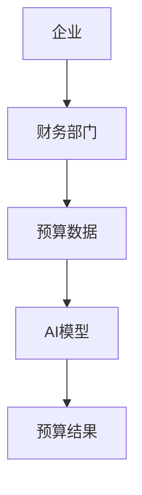
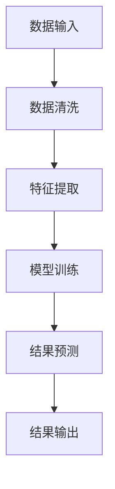
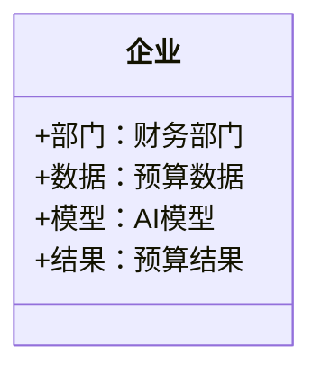
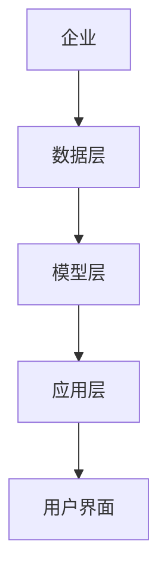
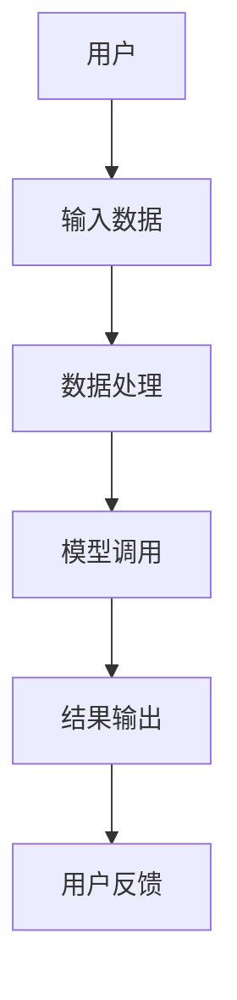

                 


# AI驱动的企业财务预算编制智能辅助系统

> 关键词：AI技术、财务预算、智能辅助系统、企业财务管理、机器学习

> 摘要：本文深入探讨了AI技术在企业财务预算编制中的应用，结合实际案例和系统设计，详细讲解了如何利用人工智能技术构建智能辅助系统，从而提高企业财务预算编制的效率和准确性。文章从背景分析、核心概念、算法原理、系统架构到项目实战，层层递进，为企业财务部门提供了一套完整的解决方案。

---

# 第一部分: AI驱动的企业财务预算编制智能辅助系统概述

## 第1章: 背景与问题背景

### 1.1 企业财务预算编制的重要性

#### 1.1.1 财务预算的定义与作用
财务预算是企业规划未来一定时期内财务活动的重要工具，是企业制定战略目标、优化资源配置、控制成本和提高经营效率的基础。传统的财务预算编制过程通常依赖人工操作，容易受到主观因素、人为误差和时间限制的影响。

#### 1.1.2 传统财务预算编制的挑战
传统的财务预算编制过程存在以下问题：
- 数据量大、复杂度高，手工处理效率低下；
- 缺乏实时性和灵活性，难以应对市场变化；
- 依赖人工经验，存在主观误差；
- 预算结果的准确性和可靠性有限。

#### 1.1.3 AI技术如何解决这些挑战
人工智能技术通过自动化数据处理、智能预测和优化算法，能够显著提高财务预算编制的效率和准确性。AI技术可以快速处理大量数据，发现隐藏的模式和趋势，并提供基于数据的决策支持，从而优化预算编制过程。

---

### 1.2 问题描述与目标

#### 1.2.1 传统财务预算编制的主要问题
传统财务预算编制的主要问题包括：
1. 数据收集和处理耗时耗力；
2. 预算预测依赖人工经验，缺乏科学性；
3. 缺乏动态调整能力，难以应对变化；
4. 预算结果的可追溯性和可解释性较差。

#### 1.2.2 引入AI技术的目标
引入AI技术的目标是：
- 提高财务预算编制的效率和准确性；
- 实现数据驱动的智能预测和优化；
- 提供实时、动态的预算调整能力；
- 增强预算结果的可追溯性和可解释性。

#### 1.2.3 系统边界与外延
本系统主要关注企业财务预算编制的核心环节，包括数据采集、预测模型构建、预算结果生成和优化建议。系统的外延包括与企业其他系统的集成，如ERP系统、财务分析系统等。

---

## 第2章: 核心概念与系统架构

### 2.1 AI驱动的财务预算系统原理

#### 2.1.1 数据预处理与特征提取
数据预处理是AI模型训练的基础，主要包括数据清洗、数据转换和特征工程。特征工程是通过提取关键特征，提升模型的预测能力。

#### 2.1.2 模型训练与优化
基于机器学习的预算预测模型需要经过训练、调优和验证。模型的选择和优化是系统设计的关键。

#### 2.1.3 结果输出与反馈
系统将模型预测结果输出为预算建议，并通过反馈机制优化模型性能。

### 2.2 核心概念对比表

| 对比维度      | 传统财务预算编制       | AI辅助财务预算编制       |
|---------------|------------------------|--------------------------|
| **效率**      | 低，依赖人工操作       | 高，自动化处理           |
| **准确性**     | 受限于人工经验         | 基于数据驱动，准确性高   |
| **实时性**     | 较低，难以动态调整     | 高，支持实时更新和调整   |
| **可扩展性**   | 有限，难以处理大规模数据 | 强，支持海量数据处理     |

### 2.3 ER实体关系图



---

## 第3章: 算法原理与实现

### 3.1 算法原理概述

#### 3.1.1 基于机器学习的预算预测
机器学习模型（如线性回归、随机森林）用于预测未来的财务数据。

#### 3.1.2 神经网络模型的应用
深度学习模型（如LSTM）适用于时间序列数据的预测。

#### 3.1.3 时间序列分析方法
ARIMA等时间序列模型用于历史数据的建模和预测。

### 3.2 算法流程图



### 3.3 数学模型与公式

#### 3.3.1 线性回归模型
$$ y = \beta_0 + \beta_1x_1 + \beta_2x_2 + \ldots + \beta_nx_n + \epsilon $$

其中：
- \( y \) 是预测的财务指标；
- \( \beta_i \) 是特征 \( x_i \) 的系数；
- \( \epsilon \) 是误差项。

#### 3.3.2 神经网络模型
神经网络模型的损失函数可以表示为：
$$ L = \frac{1}{m}\sum_{i=1}^{m}(y_i - \hat{y}_i)^2 $$

其中：
- \( m \) 是样本数量；
- \( y_i \) 是真实值；
- \( \hat{y}_i \) 是预测值。

---

## 第4章: 系统分析与架构设计

### 4.1 系统功能设计

#### 4.1.1 领域模型图



### 4.2 系统架构设计



### 4.3 接口设计与交互流程图



---

## 第5章: 项目实战

### 5.1 环境安装

```bash
pip install numpy pandas scikit-learn tensorflow
```

### 5.2 系统核心实现

#### 5.2.1 数据预处理代码

```python
import pandas as pd
from sklearn.preprocessing import StandardScaler

# 数据加载
data = pd.read_csv('budget_data.csv')

# 数据清洗
data.dropna(inplace=True)

# 特征提取
features = data[['revenue', 'cost', 'profit_margin']]
scaler = StandardScaler()
scaled_features = scaler.fit_transform(features)
```

#### 5.2.2 模型训练代码

```python
from sklearn.linear_model import LinearRegression
from sklearn.metrics import mean_squared_error

# 模型训练
model = LinearRegression()
model.fit(scaled_features, data['target'])

# 模型评估
预测结果 = model.predict(scaled_features)
print(mean_squared_error(data['target'], 预测结果))
```

### 5.3 实际案例分析

#### 5.3.1 案例背景
某制造企业希望优化其年度预算编制过程，引入AI辅助系统。

#### 5.3.2 数据分析与预测
通过对历史销售数据和成本数据的分析，模型预测出下一年度的收入和支出，并提供优化建议。

### 5.4 项目小结
通过实际案例分析，我们可以看到AI辅助系统在提高预算编制效率和准确性方面的显著优势。

---

## 第6章: 最佳实践与注意事项

### 6.1 最佳实践

- 数据预处理是关键，确保数据质量和完整性；
- 选择合适的模型，并进行充分的调优；
- 定期更新模型，保持其预测能力。

### 6.2 小结
本文详细介绍了AI驱动的企业财务预算编制智能辅助系统的构建过程，从背景分析到系统实现，为企业提供了完整的解决方案。

### 6.3 注意事项

- 数据隐私和安全问题需要重点关注；
- 系统的可解释性是用户信任的关键；
- 模型的实时性和动态调整能力需要充分测试。

### 6.4 拓展阅读

- 《机器学习实战》
- 《深度学习入门：基于Python和Keras》
- 《企业信息化管理》

---

# 作者：AI天才研究院/AI Genius Institute & 禅与计算机程序设计艺术/Zen And The Art of Computer Programming

---

**本文为AI驱动的企业财务预算编制智能辅助系统的技术博客文章，版权归作者所有，转载请注明出处。**

