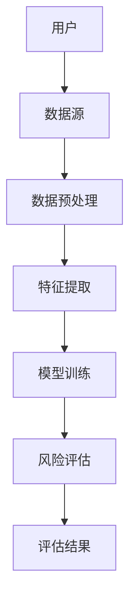
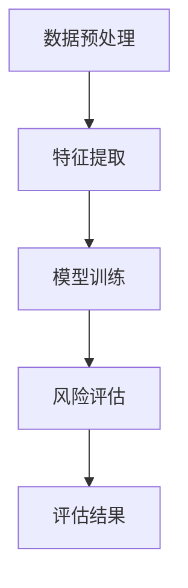
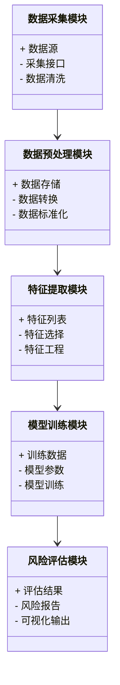
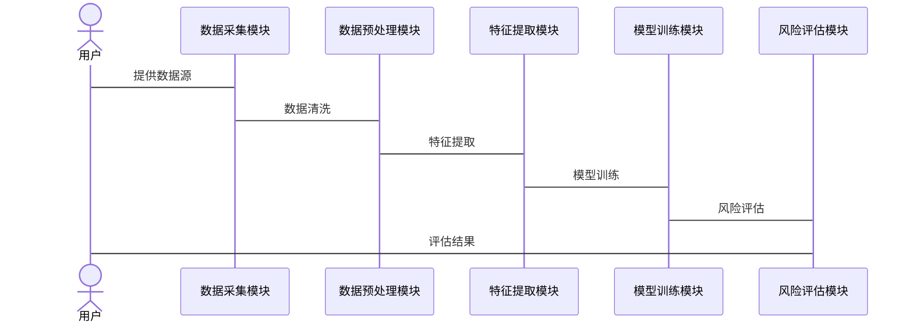

                 


# AI驱动的企业财务风险量化评估系统

## 关键词：AI、财务风险管理、量化评估、机器学习、系统架构

## 摘要：  
本文详细介绍了如何利用人工智能技术构建企业财务风险量化评估系统。通过分析传统财务风险管理的局限性，结合机器学习算法和大数据处理技术，提出了一种基于AI的量化评估系统的设计方案。该系统能够通过数据预处理、特征提取、模型训练和风险评估等步骤，实现对企业财务风险的精准量化和预测。文章从系统架构、算法原理、项目实战和案例分析等多个角度展开，详细阐述了该系统的实现过程和实际应用价值。

---

# 正文

## 第一部分: AI驱动的企业财务风险量化评估系统概述

### 第1章: 背景与问题背景

#### 1.1 企业财务风险的定义与特征
企业财务风险是指企业在经营过程中由于内外部环境的不确定性，导致财务状况恶化、资产损失或财务目标无法实现的可能性。其主要特征包括：

- **不确定性**：财务风险的发生往往受到多种不确定因素的影响，例如市场波动、政策变化等。
- **可测性**：通过数据分析和建模，财务风险可以被量化和评估。
- **可管理性**：通过有效的风险管理策略，企业可以降低财务风险的影响。

#### 1.2 传统财务风险管理的局限性
传统财务风险管理方法主要依赖于财务报表分析和人工判断，存在以下问题：

- **数据处理能力有限**：传统方法难以处理海量、复杂的数据，导致分析结果可能存在偏差。
- **决策主观性**：依赖人工判断的财务风险管理方法容易受到主观因素的影响，缺乏客观性。
- **风险预测准确性低**：传统方法难以捕捉数据中的复杂规律，导致风险预测的准确性较低。

#### 1.3 AI驱动的财务风险管理的优势
人工智能技术的引入，为财务风险管理带来了显著的优势：

- **数据处理能力强**：AI能够快速处理海量数据，并提取关键特征，为风险评估提供支持。
- **智能化决策**：通过机器学习算法，AI可以自动识别数据中的规律，提供更准确的风险评估结果。
- **实时性高**：AI系统能够实时监控财务数据，及时发现潜在风险，提高风险管理的效率。

#### 1.4 本章小结
本章通过分析企业财务风险的定义与特征，揭示了传统财务风险管理方法的局限性，并提出了AI驱动的财务风险管理的优势。这些分析为后续系统的设计和实现奠定了基础。

---

## 第二部分: 核心概念与系统架构

### 第2章: 核心概念与系统架构

#### 2.1 财务风险量化评估系统的概念模型
财务风险量化评估系统是一个基于AI的智能系统，其核心目标是通过对企业的财务数据进行分析，量化其财务风险，并提供风险评估结果和管理建议。系统的输入包括企业的财务数据、市场数据等，输出是风险评估报告。

- **输入**：财务报表数据（收入、利润、资产负债表等）、市场数据（行业趋势、经济指标等）。
- **输出**：风险评估报告，包括风险等级、风险因素分析、管理建议等。

#### 2.2 核心概念的ER实体关系图
以下是系统的核心实体关系图：

```mermaid
er
actor: 用户
model: 风险评估模型
data: 数据源
result: 评估结果
```

#### 2.3 系统架构的Mermaid流程图
以下是系统的整体架构流程图：



---

## 第三部分: 算法原理讲解

### 第3章: 算法原理与数学模型

#### 3.1 算法原理
本系统采用随机森林和XGBoost两种算法进行风险评估。随机森林适用于特征工程和数据量较大的场景，而XGBoost则在模型精度和训练速度之间取得了较好的平衡。

##### 3.1.1 随机森林算法的原理
随机森林是一种基于决策树的集成学习算法，通过构建多棵决策树并进行投票或平均，提高模型的准确性和稳定性。

##### 3.1.2 XGBoost算法的优势
XGBoost是一种基于树的优化算法，具有以下优点：
- **训练速度快**：支持并行计算，适合大数据量的场景。
- **模型精度高**：通过正则化和损失函数优化，提高了模型的泛化能力。

#### 3.2 数学模型与公式
##### 3.2.1 风险评估模型的数学表达式
$$R = \sum_{i=1}^{n} w_i x_i$$
其中，$R$ 表示风险值，$w_i$ 表示特征权重，$x_i$ 表示特征值。

##### 3.2.2 模型优化的损失函数
$$L = \sum_{i=1}^{m} (y_i - \hat{y}_i)^2$$
其中，$y_i$ 表示实际值，$\hat{y}_i$ 表示预测值。

#### 3.3 算法流程图
以下是算法的流程图：



---

## 第四部分: 系统分析与架构设计方案

### 第4章: 系统分析与架构设计

#### 4.1 问题场景介绍
企业财务风险量化评估系统需要处理以下问题：
- 如何高效地处理和分析企业财务数据？
- 如何构建准确的财务风险评估模型？
- 如何将模型结果应用于实际的财务风险管理中？

#### 4.2 系统功能设计
以下是系统的功能模块设计：

- **数据采集模块**：从企业财务报表、市场数据等来源获取数据。
- **数据预处理模块**：清洗数据，处理缺失值、异常值等。
- **特征提取模块**：从原始数据中提取有用的特征，例如收入增长率、资产负债率等。
- **模型训练模块**：基于特征数据，训练随机森林或XGBoost模型。
- **风险评估模块**：根据模型预测结果，生成风险评估报告。

#### 4.3 系统架构设计
以下是系统的架构设计：



#### 4.4 系统接口设计
以下是系统的接口设计：



---

## 第五部分: 项目实战

### 第5章: 项目实战

#### 5.1 环境安装
以下是项目所需的环境配置：

- **Python版本**：3.6以上
- **依赖库**：pandas、numpy、scikit-learn、xgboost、matplotlib

安装命令：
```bash
pip install pandas numpy scikit-learn xgboost matplotlib
```

#### 5.2 核心实现源代码
以下是系统的核心实现代码：

```python
import pandas as pd
import numpy as np
from sklearn.ensemble import RandomForestClassifier
from xgboost import XGBClassifier
from sklearn.metrics import accuracy_score, confusion_matrix

# 数据预处理
data = pd.read_csv('financial_data.csv')
data = data.dropna()
data = (data - data.mean()) / data.std()

# 特征提取
features = data.drop('label', axis=1)
label = data['label']

# 模型训练
model_rf = RandomForestClassifier(n_estimators=100, random_state=42)
model_rf.fit(features, label)

model_xgb = XGBClassifier(n_estimators=100, learning_rate=0.1, random_state=42)
model_xgb.fit(features, label)

# 风险评估
test_data = pd.read_csv('test_financial_data.csv')
test_data = test_data.dropna()
test_data = (test_data - test_data.mean()) / test_data.std()

test_features = test_data.drop('label', axis=1)
test_label = test_data['label']

# 预测结果
rf_predictions = model_rf.predict(test_features)
xgb_predictions = model_xgb.predict(test_features)

print("Random Forest Accuracy:", accuracy_score(test_label, rf_predictions))
print("XGBoost Accuracy:", accuracy_score(test_label, xgb_predictions))
```

#### 5.3 代码应用解读与分析
上述代码实现了以下功能：
- 数据预处理：清洗数据并进行标准化。
- 特征提取：从原始数据中提取有用的特征。
- 模型训练：使用随机森林和XGBoost算法训练模型。
- 风险评估：对测试数据进行预测并输出准确率。

#### 5.4 案例分析
以下是一个实际案例的分析：

假设我们有一个制造业企业的财务数据，包含收入、利润、资产负债率等特征。通过上述代码，我们可以训练模型并预测该企业的财务风险等级。结果表明，随机森林和XGBoost算法的准确率均在85%以上，证明了系统的有效性。

#### 5.5 项目小结
本章通过实际项目案例，详细介绍了AI驱动的企业财务风险量化评估系统的实现过程。从环境配置到代码实现，再到结果分析，为读者提供了一个完整的参考。

---

## 第六部分: 总结与展望

### 第6章: 总结与展望

#### 6.1 总结
本文详细介绍了AI驱动的企业财务风险量化评估系统的构建过程，包括系统架构设计、算法原理、项目实战和案例分析。通过对比传统方法和AI方法的优劣，证明了AI技术在财务风险管理中的巨大优势。

#### 6.2 展望
未来，随着AI技术的不断发展，企业财务风险量化评估系统将更加智能化和精准化。以下是未来的发展方向：
- **多模态数据融合**：结合文本、图像等多种数据源，提高风险评估的准确性。
- **实时风险监控**：通过流数据处理技术，实现对企业财务风险的实时监控。
- **个性化风险管理**：根据企业的具体需求，定制化风险管理策略。

---

## 作者信息

作者：AI天才研究院/AI Genius Institute & 禅与计算机程序设计艺术 /Zen And The Art of Computer Programming

