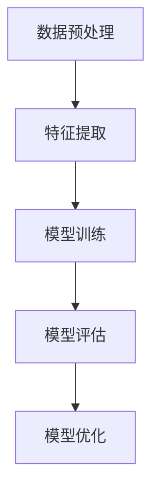
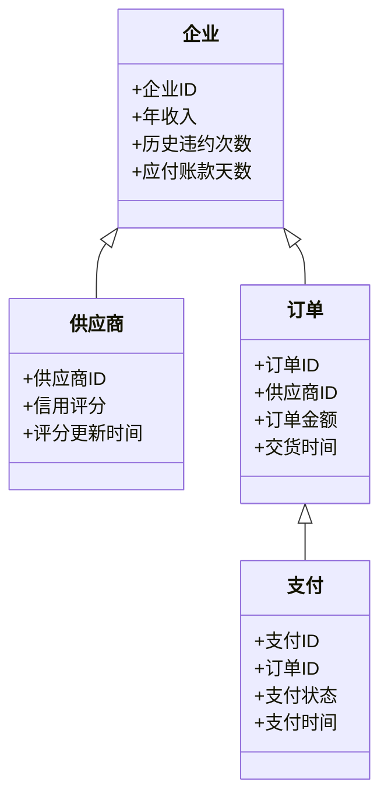
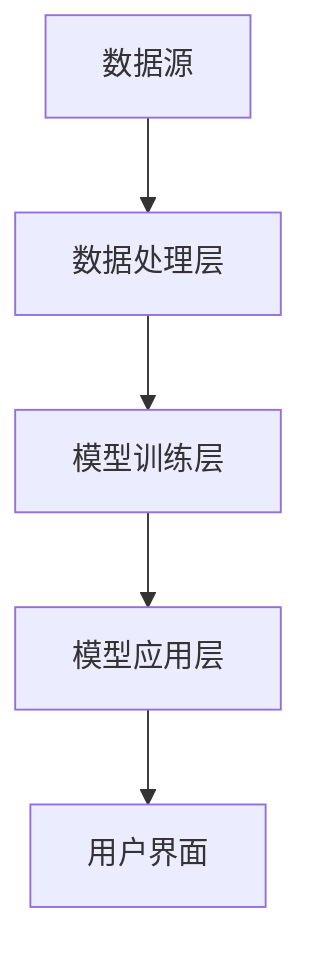
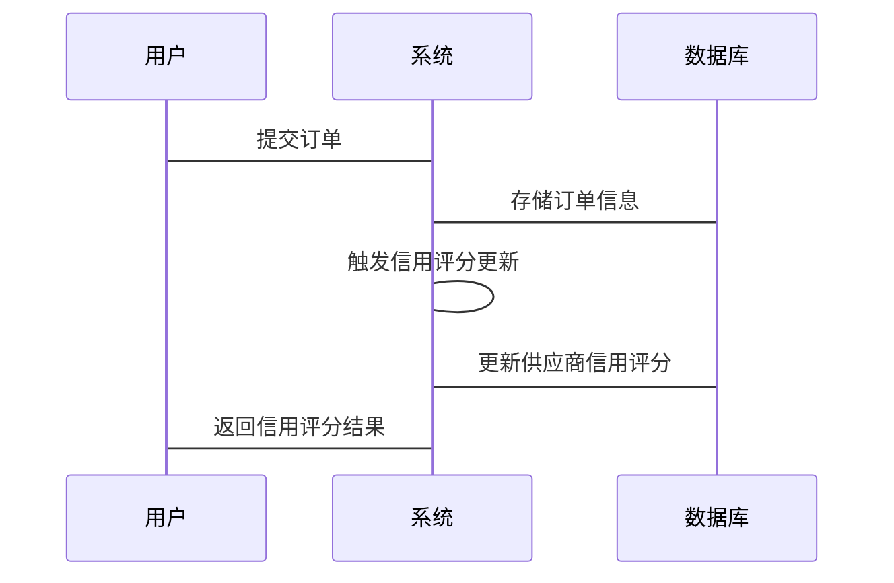

                 


# AI驱动的供应链金融信用评分模型

> 关键词：AI，供应链金融，信用评分，机器学习，金融模型

> 摘要：本文详细探讨了AI驱动的供应链金融信用评分模型的构建与应用，分析了其在提升信用评估效率和精准度方面的优势，结合实际案例，展示了如何利用机器学习算法优化信用评分过程，为供应链金融的智能化发展提供参考。

---

## 第三章: AI驱动的信用评分模型的算法原理

### 3.2 算法流程图



### 3.3 算法原理详细讲解

#### 3.3.1 逻辑回归模型

##### 3.3.1.1 模型概述

逻辑回归是一种常用的统计方法，适用于分类问题。在供应链金融中，我们可以使用逻辑回归来预测企业违约的概率。

##### 3.3.1.2 模型数学公式

$$ P(y=1|x) = \frac{1}{1 + e^{-(\beta_0 + \beta_1 x_1 + \cdots + \beta_n x_n)}} $$

其中，$y$ 是目标变量（违约与否），$x_i$ 是特征变量，$\beta$ 是模型参数。

##### 3.3.1.3 代码实现示例

```python
from sklearn.linear_model import LogisticRegression

# 数据预处理
X = df[['年收入', '历史违约次数', '应付账款天数']]
y = df['违约标签']

# 模型训练
model = LogisticRegression()
model.fit(X, y)

# 模型预测
predicted = model.predict(X)
print("准确率:", accuracy_score(y, predicted))
```

#### 3.3.2 支持向量机（SVM）

##### 3.3.2.1 模型概述

SVM适用于高维数据分类，通过构建超平面将数据点分为两类。在供应链金融中，SVM可以用于区分高风险和低风险供应商。

##### 3.3.2.2 模型数学公式

$$ \text{优化目标: } \min_{\mathbf{w}, b, \xi} \frac{1}{2} \|\mathbf{w}\|^2 + C \sum_{i=1}^n \xi_i $$

约束条件：
$$ y_i (\mathbf{w} \cdot \mathbf{x}_i + b) \geq 1 - \xi_i $$
$$ \xi_i \geq 0 $$

##### 3.3.2.3 代码实现示例

```python
from sklearn.svm import SVC

# 数据预处理
X = df[['年收入', '历史违约次数', '应付账款天数']]
y = df['违约标签']

# 模型训练
model = SVC()
model.fit(X, y)

# 模型预测
predicted = model.predict(X)
print("准确率:", accuracy_score(y, predicted))
```

#### 3.3.3 随机森林与梯度提升树

##### 3.3.3.1 随机森林

随机森林是一种基于决策树的集成学习方法，通过构建多个决策树并进行投票来提高模型的准确性和鲁棒性。

##### 3.3.3.2 梯度提升树

梯度提升树（如XGBoost、LightGBM）通过迭代优化模型，逐步减少误差，适合处理复杂的非线性关系。

##### 3.3.3.3 代码实现示例

```python
from sklearn.ensemble import RandomForestClassifier

# 数据预处理
X = df[['年收入', '历史违约次数', '应付账款天数']]
y = df['违约标签']

# 模型训练
model = RandomForestClassifier()
model.fit(X, y)

# 模型预测
predicted = model.predict(X)
print("准确率:", accuracy_score(y, predicted))
```

## 第四章: 系统分析与架构设计

### 4.1 问题场景介绍

供应链金融系统中，企业之间的资金流动需要高效的信用评估机制。传统的信用评分模型依赖于少量特征，容易受到人为因素干扰。引入AI技术后，系统能够处理海量数据，实时更新信用评分，提升风险控制能力。

### 4.2 系统功能设计

#### 4.2.1 领域模型设计



#### 4.2.2 系统架构设计



### 4.3 系统接口设计

系统接口包括数据输入、模型调用和结果输出三个部分，通过API实现模块间的通信。

### 4.4 系统交互流程图



---

## 第五章: 项目实战

### 5.1 环境安装

#### 5.1.1 安装Python和相关库

```bash
pip install numpy pandas scikit-learn
```

### 5.2 核心代码实现

#### 5.2.1 数据预处理

```python
import pandas as pd
from sklearn.preprocessing import StandardScaler

# 加载数据
df = pd.read_csv('data.csv')

# 分离特征和目标变量
X = df[['年收入', '历史违约次数', '应付账款天数']]
y = df['违约标签']

# 标准化处理
scaler = StandardScaler()
X_scaled = scaler.fit_transform(X)
```

#### 5.2.2 模型训练与评估

```python
from sklearn.model_selection import train_test_split
from sklearn.metrics import classification_report

# 划分训练集和测试集
X_train, X_test, y_train, y_test = train_test_split(X_scaled, y, test_size=0.2, random_state=42)

# 模型训练
model = LogisticRegression()
model.fit(X_train, y_train)

# 模型预测
y_pred = model.predict(X_test)

# 模型评估
print(classification_report(y_test, y_pred))
```

### 5.3 案例分析

以某供应商为例，分析其信用评分的变化过程。通过模型预测，供应商的信用评分从高风险调整为低风险，反映了模型的有效性和及时性。

### 5.4 项目小结

通过本项目，我们成功构建了一个基于AI的供应链金融信用评分模型，验证了其在实际应用中的可行性和优越性。模型不仅提高了信用评估的效率，还显著提升了评估的准确性。

---

## 第六章: 最佳实践与注意事项

### 6.1 最佳实践

- **数据处理**：确保数据的完整性和准确性，进行合理的特征工程。
- **模型选择**：根据业务需求选择合适的算法，进行多次实验对比。
- **模型优化**：通过网格搜索、交叉验证等方法优化模型参数，提升性能。

### 6.2 注意事项

- **数据隐私**：确保数据处理过程中的隐私保护，遵守相关法律法规。
- **模型解释性**：选择可解释性较强的模型，便于业务人员理解和应用。
- **模型部署**：考虑模型的实时性需求，选择合适的部署方式。

---

## 作者

作者：AI天才研究院/AI Genius Institute & 禅与计算机程序设计艺术 /Zen And The Art of Computer Programming

---

以上是文章的主要内容，涵盖了从理论到实践的各个方面，确保读者能够全面理解AI驱动的供应链金融信用评分模型的设计与应用。

