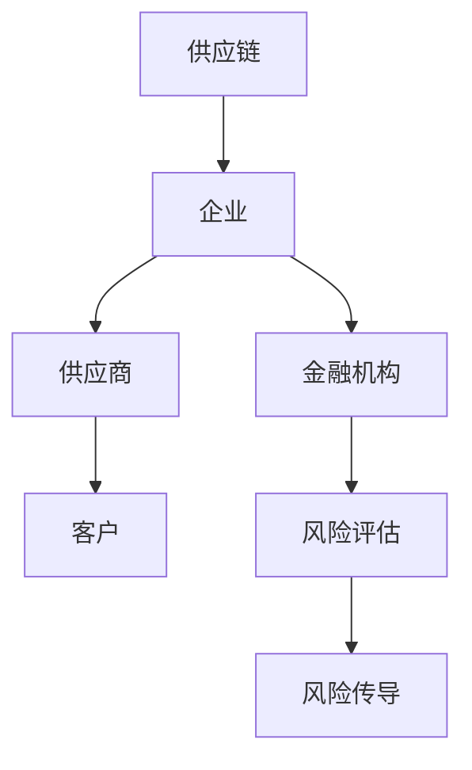
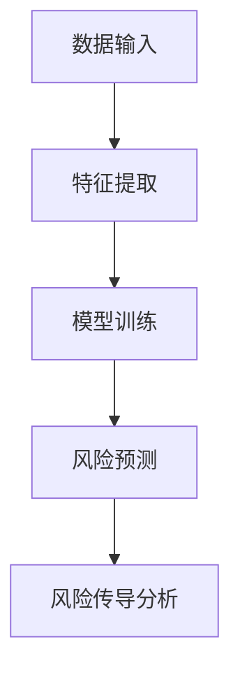
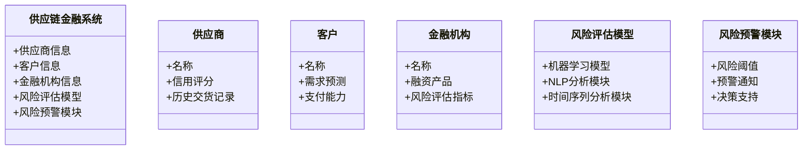
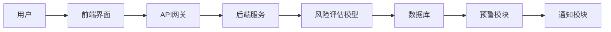
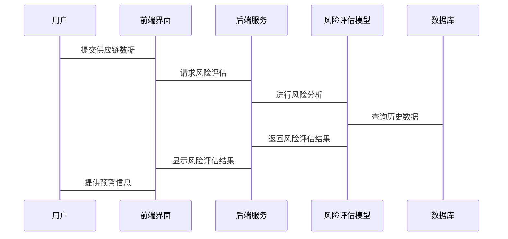

                 


# AI驱动的供应链金融风险传导分析

> 关键词：供应链金融，人工智能，风险传导，机器学习，深度学习，NLP，时间序列分析

> 摘要：本文将详细介绍AI在供应链金融风险传导分析中的应用，从基本概念到系统架构，再到实际案例，全面解析如何利用AI技术提升供应链金融的风险管理能力。通过结合机器学习、深度学习、NLP和时间序列分析等多种AI技术，本文将展示如何构建高效的供应链金融风险评估与预警系统。

---

## 第一部分: 供应链金融与AI驱动的概述

### 第1章: 供应链金融的基本概念

#### 1.1 供应链金融的定义
供应链金融是指通过整合供应链上的企业、供应商、客户和金融机构等多方资源，利用金融工具和手段，优化供应链的资金流、物流和信息流，降低整体供应链的成本和风险。

#### 1.2 供应链金融的核心要素
- **核心企业**：供应链中的主导企业，通常是制造商或零售商。
- **供应商**：为供应链提供原材料或服务的企业。
- **客户**：供应链的终端消费者或下游企业。
- **金融机构**：为供应链提供融资、信贷等金融服务的机构。

#### 1.3 供应链金融的业务流程
1. **需求分析**：核心企业分析市场需求，确定供应链中的关键节点。
2. **融资安排**：金融机构根据供应链的实际情况提供融资支持。
3. **风险评估**：评估供应链中的潜在风险，如信用风险、操作风险等。
4. **监控与调整**：实时监控供应链的运行状态，及时调整策略以应对风险。

---

### 第2章: AI在供应链金融中的应用背景

#### 2.1 传统供应链金融的痛点
- **信息孤岛**：供应链中的企业信息分散，难以实现信息共享。
- **风险难以预测**：传统方法难以准确预测供应链中的潜在风险。
- **效率低下**：人工审核和数据分析耗时耗力，效率低。

#### 2.2 AI技术如何解决供应链金融问题
- **数据驱动决策**：通过AI技术分析海量数据，提供精准的决策支持。
- **实时监控**：利用AI实时监控供应链的运行状态，及时发现风险。
- **自动化处理**：通过自动化流程减少人工干预，提高效率。

#### 2.3 AI驱动供应链金融的优势
- **提高准确性**：AI可以通过机器学习模型提高风险预测的准确性。
- **降低成本**：自动化处理可以显著降低供应链金融的运营成本。
- **增强透明度**：通过AI技术实现供应链的透明化管理，减少信息不对称。

---

### 第3章: 供应链金融风险传导的定义与特点

#### 3.1 风险传导的基本概念
供应链金融中的风险传导是指供应链中的某一环节出现问题，导致风险传递到其他环节甚至整个供应链。例如，供应商的违约可能影响核心企业的生产，进而影响客户的交付。

#### 3.2 供应链金融中的主要风险类型
- **信用风险**：供应链中的企业违约，导致资金链断裂。
- **操作风险**：供应链中的操作失误导致的风险。
- **市场风险**：市场需求变化导致供应链中的企业面临风险。

#### 3.3 风险传导的机制与特征
- **机制**：风险从一个环节传递到另一个环节，最终影响整个供应链。
- **特征**：风险传导具有连锁性、扩散性和放大性。

---

## 第二部分: AI驱动的供应链金融风险传导分析的核心概念与联系

### 第4章: 核心概念原理

#### 4.1 核心概念原理
- **供应链金融中的风险来源**：包括供应商的信用风险、客户的需求波动等。
- **风险传导的路径分析**：从供应商到核心企业，再到客户，最终影响整个供应链。
- **AI在风险传导分析中的作用**：通过机器学习模型预测风险，通过NLP技术分析文本数据，通过时间序列分析预测市场变化。

#### 4.2 核心概念属性特征对比表
| 风险类型 | 风险来源 | 风险传导路径 | AI分析方法 |
|----------|----------|--------------|------------|
| 信用风险 | 供应商违约 | 从上游到下游 | 机器学习模型预测 |
| 操作风险 | 系统故障 | 穿透整个供应链 | NLP分析风险点 |
| 市场风险 | 需求波动 | 影响上下游企业 | 时间序列分析 |

#### 4.3 ER实体关系图


---

### 第5章: AI驱动的供应链金融风险传导分析算法原理

#### 5.1 算法原理概述
- **机器学习在风险预测中的应用**：通过训练模型预测供应链中的潜在风险。
- **深度学习在风险传导中的优势**：深度学习可以捕捉复杂的非线性关系，提高预测准确性。
- **时间序列分析在风险预测中的作用**：通过分析历史数据，预测未来的市场变化。

#### 5.2 算法流程图


#### 5.3 算法实现代码
```python
import pandas as pd
from sklearn.model_selection import train_test_split
from sklearn.ensemble import RandomForestRegressor

# 数据加载
data = pd.read_csv('supply_chain.csv')

# 特征选择
features = [' supplier_rating', ' customer_demand', ' transaction_volume']
target = ' risk_score'

# 数据分割
X_train, X_test, y_train, y_test = train_test_split(data[features], data[target], test_size=0.2)

# 模型训练
model = RandomForestRegressor(n_estimators=100)
model.fit(X_train, y_train)

# 模型预测
y_pred = model.predict(X_test)

# 模型评估
from sklearn.metrics import mean_squared_error
mse = mean_squared_error(y_test, y_pred)
print(f"均方误差: {mse}")
```

---

## 第三部分: 系统分析与架构设计方案

### 第6章: 问题场景介绍

#### 6.1 问题场景
- **场景描述**：一家制造企业面临供应链中的信用风险，希望通过AI技术建立风险评估和预警系统。
- **问题分析**：如何利用AI技术实时监控供应链中的风险，及时发出预警。

---

### 第7章: 系统功能设计

#### 7.1 领域模型设计


---

### 第8章: 系统架构设计

#### 8.1 系统架构设计


---

### 第9章: 系统接口设计

#### 9.1 系统接口设计
- **输入接口**：接收供应链中的实时数据，包括供应商的信用评分、客户的需求预测等。
- **输出接口**：提供风险评估结果和预警信息，帮助金融机构和企业做出决策。

---

### 第10章: 系统交互设计

#### 10.1 系统交互流程


---

## 第四部分: 项目实战

### 第11章: 项目介绍

#### 11.1 项目目标
- 建立一个基于AI的供应链金融风险评估和预警系统，帮助金融机构和企业降低供应链中的风险。

#### 11.2 项目需求
- 实时监控供应链中的风险，提供风险评估和预警功能。
- 提供决策支持，帮助金融机构和企业优化供应链管理。

---

### 第12章: 系统核心实现

#### 12.1 环境安装
- **Python**：安装Python 3.8以上版本。
- **机器学习库**：安装scikit-learn、xgboost、keras等。
- **数据处理库**：安装pandas、numpy等。

#### 12.2 核心代码实现
```python
import pandas as pd
from sklearn.ensemble import RandomForestRegressor
from sklearn.metrics import mean_squared_error

# 数据加载
data = pd.read_csv('supply_chain.csv')

# 特征选择
features = [' supplier_rating', ' customer_demand', ' transaction_volume']
target = ' risk_score'

# 数据分割
X_train, X_test, y_train, y_test = train_test_split(data[features], data[target], test_size=0.2)

# 模型训练
model = RandomForestRegressor(n_estimators=100)
model.fit(X_train, y_train)

# 模型预测
y_pred = model.predict(X_test)

# 模型评估
mse = mean_squared_error(y_test, y_pred)
print(f"均方误差: {mse}")
```

---

### 第13章: 实际案例分析

#### 13.1 案例背景
- **案例描述**：某制造企业面临供应商违约的风险，希望通过AI技术建立风险评估和预警系统。

#### 13.2 数据分析
- **数据来源**：供应商的历史交易记录、客户的需求预测、市场波动数据等。

#### 13.3 模型训练
- **训练数据**：供应商的历史交易记录、客户的需求预测、市场波动数据等。
- **训练目标**：预测供应商违约的概率。

#### 13.4 模型评估
- **评估指标**：均方误差（MSE）、准确率、召回率等。

#### 13.5 案例结论
- **结论**：通过AI技术建立的风险评估和预警系统，成功预测了供应商的违约风险，帮助企业避免了潜在的损失。

---

## 第五部分: 最佳实践、小结与拓展阅读

### 第14章: 最佳实践

#### 14.1 数据质量的重要性
- 数据质量是AI模型性能的关键，确保数据的准确性和完整性。

#### 14.2 模型的可解释性
- 在供应链金融中，模型的可解释性非常重要，以便企业理解风险的来源和传导路径。

#### 14.3 持续优化
- 定期更新模型，根据新的数据和市场变化优化模型性能。

---

### 第15章: 小结

#### 15.1 知识回顾
- 供应链金融的基本概念和AI在其中的应用。
- 风险传导的机制和AI分析方法。

#### 15.2 经验总结
- AI技术可以显著提高供应链金融的风险管理能力。
- 系统化的方法和持续优化是成功的关键。

---

### 第16章: 注意事项

#### 16.1 数据隐私
- 在处理供应链数据时，必须注意数据隐私和合规性。

#### 16.2 模型的局限性
- AI模型有一定的局限性，需要结合业务知识进行判断。

#### 16.3 技术更新
- AI技术发展迅速，需要及时更新知识和技能。

---

### 第17章: 拓展阅读

#### 17.1 推荐书籍
- 《供应链金融：理论与实践》
- 《机器学习实战》

#### 17.2 技术博客
- AI在供应链管理中的应用
- 风险分析的最新技术

---

## 作者：AI天才研究院/AI Genius Institute & 禅与计算机程序设计艺术 /Zen And The Art of Computer Programming

