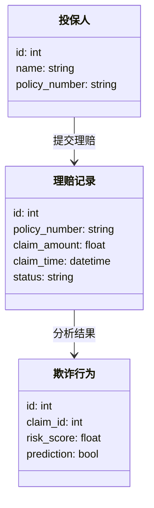
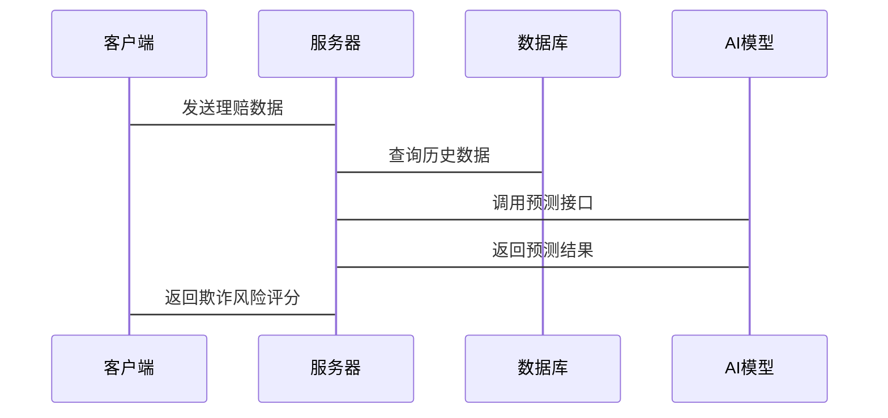

                 


# AI驱动的保险欺诈模式识别

> 关键词：AI, 保险欺诈, 模式识别, 机器学习, 深度学习, 数据分析

> 摘要：随着人工智能技术的快速发展，保险欺诈识别正逐渐成为保险行业中的重要课题。本文深入探讨了AI在保险欺诈模式识别中的应用，结合实际案例，分析了多种算法和数学模型的实现原理，同时提出了系统架构设计和项目实战方案。文章内容涵盖从背景介绍到系统实现的全过程，为读者提供了全面的技术解读。

---

# 第1章: 保险欺诈的概述

## 1.1 保险欺诈的定义与类型

### 1.1.1 保险欺诈的定义
保险欺诈是指通过故意编造虚假信息、隐瞒事实真相或其他不正当手段，骗取保险金的行为。这种行为不仅损害了保险公司的利益，也增加了投保人的成本。

### 1.1.2 常见的保险欺诈类型
- **假保单欺诈**：伪造保单或保险合同，虚构保险事件。
- **重复投保欺诈**：同一投保人对同一风险在多家保险公司重复投保，企图在发生保险事件时获取多份赔偿。
- **夸大损失欺诈**：在保险事故发生后，故意夸大损失程度，骗取更多赔偿。
- **隐瞒既往病史**：在健康保险中，投保人故意隐瞒既往病史，骗取保险金。

### 1.1.3 保险欺诈的特征与表现
- 数据量大：保险欺诈行为往往涉及大量数据。
- 隐晦性：欺诈行为通常隐藏在合法的保险流程中，难以察觉。
- 多样性：欺诈类型多样，且不断演变。

## 1.2 保险欺诈的现状与挑战

### 1.2.1 当前保险欺诈的主要形式
- 通过互联网渠道进行的欺诈行为日益增多。
- 利用大数据和人工智能技术进行复杂欺诈。
- 保险欺诈呈现团伙化、专业化趋势。

### 1.2.2 保险欺诈的经济损失分析
- 保险公司因欺诈行为导致的直接经济损失。
- 因欺诈行为增加的保险产品成本。
- 因欺诈行为导致的声誉损失。

### 1.2.3 传统欺诈识别方法的局限性
- 传统基于规则的欺诈识别方法依赖于人工经验，难以应对复杂的欺诈手段。
- 规则方法灵活性差，难以适应欺诈行为的变化。

## 1.3 AI在保险欺诈识别中的作用

### 1.3.1 AI技术在保险行业的应用背景
- 数据驱动的保险行业需求。
- 传统欺诈识别方法的局限性推动了AI技术的应用。
- AI技术在金融领域的广泛应用为保险行业提供了借鉴。

### 1.3.2 AI驱动的保险欺诈识别的优势
- 数据处理能力强：AI能够处理海量数据，发现隐藏在数据中的模式。
- 自适应性高：AI算法能够根据新的数据不断优化模型。
- 高效性：AI技术能够快速识别潜在的欺诈行为。

### 1.3.3 保险欺诈模式识别的核心问题
- 如何从大量数据中提取有效的特征。
- 如何构建高效的机器学习模型。
- 如何保证模型的泛化能力。

## 1.4 本章小结
本章从保险欺诈的定义、类型和特征入手，分析了当前保险欺诈的现状与挑战，并重点介绍了AI技术在保险欺诈识别中的作用和核心问题。

---

# 第2章: 人工智能与保险欺诈识别的基本原理

## 2.1 AI技术的核心原理

### 2.1.1 机器学习的基本概念
- **监督学习**：通过 labeled 数据训练模型，预测新的数据。
- **无监督学习**：通过 unlabeled 数据发现数据中的潜在结构。
- **半监督学习**：结合 labeled 和 unlabeled 数据进行学习。

### 2.1.2 深度学习的原理与特点
- **深度学习的核心**：通过多层神经网络提取数据特征。
- **深度学习的特点**：无需手动特征提取，能够处理复杂数据。

### 2.1.3 自然语言处理与计算机视觉的应用
- **自然语言处理**：用于分析文本数据，识别欺诈行为。
- **计算机视觉**：用于处理图像数据，识别虚假证件。

## 2.2 保险欺诈模式识别的关键技术

### 2.2.1 监督学习在欺诈识别中的应用
- **逻辑回归**：用于分类问题，预测欺诈行为。
- **支持向量机（SVM）**：用于分类问题，适用于高维数据。
- **随机森林与梯度提升树（GBDT）**：用于特征重要性分析和分类。

### 2.2.2 无监督学习与半监督学习的优劣
- **无监督学习**：适用于无标签数据，能够发现潜在的欺诈模式。
- **半监督学习**：结合少量标签数据和大量无标签数据，能够提高模型性能。

### 2.2.3 时间序列分析与异常检测
- **时间序列分析**：用于分析保险理赔的时间分布，发现异常模式。
- **异常检测**：用于识别与正常模式不符的数据点。

## 2.3 AI驱动的保险欺诈识别系统架构

### 2.3.1 系统输入与输出的定义
- **输入**：保险理赔数据，包括投保人信息、理赔金额、理赔时间等。
- **输出**：欺诈风险评分，分类结果（欺诈或非欺诈）。

### 2.3.2 系统核心模块的功能划分
- **数据预处理模块**：清洗数据，提取特征。
- **模型训练模块**：训练机器学习模型，优化模型参数。
- **预测与评估模块**：对新数据进行预测，评估模型性能。

### 2.3.3 系统的可扩展性与灵活性设计
- 系统设计模块化，便于后续扩展。
- 支持多种算法的集成，提高系统的鲁棒性。

## 2.4 本章小结
本章介绍了AI技术的基本原理，重点分析了监督学习、无监督学习和深度学习在保险欺诈识别中的应用，并提出了系统的架构设计。

---

# 第3章: 保险欺诈模式识别的算法原理

## 3.1 监督学习算法

### 3.1.1 logistic回归模型
- **logistic回归模型**：用于分类问题，输出概率值。
- **公式**：$$ P(Y=1|X) = \frac{e^{\beta X}}{1 + e^{\beta X}} $$
- **案例分析**：通过保险理赔数据训练模型，预测欺诈行为。

### 3.1.2 支持向量机（SVM）的应用
- **SVM原理**：通过构建超平面，将数据分成两类。
- **Kernel技巧**：通过核函数处理高维数据。
- **案例分析**：使用SVM对保险欺诈行为进行分类。

### 3.1.3 随机森林与梯度提升树（GBDT）
- **随机森林**：通过随机采样和随机特征选择构建多棵决策树。
- **GBDT**：通过逐步优化损失函数构建模型。
- **案例分析**：分析保险欺诈数据，评估模型性能。

## 3.2 无监督学习算法

### 3.2.1 K-means聚类算法
- **K-means原理**：通过最小化簇内距离，将数据分成K个簇。
- **案例分析**：将保险理赔数据聚类，发现潜在的欺诈模式。

### 3.2.2 DBSCAN算法在异常检测中的应用
- **DBSCAN原理**：基于密度的聚类算法，识别异常点。
- **案例分析**：通过DBSCAN算法发现异常的保险理赔行为。

### 3.2.3 高斯混合模型（GMM）
- **GMM原理**：将数据分布建模为多个高斯分布的混合。
- **案例分析**：通过GMM对保险欺诈数据进行建模。

## 3.3 深度学习算法

### 3.3.1 卷积神经网络（CNN）在图像识别中的应用
- **CNN原理**：通过卷积层提取图像特征。
- **案例分析**：识别保险欺诈中的虚假证件。

### 3.3.2 循环神经网络（RNN）在时间序列分析中的应用
- **RNN原理**：通过循环结构处理时间序列数据。
- **案例分析**：分析保险理赔的时间序列数据，发现异常模式。

### 3.3.3 图神经网络（GNN）在关系网络分析中的应用
- **GNN原理**：通过图结构分析数据之间的关系。
- **案例分析**：识别保险欺诈中的团伙欺诈行为。

## 3.4 本章小结
本章详细介绍了常用的保险欺诈识别算法，包括监督学习、无监督学习和深度学习算法，并通过案例分析展示了这些算法在实际中的应用。

---

# 第4章: 保险欺诈模式识别的数学模型与公式

## 4.1 监督学习模型的数学基础

### 4.1.1 线性回归模型
- **公式**：$$ Y = \beta X + \epsilon $$
- **解释**：用于预测连续型变量，适用于保险欺诈风险评分。

### 4.1.2 logistic回归模型
- **公式**：$$ P(Y=1|X) = \frac{e^{\beta X}}{1 + e^{\beta X}} $$
- **解释**：用于二分类问题，适用于保险欺诈行为的分类。

## 4.2 无监督学习模型的数学基础

### 4.2.1 K-means聚类算法
- **目标函数**：$$ \sum_{i=1}^{K} \sum_{j=1}^{n_i} \|x_j - c_i\|^2 $$
- **解释**：通过最小化簇内距离，将数据分成K个簇。

### 4.2.2 DBSCAN算法
- **距离度量**：使用曼哈顿距离或欧氏距离。
- **密度计算**：通过邻域点数量判断是否为异常点。

## 4.3 深度学习模型的数学基础

### 4.3.1 卷积神经网络（CNN）
- **卷积层公式**：$$ f(x) = \sum_{k} w_k \cdot x_k + b $$
- **池化层公式**：$$ y_i = \max(x_i, y_i) $$

### 4.3.2 循环神经网络（RNN）
- **递归公式**：$$ s_t = \tanh(W_s s_{t-1} + U x_t) $$
- **输出公式**：$$ y_t = W_o s_t $$

## 4.4 本章小结
本章从数学的角度分析了保险欺诈识别中常用的算法，重点介绍了监督学习、无监督学习和深度学习的数学模型和公式。

---

# 第5章: 保险欺诈模式识别的系统架构设计

## 5.1 问题场景介绍
- 保险公司在处理理赔时，需要快速识别欺诈行为。
- 系统需要支持大规模数据处理和实时分析。

## 5.2 系统功能设计

### 5.2.1 领域模型（ER图）


### 5.2.2 系统架构设计


### 5.2.3 系统接口设计
- API接口：提供RESTful API，支持保险公司的数据输入和结果查询。
- 数据接口：支持与保险公司系统的数据对接。

### 5.2.4 系统交互设计


## 5.3 本章小结
本章通过系统架构设计，展示了如何将AI技术应用于保险欺诈识别，并提出了系统的功能模块、架构图和交互流程。

---

# 第6章: 保险欺诈模式识别的项目实战

## 6.1 环境安装

### 6.1.1 安装Python环境
- 安装Python 3.8或更高版本。
- 安装Jupyter Notebook用于数据分析。

### 6.1.2 安装机器学习库
- `pip install scikit-learn`
- `pip install xgboost`
- `pip install keras`

## 6.2 系统核心实现源代码

### 6.2.1 数据预处理
```python
import pandas as pd
from sklearn.preprocessing import StandardScaler

# 读取数据
data = pd.read_csv('insurance_fraud.csv')

# 删除缺失值
data = data.dropna()

# 标准化特征
scaler = StandardScaler()
features = scaler.fit_transform(data[['age', 'claim_amount', 'policy_number']])

# 分割数据
from sklearn.model_selection import train_test_split
X_train, X_test, y_train, y_test = train_test_split(features, data['is_fraud'], test_size=0.2)
```

### 6.2.2 模型训练与评估
```python
from sklearn.linear_model import LogisticRegression
from sklearn.metrics import accuracy_score

# 训练逻辑回归模型
model = LogisticRegression()
model.fit(X_train, y_train)

# 预测结果
y_pred = model.predict(X_test)

# 评估模型
print(accuracy_score(y_test, y_pred))
```

### 6.2.3 深度学习模型实现
```python
from tensorflow.keras import layers
from tensorflow.keras import Model

# 构建CNN模型
def build_model(input_shape):
    inputs = layers.Input(shape=input_shape)
    conv1 = layers.Conv2D(32, (3,3), activation='relu')(inputs)
    pool1 = layers.MaxPooling2D((2,2))(conv1)
    conv2 = layers.Conv2D(64, (3,3), activation='relu')(pool1)
    pool2 = layers.MaxPooling2D((2,2))(conv2)
    flat = layers.Flatten()(pool2)
    dense = layers.Dense(128, activation='relu')(flat)
    outputs = layers.Dense(1, activation='sigmoid')(dense)
    return Model(inputs=inputs, outputs=outputs)

# 编译模型
model = build_model((100, 100, 3))
model.compile(optimizer='adam', loss='binary_crossentropy', metrics=['accuracy'])

# 训练模型
model.fit(X_train, y_train, epochs=10, batch_size=32)
```

## 6.3 代码应用解读与分析
- 数据预处理：清洗数据，标准化特征。
- 模型训练：使用逻辑回归和CNN模型训练模型。
- 模型评估：通过准确率评估模型性能。

## 6.4 实际案例分析
- 数据来源：保险公司的理赔数据。
- 数据分析：通过模型预测欺诈行为。
- 案例解读：分析模型预测结果，总结经验教训。

## 6.5 本章小结
本章通过实际项目实战，展示了如何使用Python和深度学习技术实现保险欺诈模式识别，并对模型的实现和评估进行了详细解读。

---

# 第7章: 总结与展望

## 7.1 总结
- AI技术在保险欺诈识别中的应用越来越广泛。
- 监督学习、无监督学习和深度学习算法各有优劣，需根据具体场景选择合适的算法。
- 系统设计需注重模块化和可扩展性。

## 7.2 展望
- 结合区块链技术，构建更加安全的保险欺诈识别系统。
- 利用联邦学习技术，实现跨机构的保险欺诈数据共享与分析。
- 探索更高效的AI算法，提升保险欺诈识别的准确率和效率。

## 7.3 最佳实践 tips
- 数据预处理是关键，需仔细清洗和特征提取。
- 模型评估需结合业务需求，选择合适的评价指标。
- 系统部署需考虑性能和安全性，确保数据隐私。

## 7.4 小结
本章总结了全文内容，并对未来的发展方向提出了展望，同时给出了实际应用中的注意事项和最佳实践建议。

---

# 作者：AI天才研究院/AI Genius Institute & 禅与计算机程序设计艺术 /Zen And The Art of Computer Programming

---

**注**：由于篇幅限制，上述目录大纲和内容仅为示例，实际文章将根据具体需求进行扩展和完善。

