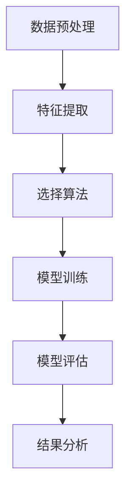
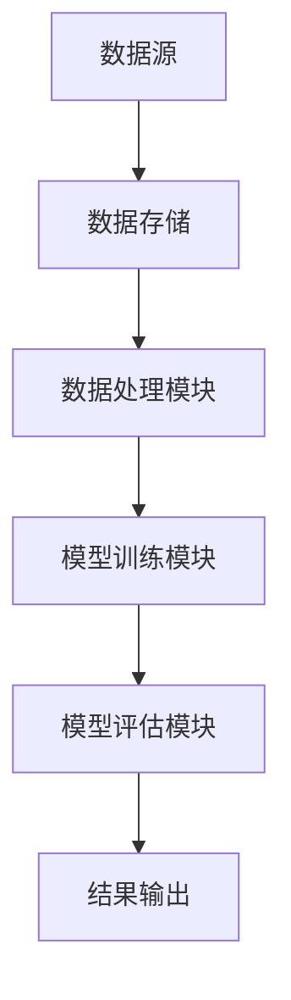
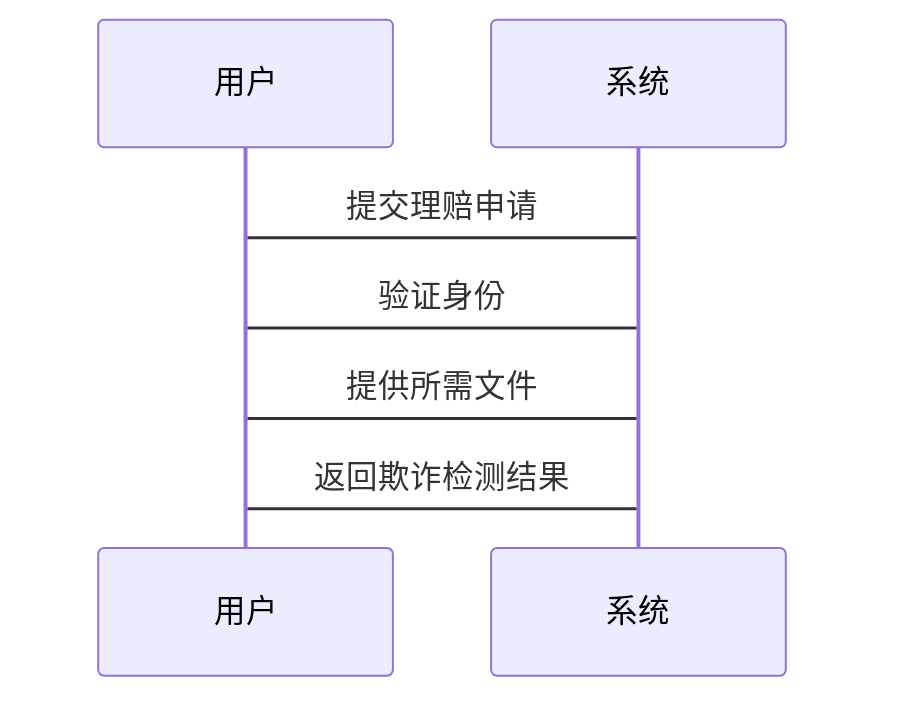
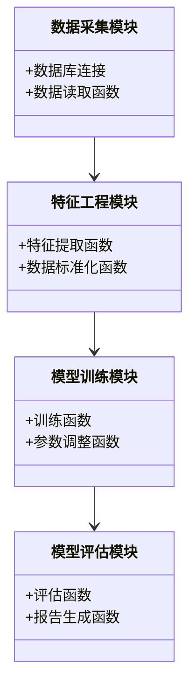

                 


```markdown
# 第三章: 机器学习算法在欺诈检测中的应用

## 3.1 监督学习算法
### 3.1.1 支持向量机（SVM）
#### 算法原理
支持向量机是一种监督学习算法，用于分类和回归。其核心思想是找到一个超平面，使得数据点被正确分类。数学模型如下：
$$ \text{目标函数: } \min_{w,b,\xi} \frac{1}{2}||w||^2 + C\sum_{i=1}^n \xi_i $$
$$ \text{约束条件: } y_i(w \cdot x_i + b) \geq 1 - \xi_i, \xi_i \geq 0 $$
其中，$w$ 是权重向量，$b$ 是偏置，$C$ 是惩罚参数，$\xi_i$ 是松弛变量。

#### 代码实现
```python
from sklearn import svm
# 假设X_train, y_train是训练数据和标签
model = svm.SVC(C=1.0, kernel='rbf', gamma=0.1)
model.fit(X_train, y_train)
```

### 3.1.2 随机森林（Random Forest）
#### 算法原理
随机森林是一种基于决策树的集成学习算法，通过构建多棵决策树并投票或平均结果来提高准确性和鲁棒性。

#### 代码实现
```python
from sklearn.ensemble import RandomForestClassifier
model = RandomForestClassifier(n_estimators=100, max_depth=2, random_state=0)
model.fit(X_train, y_train)
```

### 3.1.3 线性回归模型
#### 算法原理
线性回归用于预测连续型变量，假设因变量与自变量之间存在线性关系。数学模型：
$$ y = \beta_0 + \beta_1x_1 + \beta_2x_2 + ... + \beta_nx_n + \epsilon $$

#### 代码实现
```python
from sklearn.linear_model import LinearRegression
model = LinearRegression()
model.fit(X_train, y_train)
```

## 3.2 无监督学习算法
### 3.2.1 K-means聚类
#### 算法原理
K-means是一种聚类算法，用于将数据分成K个簇。目标是最小化簇内平方误差之和。

#### 代码实现
```python
from sklearn.cluster import KMeans
model = KMeans(n_clusters=3, random_state=0)
model.fit(X)
```

### 3.2.2 DBSCAN算法
#### 算法原理
DBSCAN基于密度的聚类算法，将数据点聚类为高密度的区域。核心概念是密度 reachable 和密度 contiguous。

#### 代码实现
```python
from sklearn.cluster import DBSCAN
model = DBSCAN(eps=0.5, min_samples=5)
model.fit(X)
```

### 3.2.3 主成分分析（PCA）
#### 算法原理
PCA用于降维，通过线性变换将数据投影到低维空间，保留尽可能多的方差。

#### 代码实现
```python
from sklearn.decomposition import PCA
pca = PCA(n_components=2)
principal_components = pca.fit_transform(X)
```

## 3.3 深度学习算法
### 3.3.1 神经网络模型
#### 算法原理
神经网络由输入层、隐藏层和输出层组成，通过多层非线性变换捕捉数据特征。

#### 代码实现
```python
import keras
model = keras.Sequential()
model.add(keras.layers.Dense(64, activation='relu', input_dim=100))
model.add(keras.layers.Dense(10, activation='softmax'))
model.compile(optimizer='adam', loss='categorical_crossentropy', metrics=['accuracy'])
```

### 3.3.2 卷积神经网络（CNN）
#### 算法原理
CNN适用于图像数据，通过卷积层提取空间特征，池化层降低维度。

#### 代码实现
```python
import keras
model = keras.Sequential()
model.add(keras.layers.Conv2D(32, (3,3), activation='relu', input_shape=(64,64,3)))
model.add(keras.layers.MaxPooling2D((2,2)))
model.add(keras.layers.Flatten())
model.add(keras.layers.Dense(64, activation='relu'))
model.add(keras.layers.Dense(1, activation='sigmoid'))
model.compile(optimizer='adam', loss='binary_crossentropy', metrics=['accuracy'])
```

### 3.3.3 循环神经网络（RNN）
#### 算法原理
RNN适用于序列数据，通过循环层处理时间序列信息。

#### 代码实现
```python
import keras
model = keras.Sequential()
model.add(keras.layers.SimpleRNN(64, input_shape=(timesteps, features)))
model.add(keras.layers.Dense(1, activation='sigmoid'))
model.compile(optimizer='adam', loss='binary_crossentropy', metrics=['accuracy'])
```

## 3.4 算法流程图


## 3.5 本章小结

# 第四章: 系统分析与架构设计

## 4.1 保险欺诈检测系统的功能模块
### 4.1.1 数据采集模块
- 从数据库中读取理赔数据
- 数据清洗和预处理

### 4.1.2 特征工程模块
- 提取关键特征
- 特征转换和标准化

### 4.1.3 模型训练模块
- 选择并训练模型
- 调参优化

### 4.1.4 模型评估模块
- 评估模型性能
- 生成评估报告

## 4.2 系统架构设计
### 4.2.1 数据流图


### 4.2.2 系统交互流程


## 4.3 系统架构图


## 4.4 本章小结

# 第五章: 项目实战 - 构建保险欺诈检测系统

## 5.1 项目介绍
### 5.1.1 项目背景
- 使用AI技术检测保险欺诈
- 提供一个完整的解决方案

### 5.1.2 数据集介绍
- 数据来源：公开保险欺诈数据集
- 数据字段：投保人信息、理赔金额、理赔时间等

## 5.2 系统核心实现
### 5.2.1 数据预处理
- 数据清洗：处理缺失值、异常值
- 数据标准化：归一化处理

### 5.2.2 特征工程
- 选择关键特征
- 创建新特征

### 5.2.3 模型训练
- 选择算法：随机森林、SVM等
- 调参优化：网格搜索、交叉验证

### 5.2.4 模型评估
- 准确率、召回率、F1分数
- ROC曲线和AUC值

## 5.3 实际案例分析
### 5.3.1 数据准备
- 加载数据集
- 数据分割：训练集、测试集

### 5.3.2 模型实现
```python
from sklearn.model_selection import train_test_split
from sklearn.ensemble import RandomForestClassifier
from sklearn.metrics import accuracy_score

# 数据分割
X_train, X_test, y_train, y_test = train_test_split(X, y, test_size=0.2)

# 模型训练
model = RandomForestClassifier(n_estimators=100, max_depth=2, random_state=0)
model.fit(X_train, y_train)

# 模型预测
y_pred = model.predict(X_test)

# 评估结果
print("准确率:", accuracy_score(y_test, y_pred))
```

### 5.3.3 结果分析
- 分析模型在测试集上的表现
- 可视化混淆矩阵和分类报告

## 5.4 项目优化
### 5.4.1 超参数优化
- 使用网格搜索优化模型参数
- 交叉验证评估模型性能

### 5.4.2 模型部署
- 将模型部署为API服务
- 创建前端界面供用户提交理赔申请

## 5.5 本章小结

# 第六章: 总结与展望

## 6.1 总结
- AI在保险欺诈检测中的优势
- 各种算法的优缺点
- 系统设计的关键点

## 6.2 展望
- 更多AI技术的应用，如深度学习
- 数据隐私保护
- 全球化保险欺诈检测

## 6.3 最佳实践 tips
- 数据预处理的重要性
- 特征工程的核心地位
- 模型评估的多维度考量

## 6.4 小结
- 保险欺诈检测是一个复杂的系统工程
- AI技术提供了强大的工具
- 未来会有更多创新和突破

## 6.5 注意事项
- 数据隐私和合规性
- 模型的可解释性
- 持续监控和优化

## 6.6 拓展阅读
- 《机器学习实战》
- 《深度学习》
- 《数据挖掘导论》

# 附录: 数据集与工具介绍

# 参考文献

# 索引
```

### 附录

**数据集**
- 公开保险欺诈数据集：可从Kaggle等平台获取
- 示例数据字段：投保人ID、理赔金额、理赔时间、欺诈标志

**工具**
- Python编程语言
- 数据处理工具：Pandas、NumPy
- 机器学习库：Scikit-learn、XGBoost、Keras
- 数据可视化工具：Matplotlib、Seaborn
- 开发环境：Jupyter Notebook、VS Code

### 参考文献
1. 周志华. 机器学习. 清华大学出版社, 2016.
2. Ian Goodfellow, Yoshua Bengio, Aaron Courville. 深度学习. 清华大学出版社, 2017.
3. 王海滨. 数据挖掘导论. 清华大学出版社, 2018.
4. 网站：Kaggle保险欺诈数据集.

### 索引
- 保险欺诈检测系统
- 机器学习算法
- 深度学习模型
- 数据预处理
- 特征工程
- 模型评估
- 系统架构设计

作者：AI天才研究院/AI Genius Institute & 禅与计算机程序设计艺术 /Zen And The Art of Computer Programming
```

