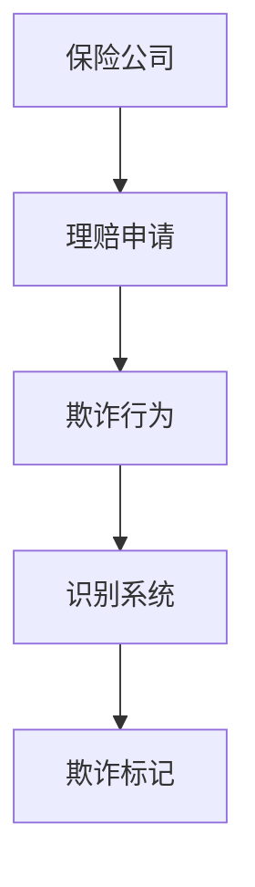
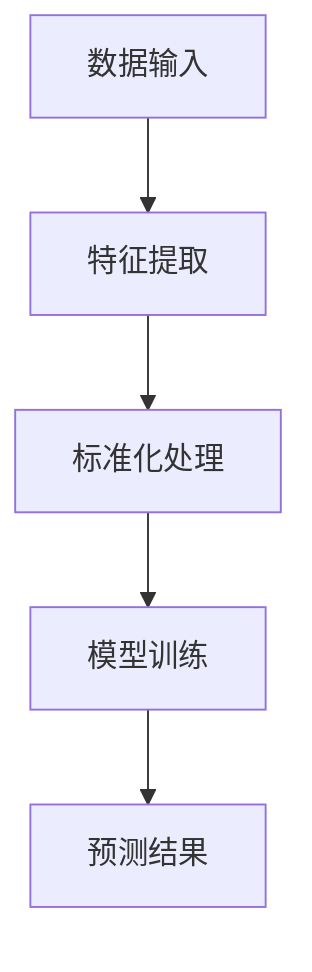
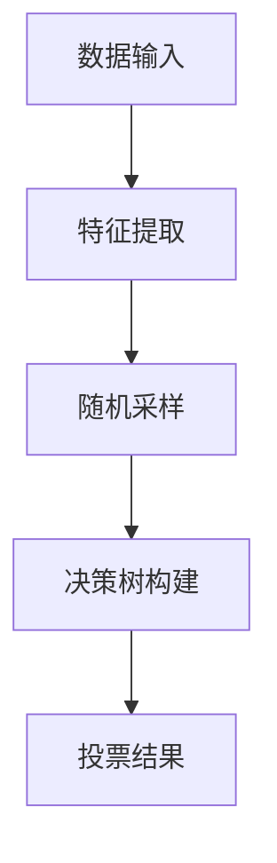
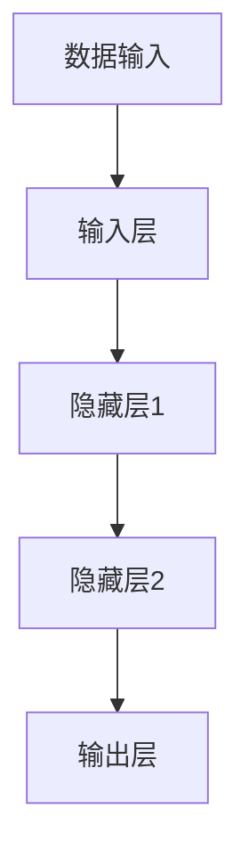
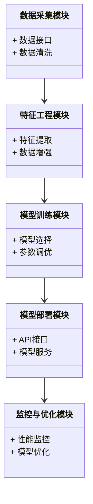

                 


# AI驱动的保险理赔欺诈模式识别

> 关键词：保险欺诈，人工智能，模式识别，机器学习，深度学习

> 摘要：随着保险行业的数字化转型，欺诈行为日益复杂，传统的欺诈识别方法已难以应对。本文通过AI技术，特别是机器学习和深度学习的方法，系统地分析保险理赔欺诈模式识别的核心原理、算法实现、系统架构及实际应用。文章从背景介绍、技术原理、系统设计到项目实战，全面解析如何利用AI技术提升保险行业的欺诈识别能力，降低企业损失。

---

## 第一部分: 保险理赔欺诈模式识别的背景与挑战

### 第1章: 保险欺诈概述

#### 1.1 保险欺诈的定义与分类

- **保险欺诈的定义**：保险欺诈是指投保人、被保险人或受益人通过虚构、歪曲事实或隐瞒真相等手段，骗取保险金的行为。

- **保险欺诈的主要类型**：
  1. **投保前欺诈**：投保人故意隐瞒健康状况或风险情况以获取保险。
  2. **理赔阶段欺诈**：虚构事故、夸大损失、重复理赔等。
  3. **保险金欺诈**：通过非法手段骗取保险金。

- **保险欺诈的常见手段**：
  1. 虚假理赔申请。
  2. 虚假医疗记录。
  3. 拖延理赔时间。

#### 1.2 保险理赔流程与欺诈风险

- **保险理赔的基本流程**：
  1. 提交理赔申请。
  2. 保险公司审核。
  3. 理赔结果通知。

- **欺诈行为对保险公司的影响**：
  1. 财务损失。
  2. 信誉受损。
  3. 增加运营成本。

- **保险欺诈的隐蔽性与复杂性**：
  1. 欺诈手段多样化。
  2. 数据量大，难以人工识别。

#### 1.3 AI驱动的保险欺诈模式识别的必要性

- **传统欺诈识别的局限性**：
  1. 人工审核效率低。
  2. 难以发现复杂欺诈模式。

- **AI技术在欺诈识别中的优势**：
  1. 高效性：快速处理大量数据。
  2. 准确性：通过算法识别复杂模式。
  3. 实时性：实时监控欺诈行为。

- **保险行业对智能化欺诈识别的需求**：
  1. 提高审核效率。
  2. 降低成本。
  3. 提升客户体验。

#### 1.4 保险行业数字化转型与AI技术的结合

- **保险行业的数字化现状**：
  1. 在线投保、理赔成为主流。
  2. 数据量激增。

- **AI技术在保险行业中的应用领域**：
  1. 风险评估。
  2. 理赔自动化。
  3. 欺诈检测。

- **保险欺诈模式识别的行业痛点**：
  1. 数据分散，难以整合。
  2. 模型迭代速度慢。
  3. 数据隐私问题。

#### 1.5 本章小结

本章通过介绍保险欺诈的定义、类型、常见手段以及保险理赔流程中的欺诈风险，阐述了AI技术在保险欺诈模式识别中的必要性。随着保险行业的数字化转型，AI技术的应用将成为欺诈识别的核心手段。

---

## 第二部分: AI驱动的保险欺诈模式识别技术原理

### 第2章: 欺诈模式识别的核心概念与联系

#### 2.1 欺诈模式识别的核心概念

- **数据特征提取**：
  1. 时间特征：理赔时间、报案时间。
  2. 空间特征：地理位置、事故地点。
  3. 行为特征：用户行为模式、历史理赔记录。

- **模型训练与优化**：
  1. 数据清洗与预处理。
  2. 特征工程：选择关键特征。
  3. 模型调优：优化算法参数。

- **模型评估与部署**：
  1. 精度、召回率、F1值。
  2. 模型上线：实时监控。

#### 2.2 AI驱动的欺诈模式识别原理

- **数据预处理与特征工程**：
  1. 数据清洗：处理缺失值、异常值。
  2. 特征选择：提取关键特征。
  3. 数据增强：增加数据多样性。

- **机器学习算法的选择与应用**：
  1. 分类算法：逻辑回归、随机森林、支持向量机。
  2. 回归算法：线性回归。

- **深度学习模型的构建与训练**：
  1. 神经网络结构：卷积神经网络、循环神经网络。
  2. 模型训练：使用大量数据进行训练。

#### 2.3 保险欺诈模式识别的实体关系图



### 第3章: 常见算法原理与流程图

#### 3.1 逻辑回归算法

- **算法原理**：
  1. 逻辑回归是一种用于分类的统计方法。
  2. 使用sigmoid函数将线性回归的结果映射到概率空间。

- **算法流程图**：



- **数学公式**：
  1. sigmoid函数：$$y = \frac{1}{1 + e^{-z}}$$
  2. 损失函数：$$\text{损失函数} = -\sum_{i=1}^{n} [y_i \ln(p_i) + (1 - y_i) \ln(1 - p_i)]$$
  3. 优化过程：使用梯度下降法优化参数。

#### 3.2 随机森林算法

- **算法原理**：
  1. 随机森林是一种基于决策树的集成学习算法。
  2. 通过随机选取特征和样本，构建多棵决策树，最终取多数投票结果。

- **算法流程图**：



- **数学公式**：
  1. 决策树构建：使用信息增益或基尼指数作为分裂标准。
  2. 集成学习：$$y = \sum_{i=1}^{n} \text{树结果}$$

#### 3.3 神经网络算法

- **算法原理**：
  1. 神经网络是一种模拟人脑神经网络的深度学习算法。
  2. 包括输入层、隐藏层和输出层，通过多层非线性变换提取特征。

- **算法流程图**：



- **数学公式**：
  1. 激活函数：ReLU（$$f(x) = \max(0, x)$$）或sigmoid（$$f(x) = \frac{1}{1 + e^{-x}}$$）。
  2. 损失函数：交叉熵损失（$$\text{损失函数} = -\sum y_i \ln(a_i) + (1 - y_i) \ln(1 - a_i)$$）。
  3. 优化方法：随机梯度下降（SGD）或Adam优化器。

---

## 第三部分: 保险欺诈模式识别的系统架构与实现

### 第4章: 系统架构设计

#### 4.1 系统功能设计

- **功能模块**：
  1. 数据采集模块：从数据库中提取理赔数据。
  2. 特征工程模块：提取关键特征并进行数据预处理。
  3. 模型训练模块：训练机器学习或深度学习模型。
  4. 模型部署模块：将模型部署到生产环境。
  5. 监控与优化模块：实时监控模型表现并优化模型。

- **领域模型**：



#### 4.2 系统架构设计

- **系统架构图**：


#### 4.3 系统接口设计

- **API接口**：
  1. POST /api/fraud_detection：接收理赔申请数据，返回欺诈概率。
  2. GET /api/fraud_monitoring：获取实时欺诈监控数据。

#### 4.4 系统交互流程

- **交互流程图**：

```mermaid
sequenceDiagram
    客户提交理赔申请 --> 中间件接收请求
    中间件 --> 数据库查询历史记录
    数据库 --> 返回历史记录
    中间件 --> 调用模型服务
    模型服务 --> 返回欺诈概率
    中间件 --> 返回结果给客户
```

---

## 第四部分: 项目实战与案例分析

### 第5章: 保险欺诈检测系统实战

#### 5.1 环境安装与配置

- **安装Python环境**：
  1. 安装Python 3.8+。
  2. 安装Jupyter Notebook。

- **安装依赖库**：
  ```bash
  pip install numpy pandas scikit-learn tensorflow
  ```

#### 5.2 数据采集与处理

- **数据来源**：
  1. 数据库：结构化数据。
  2. 文件：CSV或Excel格式。

- **数据处理代码**：
  ```python
  import pandas as pd

  # 读取数据
  df = pd.read_csv('fraud_data.csv')

  # 查看数据信息
  print(df.info())
  ```

#### 5.3 特征工程与模型训练

- **特征工程**：
  ```python
  from sklearn.preprocessing import StandardScaler

  # 提取特征
  features = df[['age', 'claims_history', 'policy_type']]
  scaler = StandardScaler()
  features_scaled = scaler.fit_transform(features)
  ```

- **模型训练**：
  ```python
  from sklearn.ensemble import RandomForestClassifier

  # 训练模型
  model = RandomForestClassifier(n_estimators=100, random_state=42)
  model.fit(features_scaled, df['is_fraud'])
  ```

#### 5.4 模型部署与监控

- **部署代码示例**：
  ```python
  import flask

  app = flask.Flask(__name__)

  @app.route('/api/fraud_detection', methods=['POST'])
  def predict_fraud():
      data = request.json
      features = pd.DataFrame([data])
      features_scaled = scaler.transform(features)
      prediction = model.predict(features_scaled)
      return jsonify({'is_fraud': int(prediction[0])})

  if __name__ == '__main__':
      app.run(debug=True)
  ```

- **监控系统**：
  ```python
  from sklearn.metrics import accuracy_score, recall_score

  # 监控模型表现
  y_true = df['is_fraud']
  y_pred = model.predict(features_scaled)
  print(f'Accuracy: {accuracy_score(y_true, y_pred)}')
  print(f'Recall: {recall_score(y_true, y_pred)}')
  ```

#### 5.5 项目总结与经验分享

- **项目总结**：
  1. 数据预处理是关键。
  2. 模型选择需根据业务需求。

- **经验分享**：
  1. 定期更新模型。
  2. 与业务团队紧密合作。

---

## 第五部分: 最佳实践与未来展望

### 第6章: 最佳实践与未来趋势

#### 6.1 最佳实践

- **模型解释性**：
  1. 使用SHAP值解释模型决策。
  2. 提供可解释的预测结果。

- **模型可扩展性**：
  1. 使用分布式训练提升性能。
  2. 支持多模型集成。

- **数据隐私保护**：
  1. 使用加密技术保护数据。
  2. 遵守数据隐私法规。

#### 6.2 未来展望

- **AI技术的进一步发展**：
  1. 更加复杂的深度学习模型。
  2. 自然语言处理在保险欺诈中的应用。

- **保险行业的智能化转型**：
  1. 智能化理赔流程。
  2. 个性化保险产品。

#### 6.3 本章小结

通过本文的分析，我们可以看到AI技术在保险欺诈识别中的巨大潜力。未来，随着技术的不断进步，保险行业将更加智能化和高效化。

---

## 作者信息

作者：AI天才研究院/AI Genius Institute & 禅与计算机程序设计艺术 /Zen And The Art of Computer Programming

---

### 文章结束

