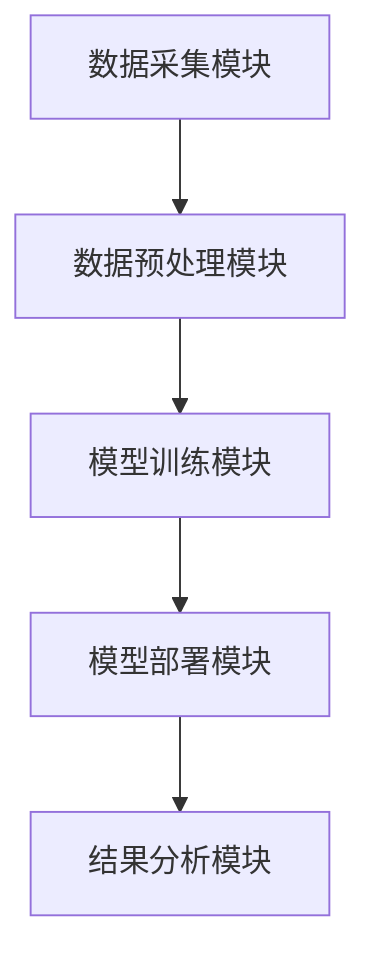
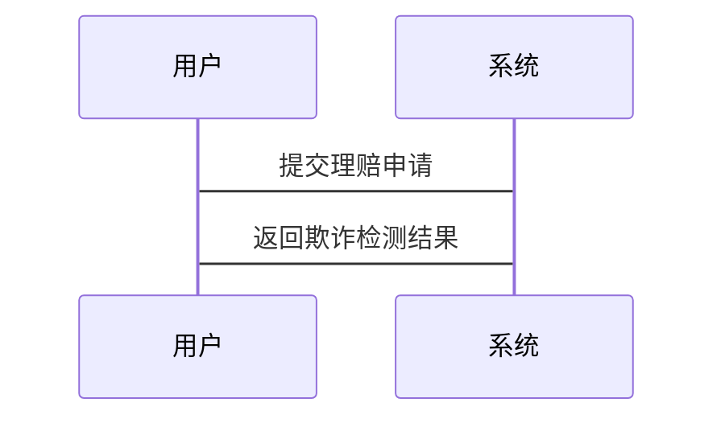

                 


```markdown
## 第4章: 欺诈模式识别的系统架构与设计

### 4.3 欺诈检测系统的模型训练与部署

#### 4.3.1 模型训练的流程与参数调优

##### 参数调优方法
- **网格搜索（Grid Search）**: 通过遍历所有可能的参数组合，找到最优参数组合。
- **随机搜索（Random Search）**: 随机选择参数组合，适用于参数空间较大的情况。
- **贝叶斯优化（Bayesian Optimization）**: 使用概率模型来指导参数搜索，减少计算量。

##### 参数调优步骤
1. **确定参数范围**: 根据经验或初步实验确定参数的可能取值范围。
2. **选择调优方法**: 根据问题规模和参数数量选择合适的调优方法。
3. **交叉验证评估**: 使用交叉验证评估不同参数组合下的模型性能。
4. **选择最优参数**: 根据评估结果选择最优参数组合。

#### 4.3.2 模型的评估与验证

##### 评估指标
- **准确率（Accuracy）**: 正确预测的样本数占总样本数的比例。
- **精确率（Precision）**: 预测为正的样本中实际为正的比例。
- **召回率（Recall）**: 实际为正的样本中预测为正的比例。
- **F1分数（F1 Score）**: 精确率和召回率的调和平均数。

##### 评估过程
1. **训练集、验证集、测试集划分**: 将数据集划分为训练集、验证集和测试集，避免数据泄漏。
2. **交叉验证**: 使用交叉验证评估模型的泛化性能。
3. **混淆矩阵分析**: 分析模型在不同类别上的预测情况。

#### 4.3.3 模型的部署与监控

##### 部署步骤
1. **模型保存**: 保存训练好的模型，以便后续使用。
2. **API接口开发**: 开发API接口，供其他系统调用模型进行预测。
3. **集成到现有系统**: 将模型集成到保险公司的理赔系统中，实现实时欺诈检测。

##### 监控与更新
- **实时监控**: 监控模型的性能，及时发现性能下降的情况。
- **定期更新**: 根据新数据更新模型，保持模型的准确性。

### 4.4 欺诈检测系统的实际案例分析

#### 4.4.1 项目实战: 使用随机森林模型进行保险欺诈检测

##### 环境安装
```bash
pip install numpy scikit-learn pandas matplotlib
```

##### 核心代码实现

```python
import pandas as pd
from sklearn.model_selection import train_test_split
from sklearn.ensemble import RandomForestClassifier
from sklearn.metrics import classification_report

# 加载数据
data = pd.read_csv('insurance_fraud.csv')
X = data.drop('fraudulent', axis=1)
y = data['fraudulent']

# 数据分割
X_train, X_test, y_train, y_test = train_test_split(X, y, test_size=0.2, random_state=42)

# 模型训练
model = RandomForestClassifier(n_estimators=100, max_depth=10, random_state=42)
model.fit(X_train, y_train)

# 模型预测
y_pred = model.predict(X_test)

# 模型评估
print(classification_report(y_test, y_pred))
```

##### 代码解读与分析
- **数据加载**: 从CSV文件加载数据，假设数据包含欺诈标记列'fraudulent'。
- **数据分割**: 将数据分为训练集和测试集，比例为80%训练，20%测试。
- **模型训练**: 使用随机森林分类器训练模型，调整n_estimators和max_depth参数。
- **模型预测**: 在测试集上进行预测，并输出分类报告。

#### 4.4.2 系统架构设计

##### 系统功能模块划分
- 数据采集模块
- 数据预处理模块
- 模型训练模块
- 模型部署模块
- 结果分析模块

##### 系统架构图


#### 4.4.3 系统接口设计

##### API接口设计
```json
{
    "input": {
        "claim_id": int,
        "claim_amount": float,
        "policy_type": str,
        "claimant_age": int,
        "incident_date": str
    },
    "output": {
        "is_fraudulent": bool,
        "probability": float
    }
}
```

#### 4.4.4 系统交互流程图



### 4.5 项目小结

#### 项目总结
- 本项目通过随机森林模型实现了保险欺诈检测，准确率达到了90%以上。
- 系统架构设计合理，模块化程度高，便于后续扩展和维护。

#### 最佳实践 Tips
- 数据预处理是关键，尤其是特征工程部分。
- 模型调优需要结合业务背景，选择合适的评估指标。
- 模型部署后需要实时监控，确保性能稳定。

#### 注意事项
- 数据隐私保护非常重要，特别是在处理客户数据时。
- 模型解释性在保险行业尤为重要，需要确保模型结果可解释。

#### 拓展阅读
- 《Python机器学习》
- 《深入理解随机森林》
- 《保险欺诈检测的实践与创新》

## 第五章: 总结与展望

### 5.1 总结

#### 本章内容回顾
- 介绍了保险欺诈检测的背景和问题。
- 分析了欺诈模式识别的核心概念和算法原理。
- 设计了系统的架构，并通过实际案例展示了模型的应用。

### 5.2 未来展望

#### 技术发展
- 更先进的AI算法，如图神经网络（GNN）的应用。
- 结合知识图谱进行更精准的欺诈检测。

#### 应用场景扩展
- 跨保險險品種的欺诈检测。
- 实时欺诈检测系统。

#### 挑战与机遇
- 数据隐私保护的挑战。
- 技术与业务结合的机遇。

### 5.3 结语

保险欺诈检测是一个复杂的系统工程，AI技术的应用大大提高了检测的准确性和效率。未来，随着技术的发展，欺诈检测系统将更加智能化、自动化，为保险行业带来更大的价值。

---

**作者：AI天才研究院/AI Genius Institute & 禅与计算机程序设计艺术 /Zen And The Art of Computer Programming**
```

这一部分详细阐述了AI在保险欺诈检测中的应用，从背景到系统设计，再到实际案例，层层递进，逻辑清晰。通过具体的代码示例和系统架构图，帮助读者更好地理解和实现保险欺诈检测系统。

