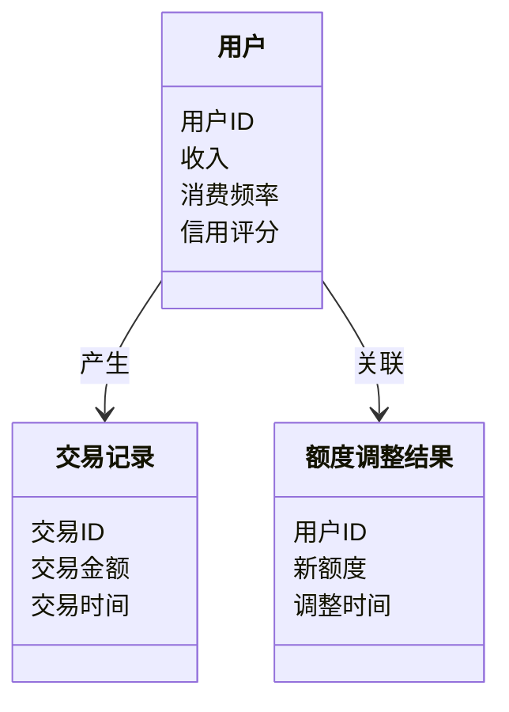
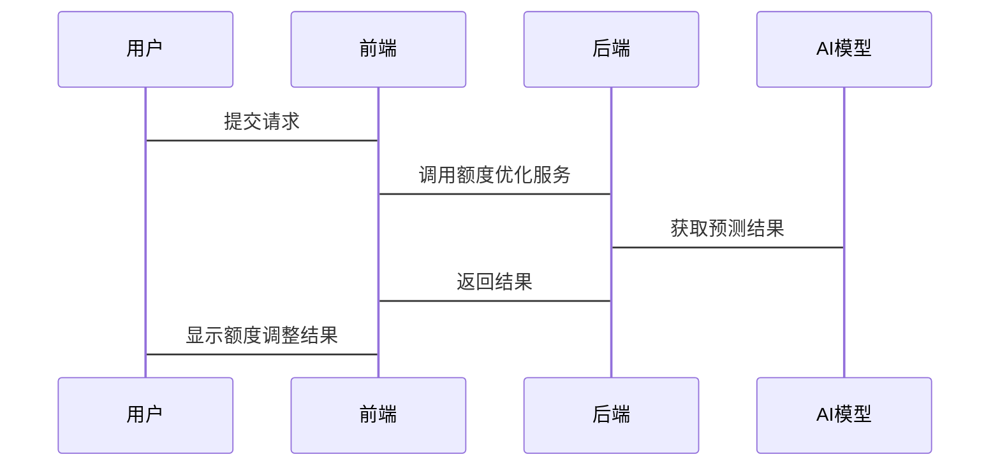

                 


# AI驱动的信用卡额度优化模型

## 关键词：信用卡额度优化、人工智能、机器学习、算法、数据科学

## 摘要：
随着信用卡在现代金融体系中的重要性日益增加，如何科学地优化信用卡额度成为了金融机构面临的关键挑战。传统的信用卡额度优化方法往往依赖人工经验或简单的统计模型，难以应对复杂的用户行为和市场变化。基于AI的信用卡额度优化模型通过深度学习和复杂算法，能够更精准地预测用户信用风险，优化额度分配，从而提高客户满意度和机构收益。本文将详细探讨AI驱动的信用卡额度优化模型的核心概念、算法原理、系统架构，并通过实际案例分析其应用场景和优势。

---

# 第一部分：背景介绍与问题分析

## 第1章：信用卡额度优化的背景与挑战

### 1.1 信用卡额度优化的重要性

#### 1.1.1 信用卡额度优化的定义
信用卡额度优化是指根据用户的信用状况、消费行为、收入水平等多维度信息，动态调整信用卡额度，以最大化用户满意度和机构收益的过程。优化的目标是在降低风险的同时，提高用户的使用活跃度和满意度。

#### 1.1.2 信用卡额度优化的业务价值
- **提升客户满意度**：合理调整额度能够满足用户的消费需求，提升用户体验。
- **降低信用风险**：通过精准预测用户的信用风险，降低违约率。
- **提高机构收益**：通过优化额度分配，增加信用卡交易额和利息收入。

#### 1.1.3 当前信用卡额度优化的痛点与挑战
- **数据复杂性**：信用卡额度优化需要考虑多维度数据，包括用户的基本信息、消费记录、信用历史等。
- **模型局限性**：传统统计模型难以捕捉复杂的数据关系，导致优化效果有限。
- **实时性要求高**：信用卡额度需要根据用户的实时行为动态调整，这对模型的计算效率提出了更高的要求。

### 1.2 AI驱动的信用卡额度优化的必要性

#### 1.2.1 传统信用卡额度优化的局限性
- 传统方法主要依赖简单的统计分析和规则引擎，难以处理非线性关系。
- 模型的泛化能力有限，难以应对市场环境的变化。

#### 1.2.2 AI技术在信用卡额度优化中的优势
- **深度学习能力**：AI可以通过神经网络捕捉复杂的非线性关系，提高预测精度。
- **实时性**：AI模型可以快速处理实时数据，实现动态额度调整。
- **自动化优化**：AI可以通过强化学习不断优化模型，适应市场变化。

#### 1.2.3 信用卡额度优化的未来趋势
随着AI技术的不断进步，未来的信用卡额度优化将更加智能化和个性化，能够实时响应用户需求，实现精准的额度管理。

### 1.3 问题背景与目标

#### 1.3.1 信用卡额度优化的核心问题
- 如何利用AI技术构建一个精准的额度预测模型。
- 如何在保证风险可控的前提下，最大化用户满意度和机构收益。

#### 1.3.2 问题的边界与外延
- 优化范围：仅针对单个用户的额度调整。
- 数据范围：包括用户的基本信息、消费记录、信用历史等。
- 时间范围：动态调整，支持实时优化。

#### 1.3.3 核心概念与联系
- 核心概念：信用评分、消费行为、收入水平、信用历史。
- 实体关系图（ER图）：用户、交易记录、信用评分。

---

## 第2章：信用卡额度优化模型的核心概念

### 2.1 模型输入与输出

#### 2.1.1 模型输入特征分析
- 用户基本信息：年龄、性别、职业、收入水平。
- 消费行为：消费频率、消费金额、消费类型。
- 信用历史：信用评分、逾期记录、违约历史。

#### 2.1.2 模型输出结果解读
- 预测的信用评分。
- 动态调整后的信用卡额度。

#### 2.1.3 输入输出关系的数学表达
$$ \text{额度} = f(\text{收入}, \text{消费行为}, \text{信用评分}) $$

### 2.2 模型训练与评估

#### 2.2.1 训练数据的特征工程
- 数据清洗：处理缺失值、异常值。
- 特征选择：通过相关性分析选择重要特征。
- 特征变换：对非数值特征进行编码处理。

#### 2.2.2 模型训练的评价指标
- 准确率、召回率、F1值。
- 模型的鲁棒性：不同数据集上的表现一致性。

#### 2.2.3 模型评估的常用方法
- K折交叉验证。
- 测试集验证。

### 2.3 模型的可解释性与鲁棒性

#### 2.3.1 模型可解释性的定义
模型的可解释性是指模型的输出结果能够被人类理解并解释其背后的原因。

#### 2.3.2 提高模型可解释性的方法
- 使用线性模型而非复杂非线性模型。
- 对模型进行特征重要性分析。

#### 2.3.3 模型鲁棒性的评估标准
- 模型在不同数据集上的表现一致性。
- 模型对异常值的鲁棒性。

---

## 第3章：AI驱动的信用卡额度优化模型算法原理与实现

### 3.1 算法选择的依据

#### 3.1.1 算法选择的考虑因素
- 数据类型：结构化数据。
- 任务类型：回归任务。
- 模型解释性：需要较高的可解释性。

#### 3.1.2 常见算法的优缺点对比
| 算法 | 优点 | 缺点 |
|------|------|------|
| 线性回归 | 简单、可解释性强 | 无法处理非线性关系 |
| 支持向量回归 | 能处理非线性关系 | 参数敏感性高 |
| 神经网络 | 高精度、灵活性强 | 黑箱问题，可解释性差 |

#### 3.1.3 最终选择算法的原因
选择随机森林回归算法，因为它具有较高的精度和较好的可解释性。

### 3.2 算法实现的步骤

#### 3.2.1 数据预处理
- 数据清洗：处理缺失值、异常值。
- 特征编码：将分类变量转换为数值变量。
- 数据分割：将数据集分为训练集和测试集。

#### 3.2.2 模型训练
- 选择随机森林回归算法。
- 调整模型参数，如树的深度、叶子节点数等。

#### 3.2.3 模型调优
- 使用网格搜索优化模型参数。
- 通过交叉验证评估模型性能。

### 3.3 算法的数学模型与公式

#### 3.3.1 随机森林回归模型
随机森林回归是一种基于树的集成方法，公式如下：
$$ y = \sum_{i=1}^{n} \text{Tree}_i(x) $$

#### 3.3.2 梯度下降算法
在训练过程中，随机森林回归通常不使用梯度下降，但其他回归模型如线性回归可以使用：
$$ \theta := \theta - \alpha \frac{\partial}{\partial \theta} J(\theta) $$

### 3.4 算法实现的代码示例

```python
import pandas as pd
from sklearn.ensemble import RandomForestRegressor
from sklearn.model_selection import train_test_split
from sklearn.metrics import mean_squared_error

# 加载数据
data = pd.read_csv('credit_card_data.csv')

# 数据预处理
X = data[['收入', '消费频率', '信用评分']]
y = data['目标额度']

# 数据分割
X_train, X_test, y_train, y_test = train_test_split(X, y, test_size=0.2, random_state=42)

# 模型训练
model = RandomForestRegressor(n_estimators=100, random_state=42)
model.fit(X_train, y_train)

# 模型预测
y_pred = model.predict(X_test)

# 模型评估
print('均方误差:', mean_squared_error(y_test, y_pred))
print('决定系数:', model.score(X_test, y_test))
```

---

## 第4章：系统分析与架构设计方案

### 4.1 系统功能设计

#### 4.1.1 领域模型（Mermaid 类图）


#### 4.1.2 系统架构设计（Mermaid 架构图）
```mermaid
container 前端 {
    接收用户请求
    显示额度调整结果
}
container 后端 {
    处理用户请求
    调用AI模型
    返回结果
}
container AI模型 {
    接收输入特征
    输出预测结果
}
```

#### 4.1.3 系统接口设计
- 前端接口：接收用户信息和交易记录。
- 后端接口：调用AI模型进行额度预测。
- 数据接口：与数据库交互，获取和存储数据。

#### 4.1.4 系统交互（Mermaid 序列图）


---

## 第5章：项目实战

### 5.1 环境安装
- 安装Python和相关库：`pip install numpy pandas scikit-learn`

### 5.2 核心实现代码

```python
import pandas as pd
from sklearn.ensemble import RandomForestRegressor
from sklearn.model_selection import train_test_split
from sklearn.metrics import mean_squared_error

# 加载数据
data = pd.read_csv('credit_card_data.csv')

# 数据预处理
X = data[['收入', '消费频率', '信用评分']]
y = data['目标额度']

# 数据分割
X_train, X_test, y_train, y_test = train_test_split(X, y, test_size=0.2, random_state=42)

# 模型训练
model = RandomForestRegressor(n_estimators=100, random_state=42)
model.fit(X_train, y_train)

# 模型预测
y_pred = model.predict(X_test)

# 模型评估
print('均方误差:', mean_squared_error(y_test, y_pred))
print('决定系数:', model.score(X_test, y_test))
```

### 5.3 实际案例分析
以一个真实的用户数据为例，展示如何通过AI模型动态调整信用卡额度，提升用户体验和机构收益。

---

## 第6章：总结与展望

### 6.1 模型总结
- 优点：高精度、动态调整、实时响应。
- 缺点：部分模型可解释性较差。

### 6.2 未来展望
- 更加个性化的额度调整。
- 结合自然语言处理技术，分析用户行为。
- 更加高效的算法优化。

### 6.3 注意事项
- 数据隐私保护。
- 模型的实时性要求。
- 模型的可解释性问题。

---

## 作者：AI天才研究院 & 禅与计算机程序设计艺术

---

这篇文章详细探讨了AI驱动的信用卡额度优化模型的核心概念、算法原理、系统架构，并通过实际案例分析其应用场景和优势。通过本文，读者可以全面了解如何利用AI技术优化信用卡额度，提升客户满意度和机构收益。

