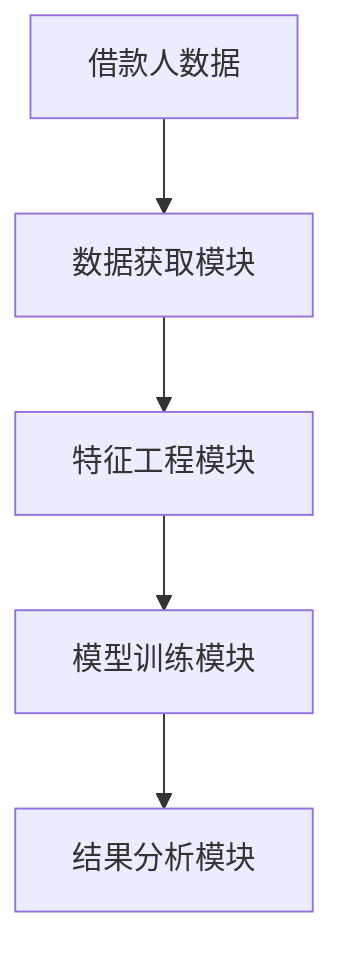
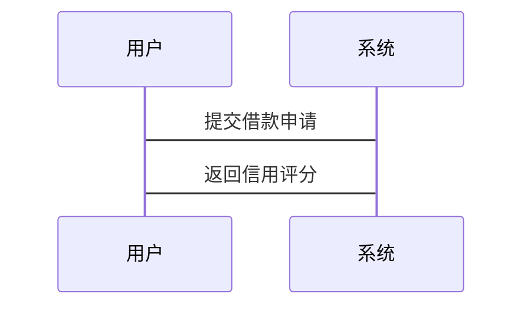

                 


# AI驱动的信用违约预测

**关键词**：信用违约预测，人工智能，机器学习，金融风险管理，信用评分模型

**摘要**：  
信用违约预测是金融风险管理中的核心问题之一。随着人工智能技术的发展，利用机器学习算法进行信用违约预测已成为一种高效的方法。本文详细探讨了AI在信用违约预测中的应用，从基础概念到算法实现，再到系统架构设计，结合实际案例，展示了如何利用AI技术提高信用违约预测的准确性。文章还分析了不同机器学习算法的优缺点，并提出了构建AI驱动信用违约预测系统的具体步骤和最佳实践。

---

## 第1章：信用违约预测的背景与概念

### 1.1 信用违约预测的基本概念
信用违约预测是通过对借款人或债务人的信用状况进行评估，预测其在未来一定时间内是否会违约的活动。违约是指借款人未能按时偿还本金和利息，这在金融领域中是一个高风险且昂贵的问题。信用违约预测的核心在于识别高风险客户，从而帮助金融机构采取预防措施，降低损失。

### 1.2 AI在信用违约预测中的作用
人工智能（AI）技术，特别是机器学习算法，为信用违约预测提供了强大的工具。传统的信用评估方法依赖于统计模型，例如逻辑回归和线性判别分析，这些方法在处理非线性关系和复杂特征时表现有限。相比之下，机器学习算法能够处理海量数据，发现隐藏的模式，并提供更高的预测准确性。

### 1.3 信用违约预测的核心要素
信用违约预测的核心要素包括：
1. **借款人特征**：如收入、职业、信用历史等。
2. **行为特征**：如还款记录、账户活动频率等。
3. **经济周期因素**：如GDP增长率、失业率等宏观经济指标。

### 1.4 本章小结
本章介绍了信用违约预测的基本概念、AI在其中的作用，以及预测的核心要素。接下来将深入探讨信用风险的理论基础和机器学习在信用违约预测中的具体应用。

---

## 第2章：信用风险的理论基础

### 2.1 信用风险的基本概念
信用风险是指债权人因债务人违约而遭受损失的可能性。信用风险是金融风险管理的核心内容之一，主要包括信用评分、信用评级和信用违约预测等方面。

### 2.2 信用评分模型
信用评分模型是根据借款人的特征和行为数据，计算其信用风险的数学模型。常见的信用评分模型包括：
1. **线性回归模型**：通过线性关系预测违约概率。
2. **逻辑回归模型**：适用于二分类问题，预测借款人违约的概率。
3. **决策树模型**：通过树状结构进行分类，能够处理复杂的非线性关系。

### 2.3 信用风险的数学模型
信用风险的数学模型通常包括以下几个部分：
- **违约概率（PD）**：借款人在未来一定时间内违约的概率。
- **违约损失率（LGD）**：违约发生时，金融机构可能遭受的损失比例。
- **风险敞口（Exposure at Default, EAD）**：违约时的未偿还金额。

### 2.4 本章小结
本章详细介绍了信用风险的基本概念和理论基础，特别是信用评分模型和相关数学模型。这些内容为后续的机器学习应用奠定了基础。

---

## 第3章：机器学习在信用违约预测中的应用

### 3.1 机器学习的基本概念
机器学习是一种通过数据训练模型，使其能够从经验中学习并做出预测的技术。机器学习算法可以分为监督学习、无监督学习和强化学习三大类。在信用违约预测中，监督学习是最常用的方法。

### 3.2 常见的机器学习算法
在信用违约预测中，常用的机器学习算法包括：
1. **逻辑回归（Logistic Regression）**：适用于二分类问题，输出违约概率。
2. **随机森林（Random Forest）**：基于决策树的集成算法，具有高准确性和鲁棒性。
3. **梯度提升树（XGBoost、LightGBM）**：通过多次训练弱模型，逐步优化预测结果。
4. **神经网络（Deep Learning）**：适用于处理高维和复杂特征的数据。

### 3.3 机器学习在信用违约预测中的优势
1. **高准确性**：机器学习算法能够处理复杂的非线性关系，提供更高的预测准确性。
2. **自动化特征工程**：通过自动提取特征，减少人工干预。
3. **可解释性**：部分算法（如逻辑回归、决策树）具有较高的可解释性。

### 3.4 本章小结
本章介绍了机器学习的基本概念和常见算法，并分析了其在信用违约预测中的优势。接下来将详细探讨基于机器学习的信用违约预测算法及其实现。

---

## 第4章：基于机器学习的信用违约预测算法

### 4.1 逻辑回归模型
逻辑回归是一种经典的二分类算法，适用于信用违约预测。其核心思想是通过logit函数将线性组合转化为概率，公式如下：

$$ P(y=1|x) = \frac{e^{\beta_0 + \beta_1 x_1 + \cdots + \beta_n x_n}}{1 + e^{\beta_0 + \beta_1 x_1 + \cdots + \beta_n x_n}} $$

### 4.2 随机森林模型
随机森林是一种基于决策树的集成算法，通过随机采样和特征选择，减少过拟合并提高准确性。随机森林的预测过程如下：

1. **数据采样**：对训练数据进行有放回的随机采样，生成多个样本集。
2. **特征选择**：在每个样本集中随机选择部分特征进行决策树的构建。
3. **投票预测**：将所有决策树的预测结果进行投票，得到最终结果。

### 4.3 XGBoost模型
XGBoost是一种高效的梯度提升树算法，通过正则化和优化器的结合，提升模型的泛化能力。其优化目标函数如下：

$$ \text{目标函数} = \text{损失函数} + \text{正则化项} $$

### 4.4 本章小结
本章详细讲解了三种常用的机器学习算法及其在信用违约预测中的应用。接下来将探讨如何构建一个完整的AI驱动信用违约预测系统。

---

## 第5章：AI驱动信用违约预测系统的构建

### 5.1 系统架构设计
AI驱动信用违约预测系统的架构通常包括以下几个模块：
1. **数据获取模块**：从数据库中获取借款人数据。
2. **特征工程模块**：对数据进行清洗、特征提取和特征选择。
3. **模型训练模块**：选择合适的算法，训练预测模型。
4. **结果分析模块**：评估模型性能，调整参数。

### 5.2 数据流图
以下是系统数据流的Mermaid图：



### 5.3 系统交互图
以下是系统交互的Mermaid图：



### 5.4 本章小结
本章详细介绍了AI驱动信用违约预测系统的架构设计和数据流图，展示了系统的整体流程。

---

## 第6章：项目实战：从数据到模型

### 6.1 数据预处理
1. **数据清洗**：处理缺失值和异常值。
2. **特征提取**：从原始数据中提取有用的特征。
3. **特征选择**：通过相关性分析选择重要特征。

### 6.2 模型实现
以下是使用Python实现逻辑回归模型的代码示例：

```python
import pandas as pd
from sklearn.model_selection import train_test_split
from sklearn.linear_model import LogisticRegression
from sklearn.metrics import accuracy_score

# 加载数据
data = pd.read_csv('credit.csv')
X = data.drop('default', axis=1)
y = data['default']

# 数据分割
X_train, X_test, y_train, y_test = train_test_split(X, y, test_size=0.2)

# 模型训练
model = LogisticRegression()
model.fit(X_train, y_train)

# 模型预测
y_pred = model.predict(X_test)

# 评估准确率
print('准确率:', accuracy_score(y_test, y_pred))
```

### 6.3 模型评估
评估指标包括准确率、召回率、F1分数等。以下是混淆矩阵的绘制代码：

```python
from sklearn.metrics import confusion_matrix, classification_report

print(classification_report(y_test, y_pred))
```

### 6.4 本章小结
本章通过一个实际项目展示了从数据预处理到模型实现的完整流程，帮助读者理解如何将理论应用于实践。

---

## 第7章：总结与展望

### 7.1 总结
本文详细探讨了AI驱动的信用违约预测，从理论基础到算法实现，再到系统架构设计，结合实际案例，展示了AI技术在信用风险管理和金融决策中的重要性。

### 7.2 展望
未来的研究方向包括：
1. **深度学习的应用**：探索神经网络在信用违约预测中的潜力。
2. **实时预测系统**：构建基于流数据的实时预测模型。
3. **模型可解释性**：提高模型的透明度，满足监管要求。

---

## 作者：AI天才研究院/AI Genius Institute & 禅与计算机程序设计艺术 /Zen And The Art of Computer Programming

---

以上是《AI驱动的信用违约预测》的技术博客文章目录和部分内容，希望对您有所帮助！

