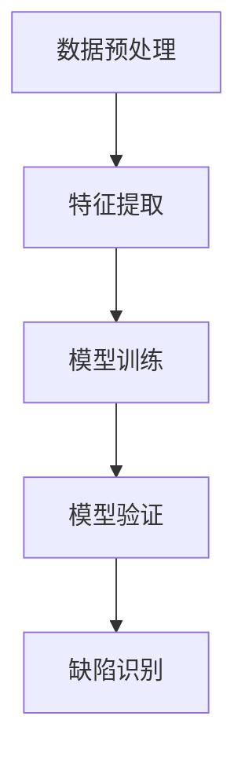
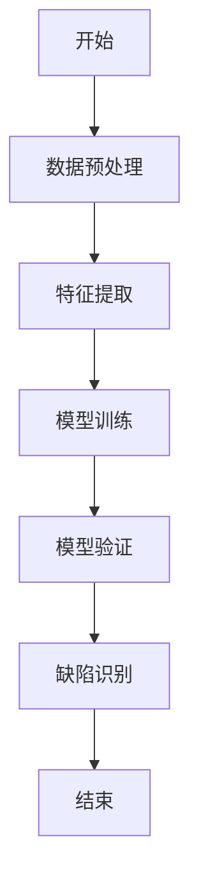
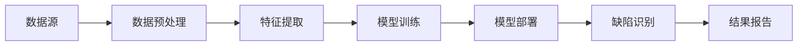
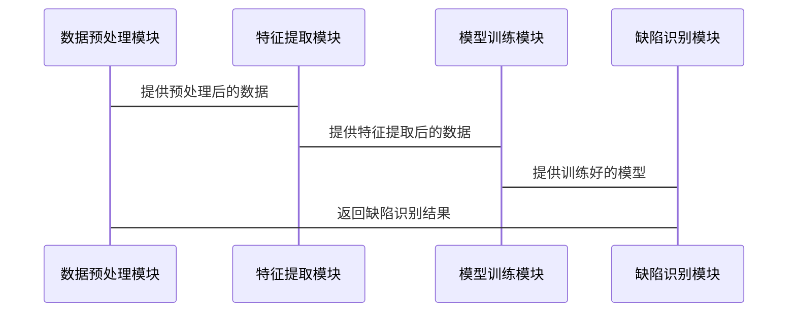

                 


# AI驱动的公司治理缺陷识别与改善建议

## 关键词：AI、公司治理、缺陷识别、改善建议、系统架构、算法原理

## 摘要：  
本文将探讨如何利用人工智能技术识别和改善公司治理中的缺陷。通过分析公司治理的核心要素、AI技术在治理中的应用背景，以及缺陷识别的关键算法和系统架构，本文旨在为企业的治理优化提供科学依据和实践指导。通过实际案例分析，本文将进一步验证AI技术在公司治理中的有效性，并提出未来研究和实践的方向。

---

## 第一章: 公司治理缺陷识别的背景与问题背景

### 1.1 公司治理的基本概念

#### 1.1.1 公司治理的核心要素
公司治理是指通过一系列制度、流程和机制，确保公司战略目标的实现、股东利益的最大化以及风险的有效控制。其核心要素包括：
- **治理结构**：董事会、监事会、高管层的组织架构。
- **决策机制**：决策的制定、执行和监督。
- **风险管理**：识别、评估和应对各类风险。
- **利益相关者关系**：与股东、客户、员工等利益相关者的互动。

#### 1.1.2 公司治理中的常见问题
在实际操作中，公司治理常常面临以下问题：
- **透明度不足**：信息传递不畅，利益相关者难以获取真实信息。
- **效率低下**：决策流程复杂，导致决策延迟。
- **合规性不足**：未能完全遵守相关法律法规。
- **内部腐败**：管理层滥用职权，导致利益输送。

#### 1.1.3 AI技术在公司治理中的优势
人工智能技术在公司治理中的应用，主要体现在以下几个方面：
- **数据驱动决策**：通过分析大量数据，提高决策的科学性和准确性。
- **实时监控**：利用AI技术实时监控公司运营中的异常情况。
- **预测性分析**：通过历史数据预测未来可能出现的治理问题。

### 1.2 AI在公司治理中的应用背景

#### 1.2.1 传统公司治理的局限性
传统的公司治理模式主要依赖于人工检查和经验判断，存在以下问题：
- **主观性**：人为判断容易受到主观因素的影响。
- **效率低下**：人工检查耗时长，难以应对海量数据。
- **覆盖面有限**：难以覆盖所有可能的治理问题。

#### 1.2.2 AI技术在公司治理中的优势
AI技术的引入，可以有效弥补传统治理模式的不足：
- **数据处理能力**：AI能够快速处理海量数据，发现潜在问题。
- **准确性**：通过机器学习算法，提高问题识别的准确性。
- **实时性**：AI系统可以实时监控公司运营，及时发现异常情况。

#### 1.2.3 当前企业治理面临的挑战
当前，企业治理面临以下挑战：
- **数字化转型**：如何利用数字化技术优化治理流程。
- **合规性要求**：日益严格的法律法规对企业治理提出更高要求。
- **全球化**：跨国经营面临的复杂环境和文化差异。

### 1.3 公司治理缺陷识别的必要性

#### 1.3.1 缺陷识别的定义与目标
缺陷识别是指通过技术手段，发现公司治理中的潜在问题或异常情况。其目标是：
- 提高治理效率。
- 降低治理风险。
- 优化公司运营。

#### 1.3.2 缺陷识别对企业价值的影响
缺陷识别能够帮助企业：
- 提前发现潜在问题，避免损失。
- 提高决策的科学性和准确性。
- 增强利益相关者的信任。

#### 1.3.3 缺陷识别的边界与外延
缺陷识别的边界包括：
- **数据范围**：仅限于公司内部数据。
- **时间范围**：仅限于过去和当前的数据。
- **目标范围**：仅限于公司治理相关的缺陷。

缺陷识别的外延包括：
- **扩展至其他领域**：如供应链管理、客户服务等。
- **实时监控**：从定期检查扩展到实时监控。
- **智能化升级**：从简单的数据处理升级到智能预测。

---

## 第二章: AI驱动的公司治理缺陷识别核心概念

### 2.1 缺陷识别的核心原理

#### 2.1.1 数据驱动的缺陷识别方法
数据驱动的缺陷识别方法包括：
- **数据清洗**：去除无效数据，确保数据质量。
- **特征提取**：从数据中提取有用的特征，用于模型训练。
- **模型训练**：利用机器学习算法训练缺陷识别模型。

#### 2.1.2 AI算法在缺陷识别中的作用
AI算法在缺陷识别中的作用包括：
- **特征学习**：自动提取数据中的特征，减少人工干预。
- **模式识别**：发现数据中的模式，识别潜在问题。
- **预测与分类**：通过预测和分类，识别治理中的缺陷。

#### 2.1.3 缺陷识别的流程与步骤
缺陷识别的流程包括：
1. **数据收集**：收集公司治理相关的数据。
2. **数据预处理**：清洗和转换数据。
3. **特征提取**：提取有用的特征。
4. **模型训练**：训练缺陷识别模型。
5. **模型验证**：验证模型的准确性和可靠性。
6. **缺陷识别**：利用模型识别公司治理中的缺陷。

### 2.2 核心概念与联系

#### 2.2.1 缺陷识别的关键要素对比表
以下表格对比了缺陷识别的关键要素：

| **要素**       | **传统方法**                   | **AI方法**                     |
|----------------|--------------------------------|--------------------------------|
| 数据来源       | 有限的内部数据                 | 海量内外部数据                 |
| 数据处理       | 手工处理，效率低               | AI自动处理，效率高             |
| 分析方法       | 经验判断，主观性强             | 数据驱动，客观性高             |
| 结果输出       | 简单的结论，覆盖面有限         | 细致的分析，覆盖面广           |

#### 2.2.2 ER实体关系图架构
以下是一个简单的ER图，展示了公司治理中的关键实体及其关系：

```mermaid
erd
  governance_defect (
    defect_id,
    defect_type,
    defect_description,
    defect_severity,
    defect_status
  )
  has_one
    company (
      company_id,
      company_name,
      company_size,
      company_industry
    )
  has_one
    department (
      department_id,
      department_name,
      department_head
    )
  has_one
    employee (
      employee_id,
      employee_name,
      employee_position
    )
```

---

## 第三章: AI驱动的公司治理缺陷识别算法原理

### 3.1 算法原理概述

#### 3.1.1 缺陷识别的算法流程
以下是一个缺陷识别算法的流程图：



#### 3.1.2 算法选择与优化
在选择算法时，需要考虑以下因素：
- **数据类型**：分类、回归等。
- **数据规模**：小数据集适合线性回归，大数据集适合深度学习。
- **模型复杂度**：简单模型适合简单问题，复杂模型适合复杂问题。

#### 3.1.3 算法优化
算法优化可以通过以下方法实现：
- **参数调优**：通过网格搜索等方法优化模型参数。
- **特征工程**：通过特征选择和特征组合提高模型性能。
- **模型集成**：通过集成学习提高模型的准确性和稳定性。

### 3.2 算法原理的数学模型

#### 3.2.1 损失函数与优化目标
以下是一个常见的损失函数公式：

$$
\text{损失函数} = \frac{1}{n}\sum_{i=1}^{n} (y_i - \hat{y_i})^2
$$

其中：
- \( y_i \) 是真实值。
- \( \hat{y_i} \) 是预测值。
- \( n \) 是数据点的数量。

#### 3.2.2 算法流程图
以下是一个算法的流程图：



#### 3.2.3 算法实现与代码示例
以下是一个简单的缺陷识别算法实现示例：

```python
# 导入所需的库
import pandas as pd
import numpy as np
from sklearn.model_selection import train_test_split
from sklearn.ensemble import RandomForestClassifier
from sklearn.metrics import accuracy_score

# 加载数据
data = pd.read_csv('governance_data.csv')

# 数据预处理
# 假设 'label' 是目标变量，其他是特征变量
X = data.drop('label', axis=1)
y = data['label']

# 划分训练集和测试集
X_train, X_test, y_train, y_test = train_test_split(X, y, test_size=0.2, random_state=42)

# 特征提取
# 假设特征中存在缺失值，使用均值填充
from sklearn.impute import SimpleImputer
imp = SimpleImputer(strategy='mean')
X_train = imp.fit_transform(X_train)
X_test = imp.transform(X_test)

# 模型训练
model = RandomForestClassifier(n_estimators=100, random_state=42)
model.fit(X_train, y_train)

# 模型预测
y_pred = model.predict(X_test)

# 模型评估
print('准确率:', accuracy_score(y_test, y_pred))
```

### 3.3 算法实现与代码示例

#### 3.3.1 数据预处理代码
以下是一个数据预处理的代码示例：

```python
# 数据预处理
import pandas as pd
import numpy as np
from sklearn.impute import SimpleImputer
from sklearn.preprocessing import StandardScaler

# 加载数据
data = pd.read_csv('governance_data.csv')

# 假设 'label' 是目标变量，其他是特征变量
X = data.drop('label', axis=1)
y = data['label']

# 处理缺失值
imp = SimpleImputer(strategy='mean')
X = imp.fit_transform(X)

# 标准化特征
scaler = StandardScaler()
X = scaler.fit_transform(X)

# 划分训练集和测试集
from sklearn.model_selection import train_test_split
X_train, X_test, y_train, y_test = train_test_split(X, y, test_size=0.2, random_state=42)
```

#### 3.3.2 模型训练代码
以下是一个模型训练的代码示例：

```python
# 模型训练
from sklearn.ensemble import RandomForestClassifier
from sklearn.metrics import accuracy_score

model = RandomForestClassifier(n_estimators=100, random_state=42)
model.fit(X_train, y_train)

# 模型预测
y_pred = model.predict(X_test)

# 模型评估
print('准确率:', accuracy_score(y_test, y_pred))
```

#### 3.3.3 缺陷识别代码
以下是一个缺陷识别的代码示例：

```python
# 缺陷识别
# 假设模型已经训练好
def detect_defects(new_data):
    # 数据预处理
    X = new_data.drop('label', axis=1)
    X = imp.transform(X)
    X = scaler.transform(X)
    
    # 缺陷识别
    y_pred = model.predict(X)
    return y_pred

# 示例数据
new_data = pd.DataFrame({
    'feature1': [1],
    'feature2': [2],
    # 其他特征...
})

# 调用缺陷识别函数
result = detect_defects(new_data)
print('缺陷识别结果:', result)
```

### 3.4 算法原理的数学模型

#### 3.4.1 损失函数与优化目标
以下是一个常见的损失函数公式：

$$
\text{损失函数} = \frac{1}{n}\sum_{i=1}^{n} (y_i - \hat{y_i})^2
$$

其中：
- \( y_i \) 是真实值。
- \( \hat{y_i} \) 是预测值。
- \( n \) 是数据点的数量。

#### 3.4.2 算法流程图
以下是一个算法的流程图：


---

## 第四章: 系统分析与架构设计方案

### 4.1 问题场景介绍

#### 4.1.1 典型缺陷识别场景
典型缺陷识别场景包括：
- **财务异常**：识别财务数据中的异常情况。
- **管理混乱**：识别管理流程中的混乱情况。
- **合规性不足**：识别公司治理中的合规性问题。

#### 4.1.2 系统目标与范围
系统目标是：
- 实现实时监控公司治理中的潜在问题。
- 提供智能化的缺陷识别和改善建议。

系统的范围包括：
- 数据采集与处理。
- 模型训练与部署。
- 缺陷识别与报告。

### 4.2 系统功能设计

#### 4.2.1 领域模型（Mermaid类图）
以下是一个领域的类图：

```mermaid
classDiagram
    class DefectRecognitionSystem {
        + data: Data
        + model: Model
        + report: Report
    }
    class Data {
        + features: array
        + labels: array
    }
    class Model {
        + trained_model: object
        + feature_processor: object
    }
    class Report {
        + defect_id: integer
        + defect_type: string
        + defect_description: string
    }
    DefectRecognitionSystem o- Data
    DefectRecognitionSystem o- Model
    DefectRecognitionSystem o- Report
```

### 4.3 系统架构设计

#### 4.3.1 系统架构图（Mermaid架构图）
以下是一个系统的架构图：



### 4.4 系统接口设计

#### 4.4.1 接口定义与交互流程
以下是一个接口的交互流程：



### 4.5 系统交互流程图（Mermaid序列图）


---

## 第五章: 项目实战

### 5.1 环境安装与配置

#### 5.1.1 安装Python与相关库
安装Python和以下库：
- `pandas`：数据处理。
- `numpy`：数值计算。
- `scikit-learn`：机器学习算法。
- `mermaid`：图表绘制。

安装命令：
```bash
pip install pandas numpy scikit-learn mermaid
```

### 5.2 系统核心实现源代码

#### 5.2.1 数据预处理代码
以下是一个数据预处理的代码示例：

```python
import pandas as pd
import numpy as np
from sklearn.impute import SimpleImputer

# 加载数据
data = pd.read_csv('governance_data.csv')

# 处理缺失值
imp = SimpleImputer(strategy='mean')
data = imp.fit_transform(data)

# 数据分割
from sklearn.model_selection import train_test_split
X_train, X_test, y_train, y_test = train_test_split(data, test_size=0.2, random_state=42)
```

#### 5.2.2 模型训练代码
以下是一个模型训练的代码示例：

```python
from sklearn.ensemble import RandomForestClassifier
from sklearn.metrics import accuracy_score

model = RandomForestClassifier(n_estimators=100, random_state=42)
model.fit(X_train, y_train)

# 模型评估
y_pred = model.predict(X_test)
print('准确率:', accuracy_score(y_test, y_pred))
```

#### 5.2.3 缺陷识别代码
以下是一个缺陷识别的代码示例：

```python
def detect_defects(new_data):
    # 数据预处理
    X = new_data.drop('label', axis=1)
    X = imp.transform(X)
    
    # 缺陷识别
    y_pred = model.predict(X)
    return y_pred

# 示例数据
new_data = pd.DataFrame({
    'feature1': [1],
    'feature2': [2],
    # 其他特征...
})

# 调用缺陷识别函数
result = detect_defects(new_data)
print('缺陷识别结果:', result)
```

### 5.3 项目实战小结

#### 5.3.1 环境搭建
安装所需的Python库和工具，确保环境配置正确。

#### 5.3.2 代码实现
实现数据预处理、模型训练和缺陷识别的代码，并进行测试。

#### 5.3.3 实际案例分析
通过实际案例分析，验证AI技术在公司治理缺陷识别中的有效性。

#### 5.3.4 项目总结
总结项目的实施过程和成果，提出改进建议。

---

## 第六章: 最佳实践与总结

### 6.1 小结

#### 6.1.1 核心内容回顾
回顾文章的核心内容，强调AI技术在公司治理缺陷识别中的重要性。

#### 6.1.2 关键点总结
总结文章的关键点，包括：
- 数据预处理的重要性。
- AI算法在缺陷识别中的作用。
- 系统架构设计的合理性。

### 6.2 注意事项与建议

#### 6.2.1 实施中的注意事项
在实施过程中需要注意以下事项：
- 数据质量和完整性。
- 模型的准确性和可靠性。
- 系统的可扩展性和可维护性。

#### 6.2.2 改善建议
提出改进建议：
- 不断优化模型，提高识别准确率。
- 定期更新数据，保持模型的实时性。
- 加强与业务部门的协作，确保模型的有效性。

### 6.3 未来展望

#### 6.3.1 AI技术的未来发展
AI技术在公司治理中的应用前景广阔，未来将更加智能化和自动化。

#### 6.3.2 缺陷识别技术的未来趋势
缺陷识别技术将更加精准和高效，支持更多复杂场景的应用。

---

## 第七章: 参考文献与附录

### 7.1 参考文献

#### 7.1.1 中文参考文献
1. 《人工智能导论》
2. 《公司治理与风险管理》
3. 《机器学习实战》

#### 7.1.2 英文参考文献
1. "Introduction to Machine Learning" by Andrew Ng.
2. "Corporate Governance and Risk Management" by Michael Lewis.
3. "Python Machine Learning" by Aurélien Géron.

### 7.2 附录

#### 7.2.1 工具安装与配置
详细说明如何安装和配置所需的工具和库。

#### 7.2.2 代码实现细节
提供完整的代码实现细节，方便读者参考和学习。

#### 7.2.3 补充说明
补充说明文章中未详细展开的内容，确保读者能够全面理解。

---

## 作者：AI天才研究院 / AI Genius Institute  
《禅与计算机程序设计艺术》

