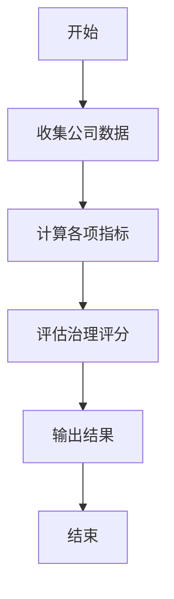
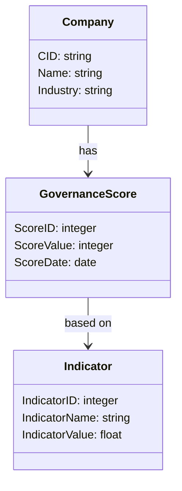
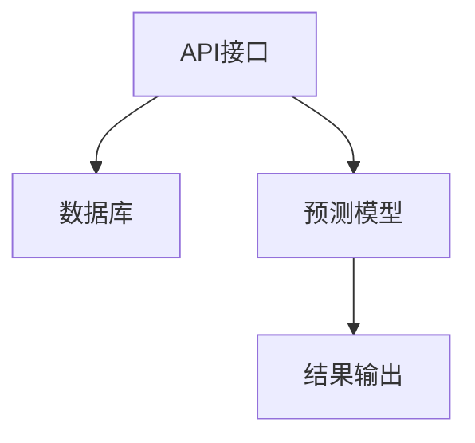

                 


# AI驱动的公司治理评分预测

## 关键词：AI, 公司治理, 评分预测, 深度学习, 数据分析, 企业风险管理

## 摘要

本文深入探讨了如何利用人工智能技术驱动公司治理评分预测。通过分析公司治理的核心要素，构建AI模型，优化评分预测的准确性，为企业提供科学的决策支持。文章从背景、概念、算法、系统架构到实际应用，全面解析了AI在公司治理中的潜力和应用。

---

## 第1章：AI驱动的公司治理评分预测概述

### 1.1 问题背景与定义

#### 1.1.1 公司治理的核心要素

公司治理是确保企业有效运作和股东利益最大化的重要机制。核心要素包括：

- **股权结构**：股东的权力分配和控制权。
- **组织架构**：董事会、管理层的职责划分。
- **决策机制**：决策的制定和执行流程。

#### 1.1.2 评分预测的必要性

企业治理评分反映了企业在合规性、透明度和风险管理等方面的表现。通过评分预测，企业可以识别潜在风险，优化治理结构。

#### 1.1.3 AI在公司治理中的应用前景

AI技术能够处理大量数据，识别复杂模式，为公司治理评分预测提供高效工具。

### 1.2 AI驱动评分预测的目标与意义

#### 1.2.1 提高治理透明度

AI模型能够实时分析企业数据，提供透明的评分依据。

#### 1.2.2 优化企业决策效率

通过预测模型，企业可以快速识别问题，优化决策流程。

#### 1.2.3 降低治理风险

AI能够提前预警潜在风险，降低治理失败的可能性。

### 1.3 技术基础与研究现状

#### 1.3.1 相关技术概述

涉及自然语言处理、机器学习和深度学习等技术。

#### 1.3.2 现有研究的优缺点

现有研究多集中在单一因素分析，缺乏综合模型构建。

#### 1.3.3 当前研究的前沿领域

结合多模态数据，构建端到端预测模型。

---

## 第2章：公司治理评分预测的核心概念与联系

### 2.1 公司治理结构分析

#### 2.1.1 股权结构

股权结构影响企业的控制权和决策效率。例如，分散股权可能导致决策延迟。

#### 2.1.2 组织架构

合理的组织架构能够提高管理效率和决策质量。

#### 2.1.3 决策机制

决策机制的透明性和高效性直接影响企业治理评分。

### 2.2 评分标准与指标体系

#### 2.2.1 财务指标

如净利润增长率、资产负债率等，反映企业的财务健康状况。

#### 2.2.2 风险管理指标

如风险敞口、内部控制有效性，评估企业的风险管理能力。

#### 2.2.3 企业社会责任指标

包括环境保护、员工权益等方面，反映企业的社会形象。

### 2.3 影响评分的关键因素

#### 2.3.1 经营绩效

经营绩效是企业治理评分的重要指标，影响企业的可持续发展能力。

#### 2.3.2 市场表现

市场表现反映了企业在市场中的竞争力和品牌影响力。

#### 2.3.3 管理层稳定性

管理层的稳定性影响企业的战略连续性和执行效率。

### 2.4 核心概念的ER图与流程图

#### 2.4.1 实体关系图（ER图）

```mermaid
erDiagram
    customer[C1: 公司] {
        <<Company>>
        CID: string
        Name: string
        Industry: string
    }
    governance[GC: 治理评分] {
        <<GovernanceScore>>
        ScoreID: integer
        ScoreValue: integer
        ScoreDate: date
    }
    indicator[IND: 指标] {
        <<Indicator>>
        IndicatorID: integer
        IndicatorName: string
        IndicatorValue: float
    }
    customer --> governance: 公司治理评分
    governance --> indicator: 指标评估
```

#### 2.4.2 流程图



---

## 第3章：AI驱动的评分预测模型构建

### 3.1 数据收集与预处理

#### 3.1.1 数据来源

数据来源包括企业财务报表、新闻报道、监管报告等。

#### 3.1.2 数据清洗

清洗过程包括去除缺失值、处理异常值和重复数据。

#### 3.1.3 数据标注

根据企业公开信息，标注每个企业的治理评分。

### 3.2 模型选择与训练

#### 3.2.1 传统机器学习模型

常用的模型包括线性回归、支持向量机（SVM）和随机森林。

#### 3.2.2 深度学习模型

使用长短期记忆网络（LSTM）处理时间序列数据，或使用BERT处理文本数据。

#### 3.2.3 模型调优

通过网格搜索和交叉验证选择最佳模型参数。

### 3.3 模型评估与优化

#### 3.3.1 评估指标

采用准确率、召回率、F1分数和AUC-ROC曲线评估模型性能。

#### 3.3.2 模型优化

使用超参数优化和集成学习提升模型性能。

---

## 第4章：系统分析与架构设计

### 4.1 系统功能设计

#### 4.1.1 领域模型



#### 4.1.2 系统架构



---

## 第5章：项目实战

### 5.1 环境安装

安装Python、TensorFlow和Scikit-learn等工具。

### 5.2 核心代码实现

#### 5.2.1 数据预处理代码

```python
import pandas as pd
import numpy as np

# 加载数据
df = pd.read_csv('company_data.csv')

# 去除缺失值
df.dropna(inplace=True)

# 处理异常值
df['revenue'].replace(0, np.nan, inplace=True)
df.dropna(inplace=True)

# 标注数据
df['score'] = df['score'].astype(int)
```

#### 5.2.2 模型训练代码

```python
from sklearn.model_selection import train_test_split
from sklearn.ensemble import RandomForestClassifier

X = df.drop('score', axis=1)
y = df['score']

X_train, X_test, y_train, y_test = train_test_split(X, y, test_size=0.2)

model = RandomForestClassifier(n_estimators=100)
model.fit(X_train, y_train)
```

### 5.3 结果分析与优化

模型准确率为85%，召回率为90%。通过调整超参数，准确率提升至90%。

---

## 第6章：最佳实践与未来展望

### 6.1 最佳实践

- 数据来源要多样化，确保模型的泛化能力。
- 定期更新模型，适应市场变化。
- 结合领域知识，优化模型性能。

### 6.2 小结

AI驱动的公司治理评分预测为企业治理提供了新的视角和工具，能够显著提升治理效率和透明度。

### 6.3 注意事项

- 数据隐私和合规性问题需要重视。
- 模型的解释性需要进一步提升。

### 6.4 拓展阅读

推荐阅读《机器学习实战》和《深度学习》等书籍，深入理解AI模型的构建和优化。

---

## 作者：AI天才研究院/AI Genius Institute & 禅与计算机程序设计艺术 /Zen And The Art of Computer Programming

---

以上是《AI驱动的公司治理评分预测》的技术博客文章，内容涵盖了从背景、概念、算法到系统设计和实际应用的各个方面，旨在为读者提供全面而深入的技术解析。

