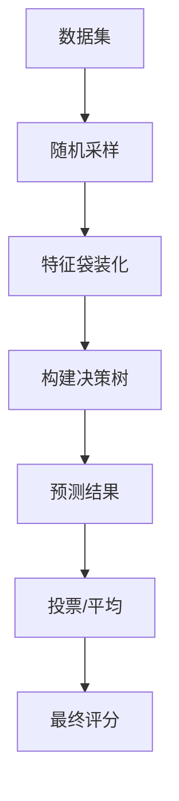
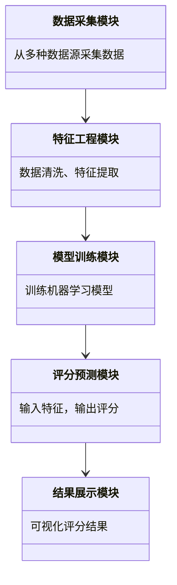
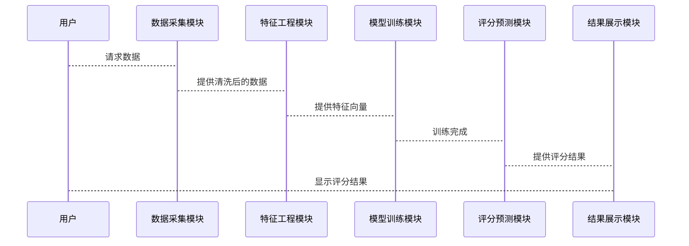

                 


# AI驱动的公司治理评分预测模型

> 关键词：AI, 公司治理, 评分预测, 模型, 算法, 系统架构, 项目实战

> 摘要：本文将介绍如何利用人工智能技术构建公司治理评分预测模型。通过分析公司治理的核心要素，结合先进的机器学习和深度学习算法，我们提出了一种基于AI的评分预测方法，并详细阐述了模型的构建过程、系统架构设计以及实际应用案例。

---

## 第1章 公司治理评分预测模型的背景与意义

### 1.1 公司治理评分的重要性

#### 1.1.1 公司治理的基本概念
公司治理是企业管理的核心，涉及股东、董事会、高管和利益相关者之间的权利、责任和义务的分配与协调。有效的公司治理能够提升企业透明度、风险管理和长期价值创造。

#### 1.1.2 公司治理评分的定义与作用
公司治理评分是对企业治理水平的量化评估，通常基于财务数据、治理结构、风险管理、社会责任等多个维度。评分结果能够帮助企业识别治理缺陷，优化管理流程，并为投资者提供决策依据。

#### 1.1.3 AI在公司治理评分中的应用前景
随着数据量的快速增长和算法的不断进步，AI技术能够帮助我们更高效地分析复杂数据，发现传统方法难以捕捉的治理风险和机会。

---

### 1.2 AI驱动评分预测的核心价值

#### 1.2.1 提高评分预测的准确性
通过机器学习和深度学习算法，AI能够从海量数据中提取非线性特征，显著提高评分预测的精度。

#### 1.2.2 提升公司治理的透明度
AI模型能够实时监控企业治理动态，及时发现潜在风险，从而提升企业治理的透明度和合规性。

#### 1.2.3 优化企业决策效率
AI驱动的评分预测模型能够为企业提供实时、动态的治理评分，帮助管理层快速做出决策。

---

## 第2章 公司治理评分预测模型的核心概念

### 2.1 模型的基本原理

#### 2.1.1 数据采集与处理
公司治理评分预测模型需要整合企业财务数据、治理结构数据、市场数据、行业基准等多源异构数据。

#### 2.1.2 特征提取与选择
通过特征工程提取与治理评分相关的特征，例如ROE（净资产收益率）、董事会独立性、高管薪酬与绩效挂钩等。

#### 2.1.3 模型训练与优化
基于特征数据，采用监督学习算法训练模型，并通过交叉验证优化模型参数。

---

### 2.2 评分指标与数据来源

#### 2.2.1 常见评分指标对比
以下是几种常见的公司治理评分指标对比：

| 指标名称       | 定义与计算方式                                                                 |
|----------------|-----------------------------------------------------------------------------|
| 治理指数得分     | 基于多个维度（如董事会结构、透明度、股东权益）的加权评分                         |
| 风险调整后评分   | 考虑企业风险因素（如杠杆率、流动性）后的评分                                   |
| 行业基准评分     | 相对于行业平均水平的评分                                                     |

#### 2.2.2 数据来源的多样性
公司治理评分数据可以来源于企业年报、行业报告、第三方评级机构等。

#### 2.2.3 数据清洗与预处理
数据清洗是确保模型准确性的关键步骤，包括处理缺失值、异常值和重复数据。

---

### 2.3 模型的输入输出关系

#### 2.3.1 输入特征的定义
模型的输入特征包括：
- 财务指标：如净利润增长率、资产负债率
- 治理结构指标：如董事会规模、独立董事比例
- 市场指标：如市盈率、行业指数

#### 2.3.2 输出评分的范围与意义
输出评分范围通常在0到1之间，评分越高表示公司治理水平越好。

#### 2.3.3 模型的可解释性
通过特征重要性分析，可以解释模型的决策逻辑，帮助企业管理者优化治理结构。

---

## 第3章 AI驱动评分预测的算法原理

### 3.1 传统机器学习算法

#### 3.1.1 线性回归模型
线性回归适用于预测连续型输出，但在公司治理评分预测中，更适合使用广义线性回归模型。

#### 3.1.2 支持向量机（SVM）
SVM适用于高维数据分类和回归问题，但在非线性关系中表现有限。

#### 3.1.3 随机森林与梯度提升树
随机森林和梯度提升树（如XGBoost）在处理高维数据和非线性关系时表现优异，适合公司治理评分预测。

---

### 3.2 深度学习模型

#### 3.2.1 神经网络基础
神经网络通过多层非线性变换，能够捕捉复杂的治理评分模式。

#### 3.2.2 LSTM在时间序列数据中的应用
LSTM适用于时间序列数据，能够捕捉企业治理的动态变化。

#### 3.2.3 Transformer模型的引入
Transformer模型通过自注意力机制，能够捕捉治理评分的全局特征。

---

### 3.3 混合模型与集成学习

#### 3.3.1 混合模型的优势
结合传统机器学习和深度学习的优势，通常能获得更好的预测效果。

#### 3.3.2 集成学习的原理与实现
通过集成多个基模型（如随机森林和梯度提升树）的预测结果，通常能显著提高模型的鲁棒性。

#### 3.3.3 深度学习与传统算法的结合
在实际应用中，通常采用混合模型架构，将传统特征与深度学习特征相结合。

---

## 第4章 模型的数学基础与公式推导

### 4.1 线性回归模型的数学公式

线性回归模型的输出可以表示为：

$$ y = \beta_0 + \beta_1 x_1 + \beta_2 x_2 + \dots + \beta_n x_n + \epsilon $$

其中：
- $y$ 是预测目标（公司治理评分）
- $\beta_0$ 是截距项
- $\beta_1, \beta_2, \dots, \beta_n$ 是特征变量的系数
- $\epsilon$ 是误差项

---

### 4.2 随机森林的算法流程

随机森林通过随机采样和特征袋装化生成多个决策树，并通过投票或平均的方式得到最终预测结果。其流程可以用以下mermaid图表示：



---

## 第5章 系统分析与架构设计方案

### 5.1 问题场景介绍

公司治理评分预测系统需要实时处理大量企业数据，支持多维度的特征分析和模型训练。

---

### 5.2 项目介绍

本项目旨在构建一个基于AI的公司治理评分预测系统，帮助企业管理者和投资者实时评估企业治理水平。

---

### 5.3 系统功能设计

#### 5.3.1 领域模型（mermaid类图）



---

### 5.4 系统架构设计

#### 5.4.1 系统架构图（mermaid架构图）

```mermaid
archi
    1. 数据采集模块 (Data Collector)
    2. 特征工程模块 (Feature Engineering)
    3. 模型训练模块 (Model Training)
    4. 评分预测模块 (Score Prediction)
    5. 结果展示模块 (Result Display)
```

---

### 5.5 系统接口设计

系统接口主要分为数据接口和用户接口，数据接口用于获取企业数据，用户接口用于展示评分结果。

---

### 5.6 系统交互设计（mermaid序列图）



---

## 第6章 项目实战

### 6.1 环境安装

安装必要的Python库，如pandas、scikit-learn、xgboost、keras等。

---

### 6.2 系统核心实现源代码

以下是一个简单的评分预测模型实现代码：

```python
import pandas as pd
from sklearn.ensemble import RandomForestRegressor
from sklearn.metrics import mean_squared_error

# 数据加载
data = pd.read_csv('governance_data.csv')

# 特征与标签分离
X = data.drop('score', axis=1)
y = data['score']

# 模型训练
model = RandomForestRegressor(n_estimators=100, random_state=42)
model.fit(X, y)

# 预测与评估
y_pred = model.predict(X)
print(f"均方误差: {mean_squared_error(y, y_pred)}")
```

---

### 6.3 代码应用解读与分析

代码实现了一个基于随机森林的评分预测模型，包括数据加载、特征提取、模型训练和预测评估。

---

### 6.4 实际案例分析

以某行业为例，分析模型在实际应用中的表现，并讨论优化方向。

---

### 6.5 项目小结

总结项目实现的关键步骤和经验教训，为后续优化提供参考。

---

## 第7章 总结与展望

### 7.1 总结

本文详细介绍了AI驱动的公司治理评分预测模型的构建过程，从理论到实践，从算法到系统设计，为读者提供了一个完整的解决方案。

---

### 7.2 未来展望

未来，随着AI技术的不断发展，公司治理评分预测模型将更加智能化和个性化，为企业治理提供更强大的支持。

---

## 作者

作者：AI天才研究院/AI Genius Institute & 禅与计算机程序设计艺术 /Zen And The Art of Computer Programming

