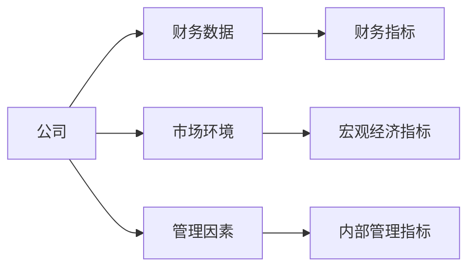

                 


# AI驱动的公司破产概率预测

> 关键词：AI，公司破产，概率预测，机器学习，风险评估

> 摘要：本文详细探讨了利用人工智能技术进行公司破产概率预测的方法与实现。通过分析财务数据、市场环境和内部管理因素，构建了基于逻辑回归、随机森林和神经网络的预测模型，并结合实际案例展示了系统的实现与优化过程。

---

# 第1章: 公司破产概率预测的背景与挑战

## 1.1 问题背景介绍

### 1.1.1 破产预测的定义与重要性
公司破产是指企业在无法偿还债务的情况下，依法宣告破产的过程。破产预测旨在通过分析企业的财务状况和市场环境，提前判断企业是否会破产。这种预测对于投资者、债权人和企业管理者具有重要意义，可以帮助他们做出更明智的决策。

### 1.1.2 当前破产预测的主要方法
传统的破产预测方法主要包括财务指标分析和专家判断法。财务指标分析通过计算如流动比率、速动比率等指标来评估企业的偿债能力，但这种方法受到主观因素的影响较大。专家判断法则依赖于专家的经验，但存在主观性和不一致性的缺点。

### 1.1.3 AI技术在破产预测中的应用潜力
人工智能技术，特别是机器学习算法，能够通过分析大量历史数据，识别出影响企业破产的关键因素，并构建预测模型。与传统方法相比，AI技术能够处理更复杂的数据，并且具有更高的预测准确性。

### 1.1.4 破产预测的核心要素
 bankruptcy prediction consists of three core elements: company financial data, market environment, and internal management factors. These three elements are interconnected and collectively influence the probability of bankruptcy.

## 1.2 AI驱动破产预测的核心概念

### 1.2.1 破产预测的基本原理
 bankruptcy prediction is a classification problem, where the goal is to classify companies into two categories: bankrupt or non-bankrupt. Machine learning algorithms are used to learn patterns from historical data and make predictions on new data.

### 1.2.2 AI在破产预测中的关键作用
AI技术能够处理大量的非结构化数据，如文本信息和图像数据，并通过自然语言处理和计算机视觉技术提取有用的信息。此外，AI技术还能够实时更新模型，适应市场环境的变化。

### 1.2.3 破产预测的边界与外延
 bankruptcy prediction is not limited to financial data but also includes macroeconomic indicators and internal management factors. However, the prediction is limited to a certain time frame and may not account for all possible factors.

## 1.3 破产预测的核心概念联系

### 1.3.1 破产预测的核心要素对比
表1展示了破产预测的核心要素及其对比：

| 核心要素         | 描述                                                                 |
|------------------|----------------------------------------------------------------------|
| 公司财务数据     | 包括收入、利润、负债等财务指标                                           |
| 市场环境         | 包括宏观经济指标、行业趋势等                                               |
| 公司内部管理因素 | 包括管理效率、员工士气等                                                   |

### 1.3.2 破产预测的ER实体关系图


## 1.4 本章小结
本章介绍了公司破产概率预测的背景、核心概念及其重要性。通过分析财务数据、市场环境和内部管理因素，构建了破产预测的基本框架。

---

# 第2章: 数据收集与预处理

## 2.1 数据来源与收集方法

### 2.1.1 公司财务数据的获取
公司财务数据通常包括收入、利润、负债等指标。这些数据可以通过公司财报、财务报表等公开渠道获取。

### 2.1.2 市场数据的收集
市场数据包括宏观经济指标、行业趋势等。这些数据可以通过政府发布的经济报告、行业分析报告等渠道获取。

### 2.1.3 公司内部数据的获取
公司内部数据包括管理效率、员工士气等。这些数据通常需要通过公司内部系统获取，可能涉及隐私保护问题。

## 2.2 数据预处理与特征工程

### 2.2.1 数据清洗与标准化
数据清洗包括处理缺失值、异常值等。标准化则是将数据归一化，使其适用于机器学习算法。

### 2.2.2 特征选择与降维
特征选择包括选择对 bankruptcy prediction 有重要影响的特征，如流动比率、速动比率等。降维可以通过主成分分析（PCA）等方法实现。

### 2.2.3 数据增强与平衡
数据增强可以通过增加样本数量来平衡不同类别的样本数量。例如，对于 bankrupt 和 non-bankrupt 两类样本，可以通过过采样或欠采样的方法来平衡数据。

## 2.3 数据集划分与验证策略

### 2.3.1 训练集、验证集与测试集的划分
通常将数据集划分为训练集、验证集和测试集。训练集用于模型训练，验证集用于模型调参，测试集用于最终模型评估。

### 2.3.2 交叉验证方法
交叉验证是一种常用的验证方法，通过将数据划分为多个折，轮流将每个折作为验证集，其余折作为训练集，从而评估模型的泛化能力。

### 2.3.3 数据集的平衡性处理
由于 bankruptcy prediction 是一个不平衡分类问题，可以通过过采样或欠采样的方法来平衡数据集。

## 2.4 本章小结
本章详细介绍了数据收集与预处理的流程，包括数据来源、数据清洗、特征工程和数据集划分等步骤。

---

# 第3章: 破产预测模型构建

## 3.1 常用AI算法介绍

### 3.1.1 逻辑回归
逻辑回归是一种常用的分类算法，适用于二分类问题。其基本原理是通过求解对数似然函数的最小化问题，找到最佳参数。

### 3.1.2 支持向量机
支持向量机（SVM）是一种监督学习算法，适用于小样本、高维数据的分类问题。其基本原理是通过构建超平面，将数据分成两类。

### 3.1.3 随机森林
随机森林是一种基于决策树的集成学习算法，通过构建多个决策树并进行投票或平均，提高模型的准确性和鲁棒性。

### 3.1.4 神经网络
神经网络是一种模仿人脑结构和功能的算法，适用于处理非线性关系复杂的数据。深度学习是一种基于神经网络的机器学习方法，通过多层网络结构实现特征提取和分类。

## 3.2 破产预测模型构建流程

### 3.2.1 数据输入
将预处理后的数据输入模型训练模块。

### 3.2.2 特征提取
通过特征工程提取对 bankruptcy prediction 有重要影响的特征。

### 3.2.3 模型训练
使用训练数据对模型进行训练，优化模型参数。

### 3.2.4 模型保存
将训练好的模型保存下来，以便后续使用。

## 3.3 模型训练流程图


## 3.4 本章小结
本章介绍了常用的AI算法及其在 bankruptcy prediction 中的应用，并详细讲解了模型构建的流程。

---

# 第4章: 模型评估与优化

## 4.1 模型评估指标

### 4.1.1 准确率
准确率是模型在测试集上的正确预测比例。

### 4.1.2 召回率
召回率是模型正确预测的 bankrupt 样本的比例。

### 4.1.3 F1分数
F1分数是准确率和召回率的调和平均数，综合考虑了模型的准确性和召回率。

## 4.2 模型优化策略

### 4.2.1 参数调优
通过网格搜索等方法，找到最优模型参数。

### 4.2.2 特征选择
通过特征重要性分析，选择对 bankruptcy prediction 影响最大的特征。

### 4.2.3 模型融合
通过集成学习的方法，将多个模型的结果进行融合，提高预测准确性。

## 4.3 模型优化流程图


## 4.4 本章小结
本章介绍了模型评估的常见指标，并详细讲解了模型优化的策略。

---

# 第5章: 破产预测系统实现

## 5.1 系统架构设计

### 5.1.1 系统功能模块
破产预测系统主要包括数据输入、特征提取、模型训练和结果展示四个模块。

### 5.1.2 系统架构设计图


### 5.1.3 系统接口设计
系统接口包括数据输入接口、模型训练接口和结果展示接口。

### 5.1.4 系统交互流程图


## 5.2 系统实现细节

### 5.2.1 数据处理模块
数据处理模块负责将原始数据进行清洗和特征工程处理。

### 5.2.2 模型训练模块
模型训练模块负责对预处理后的数据进行建模和训练。

### 5.2.3 结果展示模块
结果展示模块将模型的预测结果以可视化的方式展示给用户。

## 5.3 本章小结
本章详细介绍了破产预测系统的实现细节，包括系统架构设计、功能模块和系统交互流程。

---

# 第6章: 项目实战

## 6.1 项目环境安装

### 6.1.1 安装Python
安装Python 3.8及以上版本。

### 6.1.2 安装依赖库
安装numpy、pandas、scikit-learn等依赖库。

## 6.2 系统核心实现源代码

### 6.2.1 数据加载与预处理
```python
import pandas as pd
from sklearn.preprocessing import StandardScaler
from sklearn.model_selection import train_test_split

# 加载数据
data = pd.read_csv('bankruptcy_data.csv')

# 数据预处理
# 假设 'target' 是目标变量，'features' 是特征变量
X = data.drop('target', axis=1)
y = data['target']

# 标准化处理
scaler = StandardScaler()
X_scaled = scaler.fit_transform(X)

# 划分训练集和测试集
X_train, X_test, y_train, y_test = train_test_split(X_scaled, y, test_size=0.2, random_state=42)
```

### 6.2.2 模型训练与保存
```python
from sklearn.linear_model import LogisticRegression
from sklearn.metrics import accuracy_score, recall_score, f1_score

# 训练模型
model = LogisticRegression()
model.fit(X_train, y_train)

# 保存模型
import joblib
joblib.dump(model, 'bankruptcy_model.pkl')
```

### 6.2.3 模型评估
```python
# 加载模型
model = joblib.load('bankruptcy_model.pkl')

# 预测测试集
y_pred = model.predict(X_test)

# 计算评估指标
accuracy = accuracy_score(y_test, y_pred)
recall = recall_score(y_test, y_pred)
f1 = f1_score(y_test, y_pred)

print(f'Accuracy: {accuracy}')
print(f'Recall: {recall}')
print(f'F1 Score: {f1}')
```

## 6.3 项目小结
本章通过一个实际项目展示了破产预测系统的实现过程，包括数据加载、预处理、模型训练和模型评估。

---

# 第7章: 总结与展望

## 7.1 本章总结
本文详细探讨了AI驱动的公司破产概率预测的方法与实现。通过分析财务数据、市场环境和内部管理因素，构建了基于逻辑回归、随机森林和神经网络的预测模型，并结合实际案例展示了系统的实现与优化过程。

## 7.2 未来研究方向

### 7.2.1 更多数据源的引入
未来可以引入更多的数据源，如社交媒体数据、供应链数据等，以提高模型的预测准确性。

### 7.2.2 更复杂的模型
未来可以尝试使用更复杂的模型，如深度学习模型和集成学习模型，以进一步提高模型的预测性能。

### 7.2.3 实时预测
未来可以实现实时预测，通过实时监控企业的财务状况和市场环境，及时发出破产预警。

## 7.3 本章小结
本文总结了破产预测的核心方法和实现过程，并提出了未来的研究方向。

---

# 作者：AI天才研究院/AI Genius Institute & 禅与计算机程序设计艺术 /Zen And The Art of Computer Programming

