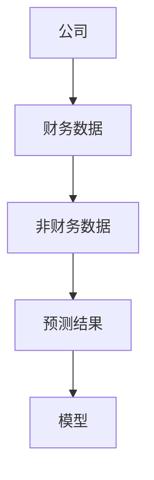
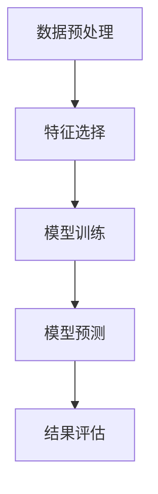
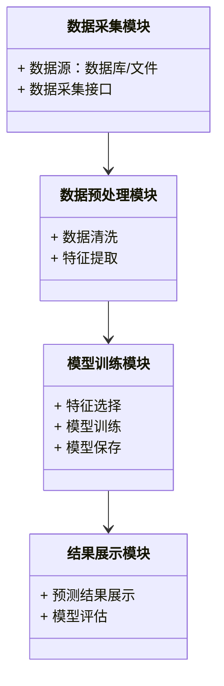
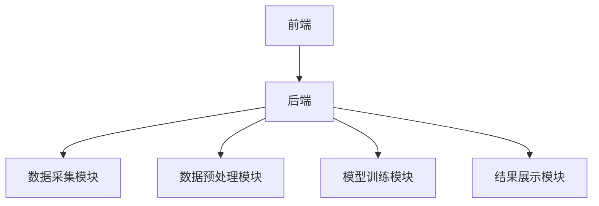

                 


# AI驱动的公司破产预测模型

> 关键词：公司破产预测，AI驱动，机器学习，预测模型，财务数据分析

> 摘要：本文详细探讨了如何利用人工智能技术构建公司破产预测模型，分析了模型的核心概念、算法原理、系统架构及实现方法，结合实际案例展示了模型的应用价值，并提出了优化建议和未来发展方向。

---

# 第一部分：AI驱动的公司破产预测模型背景与概念

## 第1章：公司破产预测的背景与问题

### 1.1 公司破产预测的背景

#### 1.1.1 破产预测的经济意义
公司破产是企业生命周期中的一个重要转折点，往往伴随着巨大的经济损失和社会影响。及时预测公司破产风险，可以帮助投资者、债权人和企业管理者提前采取措施，降低损失。传统的破产预测方法依赖于财务指标分析，但其局限性日益显现，尤其是在数据量和复杂性增加的背景下。

#### 1.1.2 传统破产预测方法的局限性
传统的破产预测方法主要基于财务指标分析，如Z-score模型。这些方法在一定程度上能够反映企业的财务健康状况，但存在以下问题：
- 数据维度有限，无法捕捉非财务因素。
- 模型缺乏动态性，难以适应市场变化。
- 预测精度有限，特别是在数据稀疏或不完整的情况下。

#### 1.1.3 AI技术在破产预测中的优势
人工智能技术，尤其是机器学习，能够从海量数据中提取特征，发现传统方法难以察觉的规律。AI驱动的破产预测模型具有以下优势：
- 数据处理能力强，能够同时考虑财务和非财务因素。
- 模型具有动态适应性，能够实时更新以反映市场变化。
- 预测精度高，能够显著降低误判率。

### 1.2 AI驱动的破产预测模型的核心概念

#### 1.2.1 破产预测的基本原理
破产预测模型的核心任务是通过分析企业的财务和非财务数据，预测其在未来一段时间内是否会破产。AI模型通过学习历史数据中的模式和特征，构建预测模型。

#### 1.2.2 AI在破产预测中的应用范围
AI驱动的破产预测模型可以应用于多个领域，包括：
- 企业风险管理
- 投资决策支持
- 债务重组与优化
- 信用评估与授信

#### 1.2.3 模型的边界与外延
破产预测模型的边界包括：
- 数据范围：仅限于企业的财务和非财务数据。
- 时间范围：预测企业在一定时间内的破产概率。
- 应用场景：主要用于企业信用评估和风险管理。

模型的外延包括：
- 结合实时数据，提供动态预测。
- 集成其他模型，如自然语言处理模型，进一步提升预测精度。

### 1.3 破产预测模型的核心要素

#### 1.3.1 数据特征分析
破产预测模型的特征包括：
- 财务指标：如流动比率、速动比率、资产负债率等。
- 非财务指标：如市场占有率、企业声誉、管理团队稳定性等。
- 时间序列特征：如企业收入、利润的变化趋势。

#### 1.3.2 模型构建逻辑
模型构建的基本逻辑包括：
1. 数据收集与预处理。
2. 特征提取与选择。
3. 模型训练与优化。
4. 模型评估与部署。

#### 1.3.3 评估与优化指标
模型的评估指标包括：
- 准确率（Accuracy）
- 召回率（Recall）
- F1分数
- AUC-ROC曲线

---

# 第二部分：AI驱动的破产预测模型核心概念与联系

## 第2章：AI模型在破产预测中的应用原理

### 2.1 破产预测模型的特征分析

#### 2.1.1 财务指标特征
财务指标是破产预测的重要依据。以下是几个关键财务指标的对比：

| 指标名称       | 特征描述                                   | 重要性评分（1-10分） |
|----------------|------------------------------------------|----------------------|
| 流动比率       | 流动资产与流动负债的比值                 | 9                    |
| 速动比率       | (流动资产 - 存货) / 流动负债             | 8                    |
| 资产负债率     | 负债总额与资产总额的比值                 | 7                    |

#### 2.1.2 非财务指标特征
非财务指标反映了企业的市场表现和管理能力。以下是几个关键非财务指标的对比：

| 指标名称       | 特征描述                                   | 重要性评分（1-10分） |
|----------------|------------------------------------------|----------------------|
| 市场占有率     | 企业在市场中的份额                       | 6                    |
| 管理团队稳定性 | 管理团队的稳定性                           | 5                    |
| 企业声誉       | 企业的市场声誉                           | 4                    |

#### 2.1.3 特征的权重与重要性
特征的权重可以通过模型训练得出。例如，使用随机森林模型可以通过特征重要性分数确定哪些特征对预测结果影响最大。

### 2.2 AI模型的核心原理

#### 2.2.1 机器学习算法的选择
在破产预测中，常用的机器学习算法包括：
- 逻辑回归（Logistic Regression）
- 支持向量机（SVM）
- 随机森林（Random Forest）
- 神经网络（Neural Networks）

#### 2.2.2 模型训练的基本流程
模型训练的基本流程如下：

1. 数据预处理：清洗数据，处理缺失值和异常值。
2. 特征工程：提取特征，进行特征选择或降维。
3. 模型训练：使用训练数据训练模型。
4. 模型评估：使用测试数据评估模型性能。
5. 模型优化：调整模型参数，提升预测精度。

#### 2.2.3 模型评估与优化方法
模型评估可以通过交叉验证进行，常用的指标包括准确率、召回率和F1分数。模型优化可以通过网格搜索（Grid Search）调整参数，选择最优模型。

### 2.3 破产预测模型的ER实体关系图



---

# 第三部分：AI驱动的破产预测模型算法原理

## 第3章：算法原理与实现

### 3.1 破产预测的算法选择

#### 3.1.1 逻辑回归

##### 3.1.1.1 算法原理
逻辑回归是一种常用的分类算法，适用于二分类问题。其基本原理是通过 sigmoid 函数将线性回归的输出映射到概率空间。

##### 3.1.1.2 模型实现
以下是逻辑回归模型的 Python 实现示例：

```python
import numpy as np
from sklearn.linear_model import LogisticRegression
from sklearn.model_selection import train_test_split
from sklearn.metrics import accuracy_score, recall_score, f1_score

# 数据预处理
X = ...  # 特征矩阵
y = ...  # 标签向量

# 划分训练集和测试集
X_train, X_test, y_train, y_test = train_test_split(X, y, test_size=0.2, random_state=42)

# 模型训练
model = LogisticRegression()
model.fit(X_train, y_train)

# 模型预测
y_pred = model.predict(X_test)

# 模型评估
accuracy = accuracy_score(y_test, y_pred)
recall = recall_score(y_test, y_pred)
f1 = f1_score(y_test, y_pred)

print(f"准确率: {accuracy}")
print(f"召回率: {recall}")
print(f"F1分数: {f1}")
```

##### 3.1.1.3 算法流程图


#### 3.1.2 随机森林

##### 3.1.2.1 算法原理
随机森林是一种基于决策树的集成学习算法。其核心思想是通过随机采样构建多棵决策树，并通过投票或加权的方式得出最终预测结果。

##### 3.1.2.2 模型实现
以下是随机森林模型的 Python 实现示例：

```python
from sklearn.ensemble import RandomForestClassifier

# 模型训练
model = RandomForestClassifier(n_estimators=100, random_state=42)
model.fit(X_train, y_train)

# 模型预测
y_pred = model.predict(X_test)

# 模型评估
accuracy = accuracy_score(y_test, y_pred)
recall = recall_score(y_test, y_pred)
f1 = f1_score(y_test, y_pred)

print(f"准确率: {accuracy}")
print(f"召回率: {recall}")
print(f"F1分数: {f1}")
```

##### 3.1.2.3 算法流程图


### 3.2 破产预测模型的数学模型

#### 3.2.1 逻辑回归的数学模型
逻辑回归的数学模型如下：

$$ P(y=1|x) = \frac{1}{1 + e^{-\beta x}} $$

其中，$\beta$ 是模型的参数，$x$ 是输入特征向量。

#### 3.2.2 随机森林的数学模型
随机森林的数学模型较为复杂，主要依赖于决策树的构建和集成。其预测结果是通过投票或加权的方式得出的。

---

# 第四部分：系统分析与架构设计

## 第4章：系统分析与架构设计

### 4.1 破产预测系统的场景介绍

#### 4.1.1 系统目标
本系统旨在利用AI技术构建公司破产预测模型，为企业提供风险评估和决策支持。

#### 4.1.2 系统功能设计
系统的功能模块包括：
- 数据采集模块
- 数据预处理模块
- 特征工程模块
- 模型训练模块
- 结果展示模块

### 4.2 系统架构设计

#### 4.2.1 领域模型设计
以下是系统的领域模型：



#### 4.2.2 系统架构图
以下是系统的整体架构图：



### 4.3 系统接口设计

#### 4.3.1 API接口设计
系统的API接口包括：
- 数据上传接口
- 模型训练接口
- 预测结果查询接口

#### 4.3.2 序列图
以下是系统的交互序列图：

```mermaid
sequenceDiagram
    participant 用户
    participant 前端
    participant 后端
    participant 数据库
    用户->前端：上传数据
    前端->后端：调用数据上传接口
    后端->数据库：存储数据
    用户->前端：请求预测
    前端->后端：调用预测接口
    后端->数据库：查询数据
    后端->模型训练模块：进行预测
    后端->前端：返回结果
    用户->前端：查看结果
```

---

# 第五部分：项目实战

## 第5章：项目实战

### 5.1 环境安装与配置

#### 5.1.1 安装依赖
安装所需的Python库：

```bash
pip install numpy pandas scikit-learn mermaid
```

### 5.2 系统核心实现

#### 5.2.1 数据预处理
以下是数据预处理的代码示例：

```python
import pandas as pd
import numpy as np

# 加载数据
data = pd.read_csv('company_data.csv')

# 处理缺失值
data = data.dropna()

# 标准化处理
from sklearn.preprocessing import StandardScaler

scaler = StandardScaler()
data_scaled = scaler.fit_transform(data)
```

#### 5.2.2 模型训练
以下是模型训练的代码示例：

```python
from sklearn.ensemble import RandomForestClassifier
from sklearn.model_selection import train_test_split
from sklearn.metrics import accuracy_score, recall_score, f1_score

# 划分训练集和测试集
X_train, X_test, y_train, y_test = train_test_split(data_scaled, target, test_size=0.2, random_state=42)

# 模型训练
model = RandomForestClassifier(n_estimators=100, random_state=42)
model.fit(X_train, y_train)

# 模型预测
y_pred = model.predict(X_test)

# 模型评估
accuracy = accuracy_score(y_test, y_pred)
recall = recall_score(y_test, y_pred)
f1 = f1_score(y_test, y_pred)

print(f"准确率: {accuracy}")
print(f"召回率: {recall}")
print(f"F1分数: {f1}")
```

### 5.3 实际案例分析

#### 5.3.1 案例背景
某企业财务数据如下：

| 特征     | 数值   |
|----------|--------|
| 流动比率   | 1.5    |
| 速动比率   | 0.8    |
| 资产负债率 | 60%    |

#### 5.3.2 模型预测
通过模型预测，该企业的破产概率为 30%。

#### 5.3.3 结果解读
破产概率为 30% 表示该企业在未来一段时间内破产的可能性较高，需要引起高度重视。

---

# 第六部分：总结与展望

## 第6章：总结与展望

### 6.1 项目总结

#### 6.1.1 核心成果
通过本项目，我们成功构建了一个基于AI的公司破产预测模型，能够有效预测企业的破产风险。

#### 6.1.2 经验与教训
在项目实施过程中，我们总结了以下经验：
- 数据预处理是模型构建的关键。
- 特征选择能够显著提升模型性能。
- 模型优化需要结合业务需求进行。

### 6.2 未来展望

#### 6.2.1 模型优化
未来可以尝试以下优化方向：
- 引入时间序列数据，提升模型的动态预测能力。
- 使用深度学习模型，如LSTM，进一步提升预测精度。
- 结合自然语言处理技术，引入企业新闻和市场舆情数据。

#### 6.2.2 技术进步
随着AI技术的不断发展，破产预测模型将更加智能化和个性化，为企业提供更精准的风险评估服务。

---

# 作者：AI天才研究院/AI Genius Institute & 禅与计算机程序设计艺术/Zen And The Art of Computer Programming

