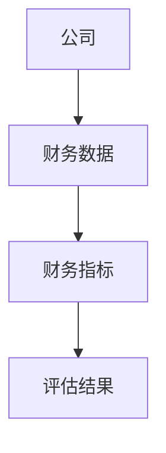
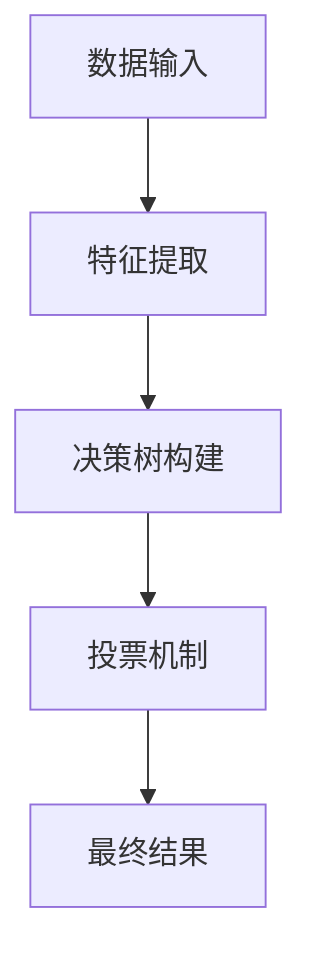
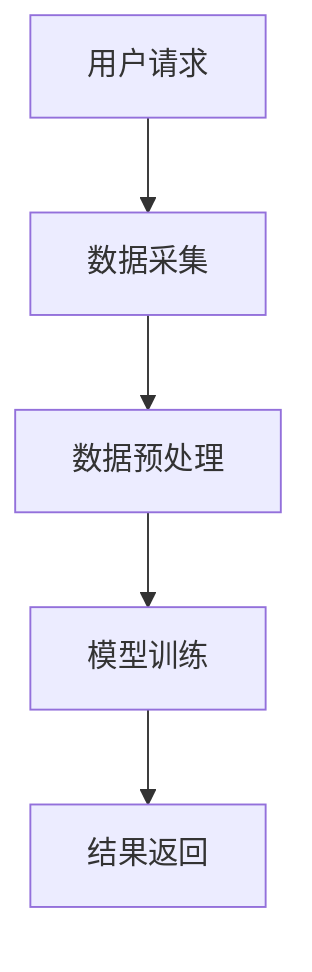

                 

# AI驱动的公司财务健康评估

## 关键词：
AI, 财务健康评估, 机器学习, 数据分析, 财务预测, 深度学习

## 摘要：
随着人工智能技术的快速发展，AI在公司财务健康评估中的应用越来越广泛。本文将从AI的基本概念出发，详细介绍AI在财务健康评估中的背景、核心概念、算法原理、系统架构、项目实战以及最佳实践。通过具体的案例分析和项目实战，帮助读者理解如何利用AI技术提升公司财务健康评估的效率和准确性。文章还涵盖了系统设计的各个方面，包括数据预处理、模型选择和优化，以及系统的实际部署和应用。最后，我们将总结AI在财务健康评估中的优势和未来发展方向，为读者提供深刻的见解和实践指导。

# 目录

## 第1章: 背景介绍与问题定义

### 1.1 什么是公司财务健康评估
#### 1.1.1 财务健康评估的定义
#### 1.1.2 财务健康评估的核心要素
#### 1.1.3 财务健康评估的边界与外延

### 1.2 AI在财务健康评估中的应用背景
#### 1.2.1 传统财务评估方法的局限性
#### 1.2.2 AI技术如何提升财务评估的效率与准确性
#### 1.2.3 企业数字化转型与AI技术的结合

### 1.3 问题描述与目标
#### 1.3.1 财务健康评估的核心问题
#### 1.3.2 问题解决的路径与方法
#### 1.3.3 本书的目标与意义

## 第2章: 核心概念与联系

### 2.1 AI驱动的财务健康评估方法
#### 2.1.1 数据预处理与特征提取
#### 2.1.2 模型选择与训练
#### 2.1.3 结果解释与反馈

### 2.2 核心概念对比表
#### 2.2.1 数据特征对比
#### 2.2.2 模型性能对比
#### 2.2.3 评估指标对比

### 2.3 实体关系图（ER图）

## 第3章: 算法原理与数学模型

### 3.1 常见算法原理
#### 3.1.1 线性回归
#### 3.1.2 随机森林
#### 3.1.3 支持向量机

### 3.2 深度学习模型
#### 3.2.1 LSTM网络
#### 3.2.2 BERT模型
#### 3.2.3 图神经网络

### 3.3 数学模型与公式
#### 3.3.1 线性回归公式
$$ y = a + bX $$

#### 3.3.2 随机森林算法

## 第4章: 系统架构设计

### 4.1 系统功能设计
#### 4.1.1 数据采集模块
#### 4.1.2 数据预处理模块
#### 4.1.3 模型训练模块
#### 4.1.4 结果展示模块

### 4.2 系统架构图

### 4.3 系统接口设计
#### 4.3.1 数据接口
#### 4.3.2 模型接口
#### 4.3.3 结果接口

### 4.4 系统交互流程

## 第5章: 项目实战

### 5.1 环境安装
#### 5.1.1 安装Python
#### 5.1.2 安装机器学习库
#### 5.1.3 安装可视化库

### 5.2 数据收集与处理
#### 5.2.1 数据源介绍
#### 5.2.2 数据清洗
#### 5.2.3 特征工程

### 5.3 模型训练与优化
#### 5.3.1 模型选择
#### 5.3.2 模型训练
#### 5.3.3 模型调优

### 5.4 结果分析与解读
#### 5.4.1 模型评估
#### 5.4.2 结果可视化
#### 5.4.3 实际应用案例

## 第6章: 案例分析与优化

### 6.1 实际案例分析
#### 6.1.1 案例背景介绍
#### 6.1.2 数据分析与处理
#### 6.1.3 模型应用与结果

### 6.2 模型优化与改进
#### 6.2.1 参数调整
#### 6.2.2 模型融合
#### 6.2.3 性能提升

## 第7章: 总结与展望

### 7.1 本书总结
#### 7.1.1 核心内容回顾
#### 7.1.2 关键知识点总结
#### 7.1.3 学习收获与思考

### 7.2 未来展望
#### 7.2.1 AI在财务健康评估中的未来方向
#### 7.2.2 技术进步对财务评估的影响
#### 7.2.3 个人成长与职业发展

## 作者：AI天才研究院/AI Genius Institute & 禅与计算机程序设计艺术 /Zen And The Art of Computer Programming

