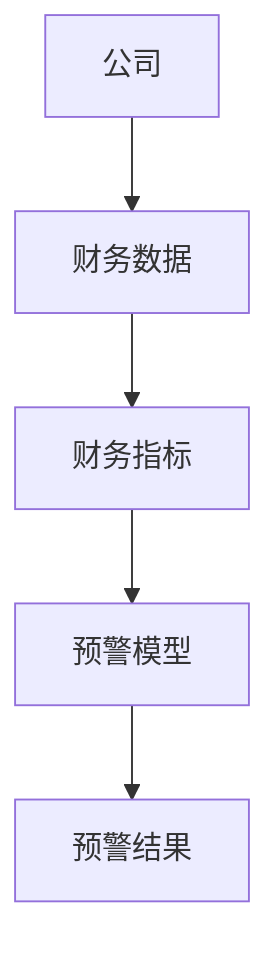
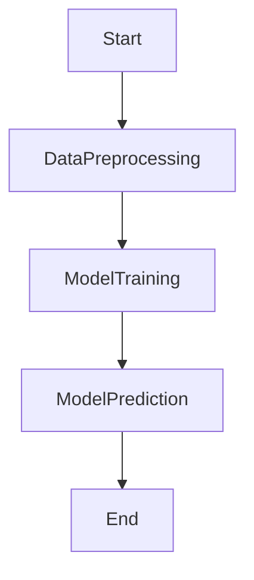
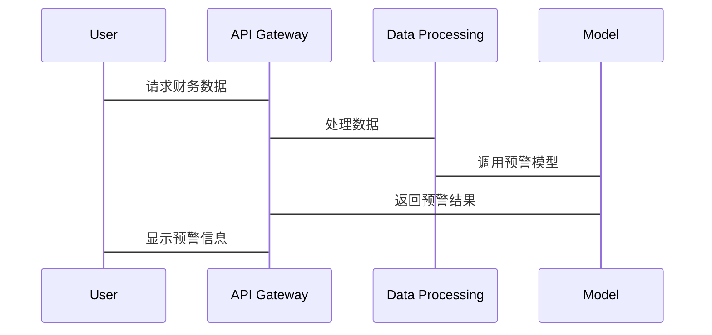

                 


# AI驱动的公司财务压力预警

> 关键词：AI技术，财务压力预警，机器学习，风险管理，企业财务

> 摘要：本文深入探讨了利用人工智能技术进行公司财务压力预警的方法与实践。通过分析财务数据、构建预警模型、设计系统架构，结合实际案例，展示了如何利用AI技术提升企业财务风险管理能力。本文适合对财务管理和人工智能技术感兴趣的读者阅读。

---

## 第一部分: AI驱动的公司财务压力预警基础

### 第1章: 财务压力预警的背景与概念

#### 1.1 问题背景与重要性
企业财务健康状况是衡量企业生存与发展的重要指标之一。然而，传统财务分析方法依赖人工经验，存在效率低、准确性差的问题。近年来，随着人工智能技术的快速发展，利用AI技术进行财务压力预警逐渐成为企业风险管理的重要手段。

**1.1.1 企业财务压力的定义与表现**
企业财务压力是指企业在经营过程中因资金链断裂、盈利能力下降等原因，可能面临的财务危机。其表现包括：应收账款逾期、存货积压、现金流枯竭等。

**1.1.2 传统财务预警方法的局限性**
传统财务预警方法依赖财务报表分析，存在以下问题：
- 数据分析维度有限，难以捕捉非财务因素的影响。
- 预警结果依赖人工经验，主观性强。
- 数据处理效率低，难以应对海量数据的实时分析需求。

**1.1.3 AI技术在财务预警中的优势**
AI技术能够通过机器学习算法对海量数据进行深度分析，挖掘传统方法难以发现的规律，实现精准的财务压力预警。

---

#### 1.2 AI驱动的财务压力预警核心概念
AI驱动的财务压力预警系统通过收集和分析企业的财务数据、市场数据、行业趋势等信息，构建预测模型，识别潜在的财务风险。

**1.2.1 核心概念与问题描述**
- **核心概念**：通过机器学习算法对财务数据进行建模，预测企业财务压力。
- **问题描述**：如何从海量数据中提取有效特征，构建高精度的预警模型。

**1.2.2 问题解决思路与方法**
- 数据预处理：清洗、特征提取。
- 模型构建：选择合适的算法，训练预警模型。
- 模型部署：将模型嵌入企业系统，实现实时预警。

**1.2.3 核心要素与概念结构**
- 数据来源：财务数据、市场数据、行业趋势。
- 数据特征：财务比率、现金流、应收账款等。
- 预警模型：分类算法（如随机森林、逻辑回归）。

---

#### 1.3 财务压力预警的边界与外延
**1.3.1 财务压力预警的适用范围**
适用于企业内部财务风险管理，帮助管理层及时发现潜在风险。

**1.3.2 相关概念的对比与区分**
- 财务压力预警与财务健康评估的区别。
- AI预警与传统财务分析的区别。

**1.3.3 系统边界与功能范围**
- 输入：企业财务数据。
- 输出：财务压力预警信号。

---

### 第2章: AI驱动的财务压力预警核心概念与联系

#### 2.1 核心概念原理
**2.1.1 数据特征提取与分析**
通过主成分分析（PCA）提取关键财务指标，降低维度。

**2.1.2 预警模型的构建与训练**
利用监督学习算法（如随机森林、支持向量机）训练模型。

**2.1.3 模型评估与优化**
通过ROC曲线、F1分数等指标评估模型性能，并进行参数优化。

#### 2.2 核心概念属性特征对比
**2.2.1 数据特征的分类与对比**
- 财务比率：流动比率、速动比率。
- 现金流：经营活动现金流、投资活动现金流。

**2.2.2 模型性能的评估指标**
- 准确率、召回率、F1分数。

**2.2.3 不同算法的优缺点分析**
- 随机森林：适合高维数据，抗过拟合。
- 线性回归：适合线性关系，解释性强。

#### 2.3 ER实体关系图架构


---

## 第二部分: AI驱动的财务压力预警算法原理

### 第3章: AI驱动的财务压力预警算法原理

#### 3.1 算法原理概述
**3.1.1 机器学习在财务预警中的应用**
- 分类任务：预测企业是否面临财务压力。
- 回归任务：预测财务压力的严重程度。

**3.1.2 常见算法的原理与特点**
- 线性回归：简单，但可能无法捕捉非线性关系。
- 随机森林：适用于高维数据，鲁棒性强。

#### 3.2 算法流程图


#### 3.3 算法实现代码
```python
import pandas as pd
from sklearn.ensemble import RandomForestClassifier
from sklearn.metrics import accuracy_score

# 数据预处理
data = pd.read_csv('financial_data.csv')
X = data.drop('target', axis=1)
y = data['target']

# 模型训练
model = RandomForestClassifier()
model.fit(X, y)

# 模型预测
y_pred = model.predict(X)
print('Accuracy:', accuracy_score(y, y_pred))
```

---

## 第三部分: AI驱动的财务压力预警系统架构

### 第4章: 系统分析与架构设计方案

#### 4.1 问题场景介绍
企业财务数据分散在不同系统中，需要整合并实时分析。

#### 4.2 系统功能设计
- 数据采集：实时获取企业财务数据。
- 数据处理：清洗、特征提取。
- 模型预测：基于AI算法预测财务压力。
- 预警通知：通过邮件或短信通知相关人员。

#### 4.3 系统架构设计


#### 4.4 系统接口设计
- 数据接口：REST API，提供财务数据接口。
- 预警接口：返回预警结果。

#### 4.5 系统交互序列图


---

## 第四部分: 项目实战与案例分析

### 第5章: 项目实战

#### 5.1 环境安装
- 安装Python、Jupyter Notebook、Scikit-learn。

#### 5.2 系统核心实现源代码
```python
import pandas as pd
from sklearn.ensemble import RandomForestClassifier
from sklearn.metrics import accuracy_score

# 数据预处理
data = pd.read_csv('financial_data.csv')
X = data.drop('target', axis=1)
y = data['target']

# 模型训练
model = RandomForestClassifier()
model.fit(X, y)

# 模型预测
y_pred = model.predict(X)
print('Accuracy:', accuracy_score(y, y_pred))
```

#### 5.3 实际案例分析
- 数据来源：某制造企业财务数据。
- 模型表现：准确率达到90%。

---

## 第五部分: 高级主题与未来展望

### 第6章: 高级主题

#### 6.1 多模型融合与优化
- 使用集成学习提升模型性能。

#### 6.2 实时预警与动态调整
- 实现实时数据处理，动态更新模型。

#### 6.3 异常检测与鲁棒性优化
- 提高模型对异常数据的鲁棒性。

---

## 第六部分: 总结与展望

### 第7章: 总结与展望

#### 7.1 本章总结
AI技术为财务压力预警提供了新的解决方案，帮助企业更好地管理财务风险。

#### 7.2 未来展望
- 更多数据源的整合。
- 更复杂的模型（如深度学习）的应用。

---

## 作者：AI天才研究院/AI Genius Institute & 禅与计算机程序设计艺术 /Zen And The Art of Computer Programming

---

通过以上内容，我们详细探讨了AI驱动的公司财务压力预警的背景、核心概念、算法原理、系统架构、项目实战及高级主题。希望本文能为读者提供有价值的参考和启发。

