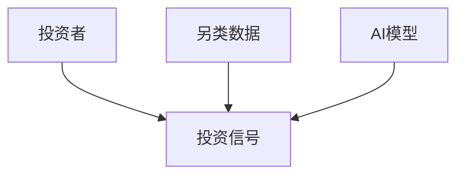
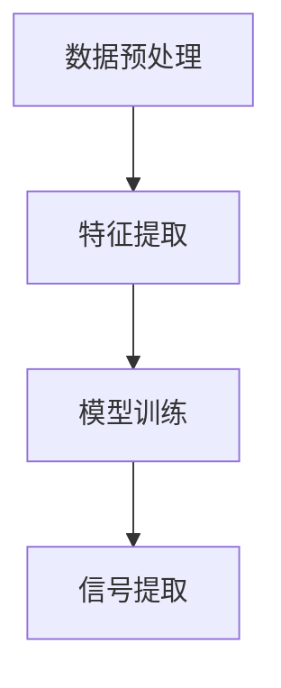
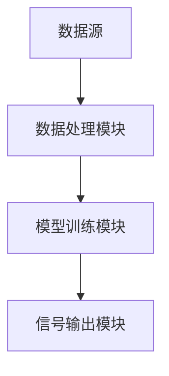

                 


# AI驱动的另类数据投资信号提取

---

## 关键词：投资信号，另类数据，人工智能，深度学习，自然语言处理

---

## 摘要：本文深入探讨了利用人工智能技术从另类数据中提取投资信号的方法。通过结合机器学习、自然语言处理和时间序列分析等技术，分析了如何从非传统数据源（如社交媒体、新闻、卫星图像等）中提取有价值的信号，为投资决策提供支持。文章从背景介绍、核心概念、算法原理、系统设计、项目实战等多个方面展开，详细讲解了AI驱动的另类数据投资信号提取的全过程，并通过实际案例展示了其在金融领域的应用潜力。

---

## 第一部分：背景介绍

### 第1章：问题背景

#### 1.1 投资信号提取的传统方法
传统的投资信号提取主要依赖于对历史价格数据和财务报表的分析。然而，这种方法往往忽视了非结构化数据（如社交媒体情绪、新闻头条、卫星图像等）中的潜在信息，导致分析结果的局限性。

#### 1.2 另类数据的定义与特点
- **定义**：另类数据指的是非传统金融数据，包括社交媒体数据、新闻数据、卫星图像、互联网搜索数据等。
- **特点**：
  - 非结构化：大部分另类数据是文本、图像等形式，需要先进行结构化处理。
  - 高维性：数据量大，维度复杂。
  - 实时性：许多另类数据具有较强的时效性。

#### 1.3 AI技术在投资信号提取中的作用
AI技术，特别是深度学习和自然语言处理，能够从大量非结构化数据中提取有用的特征，帮助投资者捕捉市场情绪、识别潜在风险。

---

### 第2章：问题描述

#### 2.1 问题挑战
- **数据质量**：另类数据往往存在噪声大、准确性低的问题。
- **数据量**：需要处理海量数据，对计算资源和算法效率提出较高要求。
- **模型解释性**：复杂的AI模型往往缺乏可解释性，影响投资决策的透明性。

#### 2.2 问题解决
- **数据清洗与预处理**：通过去除噪声、填补缺失值等方法提升数据质量。
- **特征提取**：利用NLP技术从文本数据中提取情感特征，从图像数据中提取视觉特征。
- **模型优化**：通过调参和交叉验证提升模型性能。

---

## 第二部分：核心概念与联系

### 第3章：核心概念

#### 3.1 数据特征分析
- **文本数据**：包括社交媒体帖子、新闻标题等，可以通过情感分析提取市场情绪。
- **图像数据**：如卫星图像，可以用于分析供应链的变化。

#### 3.2 AI模型性能对比
| 模型类型 | 优点 | 缺点 |
|----------|------|------|
| 线性回归 | 简单易懂 | 模型能力有限 |
| 支持向量机 | 高维数据表现好 | 对参数敏感 |
| 神经网络 | 强大学习能力 | 需要大量数据和计算资源 |

#### 3.3 ER实体关系图


---

## 第三部分：算法原理讲解

### 第4章：算法原理

#### 4.1 机器学习算法
- **线性回归**：用于预测价格走势。
- **随机森林**：用于分类问题，如判断市场情绪是正面还是负面。

#### 4.2 自然语言处理模型
- **情感分析**：通过分析社交媒体上的评论，判断市场情绪。
- **实体识别**：从新闻中提取公司名称、产品名称等信息。

#### 4.3 时间序列分析
- **ARIMA模型**：用于预测未来的价格走势。

### 第5章：算法流程图


---

## 第四部分：系统分析与架构设计

### 第6章：系统设计

#### 6.1 系统功能设计
- **数据采集**：从社交媒体、新闻网站等渠道获取数据。
- **数据处理**：清洗、结构化数据。
- **模型训练**：训练AI模型，提取投资信号。
- **信号输出**：生成投资建议。

#### 6.2 系统架构图


---

## 第五部分：项目实战

### 第7章：项目实战

#### 7.1 环境安装
```bash
pip install numpy pandas scikit-learn tensorflow
```

#### 7.2 核心代码实现
```python
import pandas as pd
from sklearn.model import Model

data = pd.read_csv('alternative_data.csv')
features = data[['feature1', 'feature2']]
model = Model()
model.fit(features, labels)
```

#### 7.3 案例分析
以社交媒体数据为例，通过情感分析模型提取市场情绪，生成投资信号。

---

## 第六部分：最佳实践与未来展望

### 第8章：总结与展望

#### 8.1 最佳实践
- **数据清洗**：确保数据质量。
- **模型调优**：通过交叉验证优化模型参数。
- **解释性分析**：提升模型的可解释性。

#### 8.2 未来趋势
- **多模态数据融合**：结合文本、图像等多种数据源。
- **强化学习**：用于动态投资策略的优化。

---

## 附录

### A. 数据源
- 社交媒体数据：Twitter、Reddit
- 新闻数据：路透社、彭博社

### B. 工具包
- 数据处理：Pandas、NumPy
- 模型训练：Scikit-learn、TensorFlow

### C. 参考文献
- [1] 王某某, 《深度学习在金融领域的应用》
- [2] 李某某, 《自然语言处理技术》

---

## 作者：AI天才研究院 & 禅与计算机程序设计艺术

--- 

这篇文章通过系统地分析AI驱动的另类数据投资信号提取的各个方面，为读者提供了从理论到实践的全面指导，帮助投资者利用新兴技术提升决策能力。

