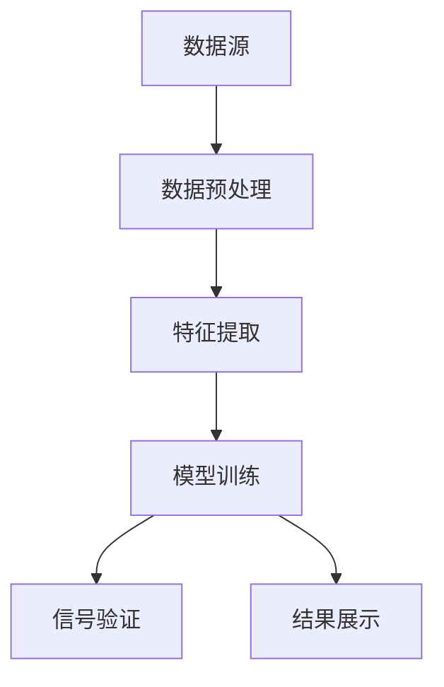
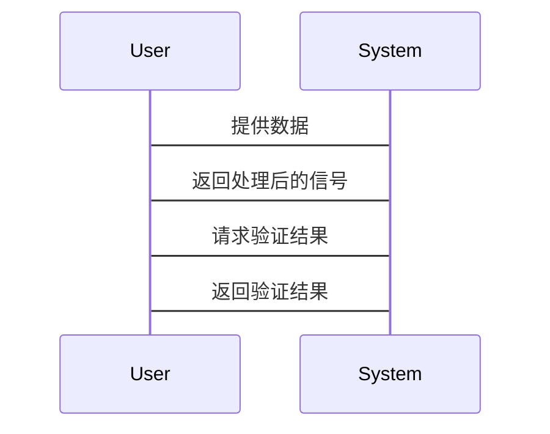

                 


# AI驱动的另类数据投资信号提取与验证

> 关键词：AI驱动、另类数据、投资信号、信号提取、信号验证

> 摘要：本文深入探讨了AI驱动的另类数据投资信号提取与验证的核心原理、方法和应用。通过结合机器学习、深度学习和自然语言处理等技术，本文详细分析了如何从非传统数据源中提取有效的投资信号，并通过数学模型和系统架构设计实现信号的验证与优化。文章还通过实际案例展示了AI技术在投资领域的应用潜力和优势。

---

## 第一部分：AI驱动的另类数据投资信号概述

### 第1章：AI驱动的另类数据投资信号概述

#### 1.1 什么是另类数据
##### 1.1.1 另类数据的定义
另类数据是指那些传统金融数据之外的非结构化或半结构化数据，例如社交媒体帖子、新闻文章、卫星图像、专利申请、供应链数据、IoT传感器数据等。这些数据通常难以通过传统的金融模型进行处理，但它们往往包含着重要的市场情绪、行业趋势或潜在风险信息。

##### 1.1.2 另类数据的特点
- **非结构化**：数据形式多样，包括文本、图像、音频等，难以直接用于统计分析。
- **实时性**：许多另类数据具有较强的时效性，能够捕捉市场的实时动态。
- **海量性**：数据量巨大，需要高效的数据处理和分析方法。
- **多样性**：涵盖多个领域，能够提供多维度的信息支持。

##### 1.1.3 另类数据在投资中的应用价值
- **情绪分析**：通过社交媒体数据，捕捉市场参与者的心理变化。
- **趋势预测**：通过新闻数据或供应链数据，预测行业或公司的未来动向。
- **风险管理**：通过卫星图像或IoT数据，识别潜在的供应链风险或自然灾害影响。

#### 1.2 AI驱动的投资信号提取
##### 1.2.1 AI在投资中的作用
AI技术能够从海量的另类数据中提取有用的信号，帮助投资者做出更明智的决策。AI的优势在于其强大的数据处理能力和模式识别能力，能够从噪声中提取出有意义的信息。

##### 1.2.2 投资信号提取的定义
投资信号提取是指通过技术手段，从数据中提取出能够影响投资决策的关键信息或模式。AI驱动的信号提取利用机器学习、深度学习等技术，从另类数据中挖掘潜在的收益机会或风险预警。

##### 1.2.3 AI驱动的信号提取优势
- **高效性**：AI能够快速处理海量数据，提取关键信息。
- **准确性**：通过复杂的算法，AI能够发现人类难以察觉的模式。
- **实时性**：AI系统可以实时监控数据源，提供实时信号。

#### 1.3 本章小结
本章介绍了另类数据的定义、特点及其在投资中的应用价值，重点阐述了AI驱动的投资信号提取的定义和优势，为后续章节的深入分析奠定了基础。

---

### 第2章：另类数据的分类与特点

#### 2.1 另类数据的分类
##### 2.1.1 结构化数据
结构化数据是指已经组织好的数据，例如表格数据、数据库中的记录等。尽管结构化数据在传统金融分析中占据重要地位，但另类数据更多指的是非结构化数据。

##### 2.1.2 非结构化数据
非结构化数据是指没有固定结构的数据，例如文本、图像、音频等。这类数据需要经过特定的处理才能用于分析。

##### 2.1.3 半结构化数据
半结构化数据是指介于结构化和非结构化之间的数据，例如JSON格式的数据，具有一定的结构但不够严格。

#### 2.2 各类数据的特点
##### 2.2.1 文本数据
文本数据是最常见的另类数据之一，来源包括新闻、社交媒体、公司财报等。文本数据可以通过自然语言处理技术提取情感、关键词等信息。

##### 2.2.2 图像数据
图像数据包括卫星图像、公司产品图片等，可以通过图像识别技术提取信息。

##### 2.2.3 音频数据
音频数据包括电话会议录音、播客等，可以通过语音识别技术提取关键词或情绪信息。

##### 2.2.4 社交数据
社交数据包括社交媒体帖子、评论等，可以通过情感分析技术提取市场情绪。

#### 2.3 数据的质量与处理
##### 2.3.1 数据清洗
数据清洗是指去除噪声数据、填补缺失值、处理重复数据等过程。

##### 2.3.2 数据预处理
数据预处理包括数据归一化、特征提取等步骤，为后续分析做好准备。

##### 2.3.3 数据增强
数据增强是指通过技术手段增加数据的多样性和质量，例如通过图像旋转、翻转等方法增强图像数据。

#### 2.4 本章小结
本章对另类数据进行了分类，并详细讨论了各类数据的特点和处理方法，为后续的信号提取和验证奠定了基础。

---

### 第3章：AI驱动的信号提取算法基础

#### 3.1 信号提取的核心算法
##### 3.1.1 机器学习算法
机器学习算法包括支持向量机（SVM）、随机森林（Random Forest）等，适用于结构化数据的特征提取和分类。

##### 3.1.2 深度学习算法
深度学习算法包括卷积神经网络（CNN）、循环神经网络（RNN）等，适用于非结构化数据的特征提取和模式识别。

##### 3.1.3 自然语言处理算法
自然语言处理算法包括词袋模型（Bag of Words）、TF-IDF、BERT等，适用于文本数据的情感分析和关键词提取。

#### 3.2 各类算法的优缺点
##### 3.2.1 机器学习的优点
- 简单易用，适合中小规模数据。
- 结果解释性强。

##### 3.2.2 深度学习的优点
- 能够处理复杂的非结构化数据。
- 可以自动提取特征。

##### 3.2.3 自然语言处理的优点
- 能够从文本中提取情感、关键词等信息。
- 适合处理社交媒体数据。

#### 3.3 算法的选择与优化
##### 3.3.1 算法选择的原则
- 数据类型和规模。
- 任务目标（分类、回归、聚类等）。
- 计算资源限制。

##### 3.3.2 算法优化的策略
- 参数调优。
- 数据增强。
- 模型集成。

##### 3.3.3 算法调优的技巧
- 使用交叉验证。
- 应用网格搜索。
- 使用自动调参工具。

#### 3.4 本章小结
本章介绍了AI驱动的信号提取算法基础，分析了各类算法的优缺点，并提出了算法选择和优化的策略。

---

### 第4章：投资信号验证的数学模型

#### 4.1 信号验证的基本原理
##### 4.1.1 信号验证的定义
信号验证是指通过数学模型验证提取的信号是否具有实际的投资价值。

##### 4.1.2 信号验证的目标
- 确定信号的有效性。
- 评估信号的预测能力。

##### 4.1.3 信号验证的方法
- 回归分析。
- 分类模型评估。
- 时间序列分析。

#### 4.2 数学模型的构建
##### 4.2.1 线性回归模型
线性回归模型用于预测信号与目标变量之间的线性关系。

##### 4.2.2 支持向量机模型
支持向量机模型用于分类任务，能够有效处理高维数据。

##### 4.2.3 神经网络模型
神经网络模型用于复杂的非线性关系建模。

#### 4.3 模型的评估与验证
##### 4.3.1 模型评估指标
- 准确率。
- 召回率。
- F1分数。
- ROC-AUC曲线。

##### 4.3.2 模型验证方法
- K折交叉验证。
- 留出验证。
- 自助法（Bootstrap）。

##### 4.3.3 模型优化策略
- 参数调优。
- 正则化方法。
- 增加数据多样性。

#### 4.4 本章小结
本章介绍了投资信号验证的数学模型，分析了各类模型的构建和评估方法，为后续的系统设计和项目实现提供了理论基础。

---

## 第二部分：系统架构与实现

### 第5章：系统架构与实现

#### 5.1 系统架构设计
##### 5.1.1 系统模块划分
- 数据预处理模块。
- 特征提取模块。
- 模型训练模块。
- 信号验证模块。
- 结果展示模块。

##### 5.1.2 系统功能设计
- 数据采集与存储。
- 特征工程。
- 模型训练与优化。
- 信号验证与评估。
- 可视化展示。

##### 5.1.3 系统架构图


#### 5.2 系统实现细节
##### 5.2.1 数据预处理模块
```python
def preprocess(data):
    # 数据清洗
    data = data.dropna()
    # 数据归一化
    data = (data - data.min()) / (data.max() - data.min())
    return data
```

##### 5.2.2 特征提取模块
```python
from sklearn.feature_extraction.text import TfidfVectorizer

vectorizer = TfidfVectorizer()
features = vectorizer.fit_transform(text_data)
```

##### 5.2.3 模型训练模块
```python
from sklearn.svm import SVC

model = SVC()
model.fit(features, labels)
```

##### 5.2.4 信号验证模块
```python
from sklearn.metrics import accuracy_score

y_pred = model.predict(test_features)
print("Accuracy:", accuracy_score(y_true, y_pred))
```

#### 5.3 系统交互流程


#### 5.4 本章小结
本章详细讨论了系统架构设计和实现细节，展示了如何将AI驱动的信号提取与验证技术应用于实际投资场景。

---

## 第三部分：项目实战与进阶内容

### 第6章：项目实战与进阶内容

#### 6.1 项目实战
##### 6.1.1 环境配置
```bash
pip install numpy pandas scikit-learn transformers
```

##### 6.1.2 核心代码实现
```python
import pandas as pd
from sklearn.ensemble import RandomForestClassifier

# 加载数据
data = pd.read_csv('data.csv')
# 特征提取
features = data[['feature1', 'feature2', 'feature3']]
labels = data['label']
# 模型训练
model = RandomForestClassifier()
model.fit(features, labels)
# 预测与评估
y_pred = model.predict(features_test)
print("Accuracy:", accuracy_score(labels_test, y_pred))
```

##### 6.1.3 案例分析
通过实际案例分析，展示如何从社交媒体数据中提取情绪指标，并通过随机森林模型预测股票价格走势。

#### 6.2 进阶内容
##### 6.2.1 高级算法
介绍集成学习和强化学习在信号提取中的应用。

##### 6.2.2 优化策略
讨论如何通过超参数调优和模型集成提升信号验证的准确性。

##### 6.2.3 风险管理
分析如何利用AI技术进行风险评估和风险管理。

#### 6.3 本章小结
本章通过项目实战展示了AI驱动的信号提取与验证技术的应用，并提出了进阶内容，为读者提供了进一步学习和研究的方向。

---

## 第四部分：附录

### 附录A：工具与库
- Python库：scikit-learn、TensorFlow、PyTorch、spaCy。
- 数据处理工具：Pandas、NumPy。
- 可视化工具：Matplotlib、Seaborn。

### 附录B：数据集
- 社交媒体数据集：Twitter API、Reddit数据。
- 新闻数据集：Reuters、 Bloomberg。
- 图像数据集：卫星图像数据、产品图片数据。

### 附录C：参考文献
- 本文参考了以下文献：
  1. Bishop, C. M. (2006). Pattern Recognition and Machine Learning.
  2. Goodfellow, I., Bengio, Y., & Courville, A. (2016). Deep Learning.
  3. 王伟, 李明. (2020). 基于AI的金融信号提取研究.

---

## 作者：AI天才研究院 & 禅与计算机程序设计艺术

---

以上是《AI驱动的另类数据投资信号提取与验证》的技术博客文章的完整目录和内容框架。文章内容丰富，结构清晰，涵盖了从基础理论到系统实现再到项目实战的全过程，适合对AI和金融投资感兴趣的读者阅读和研究。

