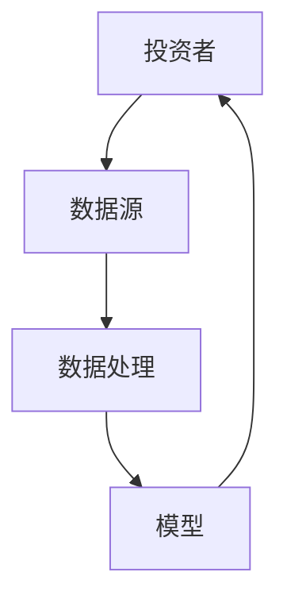
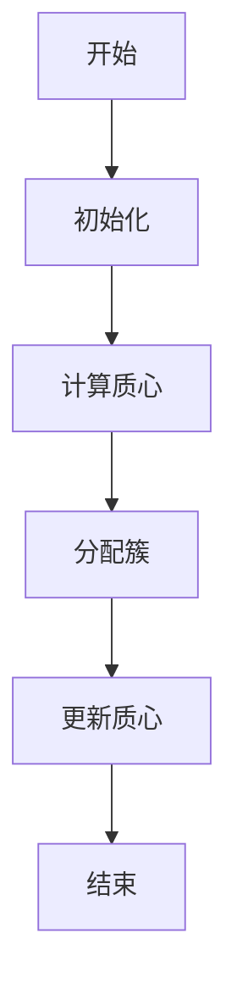
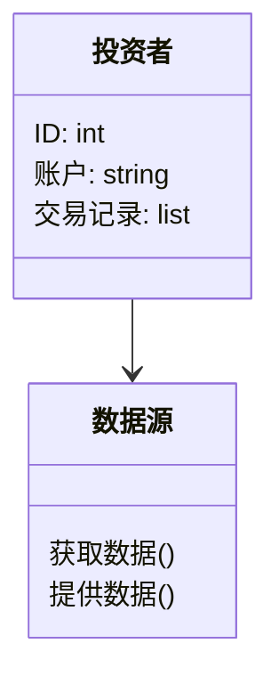
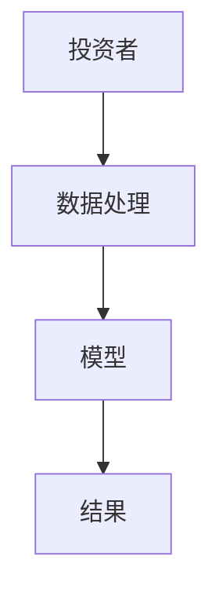
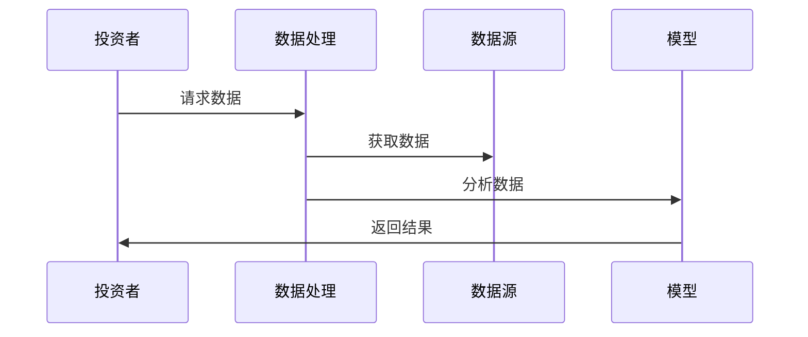

                 


# AI驱动的另类数据投资分析

> 关键词：AI投资分析，另类数据，机器学习，金融数据，大数据分析

> 摘要：本文探讨了AI技术如何驱动另类数据在投资分析中的应用，分析了其核心概念、算法原理、系统架构，并通过实际案例展示了如何利用这些技术进行投资决策。

---

# 引言

在现代金融领域，数据是投资决策的核心。传统投资分析主要依赖于市场数据、财务报表和历史价格等结构化数据。然而，随着科技的发展，另类数据的出现为投资分析带来了新的视角和机会。本文将深入探讨AI技术如何驱动另类数据在投资分析中的应用，分析其核心原理、算法、系统架构，并通过实际案例展示其在投资决策中的价值。

---

## 目录

1. [背景介绍](#背景介绍)
   - 1.1 另类数据的定义与特点
   - 1.2 AI驱动投资分析的背景
   - 1.3 问题背景与问题描述
   - 1.4 问题解决与边界
   - 1.5 核心概念与结构

2. [核心概念与联系](#核心概念与联系)
   - 2.1 数据特征分析
   - 2.2 模型优势对比
   - 2.3 数据特征与模型优势的对比表格
   - 2.4 实体关系架构

3. [算法原理讲解](#算法原理讲解)
   - 3.1 聚类
     - 3.1.1 聚类的定义与作用
     - 3.1.2 K-means算法原理
     - 3.1.3 聚类算法的流程图
     - 3.1.4 聚类算法的Python实现

4. [系统分析与架构设计](#系统分析与架构设计)
   - 4.1 项目背景
   - 4.2 系统功能设计
     - 4.2.1 领域模型
   - 4.3 系统架构设计
   - 4.4 系统接口与交互设计

5. [项目实战](#项目实战)
   - 5.1 环境安装
   - 5.2 系统核心实现
   - 5.3 案例分析
   - 5.4 项目总结

6. [总结与展望](#总结与展望)
   - 6.1 最佳实践
   - 6.2 小结
   - 6.3 注意事项
   - 6.4 拓展阅读

---

## 正文

### 1. 背景介绍

#### 1.1 另类数据的定义与特点

**另类数据**是指传统金融数据之外的非传统数据，包括卫星图像、社交媒体数据、地理位置数据、物联网数据等。这些数据具有以下特点：

- **多样性**：来源广泛，形式多样。
- **实时性**：能够捕捉市场的实时动态。
- **预测性**：通过分析另类数据，可以提前发现市场趋势。

#### 1.2 AI驱动投资分析的背景

传统投资分析依赖于历史数据和统计模型，但其局限性日益显现。AI技术的快速发展为投资分析提供了新的工具和方法，能够处理海量的非结构化数据，挖掘潜在的市场信号。

#### 1.3 问题背景与问题描述

传统投资分析的挑战在于数据的局限性和分析的复杂性。另类数据的应用能够弥补这些不足，但其处理和分析需要依赖先进的AI技术。

#### 1.4 问题解决与边界

AI技术通过深度学习和自然语言处理，能够从另类数据中提取有价值的信息，帮助投资者做出更明智的决策。

#### 1.5 核心概念与结构

本文将从数据特征、模型优势、算法原理、系统架构等多个维度展开，全面分析AI驱动的另类数据投资分析。

---

### 2. 核心概念与联系

#### 2.1 数据特征分析

数据特征是分析的基础，包括数据的分布、关联性和稀疏性等。

#### 2.2 模型优势对比

不同模型在处理数据时有不同的优势，例如聚类模型擅长发现数据的内在结构。

#### 2.3 数据特征与模型优势的对比表格

| 数据特征 | 模型优势 |
|----------|----------|
| 分布     | 聚类能力 |
| 关联性   | 分类能力 |
| 稀疏性   | 回归能力 |

#### 2.4 实体关系架构



---

### 3. 算法原理讲解

#### 3.1 聚类

##### 3.1.1 聚类的定义与作用

聚类是一种无监督学习方法，用于将数据分成若干簇，发现数据的内在结构。

##### 3.1.2 K-means算法原理

K-means算法通过迭代优化，将数据点划分为K个簇。

##### 3.1.3 聚类算法的流程图



##### 3.1.4 聚类算法的Python实现

```python
import numpy as np
from sklearn.cluster import KMeans

# 示例数据
X = np.array([[1, 2], [3, 4], [5, 6], [7, 8]])

# 初始化模型
kmeans = KMeans(n_clusters=2)

# 训练模型
kmeans.fit(X)

# 获取簇中心
print(kmeans.cluster_centers_)
```

---

### 4. 系统分析与架构设计

#### 4.1 项目背景

本文设计了一个基于AI的另类数据投资分析系统，旨在通过处理社交媒体数据，预测股票价格走势。

#### 4.2 系统功能设计

##### 4.2.1 领域模型



#### 4.3 系统架构设计



#### 4.4 系统接口与交互设计



---

### 5. 项目实战

#### 5.1 环境安装

安装Python和相关库（如scikit-learn、pandas）。

#### 5.2 系统核心实现

实现一个基于K-means的聚类模型，处理社交媒体数据，预测股票走势。

#### 5.3 案例分析

分析某公司社交媒体数据，预测其股票价格波动。

#### 5.4 项目总结

总结项目的实现过程和效果，指出存在的问题和改进方向。

---

### 6. 总结与展望

#### 6.1 最佳实践

建议读者在实际应用中结合多种数据源和模型，提高分析的准确性。

#### 6.2 小结

本文详细介绍了AI驱动的另类数据投资分析，从理论到实践，全面分析了其应用和实现。

#### 6.3 注意事项

在实际应用中，需注意数据隐私和模型的泛化能力。

#### 6.4 拓展阅读

推荐读者阅读相关书籍，深入理解AI和金融数据分析的结合。

---

# 作者

作者：AI天才研究院 & 禅与计算机程序设计艺术

---

通过本文，读者可以系统地了解AI驱动的另类数据投资分析，掌握其核心概念、算法原理和系统架构，为实际应用提供参考。

