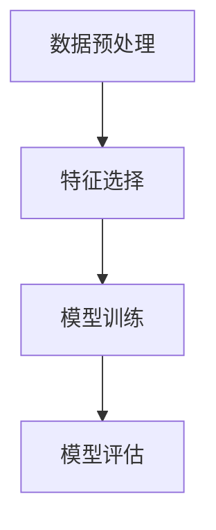
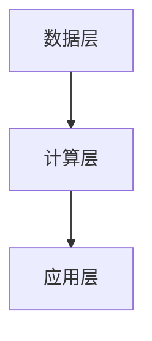
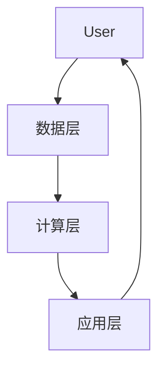

                 

# AI驱动的宏观经济预测模型

## 关键词
AI驱动，宏观经济预测，机器学习，时间序列分析，经济模型

## 摘要
本文深入探讨了如何利用人工智能技术构建宏观经济预测模型。通过结合宏观经济理论与现代机器学习算法，提出了一种基于时间序列分析的预测方法，并详细阐述了模型的构建过程，包括数据预处理、特征工程、算法选择与优化、模型评估等关键环节。同时，本文还通过实际案例展示了模型在经济预测中的应用，并对模型的优缺点进行了分析。最后，本文总结了AI驱动的宏观经济预测模型的优势，并展望了其未来的发展方向。

---

## 第1章: 宏观经济预测与AI驱动的背景介绍

### 1.1 宏观经济预测的重要性
#### 1.1.1 宏观经济预测的定义与作用
宏观经济预测是指通过对经济指标（如GDP、通货膨胀率、失业率等）的分析，预测未来经济走势的过程。它是政府制定货币政策、企业进行战略规划的重要依据。准确的宏观经济预测能够帮助企业规避风险、优化资源配置，同时也有助于政府制定科学的经济政策。

#### 1.1.2 传统宏观经济预测的局限性
传统的宏观经济预测主要依赖于经济理论和统计模型，例如回归分析、计量经济学模型等。然而，这些方法在面对复杂经济环境时往往显得力不从心，主要原因包括：
- 数据维度有限，难以捕捉复杂经济关系；
- 传统模型对非线性关系的处理能力较弱；
- 预测结果的稳定性较差，容易受到模型假设的影响。

#### 1.1.3 AI驱动预测的优势与潜力
人工智能技术的快速发展为宏观经济预测提供了新的可能性。AI驱动的预测模型能够处理海量数据，挖掘复杂的非线性关系，并且可以通过实时数据更新不断优化预测结果。其优势包括：
- 高维度数据处理能力；
- 强大的非线性建模能力；
- 高度可扩展性。

### 1.2 AI驱动宏观经济预测的核心概念
#### 1.2.1 宏观经济预测的基本问题
宏观经济预测的核心问题包括：
- 如何选择合适的经济指标作为输入变量；
- 如何构建能够准确反映经济规律的模型；
- 如何评估模型的预测精度。

#### 1.2.2 AI在宏观经济预测中的应用场景
AI技术在宏观经济预测中的应用场景主要包括：
- 经济趋势预测；
- 经济政策效果评估；
- 风险预警。

#### 1.2.3 宏观经济预测模型的基本结构
宏观经济预测模型的基本结构包括：
1. 数据输入：包括经济指标、社会数据等；
2. 特征工程：对数据进行清洗、标准化和特征提取；
3. 模型训练：选择合适的机器学习算法进行训练；
4. 预测与评估：生成预测结果并评估模型性能。

### 1.3 宏观经济预测模型的组成部分
#### 1.3.1 经济指标的分类与选择
经济指标可以分为以下几类：
- **总量指标**：如GDP、工业增加值等；
- **价格指标**：如CPI、PPI等；
- **就业指标**：如失业率、就业人口等；
- **金融指标**：如利率、汇率等。

选择合适的经济指标是构建宏观经济预测模型的关键。

#### 1.3.2 模型假设与数据来源
模型假设包括：
- 数据的平稳性假设；
- 模型的线性或非线性假设；
- 数据的独立性假设。

数据来源包括政府统计数据、金融市场数据、行业研究报告等。

#### 1.3.3 模型的输入输出关系
模型的输入通常是多维经济指标，输出是预测的经济变量（如GDP增长率）。

---

## 第2章: 宏观经济预测模型的核心概念与联系

### 2.1 宏观经济预测模型的特征工程
#### 2.1.1 数据预处理方法
数据预处理是构建宏观经济预测模型的关键步骤，主要包括：
- 数据清洗：处理缺失值、异常值；
- 数据标准化：将数据归一化到同一范围；
- 数据分解：将时间序列数据分解为趋势、季节性和随机成分。

#### 2.1.2 特征选择策略
特征选择策略包括：
- **基于统计的方法**：如逐步回归；
- **基于机器学习的方法**：如LASSO回归、随机森林特征重要性分析。

#### 2.1.3 时间序列数据的特殊性
时间序列数据具有以下特点：
- **趋势性**：数据呈现长期上升或下降趋势；
- **周期性**：数据呈现一定的周期性波动；
- **季节性**：数据在特定时间段内呈现规律性变化。

---

### 2.2 宏观经济预测模型的假设条件
#### 2.2.1 经济理论的假设
模型假设需要符合经济理论的基本规律，例如供需关系、价格传导机制等。

#### 2.2.2 数据分布的假设
假设数据符合某种分布，例如正态分布，以便选择合适的模型。

#### 2.2.3 模型稳定性的假设
假设模型在一定时间内具有稳定性，即模型参数不会发生突变。

---

### 2.3 宏观经济预测模型的数据预处理
#### 2.3.1 数据清洗与异常值处理
数据清洗是通过去除或修正异常值来提高数据质量。

#### 2.3.2 数据标准化与归一化
数据标准化是将数据缩放到统一的范围内，例如使用Z-score标准化。

#### 2.3.3 时间序列数据的分解方法
时间序列数据可以通过以下方法进行分解：
- **移动平均法**：提取趋势成分；
- **差分法**：消除趋势和季节性；
- **傅里叶变换**：提取周期性成分。

---

## 第3章: 宏观经济预测模型的算法原理

### 3.1 机器学习算法在宏观经济预测中的应用
#### 3.1.1 线性回归
线性回归是一种简单但有效的预测方法，适用于线性关系明显的经济指标。

##### 线性回归的数学模型
$$ y = \beta_0 + \beta_1 x_1 + \beta_2 x_2 + \cdots + \beta_n x_n + \epsilon $$

##### 线性回归的实现步骤
1. 数据预处理；
2. 选择特征；
3. 训练模型；
4. 评估模型。

##### 线性回归的mermaid流程图

#### 3.1.2 时间序列分析
时间序列分析是一种专门处理时间数据的方法，常用模型包括ARIMA、LSTM等。

##### ARIMA模型的数学公式
$$ ARIMA(p, d, q) $$
其中：
- $p$ 是自回归阶数；
- $d$ 是差分阶数；
- $q$ 是移动平均阶数。

##### LSTM网络的数学公式
LSTM通过 gates（门控）来捕捉时间序列中的长期依赖关系。

---

## 第4章: 宏观经济预测模型的系统架构设计

### 4.1 项目背景与目标
本项目旨在构建一个基于AI的宏观经济预测系统，能够实时更新数据并提供预测结果。

### 4.2 系统功能设计
系统功能包括：
- 数据采集与处理；
- 模型训练与优化；
- 预测结果展示。

### 4.3 系统架构设计
系统架构采用分层设计，包括数据层、计算层和应用层。

##### 系统架构的mermaid图

### 4.4 接口设计与交互流程
接口设计包括数据接口和用户接口，交互流程通过序列图展示。

##### 系统交互的mermaid图

---

## 第5章: 宏观经济预测模型的项目实战

### 5.1 项目环境与工具安装
项目需要安装Python、机器学习库（如scikit-learn、TensorFlow）和数据处理工具（如Pandas）。

### 5.2 数据获取与预处理
数据获取可以通过API接口或爬虫实现，预处理步骤包括清洗和标准化。

### 5.3 特征工程与模型训练
选择合适的特征，训练模型并进行调参优化。

### 5.4 模型评估与部署
通过交叉验证评估模型性能，部署模型并提供预测服务。

---

## 第6章: 宏观经济预测模型的案例分析与详细讲解

### 6.1 案例背景与数据介绍
以GDP预测为例，介绍数据来源和特征。

### 6.2 模型实现与结果分析
详细讲解模型的实现过程，包括数据预处理、特征选择、模型训练和结果分析。

### 6.3 模型优化与拓展
通过调整模型参数和尝试不同的算法优化预测效果。

---

## 第7章: 宏观经济预测模型的结论与展望

### 7.1 本章小结
总结本文的主要内容和研究成果。

### 7.2 未来展望
展望AI驱动的宏观经济预测模型的发展方向，包括更复杂算法的应用和实时预测能力的提升。

### 7.3 最佳实践 tips
- 数据质量是模型性能的基础；
- 模型选择需要结合实际业务需求；
- 模型部署需要考虑实时性和可扩展性。

---

## 作者：AI天才研究院/AI Genius Institute & 禅与计算机程序设计艺术 /Zen And The Art of Computer Programming

