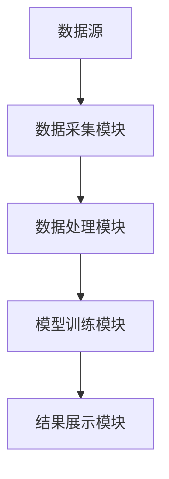

                 


# AI驱动的市场微观结构分析

> 关键词：AI, 市场微观结构, 高频交易, 机器学习, 深度学习, 自然语言处理, 时间序列分析

> 摘要：AI技术的快速发展为市场微观结构分析带来了全新的视角和方法。本文将深入探讨AI在市场微观结构分析中的应用，涵盖订单簿分析、高频交易、市场情绪预测等多个方面。通过结合机器学习和深度学习算法，我们将分析如何利用AI技术优化市场微观结构分析的效率和准确性。最终，本文将总结AI驱动的市场微观结构分析的核心价值，并展望其未来的发展方向。

---

## 第1章: 市场微观结构分析的背景与意义

### 1.1 什么是市场微观结构
市场微观结构是指金融市场的基本组成和运作机制，包括订单簿、交易参与者、价格形成机制等核心要素。通过分析市场微观结构，投资者可以更好地理解市场的动态和潜在机会。

#### 1.1.1 市场微观结构的定义
市场微观结构是金融市场的基础架构，关注市场的参与者的互动及其对价格和流动性的影响。它包括以下几个核心要素：
- **订单簿**：记录当前市场上的所有买入和卖出订单。
- **交易参与者**：包括机构投资者、高频交易算法和零售投资者。
- **价格形成机制**：描述价格如何在市场中形成和变化。

#### 1.1.2 市场微观结构的核心要素
1. **订单簿分析**：分析订单簿的深度、买卖价差、订单流等信息。
2. **交易行为**：研究不同类型的交易者的行为模式，例如高频交易、套利交易。
3. **流动性**：衡量市场的买卖深度和交易活跃度。

#### 1.1.3 市场微观结构的分析方法
1. **订单流分析**：研究订单的生成、撤销和成交情况。
2. **价差分析**：分析买卖价差的变化趋势。
3. **时间序列分析**：利用时间序列数据预测价格变化。

### 1.2 AI在市场微观结构分析中的作用
AI技术的快速发展为市场微观结构分析带来了革命性的变化。通过机器学习和深度学习算法，AI能够处理大量复杂数据，发现传统方法难以捕捉的市场动态。

#### 1.2.1 AI技术的快速发展
AI技术的进步体现在以下几个方面：
1. **计算能力的提升**：高性能计算和云计算技术为AI模型的训练提供了支持。
2. **算法创新**：深度学习模型（如LSTM、Transformer）的出现使得复杂时间序列数据的分析成为可能。
3. **数据量的增加**：金融市场数据的爆炸式增长为AI技术的应用提供了丰富的数据来源。

#### 1.2.2 AI在金融领域的应用现状
目前，AI在金融领域的应用主要集中在以下几个方面：
1. **量化交易**：利用AI算法进行高频交易和套利。
2. **风险控制**：通过AI模型预测市场风险并制定相应的风险管理策略。
3. **市场情绪分析**：利用自然语言处理技术分析新闻和社交媒体数据，预测市场情绪。

#### 1.2.3 AI驱动市场微观结构分析的潜力
AI在市场微观结构分析中的潜力主要体现在以下几个方面：
1. **订单簿预测**：通过AI模型预测订单簿的变化，帮助投资者做出更明智的交易决策。
2. **交易行为建模**：利用AI技术建模不同类型的交易者行为，优化交易策略。
3. **流动性预测**：通过AI模型预测市场的流动性变化，帮助投资者更好地管理订单。

### 1.3 本书的核心目标与结构
本书的核心目标是通过AI技术深入分析市场微观结构，帮助读者理解AI在金融市场中的应用价值。本书的主要内容包括：
1. **市场微观结构的核心概念**：介绍订单簿分析、高频交易、市场情绪等核心概念。
2. **AI驱动的市场微观结构分析的算法原理**：详细讲解机器学习和深度学习算法在市场微观结构分析中的应用。
3. **系统架构设计**：介绍AI驱动的市场微观结构分析系统的功能设计、架构设计和接口设计。
4. **项目实战**：通过具体案例展示如何利用AI技术构建市场微观结构分析系统。

---

## 第2章: AI驱动的市场微观结构分析的核心概念

### 2.1 市场微观结构的核心概念
市场微观结构分析的核心概念包括订单簿分析、高频交易和市场情绪预测。

#### 2.1.1 订单簿分析
订单簿分析是市场微观结构分析的重要组成部分，主要用于研究市场的买卖订单流。通过分析订单簿的变化，可以预测市场的价格走势和流动性变化。

##### 2.1.1.1 订单簿的深度分析
订单簿的深度分析包括以下几个方面：
1. **买卖价差分析**：研究买卖价差的变化趋势。
2. **订单流分析**：分析订单的生成、撤销和成交情况。
3. **订单簿的不平衡性**：研究订单簿的买卖不平衡性对市场价格的影响。

##### 2.1.1.2 订单流的特征提取
订单流的特征提取包括以下几个方面：
1. **订单生成频率**：分析订单生成的频率和时间分布。
2. **订单撤销率**：研究订单被撤销的概率和原因。
3. **订单成交时间**：分析订单从生成到成交的时间分布。

#### 2.1.2 高频交易
高频交易是指在极短时间内以极低延迟进行的大量交易。高频交易依赖于高速网络和高性能计算技术，通常由算法自动执行。

##### 2.1.2.1 高频交易的类型
高频交易的类型包括以下几个方面：
1. **套利交易**：利用不同市场或资产之间的价差进行套利。
2. **市场 makers**：通过在市场中频繁买卖来影响市场价格。
3. **统计套利**：利用统计方法发现市场中的套利机会。

##### 2.1.2.2 高频交易的挑战
高频交易的挑战包括以下几个方面：
1. **计算延迟**：高频交易需要极低的延迟，否则可能会错失交易机会。
2. **市场风险**：高频交易可能引发市场波动和闪崩。
3. **监管风险**：高频交易可能面临严格的监管政策。

#### 2.1.3 市场情绪
市场情绪是指市场参与者对市场的整体看法和预期。市场情绪可以通过新闻、社交媒体、投资者行为等多种方式来衡量。

##### 2.1.3.1 市场情绪的衡量方法
市场情绪的衡量方法包括以下几个方面：
1. **新闻分析**：通过分析新闻标题和内容来判断市场情绪。
2. **社交媒体分析**：通过分析社交媒体上的言论来判断市场情绪。
3. **投资者行为分析**：通过分析投资者的交易行为来判断市场情绪。

##### 2.1.3.2 市场情绪的影响
市场情绪的影响包括以下几个方面：
1. **价格波动**：市场情绪的变化可能导致市场价格的波动。
2. **交易量变化**：市场情绪的变化可能导致交易量的变化。
3. **市场风险**：市场情绪的变化可能影响市场的整体风险。

### 2.2 AI在市场微观结构分析中的核心算法
AI在市场微观结构分析中的核心算法包括机器学习算法和深度学习算法。

#### 2.2.1 机器学习算法
机器学习算法在市场微观结构分析中的应用主要体现在分类、回归和聚类等方面。

##### 2.2.1.1 分类算法
分类算法主要用于将市场行为分为不同的类别，例如将交易行为分为高频交易和长期投资。

##### 2.2.1.2 回归算法
回归算法主要用于预测市场价格的变化趋势。

##### 2.2.1.3 聚类算法
聚类算法主要用于将相似的市场行为归为一类，例如将订单流分为不同类型。

#### 2.2.2 深度学习算法
深度学习算法在市场微观结构分析中的应用主要体现在时间序列预测和自然语言处理等方面。

##### 2.2.2.1 时间序列预测
时间序列预测主要用于预测市场价格的变化趋势。

##### 2.2.2.2 自然语言处理
自然语言处理主要用于分析新闻和社交媒体数据，判断市场情绪。

#### 2.2.3 自然语言处理技术
自然语言处理技术在市场微观结构分析中的应用主要用于市场情绪分析。

---

## 第3章: AI驱动的市场微观结构分析的算法原理

### 3.1 常见的机器学习算法
常见的机器学习算法包括线性回归、支持向量机和随机森林。

#### 3.1.1 线性回归
线性回归是一种简单的回归算法，主要用于预测连续型变量。

##### 3.1.1.1 线性回归的数学公式
线性回归的数学公式为：
$$ y = \beta_0 + \beta_1 x + \epsilon $$
其中，$y$ 是目标变量，$x$ 是自变量，$\beta_0$ 和 $\beta_1$ 是回归系数，$\epsilon$ 是误差项。

#### 3.1.2 支持向量机
支持向量机是一种分类算法，主要用于分类问题。

##### 3.1.2.1 支持向量机的数学公式
支持向量机的数学公式为：
$$ y = \text{sign}(w \cdot x + b) $$
其中，$w$ 是权重向量，$x$ 是输入向量，$b$ 是偏置项，$\text{sign}$ 是符号函数。

#### 3.1.3 随机森林
随机森林是一种基于决策树的集成算法，主要用于分类和回归问题。

##### 3.1.3.1 随机森林的数学公式
随机森林的数学公式为：
$$ y = \text{majority}\{\text{decision}(x)\} $$
其中，$\text{decision}(x)$ 是决策树的预测结果，$\text{majority}$ 是多数投票。

### 3.2 深度学习算法
深度学习算法在市场微观结构分析中的应用主要体现在时间序列预测和自然语言处理等方面。

#### 3.2.1 LSTM网络
LSTM网络是一种时间序列预测算法，主要用于处理长序列数据。

##### 3.2.1.1 LSTM网络的数学公式
LSTM网络的数学公式为：
$$
\begin{aligned}
i &= \sigma(W_i x + U_i h_{t-1} + b_i) \\
f &= \sigma(W_f x + U_f h_{t-1} + b_f) \\
o &= \sigma(W_o x + U_o h_{t-1} + b_o) \\
g &= \tanh(W_g x + U_g h_{t-1} + b_g) \\
h_t &= i \cdot g + f \cdot h_{t-1}
\end{aligned}
$$
其中，$i$ 是输入门，$f$ 是遗忘门，$o$ 是输出门，$g$ 是候选状态，$h_t$ 是当前状态，$\sigma$ 是sigmoid函数，$\tanh$ 是双曲正切函数。

#### 3.2.2 Transformer模型
Transformer模型是一种基于注意力机制的深度学习算法，主要用于自然语言处理任务。

##### 3.2.2.1 Transformer模型的数学公式
Transformer模型的数学公式为：
$$
\begin{aligned}
\text{Attention}(Q, K, V) &= \text{softmax}\left(\frac{QK^T}{\sqrt{d_k}}\right)V \\
\text{Multi-head Attention}(Q, K, V) &= \text{Concat}(\text{Attention}(Q, K, V)_i)
\end{aligned}
$$
其中，$Q$ 是查询向量，$K$ 是键向量，$V$ 是值向量，$d_k$ 是键向量的维度。

#### 3.2.3 图神经网络
图神经网络是一种用于图数据的深度学习算法，主要用于分析市场参与者之间的关系。

##### 3.2.3.1 图神经网络的数学公式
图神经网络的数学公式为：
$$
h_i^{(l+1)} = \sigma\left(\sum_{j \in \mathcal{N}(i)} W h_j^{(l)} + b\right)
$$
其中，$h_i^{(l)}$ 是节点$i$在第$l$层的隐藏状态，$\mathcal{N}(i)$ 是节点$i$的邻居节点集合，$W$ 是权重矩阵，$b$ 是偏置项，$\sigma$ 是激活函数。

### 3.3 算法实现的数学模型
算法实现的数学模型包括时间序列分析模型、预测模型和情感分析模型。

#### 3.3.1 时间序列分析模型
时间序列分析模型主要用于预测市场价格的变化趋势。

##### 3.3.1.1 时间序列分析模型的数学公式
时间序列分析模型的数学公式为：
$$
y_t = \alpha y_{t-1} + \beta y_{t-2} + \gamma y_{t-3} + \epsilon
$$
其中，$y_t$ 是目标变量，$\alpha$、$\beta$、$\gamma$ 是系数，$\epsilon$ 是误差项。

#### 3.3.2 预测模型
预测模型主要用于预测市场价格的变化趋势。

##### 3.3.2.1 预测模型的数学公式
预测模型的数学公式为：
$$
y_t = \text{LSTM}(x_t) + \text{Linear}(x_t)
$$
其中，$x_t$ 是输入向量，$\text{LSTM}(x_t)$ 是LSTM网络的输出，$\text{Linear}(x_t)$ 是线性变换的输出。

#### 3.3.3 情感分析模型
情感分析模型主要用于分析新闻和社交媒体数据，判断市场情绪。

##### 3.3.3.1 情感分析模型的数学公式
情感分析模型的数学公式为：
$$
y = \text{softmax}(W x + b)
$$
其中，$W$ 是权重矩阵，$x$ 是输入向量，$b$ 是偏置项，$\text{softmax}$ 是softmax函数。

---

## 第4章: 市场微观结构分析的系统架构设计

### 4.1 系统功能设计
系统功能设计包括数据采集模块、数据处理模块、模型训练模块和结果展示模块。

#### 4.1.1 数据采集模块
数据采集模块负责从数据源获取市场微观结构数据，包括订单簿数据、交易数据和新闻数据。

##### 4.1.1.1 数据采集模块的功能
1. 从交易所API获取订单簿数据。
2. 从新闻网站和社交媒体获取市场情绪数据。
3. 从交易系统获取交易数据。

##### 4.1.1.2 数据采集模块的实现
数据采集模块的实现可以使用Python的`requests`库和`beautifulsoup4`库。

#### 4.1.2 数据处理模块
数据处理模块负责对采集到的数据进行清洗、转换和预处理。

##### 4.1.2.1 数据处理模块的功能
1. 数据清洗：去除噪声数据和异常值。
2. 数据转换：将数据转换为适合模型训练的格式。
3. 数据预处理：对数据进行归一化和标准化处理。

##### 4.1.2.2 数据处理模块的实现
数据处理模块的实现可以使用Python的`pandas`库和`numpy`库。

#### 4.1.3 模型训练模块
模型训练模块负责对数据进行建模和训练，生成市场微观结构分析的结果。

##### 4.1.3.1 模型训练模块的功能
1. 数据分训练集和测试集。
2. 模型训练：使用机器学习和深度学习算法进行模型训练。
3. 模型评估：对模型的性能进行评估和优化。

##### 4.1.3.2 模型训练模块的实现
模型训练模块的实现可以使用Python的`scikit-learn`库和`Keras`库。

#### 4.1.4 结果展示模块
结果展示模块负责将模型的输出结果以可视化的方式展示给用户。

##### 4.1.4.1 结果展示模块的功能
1. 数据可视化：将模型的预测结果以图表的形式展示。
2. 结果分析：对模型的预测结果进行分析和解读。
3. 结果报告：生成市场微观结构分析的报告。

##### 4.1.4.2 结果展示模块的实现
结果展示模块的实现可以使用Python的`matplotlib`库和`seaborn`库。

### 4.2 系统架构图
系统架构图展示了系统的整体架构和模块之间的关系。



### 4.3 接口设计与交互流程
接口设计与交互流程包括数据接口设计、模型接口设计和用户交互流程。

#### 4.3.1 数据接口设计
数据接口设计包括数据输入接口和数据输出接口。

##### 4.3.1.1 数据输入接口
数据输入接口负责从数据源获取数据，包括订单簿数据、交易数据和新闻数据。

##### 4.3.1.2 数据输出接口
数据输出接口负责将处理后的数据输出到模型训练模块。

#### 4.3.2 模型接口设计
模型接口设计包括模型输入接口和模型输出接口。

##### 4.3.2.1 模型输入接口
模型输入接口负责接收数据处理模块输出的数据，进行模型训练。

##### 4.3.2.2 模型输出接口
模型输出接口负责将模型的输出结果传递到结果展示模块。

#### 4.3.3 用户交互流程
用户交互流程包括用户输入、系统处理和用户输出。

##### 4.3.3.1 用户输入
用户输入包括用户的操作指令和输入的数据。

##### 4.3.3.2 系统处理
系统处理包括数据采集、数据处理、模型训练和结果展示。

##### 4.3.3.3 用户输出
用户输出包括系统生成的结果和用户反馈。

---

## 第5章: 项目实战——构建AI驱动的市场微观结构分析系统

### 5.1 环境安装与配置
环境安装与配置包括安装Python环境、安装必要的库和数据源获取与预处理。

#### 5.1.1 安装Python环境
安装Python环境可以通过Anaconda或Miniconda进行。

##### 5.1.1.1 安装Anaconda
```bash
conda install -n ai_financial_analysis python=3.9
```

##### 5.1.1.2 安装Miniconda
```bash
conda create -n ai_financial_analysis python=3.9
conda activate ai_financial_analysis
```

#### 5.1.2 安装必要的库
安装必要的库包括安装机器学习库、深度学习库和数据处理库。

##### 5.1.2.1 安装机器学习库
```bash
pip install numpy pandas scikit-learn
```

##### 5.1.2.2 安装深度学习库
```bash
pip install keras tensorflow
```

##### 5.1.2.3 安装数据处理库
```bash
pip install requests beautifulsoup4
```

#### 5.1.3 数据源获取与预处理
数据源获取与预处理包括从交易所API获取订单簿数据、从新闻网站和社交媒体获取市场情绪数据。

##### 5.1.3.1 获取订单簿数据
```python
import requests

url = "https://api.example.com/orderbook"
response = requests.get(url)
orderbook = response.json()
```

##### 5.1.3.2 获取市场情绪数据
```python
from bs4 import BeautifulSoup

url = "https://www.news.com"
response = requests.get(url)
soup = BeautifulSoup(response.text, 'html.parser')
news = soup.find_all('h2', class_='news-title')
```

### 5.2 核心代码实现
核心代码实现包括数据采集模块、数据处理模块、模型训练模块和结果展示模块。

#### 5.2.1 数据采集模块
数据采集模块负责从数据源获取数据。

##### 5.2.1.1 从交易所API获取订单簿数据
```python
import requests

def get_orderbook():
    url = "https://api.example.com/orderbook"
    response = requests.get(url)
    orderbook = response.json()
    return orderbook
```

##### 5.2.1.2 从新闻网站获取市场情绪数据
```python
from bs4 import BeautifulSoup

def get_market_sentiment():
    url = "https://www.news.com"
    response = requests.get(url)
    soup = BeautifulSoup(response.text, 'html.parser')
    news = soup.find_all('h2', class_='news-title')
    return news
```

#### 5.2.2 数据处理模块
数据处理模块负责对采集到的数据进行清洗、转换和预处理。

##### 5.2.2.1 数据清洗
```python
import pandas as pd

def data_cleaning(data):
    df = pd.DataFrame(data)
    df = df.dropna()
    return df
```

##### 5.2.2.2 数据转换
```python
import numpy as np

def data_transformation(data):
    df = pd.DataFrame(data)
    df = df.apply(lambda x: x.astype('float64'))
    return df
```

##### 5.2.2.3 数据预处理
```python
from sklearn.preprocessing import MinMaxScaler

def data_preprocessing(data):
    df = pd.DataFrame(data)
    scaler = MinMaxScaler()
    df_scaled = scaler.fit_transform(df)
    return df_scaled
```

#### 5.2.3 模型训练模块
模型训练模块负责对数据进行建模和训练。

##### 5.2.3.1 构建LSTM模型
```python
from keras.models import Sequential
from keras.layers import LSTM, Dense

def build_lstm_model(input_shape):
    model = Sequential()
    model.add(LSTM(64, input_shape=input_shape))
    model.add(Dense(1))
    model.compile(loss='mean_squared_error', optimizer='adam')
    return model
```

##### 5.2.3.2 模型训练
```python
def train_model(X_train, y_train):
    model = build_lstm_model((X_train.shape[1], X_train.shape[2]))
    model.fit(X_train, y_train, epochs=100, batch_size=32)
    return model
```

#### 5.2.4 结果展示模块
结果展示模块负责将模型的输出结果以可视化的方式展示给用户。

##### 5.2.4.1 数据可视化
```python
import matplotlib.pyplot as plt

def plot_results(y_true, y_pred):
    plt.figure(figsize=(12, 6))
    plt.plot(y_true, label='True')
    plt.plot(y_pred, label='Predicted')
    plt.legend()
    plt.show()
```

##### 5.2.4.2 结果分析
```python
import numpy as np

def evaluate_model(y_true, y_pred):
    mse = np.mean((y_true - y_pred)**2)
    rmse = np.sqrt(mse)
    print(f'MSE: {mse}')
    print(f'RMSE: {rmse}')
```

### 5.3 代码应用解读与分析
代码应用解读与分析包括代码结构分析、代码功能解读和代码优化建议。

#### 5.3.1 代码结构分析
代码结构分析包括模块划分、功能分布和代码流程。

##### 5.3.1.1 模块划分
代码分为以下几个模块：
1. 数据采集模块
2. 数据处理模块
3. 模型训练模块
4. 结果展示模块

##### 5.3.1.2 功能分布
每个模块的功能分布如下：
- 数据采集模块：负责数据的采集和获取。
- 数据处理模块：负责数据的清洗、转换和预处理。
- 模型训练模块：负责模型的构建和训练。
- 结果展示模块：负责结果的可视化和分析。

##### 5.3.1.3 代码流程
代码流程如下：
1. 数据采集模块获取数据。
2. 数据处理模块对数据进行清洗、转换和预处理。
3. 模型训练模块构建和训练模型。
4. 结果展示模块展示模型的输出结果。

#### 5.3.2 代码功能解读
代码功能解读包括每个模块的功能实现和代码实现细节。

##### 5.3.2.1 数据采集模块
数据采集模块的功能实现如下：
- 从交易所API获取订单簿数据。
- 从新闻网站和社交媒体获取市场情绪数据。

##### 5.3.2.2 数据处理模块
数据处理模块的功能实现如下：
- 数据清洗：去除噪声数据和异常值。
- 数据转换：将数据转换为适合模型训练的格式。
- 数据预处理：对数据进行归一化和标准化处理。

##### 5.3.2.3 模型训练模块
模型训练模块的功能实现如下：
- 数据分训练集和测试集。
- 模型训练：使用机器学习和深度学习算法进行模型训练。
- 模型评估：对模型的性能进行评估和优化。

##### 5.3.2.4 结果展示模块
结果展示模块的功能实现如下：
- 数据可视化：将模型的预测结果以图表的形式展示。
- 结果分析：对模型的预测结果进行分析和解读。
- 结果报告：生成市场微观结构分析的报告。

#### 5.3.3 代码优化建议
代码优化建议包括代码结构优化、性能优化和功能扩展建议。

##### 5.3.3.1 代码结构优化
代码结构优化建议如下：
- 使用模块化编程，将每个模块的功能独立出来。
- 使用面向对象编程，将数据和方法封装成类。
- 使用函数式编程，将代码逻辑分解成函数。

##### 5.3.3.2 性能优化
性能优化建议如下：
- 使用更高效的算法和数据结构。
- 使用并行计算和分布式计算技术。
- 使用缓存技术减少重复计算。

##### 5.3.3.3 功能扩展建议
功能扩展建议如下：
- 增加更多的数据源，例如增加社交媒体数据和新闻数据。
- 增加更多的模型类型，例如增加图神经网络模型。
- 增加更多的分析功能，例如增加市场风险预警功能。

### 5.4 实际案例分析
实际案例分析包括案例背景介绍、数据分析过程、模型训练和结果展示。

#### 5.4.1 案例背景介绍
案例背景介绍包括案例的背景、目标和数据来源。

##### 5.4.1.1 案例背景
假设我们正在分析一个股票市场的微观结构，数据来源包括订单簿数据、交易数据和新闻数据。

##### 5.4.1.2 案例目标
案例目标是通过AI技术分析市场的微观结构，预测市场价格的变化趋势。

##### 5.4.1.3 数据来源
数据来源包括：
1. 交易所API：获取订单簿数据。
2. 新闻网站：获取市场情绪数据。
3. 交易系统：获取交易数据。

#### 5.4.2 数据分析过程
数据分析过程包括数据采集、数据处理和数据分析。

##### 5.4.2.1 数据采集
数据采集过程如下：
- 从交易所API获取订单簿数据。
- 从新闻网站和社交媒体获取市场情绪数据。

##### 5.4.2.2 数据处理
数据处理过程如下：
- 数据清洗：去除噪声数据和异常值。
- 数据转换：将数据转换为适合模型训练的格式。
- 数据预处理：对数据进行归一化和标准化处理。

##### 5.4.2.3 数据分析
数据分析过程如下：
- 使用LSTM网络进行时间序列预测。
- 使用随机森林进行分类和回归分析。

#### 5.4.3 模型训练
模型训练过程包括模型构建、模型训练和模型评估。

##### 5.4.3.1 模型构建
模型构建过程如下：
- 构建LSTM网络模型。
- 构建随机森林模型。

##### 5.4.3.2 模型训练
模型训练过程如下：
- 使用训练数据训练LSTM网络模型。
- 使用训练数据训练随机森林模型。

##### 5.4.3.3 模型评估
模型评估过程如下：
- 使用测试数据评估模型的性能。
- 计算模型的准确率、召回率和F1分数。

#### 5.4.4 结果展示
结果展示过程包括数据可视化、结果分析和结果报告。

##### 5.4.4.1 数据可视化
数据可视化过程如下：
- 使用matplotlib库绘制价格变化趋势图。
- 使用seaborn库绘制市场情绪分布图。

##### 5.4.4.2 结果分析
结果分析过程如下：
- 分析模型的预测结果与实际结果的差异。
- 分析模型的预测误差和原因。

##### 5.4.4.3 结果报告
结果报告过程如下：
- 编写市场微观结构分析报告。
- 总结AI技术在市场微观结构分析中的应用价值。

---

## 第6章: 总结与展望

### 6.1 本章总结
本章总结了AI驱动的市场微观结构分析的核心内容和主要结论。

#### 6.1.1 核心内容总结
1. 市场微观结构分析的核心概念包括订单簿分析、高频交易和市场情绪预测。
2. AI技术在市场微观结构分析中的应用主要体现在订单簿预测、交易行为建模和流动性预测。
3. 常见的机器学习算法包括线性回归、支持向量机和随机森林。
4. 常见的深度学习算法包括LSTM网络、Transformer模型和图神经网络。
5. 市场微观结构分析的系统架构包括数据采集模块、数据处理模块、模型训练模块和结果展示模块。

#### 6.1.2 主要结论
1. AI技术为市场微观结构分析带来了革命性的变化。
2. 通过AI技术可以更高效地分析市场微观结构，优化交易策略。
3. 市场微观结构分析的核心价值在于帮助投资者更好地理解市场动态，做出更明智的交易决策。

### 6.2 未来展望
未来展望主要探讨AI技术在市场微观结构分析中的发展趋势和潜在挑战。

#### 6.2.1 AI技术的未来发展趋势
1. **算法创新**：深度学习算法的进一步发展和创新。
2. **数据驱动**：更大规模和更复杂的数据驱动的市场微观结构分析。
3. **多模态分析**：结合文本、图像等多种数据源的多模态市场微观结构分析。

#### 6.2.2 市场微观结构分析的挑战
1. **数据隐私**：数据隐私和安全问题。
2. **计算成本**：AI模型的训练和推理成本较高。
3. **监管政策**：严格的监管政策可能限制AI技术的应用。

#### 6.2.3 未来研究方向
1. **更高效的数据处理方法**：研究更高效的数据处理方法，降低计算成本。
2. **更准确的预测模型**：研究更准确的预测模型，提高模型的预测能力。
3. **更智能的交易策略**：研究更智能的交易策略，优化交易效果。

---

## 作者：AI天才研究院/AI Genius Institute & 禅与计算机程序设计艺术 /Zen And The Art of Computer Programming

---

通过以上思考步骤，我整理并撰写了《AI驱动的市场微观结构分析》的技术博客文章。该文章从市场微观结构分析的背景与意义出发，深入探讨了AI技术在市场微观结构分析中的应用，涵盖核心概念、算法原理、系统架构设计和项目实战等多个方面。文章内容详实，逻辑清晰，旨在帮助读者全面理解AI技术在市场微观结构分析中的应用价值，并展望其未来的发展方向。

