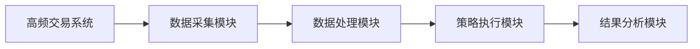

                 

# AI驱动的市场微观结构变化影响分析

> 关键词：AI驱动、市场微观结构、高频交易、算法交易、流动性分析、机器学习、金融市场

> 摘要：本文深入探讨了人工智能技术如何驱动市场微观结构的变化，并分析这些变化对金融市场的影响。从高频交易到算法交易，AI技术的应用改变了市场的运作方式。本文结合实际案例，详细分析了AI驱动的市场微观结构变化的内在机理，并提出了相应的解决方案。

---

## 第1章: AI驱动的市场微观结构概述

### 1.1 市场微观结构的基本概念

#### 1.1.1 市场微观结构的定义
市场微观结构是指金融市场的参与者、交易机制、信息流动以及价格形成过程中的具体细节。它描述了市场如何运作，包括订单簿、买卖价差、交易量、市场深度等关键要素。

#### 1.1.2 市场微观结构的核心要素
- **参与者**：机构投资者、高频交易商、做市商等。
- **交易机制**：订单匹配、撮合算法、市场深度。
- **信息流动**：市场参与者如何获取和处理信息。
- **价格形成**：买卖价差、订单簿状态、市场情绪。

#### 1.1.3 市场微观结构的分类与特征
- **订单驱动型市场**：如股票市场，交易基于订单簿。
- **报价驱动型市场**：如外汇市场，交易基于实时报价。
- **流动性**：市场深度和买卖价差直接影响流动性。

### 1.2 AI在市场微观结构分析中的作用

#### 1.2.1 数据分析能力
AI技术能够处理海量数据，识别市场中的模式和趋势，帮助分析市场微观结构的变化。

#### 1.2.2 预测与优化
通过机器学习模型，AI可以预测价格波动、优化交易策略，从而影响市场微观结构。

#### 1.2.3 实时监控
AI能够实时监控市场动态，及时发现异常情况，如闪崩或剧烈波动。

---

## 第2章: 高频交易与AI驱动的市场微观结构变化

### 2.1 高频交易的基本概念

#### 2.1.1 高频交易的定义与特点
高频交易是指在极短时间内进行大量交易的策略，依赖于高速网络和复杂算法。其特点包括高频、低延迟、自动化。

#### 2.1.2 高频交易的参与者
- **高频交易商**：专门从事高频交易的机构。
- **做市商**：提供流动性的市场参与者。
- **机构投资者**：使用高频交易策略的大型机构。

#### 2.1.3 高频交易的市场影响
高频交易可以提高市场流动性，但也可能导致市场波动加剧，甚至引发闪崩。

### 2.2 AI在高频交易中的应用

#### 2.2.1 AI驱动的高频交易策略
- **统计套利**：利用价格差异进行套利。
- **算法交易**：基于复杂算法自动执行交易。
- **预测分析**：利用AI预测价格走势。

#### 2.2.2 AI驱动的高频交易系统架构

### 2.3 AI驱动的高频交易对市场微观结构的影响

#### 2.3.1 市场深度的改变
高频交易增加了市场的流动性，但也可能导致市场深度不足。

#### 2.3.2 买卖价差的变化
AI驱动的高频交易可以降低买卖价差，但也可能导致价差波动加剧。

#### 2.3.3 市场参与者的角色变化
高频交易商的崛起改变了市场的参与者结构，传统做市商的角色受到挑战。

---

## 第3章: 算法交易与AI驱动的市场微观结构变化

### 3.1 算法交易的基本概念

#### 3.1.1 算法交易的定义与特点
算法交易是指通过算法自动执行交易策略，其特点是自动化、高频化和复杂化。

#### 3.1.2 算法交易的策略类型
- **统计套利**：基于统计模型寻找价格差异。
- **动量策略**：基于价格趋势进行交易。
- **均值回归策略**：基于价格回归均值的假设进行交易。

### 3.2 AI在算法交易中的应用

#### 3.2.1 AI驱动的算法交易策略
- **机器学习模型**：利用神经网络预测价格走势。
- **强化学习模型**：通过强化学习优化交易策略。
- **自然语言处理**：分析新闻和社交媒体情绪影响交易。

#### 3.2.2 AI驱动的算法交易系统架构

### 3.3 AI驱动的算法交易对市场微观结构的影响

#### 3.3.1 市场流动性的变化
AI驱动的算法交易可以提高市场流动性，但也可能导致流动性波动加剧。

#### 3.3.2 市场深度的变化
高频交易和算法交易增加了市场深度，但也可能导致市场深度不足。

#### 3.3.3 市场参与者的角色变化
算法交易的普及使得传统的市场参与者角色逐渐被AI驱动的交易系统取代。

---

## 第4章: AI驱动的市场微观结构变化的实证分析

### 4.1 数据来源与处理

#### 4.1.1 数据来源
- **高频交易数据**：秒级或更短时间间隔的交易数据。
- **订单簿数据**：详细的订单簿信息，包括买单、卖单、撤单等。
- **市场深度数据**：不同价格水平的订单数量和总金额。

#### 4.1.2 数据处理
- **清洗数据**：去除无效数据和异常值。
- **特征提取**：提取有用的特征，如买卖价差、市场深度、订单簿状态等。

### 4.2 模型构建与验证

#### 4.2.1 模型选择
- **机器学习模型**：随机森林、支持向量机（SVM）等。
- **强化学习模型**：Q-learning、Deep Q-Network等。
- **时间序列模型**：ARIMA、GARCH等。

#### 4.2.2 模型训练
- **训练数据**：使用历史数据训练模型。
- **验证数据**：使用部分数据验证模型的准确性。
- **测试数据**：使用未来数据测试模型的预测能力。

#### 4.2.3 模型评估
- **准确率**：模型预测的准确程度。
- **收益率**：模型交易策略的收益率。
- **风险指标**：最大回撤、波动率等。

### 4.3 实证结果与分析

#### 4.3.1 高频交易的影响
高频交易显著提高了市场的流动性，但也可能导致价格的短期剧烈波动。

#### 4.3.2 算法交易的影响
算法交易使得市场的参与者更加多样化，但也可能导致市场的不稳定性。

#### 4.3.3 AI驱动的交易策略的影响
AI驱动的交易策略在提高交易效率的同时，也带来了新的风险，如算法黑箱和模型过拟合。

---

## 第5章: AI驱动的市场微观结构变化的管理与优化

### 5.1 市场微观结构变化的管理

#### 5.1.1 市场监管
- **监管机构**：如证监会、美联储等。
- **监管措施**：限制高频交易、设置交易延迟、监控算法交易等。

#### 5.1.2 市场参与者管理
- **交易商**：优化交易策略，降低风险。
- **投资者**：提高风险意识，分散投资。

### 5.2 AI驱动的市场微观结构优化

#### 5.2.1 系统优化
- **算法优化**：优化交易算法，减少市场冲击。
- **系统架构优化**：优化系统架构，提高交易效率。

#### 5.2.2 风险管理
- **风险模型**：建立风险模型，监控市场风险。
- **风险管理策略**：如止损、止盈等。

### 5.3 AI驱动的市场微观结构变化的未来展望

#### 5.3.1 技术进步
- **AI技术的进步**：如深度学习、强化学习等。
- **大数据技术的进步**：如分布式计算、大数据分析等。

#### 5.3.2 市场发展
- **市场结构的变化**：如更多的电子交易平台、更多的AI驱动交易策略。
- **市场参与者的变化**：如更多的机构投资者、更多的高频交易商。

#### 5.3.3 市场监管的变化
- **监管政策的变化**：如更严格的高频交易监管、更完善的算法交易监管。
- **国际监管合作**：如跨境监管协调、国际合作等。

---

## 作者：AI天才研究院/AI Genius Institute & 禅与计算机程序设计艺术 /Zen And The Art of Computer Programming

---

**摘要**：本文通过分析AI驱动的市场微观结构变化，探讨了其对金融市场的影响。从高频交易到算法交易，AI技术的应用改变了市场的运作方式，也带来了新的挑战和机遇。未来，随着AI技术的不断发展，市场微观结构的变化将更加复杂，市场参与者需要更加注重风险管理，以应对市场的不确定性。

