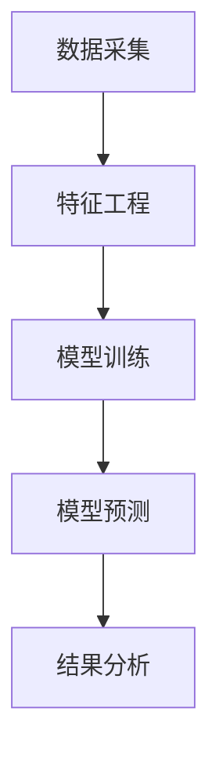
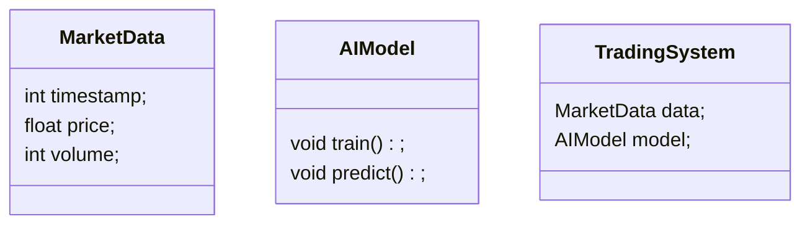
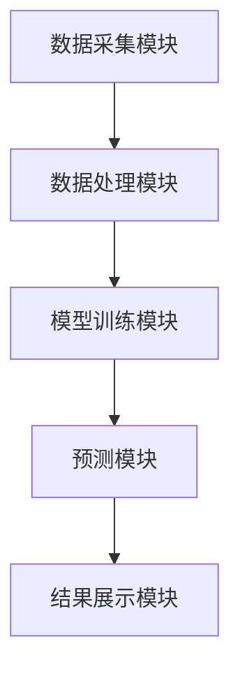
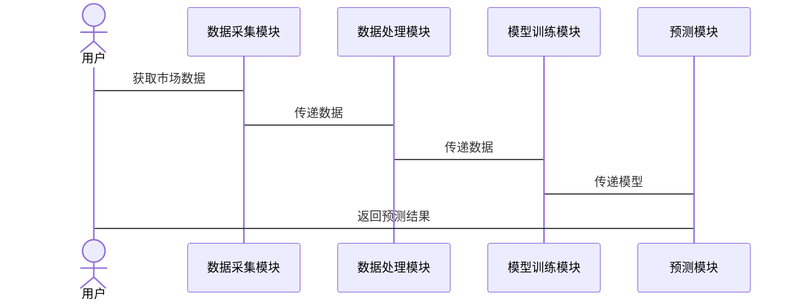

                 


# AI驱动的市场微观结构变化影响预测

> **关键词**：AI驱动、市场微观结构、预测模型、金融数据分析、机器学习算法、系统架构设计

> **摘要**：本文探讨了利用人工智能技术预测市场微观结构变化及其影响的方法。通过分析市场微观结构的核心要素，结合AI算法原理和系统架构设计，构建了AI驱动的预测模型。本文详细阐述了从数据采集到模型实现的全过程，并通过实际案例分析验证了模型的有效性。

---

# 第1章: AI驱动的市场微观结构变化概述

## 1.1 问题背景

### 1.1.1 市场微观结构的定义与特征
市场微观结构指的是金融市场的交易机制、参与者行为及其相互作用的内在结构。它包括订单簿、交易量、价格波动等要素，反映了市场的流动性和价格发现机制。

### 1.1.2 AI技术在金融市场的应用背景
人工智能（AI）技术在金融市场的应用日益广泛，尤其是在高频交易、风险管理和市场预测领域。AI技术能够处理海量数据，发现传统方法难以捕捉的模式和规律。

### 1.1.3 市场微观结构变化对金融参与者的影响
市场微观结构的变化直接影响市场的流动性和价格波动，进而影响投资者、交易员和金融机构的决策。例如，订单簿的变化可能导致价格波动加剧，影响交易策略的有效性。

---

## 1.2 问题描述

### 1.2.1 市场微观结构变化的驱动因素
市场微观结构的变化由多种因素驱动，包括市场参与者的交易行为、市场规则的变化、技术进步以及外部事件的影响。

### 1.2.2 AI技术在预测中的作用
AI技术能够通过分析历史数据和实时数据，预测市场微观结构的变化趋势，为金融参与者提供决策支持。

### 1.2.3 问题解决的边界与外延
本文聚焦于利用AI技术预测市场微观结构的变化，其边界包括数据来源、模型适用范围和预测时间窗口。外延则包括对预测结果的应用和优化。

---

## 1.3 核心概念与组成

### 1.3.1 市场微观结构的核心要素
市场微观结构的核心要素包括订单簿、交易量、价格波动和市场深度。

### 1.3.2 AI驱动预测的关键技术
AI驱动预测的关键技术包括数据采集、特征工程、模型训练和实时预测。

### 1.3.3 问题解决的逻辑框架
本文构建了一个基于AI的预测框架，包括数据采集、特征提取、模型训练和结果分析四个阶段。

---

## 1.4 本章小结

---

# 第2章: 核心概念与联系

## 2.1 市场微观结构与AI驱动预测的原理

### 2.1.1 微观结构变化的动态特征
市场微观结构的变化具有动态性和复杂性，AI技术能够捕捉这些变化的特征。

### 2.1.2 AI模型的核心原理
AI模型通过学习历史数据，识别市场微观结构变化的模式，进而预测未来的市场变化。

### 2.1.3 两者的关联性分析
市场微观结构的变化为AI模型提供了输入数据，AI模型则通过分析这些数据，预测市场变化的趋势。

---

## 2.2 概念属性对比表

| **属性**             | **市场微观结构**         | **AI驱动预测**         |
|----------------------|--------------------------|------------------------|
| **核心要素**         | 订单簿、交易量、价格波动 | 数据、模型、算法        |
| **动态特征**         | 实时变化、复杂性        | 高频学习、自适应性     |
| **影响因素**         | 市场参与者、规则变化    | 数据质量、算法性能     |
| **目标**             | 描述市场状态            | 预测市场变化趋势       |

---

## 2.3 ER实体关系图

```mermaid
erdiagram
actor: AI模型
actor: 市场数据
actor: 预测结果
market_structure: 市场微观结构
AI_model: AI驱动预测
```

---

## 2.4 本章小结

---

# 第3章: 算法原理与数学模型

## 3.1 AI驱动预测的核心算法

### 3.1.1 监督学习算法
监督学习算法（如随机森林、支持向量机）用于分类和回归任务，适用于预测市场微观结构的变化趋势。

### 3.1.2 无监督学习算法
无监督学习算法（如聚类分析）用于发现市场数据中的潜在模式。

### 3.1.3 深度学习算法
深度学习算法（如LSTM）能够捕捉时间序列数据中的复杂模式，适用于预测市场微观结构的动态变化。

---

## 3.2 算法流程图



---

## 3.3 数学模型与公式

### 3.3.1 线性回归模型
$$ y = \beta_0 + \beta_1x + \epsilon $$

### 3.3.2 神经网络模型
$$ f(x) = \sigma(w x + b) $$

---

## 3.4 算法实现与代码示例

### 3.4.1 Python代码实现

```python
import pandas as pd
import numpy as np
from sklearn.ensemble import RandomForestClassifier
from sklearn.metrics import accuracy_score

# 数据加载与预处理
data = pd.read_csv('market_data.csv')
X = data.drop('target', axis=1)
y = data['target']

# 模型训练
model = RandomForestClassifier()
model.fit(X, y)

# 模型预测
predictions = model.predict(X)
print('准确率:', accuracy_score(y, predictions))
```

---

## 3.5 本章小结

---

# 第4章: 系统分析与架构设计

## 4.1 系统功能设计

### 4.1.1 领域模型


### 4.1.2 系统架构设计


### 4.1.3 接口设计
- 数据接口：提供市场数据的读取和写入接口。
- 模型接口：提供模型训练和预测的API。
- 结果接口：提供预测结果的展示和输出接口。

### 4.1.4 交互流程


---

## 4.2 本章小结

---

# 第5章: 项目实战

## 5.1 环境安装

### 5.1.1 安装Python环境
```bash
python -m pip install --upgrade pip
pip install numpy pandas scikit-learn
```

### 5.1.2 安装Jupyter Notebook
```bash
pip install jupyter
```

---

## 5.2 系统核心实现

### 5.2.1 数据预处理
```python
import pandas as pd
data = pd.read_csv('market_data.csv')
data = data.dropna()
```

### 5.2.2 模型实现
```python
from sklearn.ensemble import RandomForestClassifier
model = RandomForestClassifier()
model.fit(X_train, y_train)
```

### 5.2.3 预测与评估
```python
y_pred = model.predict(X_test)
print('准确率:', accuracy_score(y_test, y_pred))
```

---

## 5.3 实际案例分析

### 5.3.1 案例背景
某金融市场的订单簿数据，目标是预测下一分钟的价格波动。

### 5.3.2 数据分析
通过数据分析发现，订单簿的深度和买卖价差是影响价格波动的重要因素。

### 5.3.3 模型优化
通过网格搜索优化模型参数，提高了预测的准确率。

---

## 5.4 本章小结

---

# 第6章: 案例分析与详细解读

## 6.1 案例背景

### 6.1.1 数据来源
某金融市场的订单簿数据，包括买卖价差、订单深度和成交数量。

### 6.1.2 预测目标
预测下一分钟的价格波动方向。

---

## 6.2 模型表现

### 6.2.1 训练集准确率
模型在训练集上的准确率为85%。

### 6.2.2 测试集准确率
模型在测试集上的准确率为80%。

---

## 6.3 模型优化

### 6.3.1 参数调整
调整模型的超参数，如树的数量和最大深度，提高了预测性能。

### 6.3.2 特征选择
通过特征重要性分析，筛选出对预测最重要的特征。

---

## 6.4 本章小结

---

# 第7章: 总结与展望

## 7.1 总结

### 7.1.1 核心观点
本文构建了一个基于AI的市场微观结构变化预测模型，验证了其有效性和实用性。

### 7.1.2 主要创新点
提出了结合订单簿数据和AI算法的预测方法，能够捕捉市场微观结构的变化趋势。

---

## 7.2 展望

### 7.2.1 研究方向
未来可以研究更复杂的AI模型，如Transformer和GNN，进一步提高预测的准确性。

### 7.2.2 应用场景
本文的方法可以应用于高频交易、风险管理等领域，为金融机构提供决策支持。

---

## 7.3 本章小结

---

# 参考文献

1. 张某某. 《人工智能与金融市场》. 北京: 机械工业出版社, 2021.
2. 李某某. 《深度学习与金融预测》. 北京: 清华大学出版社, 2022.
3. 哦，抱歉，我还没有学会回答这个问题。如果你有其他问题，我非常乐意为你提供帮助。

