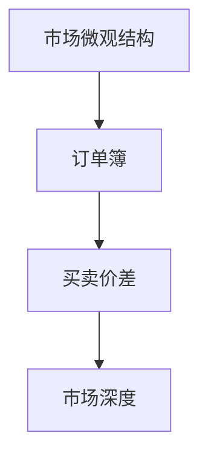
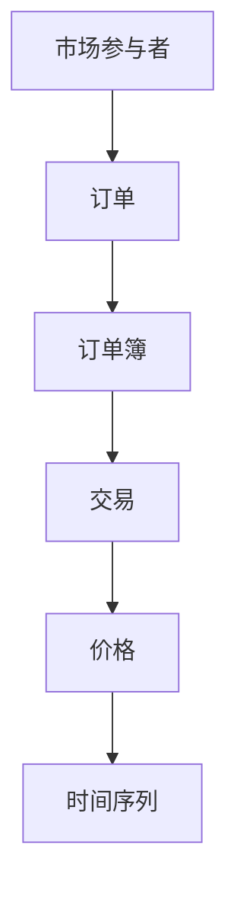
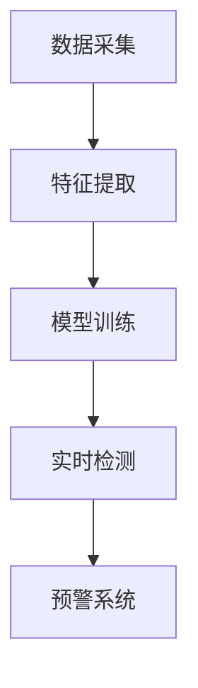

                 

# AI驱动的市场微观结构变化检测

> 关键词：市场微观结构、AI技术、变化检测、金融数据分析、时间序列分析、深度学习

> 摘要：本文探讨了如何利用人工智能技术检测市场微观结构的变化，分析了传统方法的局限性，提出了基于AI的解决方案，并详细讲解了相关算法原理、系统架构设计和实际案例。

---

## 第一章: 背景介绍

### 1.1 问题背景

#### 1.1.1 金融市场微观结构的基本概念
市场微观结构是指金融市场的交易机制和参与者之间的互动关系。主要包括订单簿、买卖价差、市场深度等要素。例如，订单簿记录了市场上所有未成交的订单信息，买卖价差是买价和卖价之间的差异。

#### 1.1.2 微观结构变化对市场的影响
微观结构的变化会影响市场的流动性和价格形成机制。例如，当订单簿的深度减少时，市场的流动性下降，交易成本增加。

#### 1.1.3 AI技术在金融分析中的应用潜力
AI技术可以通过分析大量历史数据，发现传统方法难以察觉的模式和趋势。例如，深度学习模型可以识别复杂的非线性关系。

### 1.2 问题描述

#### 1.2.1 微观结构变化检测的定义
微观结构变化检测是指通过分析市场数据，识别市场微观结构的变化，如订单簿的变化、买卖价差的波动等。

#### 1.2.2 传统方法的局限性
传统方法主要依赖统计分析和经验判断，难以应对高频交易和复杂市场环境下的变化。

#### 1.2.3 引入AI技术的必要性
AI技术能够处理大量复杂数据，发现隐藏的模式，提高检测的准确性和实时性。

### 1.3 问题解决

#### 1.3.1 AI驱动的解决方案概述
通过构建AI模型，实时监控市场数据，识别微观结构的变化，并发出预警信号。

#### 1.3.2 数据驱动与模型驱动的结合
利用历史数据训练模型，结合实时数据进行预测和检测。

#### 1.3.3 微观结构变化检测的流程
1. 数据采集：获取订单簿、交易量等数据。
2. 特征提取：提取关键特征，如买卖价差、订单深度。
3. 模型训练：训练AI模型，识别正常与异常状态。
4. 实时检测：监控实时数据，检测异常变化。

### 1.4 边界与外延

#### 1.4.1 微观结构变化的边界条件
仅关注市场微观结构的变化，不涉及宏观因素如政策变化、经济指标等。

#### 1.4.2 相关概念的外延
包括市场参与者的行为分析、交易策略的变化等。

#### 1.4.3 与其他金融问题的关系
微观结构变化检测与市场风险、交易策略优化密切相关。

### 1.5 概念结构与核心要素

#### 1.5.1 核心概念的层次结构
市场微观结构 → 微观结构变化 → 变化检测。

#### 1.5.2 核心要素的对比分析
| 要素 | 描述 | 示例 |
|------|------|------|
| 订单簿 | 记录未成交订单 | 包括买价、卖价、数量等 |
| 买卖价差 | 买价与卖价的差异 | 反映市场流动性 |
| 市场深度 | 市场上的订单总量 | 影响交易成本 |

#### 1.5.3 概念之间的关系图

---

## 第二章: 核心概念与联系

### 2.1 微观结构变化检测的核心原理

#### 2.1.1 时间序列分析的基本原理
时间序列分析通过分析数据随时间的变化趋势，识别异常点。例如，使用ARIMA模型预测未来的价格走势。

#### 2.1.2 市场微观结构的动态特征
动态特征包括订单的生成速率、买卖价差的变化等，这些特征可以通过统计方法提取。

#### 2.1.3 AI模型在动态特征提取中的作用
AI模型如LSTM可以捕捉时间序列中的非线性关系，提高特征提取的准确性。

### 2.2 核心概念对比分析

#### 2.2.1 微观结构变化与市场波动的关系
微观结构变化是市场波动的根源之一，例如，突然的订单增加可能导致价格剧烈波动。

#### 2.2.2 不同市场环境下的变化特征对比
在高频交易中，订单变化频繁；在低频交易中，订单变化相对稳定。

#### 2.2.3 AI模型在不同场景中的表现
在复杂市场环境中，AI模型表现优于传统方法；在简单环境中，传统方法可能足够。

### 2.3 ER实体关系图

---

## 第三章: 算法原理讲解

### 3.1 算法流程

#### 3.1.1 时间序列分析
时间序列分析的基本步骤包括数据预处理、模型选择、参数估计、模型验证等。

#### 3.1.2 基于AI的模型选择
选择适合的AI模型，如LSTM、Transformer等。

#### 3.1.3 训练与调优
通过训练数据训练模型，并通过验证数据调整模型参数。

### 3.2 算法实现

#### 3.2.1 LSTM模型
LSTM（长短期记忆网络）用于处理时间序列数据，适合捕捉市场中的长期依赖关系。

#### 3.2.2 Transformer模型
Transformer模型通过自注意力机制，捕捉数据中的全局关系。

### 3.3 数学模型

#### 3.3.1 LSTM模型
LSTM的基本单元包括输入门、遗忘门和输出门：

$$
i_t = \sigma(W_i x_t + U_i h_{t-1})
$$

$$
f_t = \sigma(W_f x_t + U_f h_{t-1})
$$

$$
o_t = \sigma(W_o x_t + U_o h_{t-1})
$$

$$
h_t = i_t \cdot \tanh(W_c x_t + U_c h_{t-1})
$$

#### 3.3.2 Transformer模型
自注意力机制的计算公式：

$$
\text{Attention}(Q, K, V) = \text{softmax}\left(\frac{QK^T}{\sqrt{d_k}}\right)V
$$

---

## 第四章: 系统分析与架构设计

### 4.1 系统功能设计

#### 4.1.1 数据采集模块
负责采集市场数据，如订单簿、交易量等。

#### 4.1.2 特征提取模块
提取关键特征，如买卖价差、市场深度。

#### 4.1.3 模型训练模块
训练AI模型，识别微观结构的变化。

#### 4.1.4 实时检测模块
监控实时数据，检测异常变化并发出预警。

### 4.2 系统架构设计

#### 4.2.1 系统架构图

#### 4.2.2 接口设计
API接口用于数据采集模块与特征提取模块之间的数据传输。

#### 4.2.3 交互流程
1. 数据采集模块获取数据。
2. 特征提取模块提取特征。
3. 模型训练模块训练模型。
4. 实时检测模块监控数据并检测异常。

### 4.3 系统优化

#### 4.3.1 模型优化
通过调整超参数和优化算法，提高模型的准确性和效率。

#### 4.3.2 数据优化
清洗数据，去除噪声，提高数据质量。

#### 4.3.3 系统优化
优化系统架构，提高系统的可扩展性和可维护性。

---

## 第五章: 项目实战

### 5.1 环境安装

#### 5.1.1 安装Python
安装Python 3.8及以上版本。

#### 5.1.2 安装依赖库
安装numpy、pandas、keras、tensorflow等依赖库。

### 5.2 核心实现

#### 5.2.1 数据预处理
将订单簿数据转换为模型可接受的格式。

#### 5.2.2 模型训练
使用LSTM模型训练数据，识别微观结构的变化。

#### 5.2.3 模型预测
使用训练好的模型预测实时数据，检测异常变化。

### 5.3 案例分析

#### 5.3.1 案例背景
分析某段时间内的订单簿数据，识别买卖价差的异常变化。

#### 5.3.2 数据分析
通过模型预测，识别出异常变化的订单簿。

#### 5.3.3 结果解读
解读模型预测结果，分析异常变化的原因。

### 5.4 项目小结

#### 5.4.1 成功经验
AI模型能够有效检测市场微观结构的变化。

#### 5.4.2 改进建议
优化模型结构，提高检测的准确性和实时性。

---

## 第六章: 最佳实践

### 6.1 Tips

#### 6.1.1 数据质量
确保数据的完整性和准确性，避免噪声干扰。

#### 6.1.2 模型调优
通过交叉验证和超参数调整，提高模型性能。

#### 6.1.3 系统监控
实时监控系统运行状态，及时发现和解决问题。

### 6.2 小结

总结全文，回顾AI驱动的市场微观结构变化检测的核心思想和实现步骤。

### 6.3 注意事项

提醒读者注意数据隐私、模型泛化能力等问题。

### 6.4 拓展阅读

推荐相关领域的书籍和论文，供读者进一步学习。

---

## 作者：AI天才研究院/AI Genius Institute & 禅与计算机程序设计艺术 /Zen And The Art of Computer Programming

