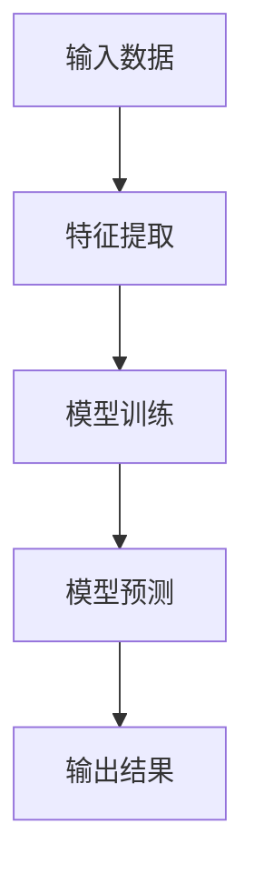
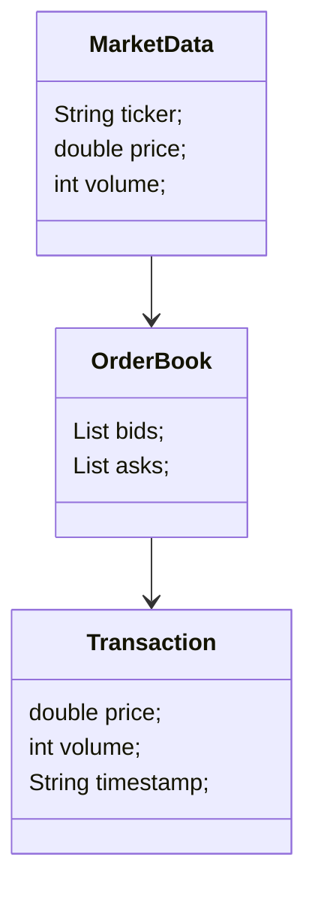
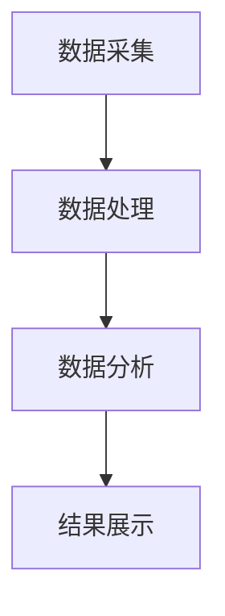
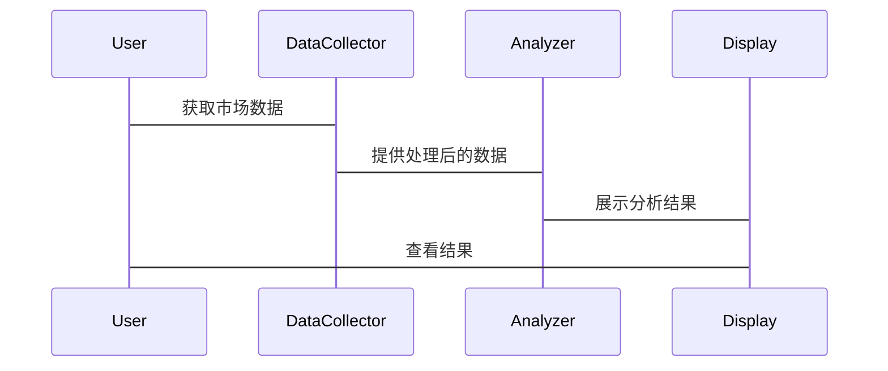

                 


# AI驱动的市场微观结构影响分析

> 关键词：AI，市场微观结构，交易行为，价格预测，机器学习，深度学习，自然语言处理

> 摘要：本文详细探讨了AI技术在市场微观结构分析中的应用，从核心概念到算法实现，再到系统设计和实际案例，全面分析了AI驱动的市场微观结构影响。通过本文，读者可以深入了解如何利用AI技术预测市场行为，优化交易策略，并在实际应用中提升市场分析的精准度和效率。

---

## 第1章: AI驱动的市场微观结构分析背景

### 1.1 市场微观结构概述

#### 1.1.1 市场微观结构的定义
市场微观结构是指市场中各个参与者（如投资者、交易员、机构等）之间的互动关系，以及这些互动如何影响市场价格、交易量和市场流动性。它关注的是市场运作的细节，而非整体市场的宏观经济因素。

#### 1.1.2 AI技术在市场微观结构分析中的作用
AI技术，尤其是机器学习和深度学习，能够从海量数据中提取模式和关系，帮助分析市场微观结构中的复杂现象。例如，AI可以预测交易行为、识别市场情绪、优化交易策略等。

#### 1.1.3 问题背景与研究意义
传统的市场微观结构分析依赖于统计方法和经济学理论，但在面对高频交易、大数据和复杂市场行为时，这些方法显得力不从心。AI技术的引入为市场微观结构分析提供了新的工具和视角，能够更高效地处理数据、发现隐藏的模式，并实时做出决策。

---

### 1.2 AI驱动的市场分析现状

#### 1.2.1 当前市场微观结构分析的主要方法
目前，市场微观结构分析主要依赖以下几种方法：
1. **统计分析**：通过回归分析等方法研究变量之间的关系。
2. **经济学模型**：构建市场参与者的理性行为模型。
3. **大数据分析**：利用大数据技术提取市场行为特征。

#### 1.2.2 AI技术在市场分析中的应用现状
AI技术在市场微观结构分析中的应用主要集中在以下几个方面：
1. **交易行为预测**：利用机器学习模型预测投资者的买卖行为。
2. **价格波动预测**：通过深度学习模型分析历史价格数据，预测未来的价格走势。
3. **市场情绪分析**：利用自然语言处理技术分析新闻、社交媒体等文本数据，评估市场情绪对价格的影响。

#### 1.2.3 研究的创新点与挑战
AI技术的应用为市场微观结构分析带来了新的可能性，但也面临以下挑战：
1. **数据质量**：市场数据的噪声和缺失可能影响模型的准确性。
2. **模型解释性**：复杂的AI模型（如深度学习模型）通常缺乏可解释性，难以被市场参与者理解和信任。
3. **实时性要求**：高频交易需要模型能够实时处理数据并做出决策。

---

## 第2章: 核心概念与联系

### 2.1 市场微观结构的核心要素

#### 2.1.1 市场参与者
市场参与者包括投资者、交易员、机构、做市商等。不同参与者的行为模式和动机不同，对市场价格和流动性的影响也不同。

#### 2.1.2 交易行为
交易行为包括买卖订单的生成、订单簿的动态变化、交易量的变化等。AI技术可以通过分析这些行为模式，预测未来的市场走势。

#### 2.1.3 价格形成机制
价格形成机制是市场微观结构的核心，涉及买卖双方的议价过程、订单匹配机制等。AI技术可以帮助揭示价格形成过程中的隐藏规律。

### 2.2 AI技术的核心原理

#### 2.2.1 机器学习算法
机器学习算法（如随机森林、支持向量机）能够从数据中学习特征，并用于分类、回归等任务。

#### 2.2.2 深度学习模型
深度学习模型（如LSTM、Transformer）能够捕捉数据中的复杂模式，适用于时间序列分析和自然语言处理任务。

#### 2.2.3 自然语言处理技术
自然语言处理技术（如BERT、GPT）能够分析文本数据，提取市场情绪和新闻中的潜在信息。

### 2.3 市场微观结构与AI技术的联系

#### 2.3.1 数据驱动的市场分析
AI技术依赖于大量数据，而市场微观结构分析提供了丰富的数据来源，如订单簿数据、交易数据、新闻数据等。

#### 2.3.2 AI技术在交易行为预测中的应用
通过分析历史交易数据，AI模型可以预测未来的交易行为，帮助投资者制定交易策略。

#### 2.3.3 市场情绪分析与价格波动的关系
市场情绪是影响价格波动的重要因素。AI技术可以通过分析社交媒体、新闻等文本数据，量化市场情绪，并预测价格走势。

---

## 第3章: 市场微观结构影响的数学模型

### 3.1 市场微观结构的数学建模

#### 3.1.1 交易行为模型
交易行为模型可以描述投资者的买卖行为。例如，假设投资者在价格高于某一阈值时卖出，低于某一阈值时买入，可以用以下公式表示：
$$ P_{\text{buy}} = \text{min}(P_t) $$
$$ P_{\text{sell}} = \text{max}(P_t) $$

#### 3.1.2 价格形成模型
价格形成模型可以基于买卖订单的动态变化。例如，订单簿的深度可以用以下公式表示：
$$ D_{\text{bid}} = \sum_{i=1}^{n} b_i $$
$$ D_{\text{ask}} = \sum_{i=1}^{m} a_i $$
其中，$b_i$ 和 $a_i$ 分别代表买方和卖方的订单深度。

#### 3.1.3 市场参与者的互动模型
市场参与者的互动可以通过博弈论模型进行建模。例如，假设两个投资者在市场中博弈，最终价格由他们的策略决定：
$$ P_{\text{final}} = f(P_1, P_2) $$

### 3.2 AI驱动的市场分析算法

#### 3.2.1 机器学习算法
机器学习算法可以通过训练数据学习市场微观结构的特征。例如，使用随机森林模型预测交易量：
$$ \text{Predicted Volume} = \text{RandomForest}(X_{\text{train}}, y_{\text{train}}).predict(X_{\text{test}}) $$

#### 3.2.2 深度学习模型
深度学习模型可以捕捉市场数据中的复杂模式。例如，使用LSTM网络预测价格走势：
$$ \text{LSTM}(X_{\text{train}}, y_{\text{train}}) \rightarrow \text{Predicted Price} $$

#### 3.2.3 自然语言处理模型
自然语言处理模型可以分析文本数据，提取市场情绪。例如，使用情感分析模型评估新闻标题的情绪：
$$ \text{Sentiment Score} = \text{SentimentAnalysis}(X_{\text{news}}) $$

### 3.3 数学公式与模型

#### 3.3.1 交易行为模型公式
$$ P_{\text{buy}} = \text{min}(P_t) $$
$$ P_{\text{sell}} = \text{max}(P_t) $$

#### 3.3.2 价格预测公式
$$ \hat{P}_{t+1} = \text{NN}(P_t, V_t) $$
其中，$\text{NN}$ 表示神经网络模型，$P_t$ 是当前价格，$V_t$ 是当前交易量。

#### 3.3.3 市场情绪分析公式
$$ \text{Sentiment Score} = \frac{\text{Positive Words} - \text{Negative Words}}{\text{Total Words}} $$

---

## 第4章: 算法原理与实现

### 4.1 机器学习算法原理

#### 4.1.1 监督学习
监督学习通过训练数据学习输入与输出之间的关系。例如，使用线性回归模型预测交易量：
$$ y = \beta_0 + \beta_1 x_1 + \beta_2 x_2 + \dots + \beta_n x_n $$

#### 4.1.2 无监督学习
无监督学习用于发现数据中的隐藏结构。例如，使用聚类算法将交易行为分为不同的类别。

#### 4.1.3 强化学习
强化学习通过试错机制优化决策策略。例如，使用Q-learning算法优化交易策略。

### 4.2 深度学习模型实现

#### 4.2.1 神经网络结构
神经网络结构包括输入层、隐藏层和输出层。例如，使用多层感知机（MLP）模型预测价格：
$$ y = f(W_1 x + b_1) $$

#### 4.2.2 卷积神经网络
卷积神经网络（CNN）用于处理图像和序列数据。例如，使用CNN分析K线图：
$$ y = \text{CNN}(X) $$

#### 4.2.3 循环神经网络
循环神经网络（RNN）用于处理序列数据。例如，使用LSTM网络预测价格走势：
$$ y = \text{LSTM}(X) $$

### 4.3 算法实现的代码示例

#### 4.3.1 Python代码实现
```python
import numpy as np
from sklearn.linear_model import LinearRegression

# 示例数据
X = np.array([[1], [2], [3], [4]])
y = np.array([2, 4, 6, 8])

# 训练模型
model = LinearRegression()
model.fit(X, y)

# 预测
new_X = np.array([[5]])
print(model.predict(new_X))  # 输出：[[10]]
```

#### 4.3.2 算法流程图


#### 4.3.3 算法优化与调优
算法优化可以通过调整超参数（如学习率、批量大小）和选择合适的模型结构来实现。例如，使用网格搜索优化线性回归模型：
```python
from sklearn.model_selection import GridSearchCV

param_grid = {'fit_intercept': [True, False], 'normalize': [True, False]}
grid_search = GridSearchCV(LinearRegression(), param_grid, cv=5)
grid_search.fit(X, y)
print(grid_search.best_params_)
```

---

## 第5章: 系统分析与架构设计

### 5.1 系统功能设计

#### 5.1.1 数据采集模块
数据采集模块负责收集市场数据，包括订单数据、交易数据和新闻数据。

#### 5.1.2 数据处理模块
数据处理模块对原始数据进行清洗、转换和特征提取，为后续分析提供高质量的数据。

#### 5.1.3 数据分析模块
数据分析模块利用机器学习和深度学习模型，分析市场微观结构，预测价格走势和交易行为。

#### 5.1.4 结果展示模块
结果展示模块将分析结果以可视化的方式呈现，帮助用户理解和决策。

### 5.2 系统架构设计

#### 5.2.1 领域模型类图


#### 5.2.2 系统架构图


#### 5.2.3 系统接口设计
系统接口设计包括数据接口、算法接口和用户接口。数据接口负责与数据源交互，算法接口负责调用分析模型，用户接口负责展示结果。

#### 5.2.4 系统交互序列图


---

## 第6章: 项目实战

### 6.1 环境安装

#### 6.1.1 安装Python和相关库
安装Python和必要的库（如NumPy、Scikit-learn、TensorFlow、Matplotlib）：
```bash
pip install numpy scikit-learn tensorflow matplotlib
```

#### 6.1.2 安装Jupyter Notebook
安装Jupyter Notebook用于数据可视化和算法实现：
```bash
pip install jupyter
```

### 6.2 系统核心实现源代码

#### 6.2.1 数据处理代码
```python
import pandas as pd
import numpy as np

# 示例数据
data = {
    'timestamp': ['2023-01-01', '2023-01-02', '2023-01-03'],
    'price': [100, 101, 99],
    'volume': [500, 400, 600]
}
df = pd.DataFrame(data)

# 数据清洗
df.dropna()
df['price_diff'] = df['price'].diff()
print(df)
```

#### 6.2.2 算法实现代码
```python
from sklearn.linear_model import LinearRegression
from sklearn.model_selection import train_test_split

# 数据准备
X = df[['price_diff']]
y = df['volume']

# 划分训练集和测试集
X_train, X_test, y_train, y_test = train_test_split(X, y, test_size=0.2, random_state=42)

# 训练模型
model = LinearRegression()
model.fit(X_train, y_train)

# 预测
y_pred = model.predict(X_test)
print('预测结果:', y_pred)
```

#### 6.2.3 可视化代码
```python
import matplotlib.pyplot as plt

# 可视化真实值与预测值
plt.scatter(y_test, y_pred)
plt.xlabel('真实值')
plt.ylabel('预测值')
plt.title('真实值与预测值的关系')
plt.show()
```

### 6.3 代码应用解读与分析

#### 6.3.1 数据处理部分
数据处理部分包括数据清洗和特征提取。通过计算价格差，我们引入了一个新的特征，有助于模型更好地捕捉价格变化的趋势。

#### 6.3.2 算法实现部分
使用线性回归模型进行预测，模型的系数和截距可以通过 `model.coef_` 和 `model.intercept_` 获取。

#### 6.3.3 可视化部分
可视化部分展示了模型的预测结果与真实值的关系。如果点分布在对角线上，说明模型的预测效果较好。

### 6.4 实际案例分析和详细讲解剖析

#### 6.4.1 案例背景
假设我们有一个股票的交易数据，包括时间戳、价格和成交量。我们需要预测未来的价格走势。

#### 6.4.2 数据准备
将数据分为训练集和测试集，训练集用于训练模型，测试集用于验证模型的性能。

#### 6.4.3 模型训练与预测
使用线性回归模型训练数据，并对测试集进行预测。

#### 6.4.4 结果分析
通过可视化结果，评估模型的预测效果。如果模型表现良好，可以进一步优化或尝试其他算法。

### 6.5 项目小结

#### 6.5.1 项目总结
通过本项目，我们了解了如何利用AI技术进行市场微观结构分析，掌握了数据处理、模型训练和结果可视化的基本方法。

#### 6.5.2 项目经验
在实际项目中，需要注意数据的质量和模型的可解释性。同时，实时性要求较高的场景可能需要优化算法或采用分布式计算。

---

## 第7章: 最佳实践、小结、注意事项、拓展阅读

### 7.1 最佳实践

#### 7.1.1 数据处理
- 确保数据的完整性和准确性。
- 对数据进行标准化或归一化处理，以提高模型性能。

#### 7.1.2 模型选择
- 根据问题类型选择合适的算法。
- 对模型进行调优和优化，避免过拟合或欠拟合。

#### 7.1.3 结果分析
- 对模型的预测结果进行可视化和解释。
- 结合业务知识，验证模型的合理性和有效性。

### 7.2 小结

通过本文的介绍和实践，我们了解了AI技术在市场微观结构分析中的应用，掌握了从数据处理到模型实现的全过程。AI技术为市场分析提供了新的工具和视角，但同时也需要我们不断探索和优化。

### 7.3 注意事项

- **数据隐私**：在处理市场数据时，需注意数据隐私和合规性。
- **模型解释性**：复杂的AI模型可能难以被市场参与者理解和信任。
- **实时性要求**：高频交易需要模型具备高实时性。

### 7.4 拓展阅读

- **《机器学习实战》**：深入理解机器学习算法的实现和应用。
- **《深度学习》**：学习深度学习的基本原理和最新进展。
- **《自然语言处理入门》**：掌握自然语言处理技术的基本方法。

---

## 作者：AI天才研究院/AI Genius Institute & 禅与计算机程序设计艺术/Zen And The Art of Computer Programming

---

通过本文，我们详细探讨了AI驱动的市场微观结构影响分析的核心概念、算法实现和实际应用。希望读者能够通过本文的指导，深入了解AI技术在市场分析中的潜力，并在实际工作中加以应用。

