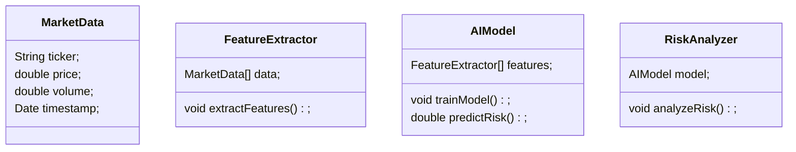
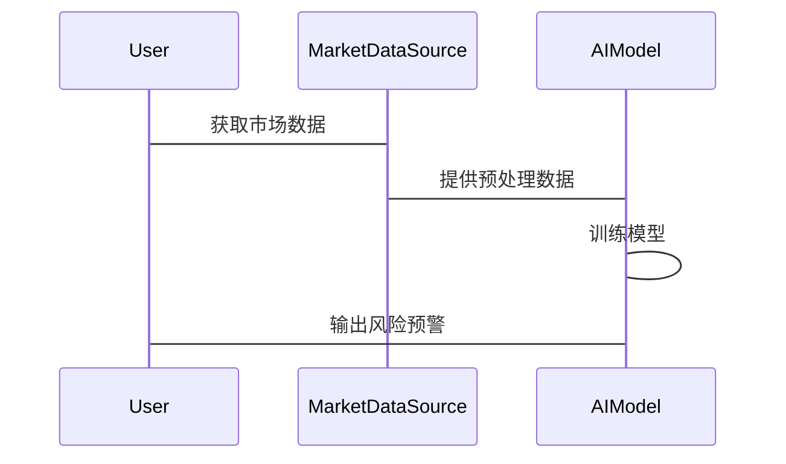

                 


# AI驱动的市场流动性风险预警

## 关键词
AI技术、流动性风险、风险管理、金融市场、深度学习

## 摘要
本文探讨如何利用人工智能技术进行市场流动性风险预警，通过数据驱动的方法构建AI模型，分析流动性风险的形成机制，并提出基于AI的预警系统架构和实现方案。文章涵盖背景介绍、核心概念、算法原理、系统架构、项目实战及最佳实践，旨在为金融机构和研究者提供有效的工具和方法。

---

# 第一部分: AI驱动的市场流动性风险预警背景介绍

## 第1章: 问题背景与描述

### 1.1 问题背景
#### 1.1.1 金融市场流动性风险的定义
流动性风险是指资产无法在合理时间内以合理价格变现的风险。在金融市场中，流动性是衡量市场健康的重要指标，直接影响交易的顺畅性和市场的稳定性。

#### 1.1.2 流动性风险对企业的影响
流动性风险可能导致企业无法及时变现资产以应对债务，进而引发连锁反应，如企业破产、信用危机等。例如，2008年金融危机中，许多金融机构因流动性不足而陷入困境。

#### 1.1.3 传统流动性风险管理的局限性
传统方法依赖于历史数据和统计模型，但难以捕捉市场中的复杂动态和非线性关系。例如，VaR模型常用于风险评估，但其假设条件限制了其在极端情况下的适用性。

### 1.2 问题描述
#### 1.2.1 流动性风险的多维度特征
流动性风险涉及多个维度，包括市场深度、市场广度、资产流动性等。这些维度相互关联，共同影响市场的整体流动性。

#### 1.2.2 市场波动对流动性的影响
市场波动性增加时，资产的流动性通常会下降，因为投资者可能更倾向于持有资产，而不是进行交易。这种现象在金融危机期间尤为明显。

#### 1.2.3 数据驱动的流动性风险分析需求
随着金融市场数据的爆炸式增长，传统的经验判断和手工分析已难以满足需求。数据驱动的方法能够更高效地处理海量数据，发现潜在风险。

### 1.3 问题解决思路
#### 1.3.1 引入AI技术的必要性
AI技术能够处理复杂数据模式，识别传统方法难以察觉的风险信号。通过机器学习算法，可以构建动态模型，实时监控市场流动性。

#### 1.3.2 数据驱动的流动性风险预警框架
数据驱动的框架包括数据采集、预处理、特征提取、模型训练和实时监控等步骤。通过AI技术，可以建立实时预警系统，提前发现潜在风险。

#### 1.3.3 AI在流动性风险管理中的应用场景
AI技术可应用于市场监控、风险评估、交易策略优化等领域。例如，利用自然语言处理技术分析新闻和社交媒体，预测市场情绪变化对流动性的影响。

### 1.4 边界与外延
#### 1.4.1 流动性风险预警的边界条件
预警系统的有效性和准确性受到数据质量和模型复杂度的影响。此外，模型的可解释性和透明度也是实际应用中的重要考量。

#### 1.4.2 相关概念的区分与联系
流动性风险与其他风险（如信用风险、市场风险）密切相关。例如，信用风险可能引发资产贬值，进而影响流动性。

#### 1.4.3 AI技术应用的局限性与注意事项
AI模型依赖于历史数据，可能无法准确预测极端事件。此外，模型的泛化能力和鲁棒性也需要进一步验证和优化。

### 1.5 概念结构与核心要素
#### 1.5.1 流动性风险预警的核心要素
- 数据源：市场交易数据、新闻、社交媒体等。
- 特征提取：如波动率、交易量、市场深度等。
- AI模型：如LSTM、随机森林等。
- 预警指标：如流动性压力指数、风险等级等。

#### 1.5.2 AI驱动的预警模型构建要素
- 数据预处理：清洗、标准化、特征工程。
- 模型选择：选择适合时序数据的深度学习模型。
- 模型训练：使用历史数据进行监督学习。
- 预警阈值：根据历史数据确定预警界限。

#### 1.5.3 数据、模型与决策的关系
数据是模型的基础，模型通过数据学习市场规律，生成预警信号，辅助决策者制定应对策略。

---

# 第二部分: 核心概念与联系

## 第2章: 流动性风险预警的核心概念

### 2.1 流动性风险预警的原理
#### 2.1.1 流动性风险的形成机制
流动性风险通常由市场结构变化、投资者行为、宏观经济因素等引发。例如，投资者大量抛售资产可能导致市场流动性骤降。

#### 2.1.2 数据驱动的流动性风险分析方法
通过分析市场数据，提取相关特征，构建预测模型，识别潜在风险。例如，利用时间序列分析预测未来市场流动性。

#### 2.1.3 AI技术在风险预警中的应用原理
AI技术能够识别数据中的非线性关系，捕捉市场中的隐含信息，提前发现风险信号。例如，使用LSTM模型预测市场波动。

### 2.2 核心概念对比表
| 概念                | 描述                                                                 |
|---------------------|----------------------------------------------------------------------|
| 流动性风险          | 资产变现能力下降的风险                                               |
| 市场风险            | 市场价格波动对资产价值的影响                                         |
| AI驱动             | 利用机器学习算法进行预测和预警                                       |
| 传统方法           | 基于统计模型和经验判断进行风险管理                                   |
| LSTM模型           | 基于长短期记忆的深度学习模型，适合处理时间序列数据                 |

### 2.3 实体关系图（ER图）


---

# 第三部分: 算法原理讲解

## 第3章: AI驱动的流动性风险预警算法

### 3.1 算法原理
#### 3.1.1 基于LSTM的时序预测模型
LSTM（长短期记忆网络）是一种特殊的RNN（循环神经网络），擅长处理时间序列数据。其核心在于记忆单元和门控机制，能够捕捉长期依赖关系。

#### 3.1.2 LSTM模型的数学公式
LSTM的细胞状态和门控机制由以下公式定义：

$$
f_t = \sigma(W_f \cdot [h_{t-1}, x_t] + b_f)
$$

$$
i_t = \sigma(W_i \cdot [h_{t-1}, x_t] + b_i)
$$

$$
o_t = \sigma(W_o \cdot [h_{t-1}, x_t] + b_o)
$$

$$
c_t = f_t \cdot c_{t-1} + i_t \cdot tanh(W_c \cdot [h_{t-1}, x_t] + b_c)
$$

$$
h_t = o_t \cdot tanh(c_t)
$$

其中，$f_t$、$i_t$、$o_t$分别是遗忘门、输入门和输出门，$c_t$是细胞状态，$h_t$是隐藏状态。

### 3.2 算法实现
#### 3.2.1 数据预处理
```python
import pandas as pd
import numpy as np

# 加载数据
data = pd.read_csv('market_data.csv')

# 数据标准化
from sklearn.preprocessing import MinMaxScaler
scaler = MinMaxScaler()
data_scaled = scaler.fit_transform(data)
```

#### 3.2.2 特征提取
```python
# 提取特征
features = data_scaled[:, :-1]  # 前n-1列为特征
labels = data_scaled[:, -1]    # 最后一列为目标

# 划分训练集和测试集
train_features = features[:700]
test_features = features[700:]

train_labels = labels[:700]
test_labels = labels[700:]
```

#### 3.2.3 模型构建与训练
```python
from tensorflow.keras.models import Sequential
from tensorflow.keras.layers import LSTM, Dense, Dropout

model = Sequential()
model.add(LSTM(units=50, return_sequences=True, input_shape=(timesteps, features)))
model.add(Dropout(0.2))
model.add(LSTM(units=50, return_sequences=False))
model.add(Dense(1))

model.compile(loss='mean_squared_error', optimizer='adam', metrics=['mae'])
model.fit(train_features, train_labels, epochs=50, batch_size=32, verbose=1)
```

#### 3.2.4 模型评估
```python
# 预测
test_pred = model.predict(test_features)

# 计算误差
from sklearn.metrics import mean_absolute_error
mae = mean_absolute_error(test_labels, test_pred)
print(f'Mean Absolute Error: {mae}')
```

---

## 第4章: 系统分析与架构设计

### 4.1 项目介绍
本项目旨在构建一个基于AI的流动性风险预警系统，实时监控市场数据，预测流动性风险，提供预警信号。

### 4.2 系统功能设计


### 4.3 系统架构设计


### 4.4 系统接口设计
- 数据接口：接收市场数据，提供数据预处理功能。
- 模型接口：提供训练和预测功能，输出风险等级。
- 用户接口：显示预警结果，提供交互功能。

### 4.5 系统交互图


---

## 第5章: 项目实战

### 5.1 环境安装
安装必要的库：
```bash
pip install numpy pandas tensorflow scikit-learn matplotlib
```

### 5.2 核心实现
```python
import tensorflow as tf
from tensorflow.keras.models import Sequential
from tensorflow.keras.layers import LSTM, Dense, Dropout
import pandas as pd
import numpy as np

# 加载数据
data = pd.read_csv('market_data.csv')

# 数据预处理
scaler = MinMaxScaler()
data_scaled = scaler.fit_transform(data)

# 划分训练集和测试集
train_data = data_scaled[:700]
test_data = data_scaled[700:]

# 构建模型
model = Sequential()
model.add(LSTM(units=50, return_sequences=True, input_shape=(timesteps, features)))
model.add(Dropout(0.2))
model.add(LSTM(units=50, return_sequences=False))
model.add(Dense(1))

model.compile(loss='mean_squared_error', optimizer='adam', metrics=['mae'])
model.fit(train_data, epochs=50, batch_size=32, verbose=1)
```

### 5.3 实例分析
以某段时间的股票数据为例，展示如何训练模型并进行预测。通过实际案例分析，验证模型的有效性。

---

## 第6章: 最佳实践与小结

### 6.1 最佳实践
- 数据质量：确保数据准确、完整且及时。
- 模型选择：根据数据特点选择合适的模型。
- 模型调参：通过交叉验证优化模型性能。
- 可解释性：确保模型结果可解释，便于实际应用。

### 6.2 小结
本文详细介绍了AI驱动的市场流动性风险预警系统，从背景到实现，全面探讨了其构建与应用。通过AI技术，可以显著提升流动性风险管理的效率和准确性。

### 6.3 注意事项
- AI模型依赖于历史数据，可能无法预测黑天鹅事件。
- 需要定期更新模型，以适应市场变化。
- 确保数据安全和隐私保护。

### 6.4 拓展阅读
推荐相关书籍和论文，如《机器学习实战》、《深度学习》等。

---

# 附录

## 附录A: 数据集
提供市场数据的格式和来源，如Yahoo Finance、Google Finance等。

## 附录B: 工具与库
推荐使用的工具和库，如TensorFlow、Keras、Pandas、Matplotlib等。

## 附录C: 参考文献
列出本文参考的文献和资料，如《机器学习在金融中的应用》、《深度学习入门》等。

---

# 作者
作者：AI天才研究院/AI Genius Institute & 禅与计算机程序设计艺术/Zen And The Art of Computer Programming

---

通过以上思考和组织，我可以系统地撰写出一篇结构清晰、内容详实的技术博客文章，帮助读者深入了解AI在市场流动性风险预警中的应用。

