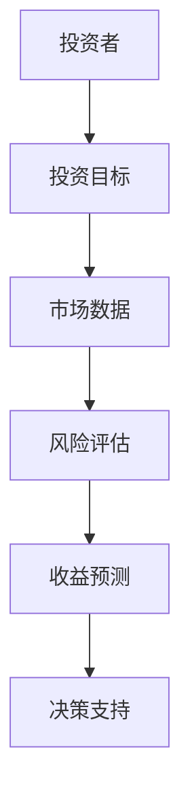
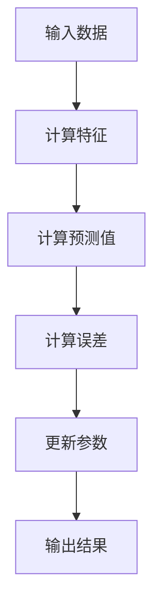
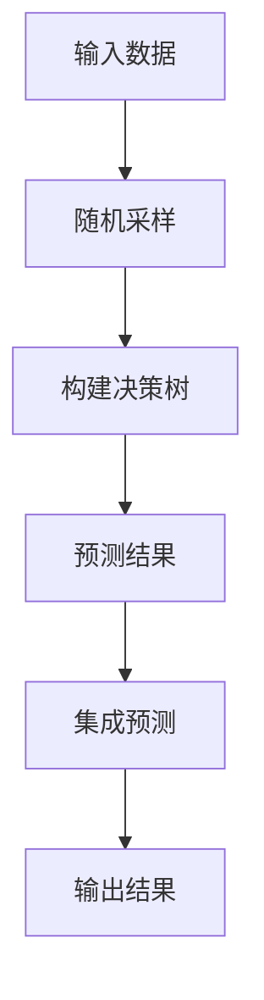
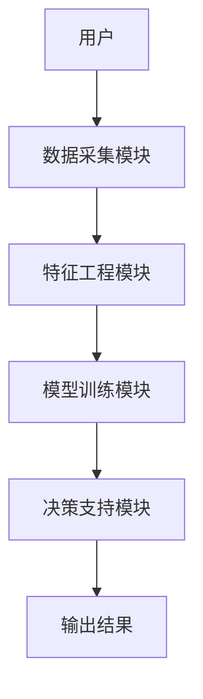
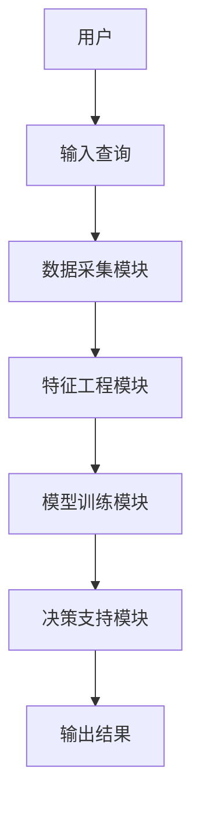

                 


# AI驱动的投资决策支持系统

> 关键词：AI, 投资决策, 机器学习, 深度学习, 数据分析, 系统架构, 投资策略

> 摘要：本文深入探讨了AI驱动的投资决策支持系统的构建与应用，从传统投资决策的局限性出发，结合现代AI技术，详细分析了系统的核心概念、算法原理、系统架构设计以及实际案例。通过理论与实践相结合的方式，展示了如何利用AI技术提升投资决策的效率与准确性。

---

## 第一部分：AI驱动的投资决策支持系统概述

### 第1章：AI驱动的投资决策支持系统背景

#### 1.1 投资决策的传统模式与局限性
投资决策是金融领域的核心活动之一，传统的投资决策主要依赖于人类的经验、市场分析和基础的统计数据。然而，这种方法存在以下局限性：

- **信息过载**：金融市场数据庞大且复杂，投资者难以快速处理和分析。
- **主观性**：决策过程依赖于个人经验，容易受到情绪和偏见的影响。
- **效率低下**：传统方法难以快速响应市场变化，尤其是在高频交易和大数据时代，传统方法显得力不从心。

#### 1.2 AI驱动的投资决策支持系统的定义
AI驱动的投资决策支持系统是一种利用人工智能技术，通过分析海量数据、识别市场趋势、评估风险，并提供智能化投资建议的系统。其核心目标是帮助投资者提高决策效率、降低风险，并实现更高的投资收益。

#### 1.3 本章小结
本章介绍了传统投资决策的局限性，并提出了AI驱动的投资决策支持系统的概念，为后续内容奠定了基础。

---

## 第二部分：AI驱动的投资决策支持系统的核心概念与联系

### 第2章：AI驱动的投资决策支持系统的核心概念

#### 2.1 数据源与数据处理
投资决策支持系统的核心在于数据的处理与分析。以下是主要的数据来源和处理方法：

- **数据源**：
  - 市场数据：包括股票价格、指数、成交量等实时数据。
  - 公司基本面数据：包括财务报表、盈利能力、成长性等。
  - 新闻与舆情数据：通过自然语言处理技术分析新闻和社交媒体情绪。
  - 宏观经济数据：包括GDP、利率、通货膨胀率等宏观经济指标。

- **数据处理**：
  - 数据清洗：去除噪声数据，处理缺失值。
  - 特征工程：提取有用的特征，如动量、相对强弱指数（RSI）等。
  - 数据预处理：标准化、归一化等。

#### 2.2 模型与算法
AI驱动的投资决策支持系统依赖于多种机器学习和深度学习算法。以下是几种常见的算法及其应用场景：

- **线性回归**：用于预测资产的未来价格。
- **随机森林**：用于分类和回归问题，适合处理高维数据。
- **神经网络**：用于复杂的非线性关系建模，如时间序列预测。
- **强化学习**：用于动态策略优化，如交易机器人。

#### 2.3 投资决策支持系统的实体关系
以下是投资决策支持系统的实体关系图：



---

## 第三部分：AI驱动的投资决策支持系统的算法原理

### 第3章：常用算法及其在投资中的应用

#### 3.1 线性回归
线性回归是一种简单但强大的回归算法，适用于线性关系的预测。其数学模型如下：

$$ y = \beta_0 + \beta_1x + \epsilon $$

其中，$y$ 是目标变量，$x$ 是自变量，$\beta_0$ 和 $\beta_1$ 是回归系数，$\epsilon$ 是误差项。

##### 3.1.1 算法流程图


##### 3.1.2 代码实现示例
```python
import numpy as np
from sklearn.linear_model import LinearRegression

# 示例数据
X = np.array([[1], [2], [3], [4]])
y = np.array([2, 4, 6, 8])

# 模型训练
model = LinearRegression()
model.fit(X, y)

# 预测
print(model.predict([[5]]))  # 输出: [[10]]
```

#### 3.2 随机森林
随机森林是一种基于决策树的集成算法，具有较强的抗过拟合能力。其核心思想是通过构建多个决策树并进行投票或平均来提高模型的准确性和稳定性。

##### 3.2.1 算法流程图


---

## 第四部分：AI驱动的投资决策支持系统的系统架构设计

### 第4章：系统架构设计与实现

#### 4.1 系统功能设计
投资决策支持系统的功能模块包括：

- 数据采集模块：从多种数据源获取数据。
- 特征工程模块：对数据进行清洗和特征提取。
- 模型训练模块：训练机器学习模型。
- 决策支持模块：提供投资建议和风险评估。

#### 4.2 系统架构图
以下是系统的架构图：



#### 4.3 接口设计
系统需要与外部数据源（如API）进行交互，以下是接口设计示例：

```python
import requests

# 获取市场数据
response = requests.get('https://api.example.com/market_data')
data = response.json()
```

#### 4.4 交互流程图
以下是系统的交互流程图：



---

## 第五部分：AI驱动的投资决策支持系统的实战案例

### 第5章：项目实战与案例分析

#### 5.1 环境安装
以下是项目所需的环境配置：

```bash
# 安装依赖
pip install numpy pandas scikit-learn matplotlib
```

#### 5.2 核心实现代码
以下是系统的实现代码：

```python
import numpy as np
import pandas as pd
from sklearn.ensemble import RandomForestRegressor
from sklearn.metrics import mean_squared_error

# 数据加载
data = pd.read_csv('stock_data.csv')

# 特征与目标分离
X = data.drop('target', axis=1)
y = data['target']

# 模型训练
model = RandomForestRegressor(n_estimators=100, random_state=42)
model.fit(X, y)

# 预测
predictions = model.predict(X)

# 评估
mse = mean_squared_error(y, predictions)
print(f'Mean Squared Error: {mse}')
```

#### 5.3 案例分析
以下是以股票价格预测为例的案例分析：

- **数据来源**：历史股票价格数据。
- **模型选择**：随机森林回归模型。
- **结果分析**：预测与实际值的对比，评估模型的准确性。

#### 5.4 项目小结
本章通过实际案例展示了AI驱动的投资决策支持系统的实现过程，从数据加载到模型训练，再到结果分析，全面介绍了系统的实战应用。

---

## 第六部分：AI驱动的投资决策支持系统的最佳实践与总结

### 第6章：最佳实践与小结

#### 6.1 最佳实践
- **数据质量**：确保数据的准确性和完整性。
- **模型选择**：根据具体问题选择合适的算法。
- **风险管理**：结合AI模型进行风险评估与控制。

#### 6.2 小结
本文详细介绍了AI驱动的投资决策支持系统的构建与应用，从理论到实践，全面覆盖了系统的各个方面。通过本文的学习，读者可以掌握如何利用AI技术提升投资决策的效率与准确性。

---

## 参考文献与扩展阅读
1. 《机器学习实战》
2. 《深度学习入门：基于Python的理论与实现》
3. 《Python金融数据分析》

---

## 作者：AI天才研究院/AI Genius Institute & 禅与计算机程序设计艺术 /Zen And The Art of Computer Programming

