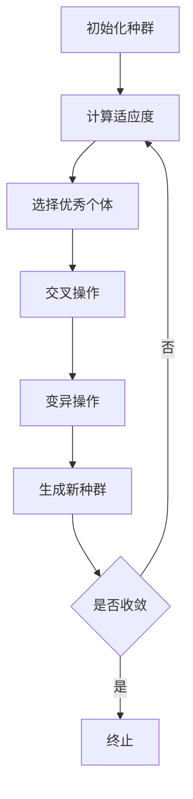
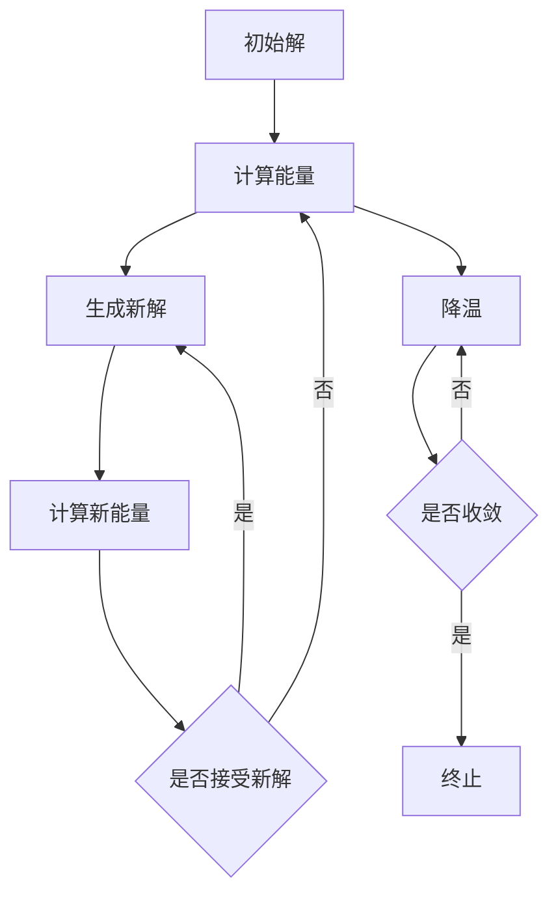
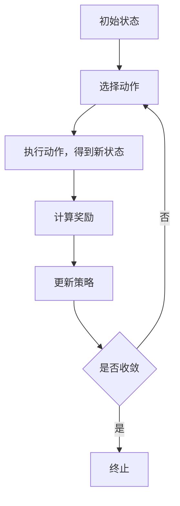
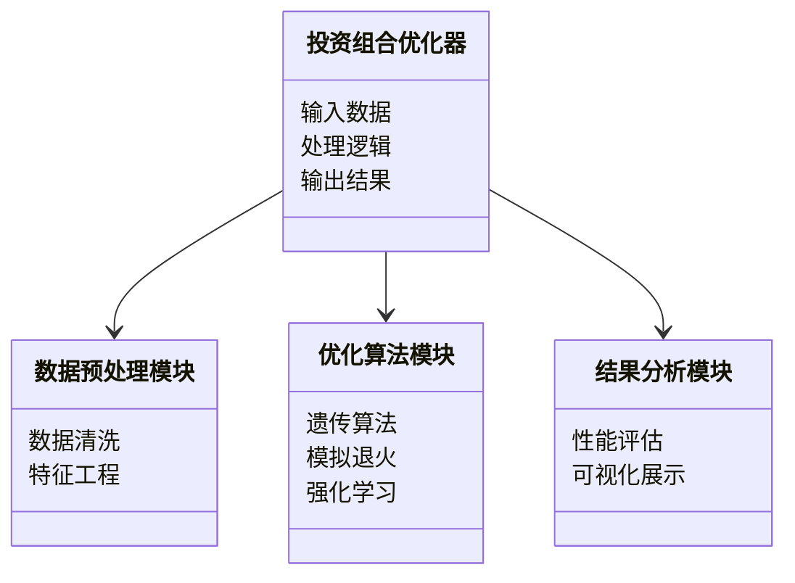
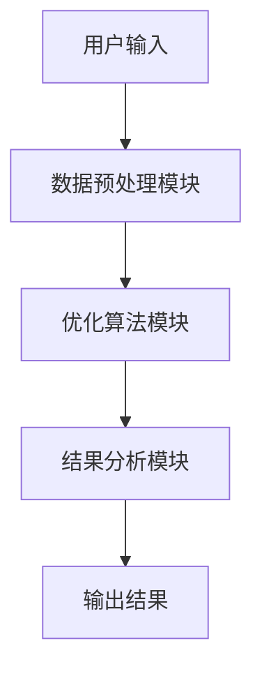
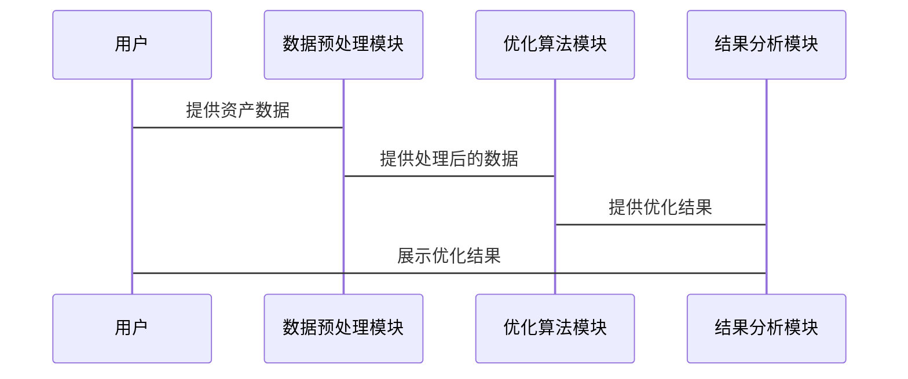

                 


# AI驱动的投资组合优化器

> 关键词：AI驱动、投资组合优化、机器学习、遗传算法、强化学习、金融应用

> 摘要：本文探讨了如何利用人工智能技术优化投资组合，通过分析投资组合优化的核心问题，介绍了AI算法在优化中的应用，并结合实际案例展示了如何构建AI驱动的投资组合优化器。

---

# 第1章: 投资组合优化概述

## 1.1 投资组合优化的基本概念

### 1.1.1 投资组合的定义与目标
投资组合是指将资金分配到不同资产（如股票、债券、基金等）上的配置方式。其目标是在满足特定风险承受能力的前提下，实现收益的最大化。投资组合优化的核心问题是在给定的约束条件下，找到最优的资产配置比例。

$$ \text{目标函数：最大化收益或最小化风险} $$

### 1.1.2 投资组合优化的必要性
传统的投资组合优化方法（如现代投资组合理论，MPT）虽然有效，但在面对复杂市场环境和多样化资产时，其计算复杂度和适用性受到限制。引入人工智能技术可以提高优化效率并适应动态市场变化。

### 1.1.3 传统投资组合优化方法的局限性
- **计算复杂性**：当资产数量较多时，传统的优化方法（如二次规划）计算量巨大。
- **市场动态性**：传统方法假设市场参数不变，而实际市场环境不断变化。
- **非线性问题**：某些优化问题具有非线性特征，传统方法难以处理。

---

## 1.2 AI在金融投资中的应用背景

### 1.2.1 人工智能在金融领域的应用现状
AI技术在金融领域的应用广泛，包括股票预测、风险评估、信用评分和投资组合优化等。AI的优势在于其强大的数据处理能力和自适应性。

### 1.2.2 投资组合优化与AI的结合趋势
随着AI技术的快速发展，越来越多的金融机构开始采用AI驱动的投资组合优化方法。AI能够处理海量数据，并快速调整优化策略以适应市场变化。

### 1.2.3 数据驱动投资的优势与挑战
- **优势**：数据驱动方法能够捕捉市场中的细微趋势，提供更精准的预测。
- **挑战**：数据质量、模型过拟合和计算资源消耗等问题需要克服。

---

## 1.3 投资组合优化的核心问题

### 1.3.1 风险与收益的平衡
投资组合优化的核心目标是在风险和收益之间找到最佳平衡点。AI技术可以通过动态调整资产权重来实现这一目标。

### 1.3.2 资产配置的最优性
资产配置的最优性取决于多种因素，包括市场波动、资产相关性和投资者风险偏好等。AI算法可以通过迭代优化找到最优配置。

### 1.3.3 市场动态的适应性
市场环境不断变化，投资组合需要动态调整以适应新的市场条件。AI技术通过实时数据处理和模型更新，能够快速响应市场变化。

---

## 1.4 本章小结
本章介绍了投资组合优化的基本概念、AI在金融中的应用背景以及优化的核心问题。通过分析传统方法的局限性和AI的优势，为后续章节奠定了理论基础。

---

# 第2章: AI驱动优化的核心概念

## 2.1 现代投资组合理论（MPT）基础

### 2.1.1 均值-方差优化
均值-方差优化是MPT的核心方法，目标是最小化投资组合的方差（风险），同时满足收益目标。

$$ \text{目标函数：} \min \sigma^2 \quad \text{约束条件：} \sum w_i r_i = R $$

其中，$w_i$ 是资产$i$的权重，$r_i$ 是资产$i$的期望收益，$R$ 是目标收益。

### 2.1.2 马科维茨有效前沿
马科维茨有效前沿是指在给定风险水平下，能够提供最高收益的所有投资组合的集合。

### 2.1.3 MPT的局限性
MPT假设资产收益符合正态分布，且市场是有效的。然而，实际市场中存在非线性关系和市场失灵。

---

## 2.2 AI算法在优化中的应用

### 2.2.1 机器学习算法概述
机器学习算法通过训练数据模型，能够发现数据中的隐含规律。在投资组合优化中，常用算法包括支持向量机（SVM）、随机森林（Random Forest）等。

### 2.2.2 遗传算法与模拟退火
- **遗传算法**：模拟生物进化过程，通过选择、交叉和变异生成新的候选解。
- **模拟退火**：通过逐步降低“温度”来避免陷入局部最优。

### 2.2.3 强化学习在投资组合优化中的应用
强化学习通过与环境的交互，学习最优策略。在投资组合优化中，可以用于动态调整资产权重。

---

## 2.3 特征工程与数据预处理

### 2.3.1 数据清洗与标准化
- 数据清洗：去除缺失值和异常值。
- 数据标准化：将数据标准化到同一尺度，便于模型训练。

### 2.3.2 特征选择与降维
- 特征选择：通过统计方法或模型评估，选择重要特征。
- 降维：使用主成分分析（PCA）等方法降低特征维度。

### 2.3.3 时间序列数据的处理
时间序列数据具有自相关性，需要使用专门的处理方法，如ARIMA模型或LSTM网络。

---

## 2.4 优化目标与约束条件

### 2.4.1 最大化收益
最大化投资组合的期望收益。

### 2.4.2 最小化风险
最小化投资组合的波动性或VaR（在险值）。

### 2.4.3 约束条件的处理方法
- 线性约束：如权重之和为1。
- 非线性约束：如最大允许波动率为5%。

---

## 2.5 本章小结
本章介绍了AI算法在投资组合优化中的应用，重点讲解了遗传算法、模拟退火和强化学习等方法，并分析了特征工程和数据预处理的重要性。

---

# 第3章: AI驱动优化的算法原理

## 3.1 遗传算法优化流程

### 3.1.1 初始化种群
随机生成一组初始解（种群）。

### 3.1.2 适应度函数计算
计算每个解的适应度值（即收益与风险的综合指标）。

### 3.1.3 选择与交叉操作
根据适应度值选择优秀个体，并进行交叉操作生成新个体。

### 3.1.4 变异与新种群生成
对新个体进行变异操作，生成新的种群。

### 3.1.5 收敛条件判断
若满足收敛条件（如达到最大迭代次数或适应度值不再变化），则停止优化，否则返回步骤3.1.2。

### 3.1.6 优化流程示意图



---

## 3.2 模拟退火算法原理

### 3.2.1 初始解生成
随机生成一个初始解。

### 3.2.2 计算能量函数
能量函数用于衡量解的优劣，通常为风险或收益的相反数。

### 3.2.3 降温过程与状态转移
根据当前解和新解的能量差，按照一定概率接受或拒绝新解。随着温度的降低，接受差解的概率逐渐减小。

### 3.2.4 收敛条件判断
若满足收敛条件，则停止优化，否则继续降温。

### 3.2.5 优化流程示意图



---

## 3.3 随机森林在特征选择中的应用

### 3.3.1 随机森林算法简介
随机森林是一种基于决策树的集成学习方法，通过随机采样和特征选择提高模型的泛化能力。

### 3.3.2 特征重要性计算
随机森林通过计算每个特征在决策树中的分裂贡献度来评估特征重要性。

### 3.3.3 基于特征重要性的优化策略
在优化过程中，优先选择重要特征，减少无关特征的干扰。

---

## 3.4 强化学习优化流程

### 3.4.1 状态空间定义
状态空间包括当前的投资组合权重和市场指标（如收益、波动率等）。

### 3.4.2 动作空间设计
动作空间包括调整资产权重的决策，如增加股票比例或减少债券比例。

### 3.4.3 奖励函数设计
奖励函数用于衡量优化效果，通常为收益与风险的综合指标。

### 3.4.4 策略优化与更新
通过与环境的交互，不断更新策略参数，最终找到最优投资组合。

### 3.4.5 优化流程示意图



---

## 3.5 算法选择与优化策略

### 3.5.1 不同算法的优缺点对比

| 算法 | 优点 | 缺点 |
|------|------|------|
| 遗传算法 | 全局搜索能力强 | �易陷入局部最优 |
| 模拟退火 | 能够跳出局部最优 | 收敛速度较慢 |
| 强化学习 | 适用于动态环境 | 需要大量数据 |

### 3.5.2 算法适用场景分析
- 遗传算法适用于大规模优化问题。
- 模拟退火适用于容易陷入局部最优的情况。
- 强化学习适用于动态环境下的优化。

### 3.5.3 多算法结合策略
根据具体问题特点，结合多种算法的优点，设计混合优化策略。

---

## 3.6 本章小结
本章详细讲解了遗传算法、模拟退火和强化学习的优化原理，并通过对比分析，提出了算法选择与优化策略。

---

# 第4章: AI驱动投资组合优化器的系统架构设计

## 4.1 问题场景介绍
在实际应用中，投资组合优化器需要处理海量数据，实时调整优化策略，并与交易系统集成。

---

## 4.2 系统功能设计

### 4.2.1 领域模型


### 4.2.2 系统架构设计


### 4.2.3 系统接口设计
- 输入接口：接收资产数据和优化参数。
- 输出接口：输出优化结果。

### 4.2.4 系统交互流程


---

## 4.3 本章小结
本章从系统架构的角度，详细设计了AI驱动投资组合优化器的功能模块和交互流程，为后续的实现提供了指导。

---

# 第5章: 项目实战

## 5.1 环境安装与配置

### 5.1.1 安装Python环境
使用Anaconda或Miniconda安装Python 3.8及以上版本。

### 5.1.2 安装依赖库
安装必要的库，如`numpy`, `pandas`, `scipy`, `sklearn`, `matplotlib`等。

---

## 5.2 核心代码实现

### 5.2.1 数据预处理代码
```python
import pandas as pd
import numpy as np

# 加载数据
data = pd.read_csv('assets.csv')

# 数据清洗
data = data.dropna()

# 特征工程
from sklearn.preprocessing import StandardScaler
scaler = StandardScaler()
data_scaled = scaler.fit_transform(data)
```

### 5.2.2 遗传算法实现
```python
import random

def fitness(w, data):
    # 计算收益与风险
    return - (np.mean(data.dot(w)) / np.std(data.dot(w)))

def genetic_algorithm(data, pop_size=100, generations=100):
    n_assets = data.shape[1]
    pop = np.random.rand(pop_size, n_assets)
    
    for _ in range(generations):
        fitness_val = np.apply_along_axis(fitness, 1, pop, data)
        selected = pop[np.argsort(fitness_val)]
        pop = selected[:int(pop_size/2)] + selected[-int(pop_size/2):]
    
    best = pop[0]
    return best
```

### 5.2.3 强化学习实现
```python
import gym
import numpy as np

class InvestmentEnv(gym.Env):
    def __init__(self, data):
        self.data = data
        self.state = 0
        self.action_space = gym.spaces.Box(-1, 1, (1,))  # 资产权重调整
        self.observation_space = gym.spaces.Box(0, 1, ())  # 当前状态
        
    def step(self, action):
        # 执行动作，更新状态
        new_state = self.state + action
        reward = -np.std(self.data[new_state])  # 奖励为收益波动的相反数
        return new_state, reward, False, {}

    def reset(self):
        self.state = 0
        return self.state
```

---

## 5.3 案例分析与结果解读

### 5.3.1 数据来源与预处理
假设我们有5只股票的数据，经过标准化处理后，用于优化算法。

### 5.3.2 优化结果展示
优化后的投资组合在给定风险水平下，收益最大化。例如，假设优化后股票A的权重为30%，股票B为20%，以此类推。

### 5.3.3 代码实现细节
详细解释代码实现的每一步，包括数据加载、预处理、算法实现和结果分析。

---

## 5.4 本章小结
本章通过实际案例展示了AI驱动投资组合优化器的实现过程，包括数据预处理、算法选择和结果分析。

---

# 第6章: 最佳实践与小结

## 6.1 最佳实践 tips

### 6.1.1 数据质量的重要性
确保数据的完整性和准确性。

### 6.1.2 模型选择的灵活性
根据具体问题选择合适的算法。

### 6.1.3 系统的可扩展性
设计模块化的系统架构，便于后续扩展。

---

## 6.2 小结
本文详细介绍了AI驱动的投资组合优化器，从理论基础到系统设计，再到项目实战，为读者提供了全面的知识体系。

---

## 6.3 注意事项

- **数据依赖性**：AI优化器的效果高度依赖数据质量。
- **模型解释性**：复杂的模型可能难以解释。
- **风险管理**：优化结果需结合实际市场情况，避免过度优化。

---

## 6.4 拓展阅读
推荐相关书籍和论文，帮助读者进一步深入学习。

---

# 作者：AI天才研究院/AI Genius Institute & 禅与计算机程序设计艺术/Zen And The Art of Computer Programming

