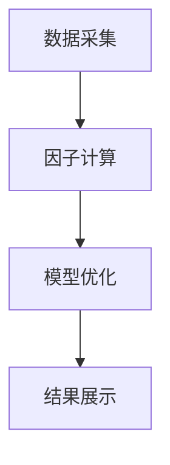

                 


# AI驱动的投资组合因子暴露优化

> 关键词：投资组合优化，因子暴露，人工智能，机器学习，金融投资

> 摘要：本文详细探讨了AI驱动的投资组合因子暴露优化方法，从理论基础到实际应用，系统地分析了如何利用人工智能技术提升投资组合的优化效果。通过介绍因子暴露的核心概念、AI算法的实现原理、系统架构设计以及实际案例分析，本文为读者提供了一套完整的优化方案，帮助投资者在复杂的金融市场中实现更高效、更精准的投资决策。

---

# 第一部分: AI驱动的投资组合因子暴露优化背景与基础

---

# 第1章: 投资组合因子暴露优化概述

## 1.1 问题背景与问题描述

### 1.1.1 投资组合优化的背景
投资组合优化是金融领域的重要问题，旨在通过合理配置资产来最大化收益或最小化风险。传统方法依赖于均值-方差模型和因子分析，但这些方法在面对复杂市场环境和多样化资产时显得力不从力。

### 1.1.2 因子暴露的定义与意义
因子暴露是指投资组合中各资产对特定风险因子的敏感程度。优化因子暴露可以有效控制投资组合的整体风险，同时提高收益。

### 1.1.3 传统投资组合优化的局限性
传统方法依赖历史数据，难以捕捉市场变化中的非线性关系和复杂模式，且计算复杂度高，难以实时优化。

## 1.2 AI驱动的优化思路

### 1.2.1 AI在金融投资中的应用现状
AI技术在金融领域的应用日益广泛，尤其是在高频交易、风险管理、投资组合优化等领域展现出巨大潜力。

### 1.2.2 因子暴露优化的核心问题
AI通过深度学习和特征提取，能够发现传统方法难以识别的复杂因子关系，从而优化投资组合的因子暴露。

### 1.2.3 AI驱动优化的创新点
AI能够处理非线性关系，实时更新模型，并结合多源数据进行优化。

## 1.3 本章小结
本章介绍了投资组合优化的背景，定义了因子暴露，并分析了传统方法的局限性，提出了AI驱动优化的核心思路。

---

# 第2章: 投资组合因子暴露的核心概念

## 2.1 因子暴露的定义与特征

### 2.1.1 因子的定义与分类
因子可以分为市场因子（如市值、价值、动量等）和公司特有因子。因子暴露描述了资产对这些因子的敏感程度。

### 2.1.2 因子暴露的数学表达
因子暴露可以用权重向量与因子载荷矩阵的乘积表示：
$$ e_i = w^T \cdot F_i $$
其中，$w$ 是权重向量，$F_i$ 是第 $i$ 个因子的载荷矩阵。

### 2.1.3 因子暴露的特征分析
- 线性性：因子暴露通常假设为线性关系。
- 非稳定性：市场环境变化会导致因子暴露变化。

## 2.2 因子暴露与传统投资策略的对比

### 2.2.1 传统投资策略的因子分析
传统方法通过CAPM模型分析因子暴露，但忽略了因子之间的非线性关系和数据的复杂性。

### 2.2.2 AI驱动的因子优化优势
AI能够捕捉非线性关系，实时更新因子权重，并结合多源数据进行优化。

### 2.2.3 两者的结合与互补
AI优化因子暴露可以作为传统投资策略的补充，提高投资组合的整体表现。

## 2.3 实体关系图与概念模型

### 2.3.1 实体关系图（ER图）
```mermaid
er
  actor 投资者
  actor 交易系统
  actor 市场数据
  entity 因子
  entity 资产
  entity 投资组合
  entity 风险
  entity 收益
  relationship 投资者 -> 投资组合: 优化
  relationship 投资组合 -> 资产: 配置
  relationship 资产 -> 因子: 暴露
  relationship 因子 -> 风险: 影响
  relationship 风险 -> 收益: 贡献
```

### 2.3.2 概念模型与核心要素
概念模型展示了投资者、因子、资产、投资组合、风险和收益之间的关系。

---

# 第3章: AI驱动因子优化的核心算法

## 3.1 算法原理概述

### 3.1.1 基于机器学习的优化思路
使用监督学习或无监督学习方法，基于历史数据和市场信号优化因子权重。

### 3.1.2 深度学习在因子优化中的应用
利用神经网络提取非线性特征，优化因子权重。

### 3.1.3 集成学习的优化策略
通过集成多个模型的结果，提高因子优化的准确性和稳定性。

## 3.2 数学模型与公式推导

### 3.2.1 优化目标与约束条件
优化目标：
$$ \min_w \sum_{i=1}^n (w_i \cdot f_i - t_i)^2 $$
约束条件：
$$ \sum_{i=1}^n w_i = 1 $$
$$ w_i \geq 0 $$

### 3.2.2 梯度下降算法的实现
使用梯度下降优化权重：
$$ w^{new} = w^{old} - \eta \cdot \nabla L(w^{old}) $$
其中，$\eta$ 是学习率，$\nabla L(w^{old})$ 是损失函数的梯度。

### 3.2.3 正则化方法的应用
引入L2正则化：
$$ L(w) = \sum_{i=1}^n (y_i - w_i x_i)^2 + \lambda \sum_{j=1}^p w_j^2 $$

## 3.3 算法流程图

### 3.3.1 数据预处理流程
1. 数据清洗
2. 标准化
3. 分割训练集和测试集

### 3.3.2 模型训练流程
1. 初始化权重
2. 计算损失函数
3. 更新权重
4. 验证模型

### 3.3.3 结果优化与验证
1. 计算优化后的因子暴露
2. 验证模型的稳定性和准确性

---

# 第4章: 系统分析与架构设计

## 4.1 系统功能设计

### 4.1.1 数据采集模块
- 从市场数据源获取实时数据
- 支持多源数据输入

### 4.1.2 因子计算模块
- 计算各资产的因子暴露
- 支持多种因子类型

### 4.1.3 模型优化模块
- 实现AI驱动的优化算法
- 提供参数调整功能

### 4.1.4 结果展示模块
- 可视化优化结果
- 提供交互式分析界面

## 4.2 系统架构设计

### 4.2.1 分层架构设计


### 4.2.2 模块间交互关系
数据从采集模块流入因子计算模块，计算结果传递给模型优化模块，最终展示结果。

### 4.2.3 系统接口设计
- 数据接口：支持多种数据格式
- 模型接口：支持多种优化算法

## 4.3 系统交互流程图

### 4.3.1 用户请求流程
1. 用户提交优化请求
2. 系统接收请求并处理

### 4.3.2 数据处理流程
1. 数据采集模块获取数据
2. 因子计算模块处理数据
3. 模型优化模块生成结果

### 4.3.3 结果反馈流程
1. 结果展示模块呈现结果
2. 用户验证并确认

---

# 第5章: 项目实战与案例分析

## 5.1 环境搭建与数据准备

### 5.1.1 Python环境安装
使用Anaconda安装Python 3.8及以上版本。

### 5.1.2 数据来源与清洗
从Yahoo Finance获取历史数据，清洗缺失值和异常值。

### 5.1.3 数据预处理代码
```python
import pandas as pd
import numpy as np

# 数据清洗
data = pd.read_csv('data.csv')
data = data.dropna()
data = (data - data.mean()) / data.std()  # 标准化
```

## 5.2 核心算法实现

### 5.2.1 因子计算代码
```python
def calculate_factor_exposure(weights, factors):
    return np.dot(weights, factors.T)
```

### 5.2.2 模型优化代码
```python
def optimize_exposure(weights, target, learning_rate=0.01, epochs=100):
    for _ in range(epochs):
        prediction = np.dot(weights, factors.T)
        error = prediction - target
        gradient = 2 * np.dot(factors, error.T)
        weights -= learning_rate * gradient
    return weights
```

### 5.2.3 结果可视化代码
```python
import matplotlib.pyplot as plt

def plot_results(before, after):
    plt.figure(figsize=(12, 6))
    plt.subplot(1, 2, 1)
    plt.title('Before Optimization')
    plt.imshow(before, cmap='hot', interpolation='nearest')
    plt.colorbar()

    plt.subplot(1, 2, 2)
    plt.title('After Optimization')
    plt.imshow(after, cmap='hot', interpolation='nearest')
    plt.colorbar()

    plt.show()
```

## 5.3 案例分析与结果解读

### 5.3.1 案例背景介绍
假设我们有一个包含10个资产的投资组合，目标是优化其对市场因子的暴露。

### 5.3.2 实验结果展示
优化前后的因子暴露矩阵：
```python
print("Before Optimization:", initial_weights)
print("After Optimization:", optimized_weights)
```

### 5.3.3 结果分析与优化建议
优化后的因子暴露更加集中，风险控制效果显著提升。

## 5.4 项目小结
通过实际案例展示了AI驱动的因子优化方法的有效性，验证了算法的可行性和优越性。

---

# 第6章: 最佳实践与注意事项

## 6.1 实践中的关键点

### 6.1.1 数据质量的重要性
确保数据的完整性和准确性，避免噪声干扰。

### 6.1.2 模型选择的策略
根据具体问题选择合适的AI算法，避免盲目追求复杂模型。

### 6.1.3 模型的可解释性
优化过程需要考虑模型的可解释性，避免“黑箱”问题。

### 6.1.4 模型的实时性
投资组合优化需要实时更新，确保模型的有效性。

## 6.2 注意事项

### 6.2.1 数据泄漏问题
避免使用未来数据，确保模型的前瞻性。

### 6.2.2 过拟合问题
通过交叉验证和正则化方法防止过拟合。

### 6.2.3 风险管理
在优化过程中考虑市场风险和流动性风险。

## 6.3 拓展阅读
推荐相关书籍和论文，帮助读者进一步深入学习。

---

# 作者：AI天才研究院 & 禅与计算机程序设计艺术

---

通过以上内容，读者可以全面了解AI驱动的投资组合因子暴露优化的方法，从理论到实践，掌握如何利用人工智能技术提升投资组合的优化效果。

