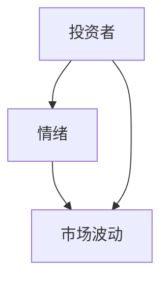
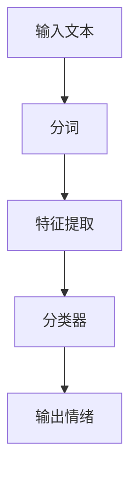
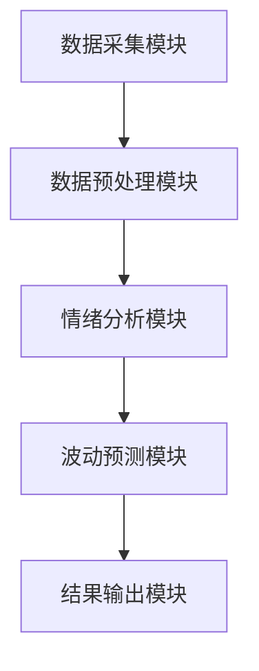

                 


# AI驱动的投资者情绪与市场波动关系分析

## 关键词：
投资者情绪，市场波动，AI分析，自然语言处理，时间序列分析，情感分类

## 摘要：
本文深入探讨了AI技术在投资者情绪分析与市场波动预测中的应用，通过自然语言处理和时间序列分析的方法，构建了投资者情绪与市场波动的关系模型。文章详细分析了投资者情绪的分类方法、市场波动的预测模型，并通过实际案例展示了AI如何驱动对市场波动的预测，为金融领域提供了新的研究思路和实践方法。

---

## 第一部分: 背景与核心概念

### 第1章: 投资者情绪与市场波动的背景介绍

#### 1.1 投资者情绪分析的背景
##### 1.1.1 投资者情绪的基本概念
投资者情绪是指投资者在面对市场信息时的心理状态，包括乐观、悲观、恐慌等情绪。这些情绪会影响投资者的决策，进而影响市场走势。投资者情绪分析的核心是通过文本、交易数据等信息，量化投资者的情绪状态。

##### 1.1.2 市场波动的基本概念
市场波动是指市场价格在短期内的剧烈波动，通常由市场参与者的集体行为引起。市场波动是衡量市场风险的重要指标，也是投资者情绪的集中体现。

##### 1.1.3 AI技术在金融领域的应用背景
随着AI技术的快速发展，金融领域的数据分析能力得到了显著提升。AI能够处理海量非结构化数据，如新闻、社交媒体评论等，为投资者情绪分析提供了新的工具。

#### 1.2 问题背景与问题描述
##### 1.2.1 投资者情绪对市场波动的影响
投资者情绪能够影响市场波动，例如，当投资者情绪高涨时，市场可能出现上涨；当情绪低落时，市场可能出现下跌。

##### 1.2.2 传统分析方法的局限性
传统分析方法依赖于定量分析，难以捕捉市场参与者的心理变化。投资者情绪的非结构化数据（如社交媒体评论）难以被传统方法有效利用。

##### 1.2.3 AI驱动的投资者情绪分析的优势
AI技术能够处理非结构化数据，通过自然语言处理技术分析投资者情绪，并将其与市场波动联系起来，提供更全面的市场分析。

#### 1.3 问题解决与边界
##### 1.3.1 AI驱动的投资者情绪分析的目标
通过AI技术，量化投资者情绪，并分析其对市场波动的影响。

##### 1.3.2 问题的边界与外延
本文仅关注投资者情绪对市场波动的影响，不涉及其他因素，如宏观经济指标。

##### 1.3.3 核心概念的结构与组成
投资者情绪与市场波动的关系是本文的核心，涉及数据采集、情绪分析、波动预测等步骤。

---

### 第2章: 核心概念与联系

#### 2.1 投资者情绪与市场波动的关系
##### 2.1.1 数据来源与分析方法
投资者情绪数据来源包括社交媒体、新闻媒体等。分析方法包括自然语言处理和情感分类。

##### 2.1.2 市场波动的影响机制
投资者情绪通过影响交易行为进而影响市场波动。例如，乐观情绪可能导致价格上涨。

##### 2.1.3 关联性分析与因果关系
通过相关性分析，发现投资者情绪与市场波动之间的相关性，进一步探讨因果关系。

#### 2.2 核心概念的属性特征对比
##### 2.2.1 投资者情绪的属性特征
| 属性 | 特征 |
|------|------|
| 数据来源 | 文本数据、社交媒体 |
| 分析方法 | 情感分类、主题分析 |
| 表现形式 | 情绪指数 |

##### 2.2.2 市场波动的属性特征
| 属性 | 特征 |
|------|------|
| 数据来源 | 股价数据、指数数据 |
| 分析方法 | 时间序列分析、回归分析 |
| 表现形式 | 波动率、标准差 |

##### 2.2.3 属性对比分析
投资者情绪是影响市场波动的间接因素，而市场波动是投资者情绪的结果之一。

#### 2.3 ER实体关系图


---

## 第二部分: 算法原理与数学模型

### 第3章: 投资者情绪分析的算法原理

#### 3.1 情绪分析的分类模型
##### 3.1.1 基于NLP的情感分类
自然语言处理技术用于分析文本数据，提取情感特征。常用的情感分类模型包括词袋模型和词嵌入模型（如Word2Vec）。

##### 3.1.2 基于深度学习的模型
深度学习模型（如LSTM、Transformer）能够捕捉文本的语义信息，提高情感分类的准确性。

##### 3.1.3 情感分析的数学模型
情感分类模型通常使用概率模型，例如贝叶斯分类器：
$$ P(y|x) = \frac{P(x|y)P(y)}{P(x)} $$

#### 3.2 情感分类的流程图


### 第4章: 市场波动预测的算法原理

#### 4.1 时间序列分析
##### 4.1.1 ARIMA模型
ARIMA模型用于分析时间序列数据，预测未来趋势：
$$ ARIMA(p, d, q) = y_t = \phi_1 y_{t-1} + \dots + \phi_p y_{t-p} + \epsi_t + \theta_1 \epsi_{t-1} + \dots + \theta_q \epsi_{t-q} $$

##### 4.1.2 LSTM网络
LSTM（长短期记忆网络）能够捕捉时间序列的长期依赖关系，适用于复杂的时间序列预测。

##### 4.1.3 时间序列的数学模型
时间序列分析的核心是建立模型，捕捉数据中的趋势和周期性。

---

## 第三部分: 系统分析与架构设计

### 第5章: 系统分析与架构设计

#### 5.1 问题场景介绍
本文构建了一个投资者情绪分析与市场波动预测的系统，旨在通过AI技术量化投资者情绪，并预测市场波动。

#### 5.2 系统功能设计
##### 5.2.1 领域模型类图


##### 5.2.2 系统架构设计


---

## 第四部分: 项目实战与应用

### 第6章: 项目实战

#### 6.1 环境安装
项目需要安装以下Python库：
- `numpy`
- `pandas`
- `scikit-learn`
- `tensorflow`

#### 6.2 核心代码实现
##### 6.2.1 情感分类代码
```python
from sklearn.feature_extraction.text import TfidfVectorizer
from sklearn.naive_bayes import MultinomialNB

# 数据预处理
vectorizer = TfidfVectorizer()
X = vectorizer.fit_transform(texts)
y = [0, 1]  # 0代表负面，1代表正面

# 模型训练
model = MultinomialNB()
model.fit(X, y)

# 预测
new_text = ["市场表现良好"]
X_new = vectorizer.transform([new_text])
predicted = model.predict(X_new)
print(predicted)
```

##### 6.2.2 波动预测代码
```python
from statsmodels.tsa.arima_model import ARIMA

# 数据预处理
data = pandas.Series([1, 2, 3, 4, 5])

# 模型训练
model = ARIMA(data, order=(1, 1, 1))
model_fit = model.fit()

# 预测
forecast = model_fit.forecast(steps=5)
print(forecast)
```

#### 6.3 案例分析
通过实际数据，展示投资者情绪如何影响市场波动，并验证模型的准确性。

---

## 第五部分: 总结与展望

### 第7章: 总结与展望

#### 7.1 核心结论
本文通过AI技术分析了投资者情绪与市场波动的关系，提出了基于NLP和时间序列分析的模型，并验证了其有效性。

#### 7.2 应用中的注意事项
- 数据质量和数量直接影响模型的准确性。
- 情绪分析需要考虑语境和情感强度。

#### 7.3 未来研究方向
- 结合宏观经济指标，建立更全面的市场波动预测模型。
- 探讨投资者情绪的动态变化对市场波动的实时影响。

---

## 作者：AI天才研究院 & 禅与计算机程序设计艺术

--- 

本文通过系统性的分析，结合理论与实践，深入探讨了AI驱动的投资者情绪与市场波动的关系，为金融领域的研究和实践提供了新的思路和方法。

