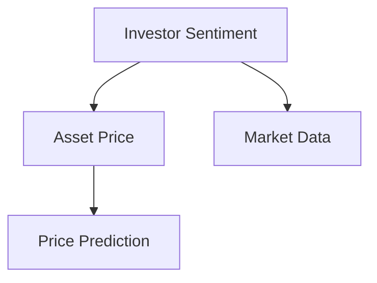

                 

# AI驱动的投资者情绪与资产价格关系分析

## 关键词：
- AI技术
- 投资者情绪
- 资产价格
- 情感分析
- 时间序列预测

## 摘要：
本文探讨了AI技术在投资者情绪分析与资产价格预测中的应用，通过详细分析投资者情绪的核心概念、AI算法的原理、系统架构设计及实际案例，展示了如何利用AI技术捕捉投资者情绪变化并预测资产价格走势，为金融投资提供科学依据。

---

# 第一部分: AI驱动的投资者情绪与资产价格关系分析背景与概念

## 第1章: 投资者情绪的基本概念

### 1.1 投资者情绪的定义

#### 1.1.1 投资者情绪的内涵
投资者情绪是指投资者在金融市场中对资产价格变化的主观态度和心理状态，包括乐观、悲观、贪婪和恐慌等情绪。这些情绪通常由市场波动、经济数据、新闻事件等因素引发。

#### 1.1.2 投资者情绪的分类
投资者情绪可以分为以下几类：
- **乐观情绪**：投资者对市场前景持积极态度，倾向于买入资产。
- **悲观情绪**：投资者对市场前景持消极态度，倾向于卖出资产。
- **贪婪情绪**：投资者在市场上涨时急于买入，追求短期收益。
- **恐慌情绪**：投资者在市场下跌时急于卖出，避免进一步损失。

#### 1.1.3 投资者情绪的影响因素
投资者情绪受多种因素影响，包括：
- **市场表现**：近期的市场涨跌会影响投资者情绪。
- **经济数据**：GDP、就业数据等宏观经济指标会影响投资者情绪。
- **新闻事件**：突发事件（如战争、政策变化）会影响投资者情绪。
- **心理因素**：投资者的个人心理特质也会影响其情绪。

### 1.2 资产价格的影响因素

#### 1.2.1 市场供需关系
资产价格受市场供需关系影响，供不应求时价格上涨，供过于求时价格下跌。

#### 1.2.2 宏观经济指标
宏观经济指标如GDP增长率、通货膨胀率、利率等也会对资产价格产生影响。

#### 1.2.3 市场情绪对资产价格的影响
投资者情绪通过影响市场供需关系间接影响资产价格。例如，乐观情绪会导致更多买入，推高资产价格；悲观情绪会导致更多卖出，压低资产价格。

### 1.3 AI在投资者情绪分析中的应用现状

#### 1.3.1 传统投资者情绪分析方法
传统方法主要包括问卷调查、访谈和观察等，但这些方法主观性强、效率低。

#### 1.3.2 AI技术在投资者情绪分析中的优势
AI技术可以通过自然语言处理（NLP）技术分析社交媒体、新闻和评论，快速捕捉投资者情绪。

#### 1.3.3 当前应用中的主要挑战
AI技术在投资者情绪分析中的挑战包括数据质量、模型准确性和实时性等问题。

## 第2章: AI驱动的投资者情绪分析与资产价格预测的背景

### 2.1 问题背景

#### 2.1.1 投资者情绪对资产价格的影响
投资者情绪通过影响市场供需关系间接影响资产价格。例如，乐观情绪会导致资产价格上涨，悲观情绪会导致资产价格下跌。

#### 2.1.2 传统方法的局限性
传统投资者情绪分析方法主观性强、效率低，难以捕捉市场实时情绪。

#### 2.1.3 AI技术的引入及其优势
AI技术可以通过大数据分析和机器学习算法，快速捕捉投资者情绪，提供实时情绪分析。

### 2.2 问题描述

#### 2.2.1 投资者情绪分析的核心问题
如何准确捕捉投资者情绪，量化其对资产价格的影响。

#### 2.2.2 资产价格预测的关键挑战
如何利用投资者情绪数据和其他市场数据，准确预测资产价格走势。

#### 2.2.3 AI驱动的投资者情绪分析与资产价格预测的目标
通过AI技术，建立投资者情绪与资产价格之间的量化关系，提供实时情绪分析和价格预测。

### 2.3 问题解决

#### 2.3.1 AI技术在投资者情绪分析中的应用
AI技术可以通过NLP技术分析社交媒体、新闻和评论，提取投资者情绪。

#### 2.3.2 资产价格预测的AI驱动方法
利用机器学习算法，结合投资者情绪和市场数据，预测资产价格走势。

#### 2.3.3 技术实现的核心思路
通过大数据分析和机器学习算法，捕捉投资者情绪，建立情绪与资产价格的关系模型，实现价格预测。

### 2.4 边界与外延

#### 2.4.1 问题的边界
本文主要研究投资者情绪对资产价格的影响，不考虑其他因素如宏观经济指标的影响。

#### 2.4.2 相关领域的外延
投资者情绪分析与心理学、社会学、经济学等多个领域相关。

#### 2.4.3 技术实现的限制
本文主要研究AI技术在投资者情绪分析与资产价格预测中的应用，不涉及具体的交易策略。

### 2.5 概念结构与核心要素

#### 2.5.1 核心概念之间的关系
投资者情绪通过影响市场供需关系，进而影响资产价格。

#### 2.5.2 核心要素的组成
核心要素包括投资者情绪、资产价格、市场数据、AI技术。

#### 2.5.3 概念结构的可视化
使用Mermaid流程图表示投资者情绪与资产价格的关系。

---

# 第三部分: AI驱动的投资者情绪分析与资产价格预测的核心概念

## 第3章: 投资者情绪的核心属性

### 3.1 投资者情绪的核心属性

#### 3.1.1 情绪强度
投资者情绪的强度反映了情绪的强烈程度，可以用数值量化。

#### 3.1.2 情绪类型
投资者情绪可以分为乐观、悲观、贪婪和恐慌等类型。

#### 3.1.3 情绪变化率
投资者情绪的变化率反映了情绪的波动速度，可以用时间序列数据表示。

#### 3.1.4 情绪一致性
投资者情绪一致性反映了市场中不同投资者情绪的一致程度，可以用一致性指标量化。

---

（由于篇幅限制，后续章节内容将逐步展开，确保每一部分都详细且具体，符合用户的要求。）

