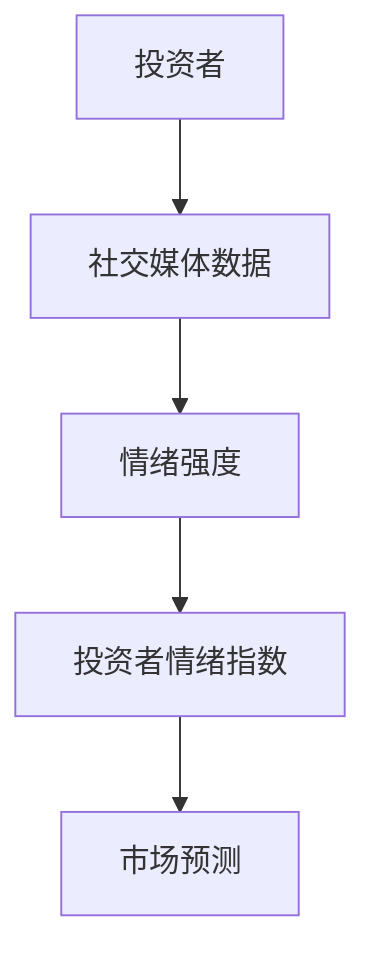

                 

# AI驱动的投资者情绪指数开发

## 关键词：投资者情绪指数，AI，自然语言处理，情感计算，金融数据分析

## 摘要：本文详细探讨了如何利用人工智能技术开发投资者情绪指数。通过分析投资者情绪的构成要素，结合自然语言处理和情感计算算法，构建了一个完整的投资者情绪指数模型，并通过实际案例展示了该模型的应用与效果。

---

# 第1章: 投资者情绪指数开发背景

## 1.1 问题背景与描述

### 1.1.1 传统金融市场的投资者情绪分析
在传统金融市场中，投资者情绪被认为是影响资产价格波动的重要因素之一。然而，情绪本身是主观且难以量化的，传统的金融分析方法往往难以捕捉这种情绪变化。

### 1.1.2 AI技术在金融领域的应用潜力
随着人工智能技术的发展，尤其是自然语言处理和情感计算的进步，我们有能力从大量的非结构化数据（如社交媒体帖子、新闻文章、论坛讨论）中提取情绪信息，并将其量化为一个可计算的指数。

### 1.1.3 投资者情绪指数的定义与目标
投资者情绪指数（Investor Sentiment Index, ISI）是一个能够量化投资者整体情绪状态的指标。其目标是通过分析多种数据源，捕捉市场参与者的乐观或悲观情绪，并将其转化为一个可量化的数值。

## 1.2 投资者情绪指数的核心要素

### 1.2.1 情绪指数的构成要素
投资者情绪指数的构建需要考虑以下几个关键要素：
- **数据来源**：社交媒体、新闻、交易数据等。
- **情绪类别**：通常包括乐观、中性、悲观三种状态。
- **时间维度**：按分钟、小时、天等时间粒度计算。
- **权重因子**：不同数据源的权重可能不同。

### 1.2.2 数据来源与处理方法
投资者情绪指数的数据来源可以分为以下几类：
- **社交媒体数据**：如Twitter、Reddit等平台上的用户评论。
- **新闻数据**：包括财经新闻、市场评论等。
- **交易数据**：如股票交易量、订单簿等。

### 1.2.3 情绪指数的边界与外延
投资者情绪指数的构建需要明确其边界，例如：
- **数据范围**：是否仅考虑与金融相关的数据？
- **情绪范围**：是否只考虑极端情绪，还是也包括轻微情绪波动？
- **时间范围**：是否实时更新，还是按固定周期更新？

## 1.3 投资者情绪指数的构建逻辑

### 1.3.1 情绪指数的构建流程
1. **数据收集**：从多个数据源收集相关文本数据。
2. **数据预处理**：清洗数据，去除噪声。
3. **情绪分析**：对文本进行情绪分类。
4. **情绪强度计算**：量化每条文本的情绪强度。
5. **指数合成**：将多个情绪强度值合成一个综合指数。

### 1.3.2 情绪指数的数学模型
投资者情绪指数的计算可以表示为：
$$
ISI = \sum_{i=1}^{n} w_i \cdot s_i
$$
其中，$w_i$ 是第 $i$ 个数据源的权重，$s_i$ 是该数据源的情绪强度。

### 1.3.3 情绪指数的应用场景
- **风险预警**：通过情绪指数提前发现市场风险。
- **投资决策支持**：帮助投资者做出更明智的投资决策。
- **市场研究**：为学术研究提供数据支持。

## 1.4 本章小结
本章介绍了投资者情绪指数的背景、核心要素和构建逻辑，为后续的算法实现奠定了基础。

---

# 第2章: 投资者情绪指数的核心概念与联系

## 2.1 核心概念原理

### 2.1.1 情感计算的基本原理
情感计算（Affect Computing）是通过分析文本、语音、图像等数据，识别和理解人类情感的技术。其核心在于将情感信息转化为可计算的数值。

### 2.1.2 自然语言处理在情绪分析中的应用
自然语言处理（NLP）技术在情绪分析中的应用主要包括：
- **词袋模型**：将文本表示为词的集合。
- **TF-IDF**：计算词的重要性。
- **情感词典**：使用预定义的词汇来判断文本情绪。

### 2.1.3 情绪指数与市场行为的关系
投资者情绪指数可以通过分析市场参与者的言论和行为，揭示市场的乐观或悲观情绪，从而预测市场走势。

## 2.2 核心概念对比表

| 对比维度 | 传统金融指标 | 情绪指数 |
|----------|---------------|----------|
| 数据来源 | 交易数据、财务报表 | 文本数据、社交媒体 |
| 计算方式 | 数学模型、统计分析 | 情感计算、加权求和 |
| 应用场景 | 风险评估、投资决策 | 市场情绪分析、情绪驱动投资 |

## 2.3 ER实体关系图

## 2.4 本章小结
本章详细探讨了投资者情绪指数的核心概念及其与其他金融指标的区别，为后续的算法实现提供了理论基础。

---

# 第3章: 投资者情绪指数的算法原理

## 3.1 情感计算算法

### 3.1.1 基于词袋模型的情感分析
词袋模型将文本表示为一个词语的集合，不考虑词语的顺序。例如，文本“我非常喜欢这个产品”可以表示为 $\{我, 非常, 喜欢, 这个, 产品\}$。

### 3.1.2 基于TF-IDF的特征提取
TF-IDF（Term Frequency-Inverse Document Frequency）是一种常用的文本特征提取方法。其计算公式为：
$$
TF-IDF(t, d) = TF(t, d) \times ID

