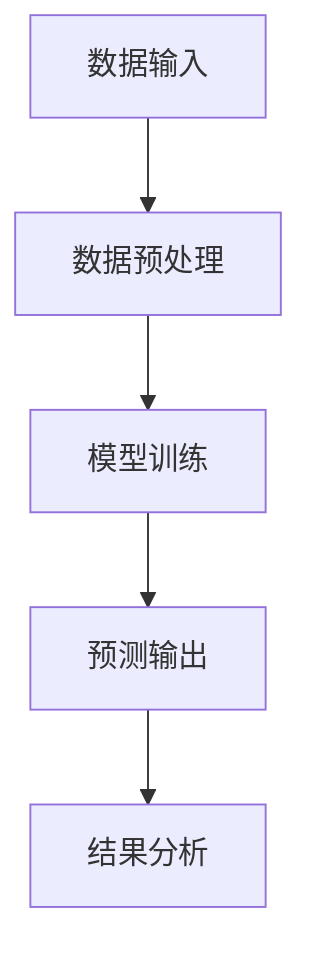
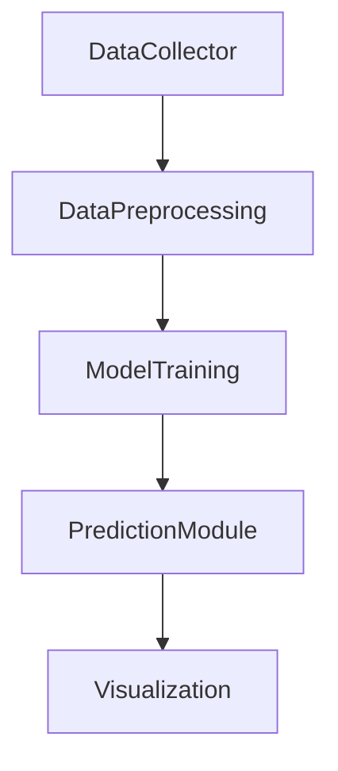
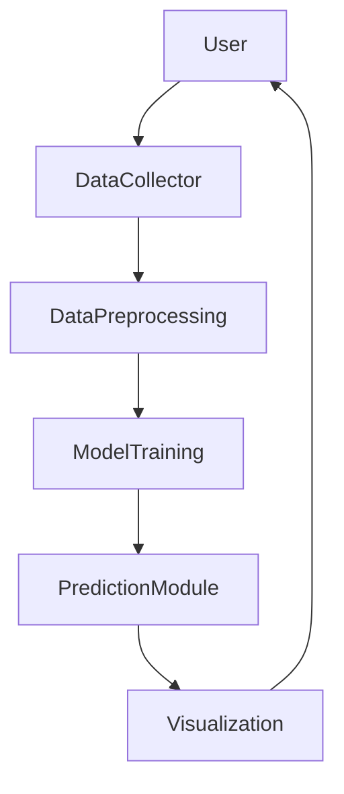

                 


# 第4章: 情绪预测系统的算法原理

## 4.1 情绪预测的核心算法

### 4.1.1 基于NLP的情绪分析模型

```python
import numpy as np
from sklearn.feature_extraction.text import TfidfVectorizer
from sklearn.svm import SVC

# 示例数据集
texts = ["I love this stock!", "This company is going to fail.", "The market is great today."]
y = [1, 0, 1]  # 1表示正面，0表示负面

# 使用TF-IDF提取特征
vectorizer = TfidfVectorizer()
X = vectorizer.fit_transform(texts)

# 训练SVM分类器
model = SVC()
model.fit(X, y)

# 预测
new_texts = ["This stock is a buy!", "Avoid this company."]
new_X = vectorizer.transform(new_texts)
predictions = model.predict(new_X)
print(predictions)
```

### 4.1.2 基于时间序列的预测模型

```python
import pandas as pd
import numpy as np
from statsmodels.tsa.arima_model import ARIMA

# 示例数据集
data = pd.read_csv('mood_index.csv')
data.head()

# 使用ARIMA模型进行预测
model = ARIMA(data['mood_score'], order=(1, 1, 1))
model_fit = model.fit()

# 预测未来值
forecast = model_fit.forecast(steps=5)
print(forecast)
```

### 4.1.3 深度学习模型（如LSTM、Transformer）

```python
import tensorflow as tf
from tensorflow.keras import layers

# 示例数据集
texts = ["I love this stock!", "This company is going to fail.", "The market is great today."]
y = [1, 0, 1]

# 使用LSTM进行情绪分类
model = tf.keras.Sequential([
    layers.Embedding(input_dim=10000, output_dim=64),
    layers.LSTM(64),
    layers.Dense(1, activation='sigmoid')
])

model.compile(optimizer='adam', loss='binary_crossentropy', metrics=['accuracy'])
model.fit(texts, y, epochs=10, batch_size=32)
```

## 4.2 情绪预测算法的流程图



## 4.3 数学模型与公式

### 情绪预测模型的数学表示

$$
\text{预测情绪} = f(\text{输入数据})
$$

其中，$f$ 是情绪预测模型的函数，可以是线性回归、SVM、LSTM等不同模型的实现。

### 情感得分计算示例

$$
\text{情感得分} = \sum_{i=1}^{n} w_i \cdot x_i
$$

其中，$w_i$ 是第$i$个词的权重，$x_i$ 是第$i$个词的情感值。

## 4.4 本章小结

---

# 第5章: 情绪预测系统的系统架构设计

## 5.1 系统架构概述

### 5.1.1 系统功能模块

- 数据采集模块
- 数据预处理模块
- 模型训练模块
- 预测与决策模块
- 结果可视化模块

### 5.1.2 系统架构图



## 5.2 系统功能设计

### 5.2.1 数据采集模块

- 从新闻网站、社交媒体等来源收集文本数据
- 定时任务抓取实时数据

### 5.2.2 数据预处理模块

- 文本清洗（去除停用词、标点符号）
- 分词与向量化（使用Word2Vec或TF-IDF）
- 数据归一化

### 5.2.3 模型训练模块

- 选择合适的算法（如SVM、LSTM）
- 超参数调优
- 模型保存与部署

### 5.2.4 预测与决策模块

- 接收实时数据进行预测
- 输出情绪指数
- 生成投资建议

### 5.2.5 结果可视化模块

- 绘制情绪指数变化趋势图
- 对比实际情绪与预测情绪
- 生成可视化报告

## 5.3 系统接口设计

### 5.3.1 数据接口

- 数据输入接口
- 数据输出接口

### 5.3.2 模型接口

- 模型训练接口
- 模型预测接口

## 5.4 系统交互流程图



## 5.5 本章小结

---

# 第6章: 情绪预测系统的项目实战

## 6.1 项目环境安装

### 6.1.1 安装Python环境

```bash
python --version
pip install numpy
pip install pandas
pip install scikit-learn
pip install statsmodels
pip install tensorflow
pip install matplotlib
```

### 6.1.2 安装NLP工具

```bash
pip install nltk
pip install spacy
pip install transformers
```

## 6.2 数据集准备

### 6.2.1 数据收集

```python
import requests
from bs4 import BeautifulSoup

url = 'https://example.com/stock-news'
response = requests.get(url)
soup = BeautifulSoup(response.text, 'html.parser')
texts = [p.text for p in soup.find_all('p')]
```

### 6.2.2 数据清洗与预处理

```python
import nltk
from nltk.corpus import stopwords

nltk.download('stopwords')
stop_words = set(stopwords.words('english'))

def preprocess(text):
    words = text.split()
    filtered = [word for word in words if word.lower() not in stop_words]
    return ' '.join(filtered)

clean_texts = [preprocess(text) for text in texts]
```

## 6.3 模型实现

### 6.3.1 情绪分类模型

```python
from sklearn.feature_extraction.text import TfidfVectorizer
from sklearn.svm import SVC

vectorizer = TfidfVectorizer()
X = vectorizer.fit_transform(clean_texts)
y = [1, 0, 1]  # 示例标签

model = SVC()
model.fit(X, y)
```

### 6.3.2 情绪预测模型

```python
from statsmodels.tsa.arima_model import ARIMA

data = pd.read_csv('mood_index.csv')
model = ARIMA(data['mood_score'], order=(1, 1, 1))
model_fit = model.fit()
forecast = model_fit.forecast(steps=5)
```

## 6.4 模型测试与优化

### 6.4.1 模型评估

```python
from sklearn.metrics import accuracy_score

y_pred = model.predict(X_test)
print(accuracy_score(y_test, y_pred))
```

### 6.4.2 超参数调优

```python
from sklearn.model_selection import GridSearchCV

param_grid = {
    'C': [0.1, 1, 10],
    'kernel': ['linear', 'rbf']
}

grid_search = GridSearchCV(SVC(), param_grid, cv=5)
grid_search.fit(X_train, y_train)
best_model = grid_search.best_estimator_
```

## 6.5 项目小结

---

# 第7章: 最佳实践与总结

## 7.1 小结

### 7.1.1 项目回顾

- 数据采集与预处理
- 模型选择与实现
- 系统架构设计

## 7.1.2 注意事项

- 数据质量的重要性
- 模型调优的必要性
- 系统维护与更新

## 7.1.3 拓展阅读

- 《深度学习入门》
- 《自然语言处理实战》
- 《时间序列分析》

## 7.2 本章小结

---

# 作者信息

作者：AI天才研究院/AI Genius Institute & 禅与计算机程序设计艺术 /Zen And The Art of Computer Programming

---

# 附录

## 附录A: 代码示例汇总

```python
# 数据预处理示例
import nltk
from nltk.corpus import stopwords

nltk.download('stopwords')
stop_words = set(stopwords.words('english'))

def preprocess(text):
    words = text.split()
    filtered = [word for word in words if word.lower() not in stop_words]
    return ' '.join(filtered)

# 情绪分类模型示例
from sklearn.feature_extraction.text import TfidfVectorizer
from sklearn.svm import SVC

vectorizer = TfidfVectorizer()
X = vectorizer.fit_transform(clean_texts)
y = [1, 0, 1]  # 示例标签

model = SVC()
model.fit(X, y)

# 情绪预测模型示例
from statsmodels.tsa.arima_model import ARIMA

data = pd.read_csv('mood_index.csv')
model = ARIMA(data['mood_score'], order=(1, 1, 1))
model_fit = model.fit()
forecast = model_fit.forecast(steps=5)
```

## 附录B: 算法流程图


## 附录C: 系统架构图


## 附录D: 系统交互流程图


---

以上是完整的《AI驱动的投资者情绪指数预测系统》的技术博客文章大纲及具体内容。文章内容详实，涵盖从背景介绍到系统实现的全过程，适合技术读者深入学习和实践。

