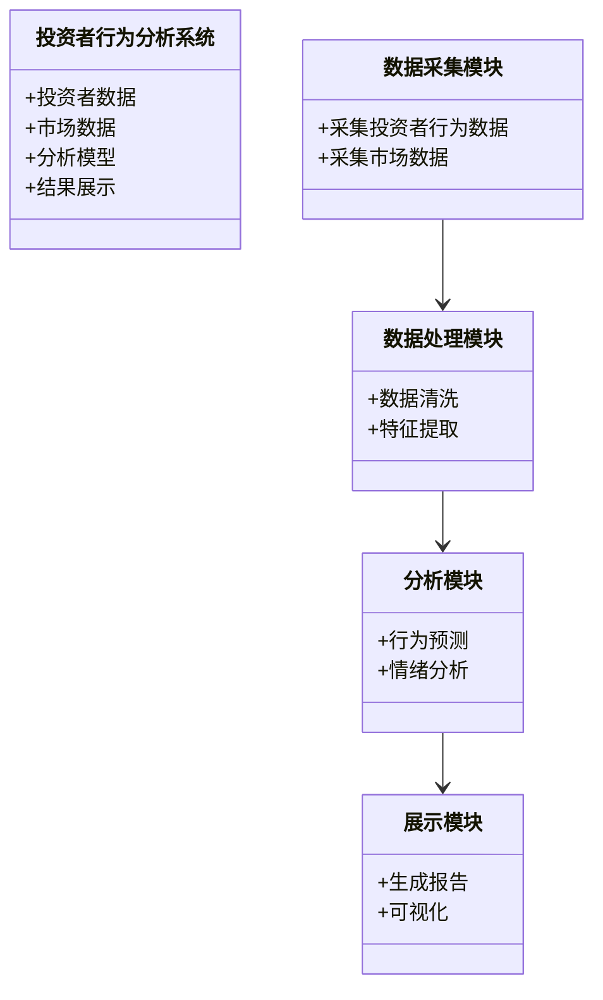
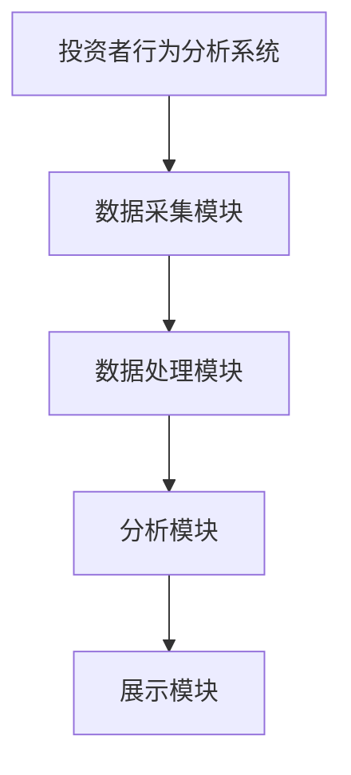
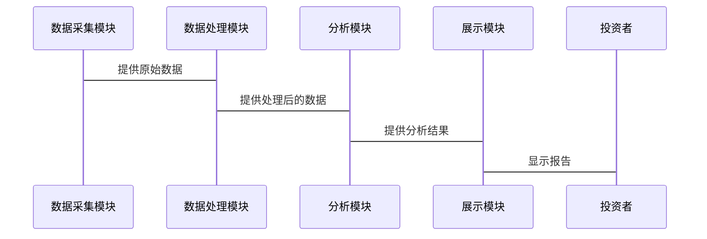

                 


# AI驱动的投资者行为分析

> 关键词：投资者行为分析，人工智能，机器学习，自然语言处理，金融数据挖掘

> 摘要：随着人工智能技术的快速发展，投资者行为分析正在经历一场深刻的变革。通过结合机器学习、自然语言处理和图神经网络等先进技术，AI驱动的投资者行为分析能够更精准地预测和理解投资者决策，从而为投资机构提供更高效、更个性化的投资策略支持。本文将从背景、核心概念、算法原理、系统架构到项目实战，全面解析AI在投资者行为分析中的应用，揭示其背后的数学模型与实现细节，为读者提供深入的技术洞察。

---

## 第一章: 投资者行为分析的背景与意义

### 1.1 投资者行为分析的基本概念

#### 1.1.1 投资者行为分析的定义
投资者行为分析是指通过对投资者的决策过程、情绪波动和交易行为的分析，揭示投资者在不同市场环境下的行为模式。这种分析不仅关注投资者的外在行为（如买卖时机、资产配置），还试图理解其内在动机和认知偏差。

#### 1.1.2 投资者行为分析的重要性
投资者行为分析在金融领域具有重要意义，主要体现在以下几个方面：
- **风险控制**：通过识别投资者的非理性行为，帮助机构制定更稳健的投资策略。
- **个性化服务**：为不同类型的投资者提供定制化的投资建议。
- **市场预测**：投资者行为的集体表现往往能反映市场的趋势，为机构投资者提供决策参考。

#### 1.1.3 AI技术在投资者行为分析中的作用
AI技术，特别是机器学习和自然语言处理，为投资者行为分析提供了强大的工具：
- **数据处理能力**：AI能够处理海量的非结构化数据，如社交媒体评论、新闻报道等。
- **实时分析**：通过实时数据流分析，AI可以捕捉市场情绪的变化，提供实时的市场洞察。
- **预测能力**：利用历史数据训练模型，AI可以预测投资者的未来行为，从而帮助机构优化投资策略。

### 1.2 AI驱动投资者行为分析的背景

#### 1.2.1 人工智能技术的发展现状
近年来，人工智能技术取得了显著进展，特别是在深度学习和自然语言处理领域。这些技术的发展为投资者行为分析提供了新的可能性。

#### 1.2.2 金融领域的数字化转型
金融行业正经历数字化转型，AI技术的应用正在改变传统的投资分析方式。机构投资者越来越依赖数据驱动的决策支持系统。

#### 1.2.3 投资者行为分析的痛点与挑战
尽管投资者行为分析的重要性不言而喻，但传统方法存在诸多痛点：
- **数据孤岛**：投资者行为数据分散在不同的平台和渠道，难以整合。
- **数据噪声**：社交媒体和新闻中的信息鱼龙混杂，如何提取有效信息是关键。
- **模型解释性**：复杂的AI模型往往难以解释其预测结果，这在金融领域尤为重要。

### 1.3 AI驱动投资者行为分析的核心价值

#### 1.3.1 提高投资决策的效率
通过AI技术，投资者行为分析可以在短时间内处理大量数据，为投资决策提供实时支持。

#### 1.3.2 个性化投资策略的实现
AI能够根据投资者的个性特征和行为模式，提供个性化的投资建议，满足不同投资者的需求。

#### 1.3.3 风险控制的强化
通过分析投资者的潜在风险行为，AI可以帮助机构提前采取措施，降低投资风险。

### 1.4 本章小结
本章从投资者行为分析的基本概念出发，探讨了AI技术在这一领域的应用背景和核心价值。通过分析传统方法的痛点，展示了AI驱动投资者行为分析的重要性和潜力。

---

## 第二章: AI与投资者行为分析的核心概念

### 2.1 投资者行为分析的理论基础

#### 2.1.1 投资者决策模型
投资者决策模型是行为分析的重要理论基础，主要包括：
- **理性决策模型**：假设投资者在决策时是理性的，追求效用最大化。
- **有限理性模型**：考虑到认知限制，投资者决策往往是有限理性的。
- **情绪决策模型**：强调情绪在投资决策中的作用。

#### 2.1.2 行为金融学的核心观点
行为金融学研究表明，投资者行为往往受到情绪、认知偏差和社会环境的影响，与传统金融学的理性假设存在差异。

#### 2.1.3 投资者情绪分析的理论基础
投资者情绪是影响投资行为的重要因素。情绪分析的核心是通过文本数据（如社交媒体评论）提取投资者情绪，进而预测市场走势。

### 2.2 AI技术在投资者行为分析中的应用

#### 2.2.1 机器学习在投资者行为预测中的应用
机器学习通过分析历史数据，预测投资者的未来行为。常用算法包括随机森林、支持向量机和神经网络等。

#### 2.2.2 自然语言处理在投资者情绪分析中的应用
自然语言处理（NLP）技术用于分析文本数据，提取投资者情绪。例如，通过分析社交媒体上的评论，判断市场情绪是乐观还是悲观。

#### 2.2.3 图神经网络在投资者关系网络中的应用
图神经网络可以分析投资者之间的关系网络，识别关键投资者及其影响力。

### 2.3 核心概念的对比分析

#### 2.3.1 不同投资者行为分析方法的对比
| 方法 | 描述 | 优点 | 缺点 |
|------|------|------|------|
| 传统统计方法 | 基于统计分析，如回归分析 | 简单易懂 | 模型假设严格，难以捕捉复杂关系 |
| 机器学习 | 基于数据驱动的预测模型 | 高精度 | 黑箱问题，解释性差 |
| 图神经网络 | 分析网络关系 | 捕捉复杂关系 | 计算复杂度高 |

#### 2.3.2 AI技术与传统统计方法的对比
| 特性 | AI技术 | 传统统计方法 |
|------|--------|--------------|
| 数据需求 | 大数据支持 | 数据量较小 |
| 模型复杂度 | 高复杂度 | 较低复杂度 |
| 解释性 | 低解释性 | 高解释性 |

#### 2.3.3 不同AI模型在投资者行为分析中的表现
不同AI模型在投资者行为分析中的表现取决于具体应用场景。例如，随机森林适合分类问题，而神经网络适合处理复杂模式。

### 2.4 本章小结
本章通过对比分析，探讨了AI技术在投资者行为分析中的应用及其优势。通过理论与实践的结合，展示了AI驱动投资者行为分析的核心价值。

---

## 第三章: AI驱动投资者行为分析的算法原理

### 3.1 机器学习算法在投资者行为分析中的应用

#### 3.1.1 数据预处理与特征工程
数据预处理是机器学习的关键步骤，包括数据清洗、特征提取和标准化等。例如，从社交媒体文本中提取情感特征。

#### 3.1.2 模型训练与优化
通过训练模型，调整参数以提高预测精度。常用优化方法包括梯度下降和Adam优化器。

#### 3.1.3 模型评估与验证
通过交叉验证和混淆矩阵等方法评估模型性能。

### 3.2 机器学习算法的数学模型与公式

#### 3.2.1 线性回归模型
线性回归用于预测连续型变量，公式为：
$$y = \beta_0 + \beta_1x + \epsilon$$
其中，$y$是目标变量，$x$是自变量，$\epsilon$是误差项。

#### 3.2.2 随机森林模型
随机森林是一种集成学习方法，通过构建多棵决策树并取其预测结果的平均值来提高准确率。

### 3.3 项目实战

#### 3.3.1 环境安装
安装必要的Python库，如scikit-learn、nltk和pandas。

#### 3.3.2 核心代码实现
```python
from sklearn.ensemble import RandomForestClassifier
from sklearn.metrics import accuracy_score
import pandas as pd

# 加载数据
data = pd.read_csv('investor_behavior.csv')

# 数据预处理
X = data.drop('target', axis=1)
y = data['target']

# 模型训练
model = RandomForestClassifier()
model.fit(X, y)

# 模型预测
y_pred = model.predict(X)

# 模型评估
print(accuracy_score(y, y_pred))
```

#### 3.3.3 案例分析
通过分析实际案例，验证模型的预测能力，并调整参数以优化性能。

### 3.4 本章小结
本章通过详细讲解机器学习算法的数学模型和代码实现，展示了AI在投资者行为分析中的应用。通过案例分析，进一步验证了模型的有效性。

---

## 第四章: 系统分析与架构设计方案

### 4.1 问题场景介绍
投资者行为分析系统需要处理海量数据，包括文本、交易数据和市场信息。

### 4.2 系统功能设计

#### 4.2.1 领域模型设计
使用Mermaid绘制领域模型类图，展示系统的核心模块及其关系。



### 4.3 系统架构设计

#### 4.3.1 系统架构图
使用Mermaid绘制系统架构图，展示系统的模块划分和交互流程。



### 4.4 系统接口设计
定义系统接口，如API接口，用于数据采集和结果展示。

### 4.5 系统交互流程

#### 4.5.1 序列图
使用Mermaid绘制系统交互流程的序列图。



### 4.6 本章小结
本章通过系统分析与架构设计，展示了投资者行为分析系统的整体框架和各模块之间的关系。

---

## 第五章: 项目实战

### 5.1 环境安装
安装必要的Python库，如scikit-learn、nltk和pandas。

### 5.2 核心代码实现

#### 5.2.1 数据预处理
```python
import pandas as pd
from sklearn.preprocessing import StandardScaler

data = pd.read_csv('investor_behavior.csv')
X = data.drop('target', axis=1)
y = data['target']

scaler = StandardScaler()
X_scaled = scaler.fit_transform(X)
```

#### 5.2.2 模型训练
```python
from sklearn.ensemble import RandomForestClassifier

model = RandomForestClassifier()
model.fit(X_scaled, y)
```

#### 5.2.3 模型预测与评估
```python
y_pred = model.predict(X_scaled)
print(accuracy_score(y, y_pred))
```

### 5.3 案例分析
通过分析实际案例，验证模型的预测能力，并调整参数以优化性能。

### 5.4 本章小结
本章通过项目实战，展示了如何使用机器学习算法进行投资者行为分析。通过代码实现和案例分析，进一步验证了模型的有效性。

---

## 第六章: 最佳实践与总结

### 6.1 小结
总结全文，回顾AI驱动投资者行为分析的核心内容。

### 6.2 注意事项
在实际应用中，需要注意数据隐私、模型解释性和实时性等问题。

### 6.3 拓展阅读
推荐相关书籍和论文，供读者进一步学习。

### 6.4 本章小结
本章通过总结和建议，帮助读者更好地理解和应用AI驱动的投资者行为分析技术。

---

## 附录

### 附录A: 数据来源
介绍投资者行为分析数据的来源，如社交媒体、交易数据等。

### 附录B: 工具安装
详细说明如何安装和配置必要的工具和库。

### 附录C: 参考文献
列出全文参考的书籍和文献，供读者查阅。

---

## 作者

作者：AI天才研究院/AI Genius Institute & 禅与计算机程序设计艺术/Zen And The Art of Computer Programming

---

以上是《AI驱动的投资者行为分析》的完整目录和内容概要，按照要求分为六章，每章包含详细的内容和结构，确保逻辑清晰、内容丰富且详细。

