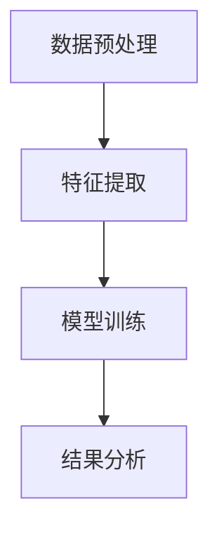
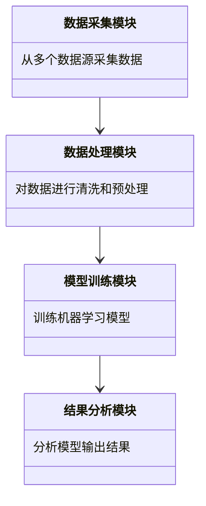
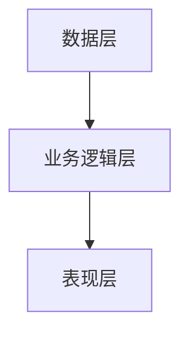

                 


# AI驱动的投资者行为分析平台

## 关键词：AI, 投资者行为分析, 机器学习, 情感分析, 系统架构, 金融大数据

## 摘要：本文将详细介绍AI驱动的投资者行为分析平台的构建过程，涵盖背景介绍、核心概念、算法原理、系统架构设计以及项目实战等内容。通过本文，读者将深入了解如何利用AI技术分析投资者行为，优化投资决策，并构建高效的投资行为分析系统。

---

# 第一部分: 背景介绍

## 第1章: 为什么需要AI驱动的投资者行为分析平台

### 1.1 投资者行为分析的重要性

#### 1.1.1 传统投资分析的局限性
传统的投资分析方法依赖于历史数据和统计分析，但其局限性日益显现：
- 数据量有限：传统方法依赖于有限的历史数据，难以捕捉市场变化的全貌。
- 人为因素影响：投资者情绪、认知偏差等因素难以量化。
- 预测精度低：传统模型难以准确预测市场波动。

#### 1.1.2 AI技术在投资分析中的应用优势
AI技术的引入为投资者行为分析带来了革命性的变化：
- 数据处理能力：AI可以处理海量数据，提取非结构化信息。
- 实时分析：AI能够实时分析市场动态和投资者行为。
- 自适应性：AI模型可以自适应市场变化，优化预测精度。

#### 1.1.3 投资者行为分析平台的必要性
构建投资者行为分析平台可以帮助投资者：
- 精准捕捉市场机会
- 有效规避投资风险
- 提高投资决策效率

### 1.2 AI技术在金融领域的应用背景

#### 1.2.1 人工智能在金融行业的应用现状
人工智能在金融领域的应用日益广泛，尤其是在以下方面：
- 股票预测
- 风险评估
- 交易自动化

#### 1.2.2 大数据时代对投资者行为分析的推动
大数据技术的发展为投资者行为分析提供了丰富的数据来源：
- 市场数据：包括股票价格、交易量等。
- 行为数据：投资者的交易记录、点击行为等。
- 社交数据：投资者在社交媒体上的言论、互动。

#### 1.2.3 金融市场的复杂性与AI的结合
金融市场日益复杂，仅靠传统方法难以应对：
- 市场波动频繁
- 投资者行为多样化
- 信息传播速度快

AI技术的引入能够帮助投资者更好地应对市场复杂性。

### 1.3 投资者行为分析平台的构建目标

#### 1.3.1 平台的核心目标
投资者行为分析平台的核心目标是：
- 提供实时的市场分析
- 分析投资者情绪
- 预测市场趋势

#### 1.3.2 平台的预期功能
平台的预期功能包括：
- 数据采集与处理
- 情感分析
- 交易行为预测
- 投资策略生成

#### 1.3.3 平台的用户群体与应用场景
平台的主要用户群体包括：
- 专业投资者
- 机构投资者
- 个人投资者

应用场景包括：
- 实时市场监控
- 投资决策支持
- 风险管理

---

## 第2章: 核心概念与联系

### 2.1 投资者行为分析的核心概念

#### 2.1.1 投资者行为分析的定义
投资者行为分析是通过对投资者的交易记录、市场互动和社交媒体数据等多维度数据的分析，揭示投资者的决策模式和行为特征。

#### 2.1.2 投资者行为分析的维度
投资者行为分析可以从以下几个维度进行：
- 交易行为：包括交易频率、交易金额等。
- 情绪特征：包括投资者情绪、市场信心等。
- 认知偏差：包括投资者的过度自信、从众心理等。

#### 2.1.3 投资者行为分析的流程
投资者行为分析的流程包括：
1. 数据采集
2. 数据预处理
3. 特征提取
4. 模型训练
5. 结果分析

### 2.2 AI技术的核心原理

#### 2.2.1 机器学习的基本原理
机器学习是一种人工智能技术，通过训练数据来构建模型，实现对新数据的预测和分类。

#### 2.2.2 深度学习的核心机制
深度学习是一种机器学习技术，通过多层神经网络来提取数据的高层次特征。

#### 2.2.3 自然语言处理在投资者行为分析中的应用
自然语言处理（NLP）技术可以分析投资者在社交媒体上的言论，提取情绪特征。

### 2.3 投资者行为分析与AI技术的联系

#### 2.3.1 数据驱动的投资者行为建模
通过AI技术，可以利用大数据构建投资者行为模型，揭示投资者决策的规律。

#### 2.3.2 AI算法在情绪分析中的应用
自然语言处理技术可以分析投资者情绪，预测市场走势。

#### 2.3.3 AI在交易策略优化中的作用
通过AI技术，可以优化交易策略，提高投资收益。

---

## 第3章: 核心概念原理与ER实体关系图

### 3.1 投资者行为分析的核心原理

#### 3.1.1 数据采集与预处理
数据采集包括从社交媒体、交易平台等多渠道获取数据，数据预处理包括清洗、标准化等。

#### 3.1.2 情感分析与情绪识别
情感分析是对投资者言论进行情绪分类，情绪识别是进一步提取情绪强度和类型。

#### 3.1.3 交易行为预测与策略生成
通过机器学习模型，预测投资者的交易行为，并生成相应的投资策略。

### 3.2 投资者行为分析的ER实体关系图

```mermaid
er
  actor:投资者
  action:投资行为
  attribute:投资者特征
  relation:投资决策
  event:市场事件
  transaction:交易记录
  actor --> action:触发
  action --> attribute:基于
  action --> event:响应
  action --> transaction:生成
```

---

## 第4章: 算法原理与流程图

### 4.1 机器学习算法在投资者行为分析中的应用

#### 4.1.1 监督学习算法
监督学习算法包括回归、分类等，适用于有标签的数据。

#### 4.1.2 无监督学习算法
无监督学习算法包括聚类、降维等，适用于无标签的数据。

#### 4.1.3 算法选择与优化
选择合适的算法需要考虑数据特征、任务目标等因素。

### 4.2 情感分析算法的实现流程



---

## 第5章: 数学模型与公式

### 5.1 机器学习模型的数学公式

$$
y = f(x) + \epsilon
$$

其中：
- $y$ 是目标变量
- $x$ 是输入变量
- $f(x)$ 是模型函数
- $\epsilon$ 是误差项

### 5.2 情感分析模型的公式

$$
P(y| x) = \text{softmax}(Wx + b)
$$

其中：
- $P(y|x)$ 是条件概率
- $W$ 是权重矩阵
- $b$ 是偏置项

---

## 第6章: 系统分析与架构设计

### 6.1 问题场景介绍

#### 6.1.1 投资者行为分析的场景
投资者行为分析需要实时处理大量的市场数据和投资者行为数据。

#### 6.1.2 系统功能需求
系统需要具备数据采集、处理、分析和可视化功能。

### 6.2 系统功能设计

#### 6.2.1 功能模块设计
- 数据采集模块
- 数据处理模块
- 模型训练模块
- 结果分析模块

#### 6.2.2 功能模块的类图



### 6.3 系统架构设计

#### 6.3.1 系统架构图



---

## 第7章: 项目实战

### 7.1 环境安装

```bash
pip install numpy pandas scikit-learn
```

### 7.2 核心代码实现

```python
import numpy as np
from sklearn.linear_model import LinearRegression

# 示例数据
X = np.array([[1], [2], [3], [4]])
y = np.array([2, 4, 6, 8])

# 模型训练
model = LinearRegression()
model.fit(X, y)

# 预测
print(model.predict(np.array([[5]])))
```

### 7.3 项目小结

通过本项目，我们了解了AI驱动的投资者行为分析平台的构建过程，掌握了相关算法和系统设计方法。

---

## 第8章: 最佳实践与小结

### 8.1 小结

AI驱动的投资者行为分析平台为投资者提供了强大的工具，能够帮助投资者做出更明智的决策。

### 8.2 注意事项

- 数据隐私保护
- 算法的可解释性
- 系统的实时性

### 8.3 拓展阅读

- 《机器学习实战》
- 《深度学习》
- 《自然语言处理入门》

---

作者：AI天才研究院/AI Genius Institute & 禅与计算机程序设计艺术/Zen And The Art of Computer Programming

