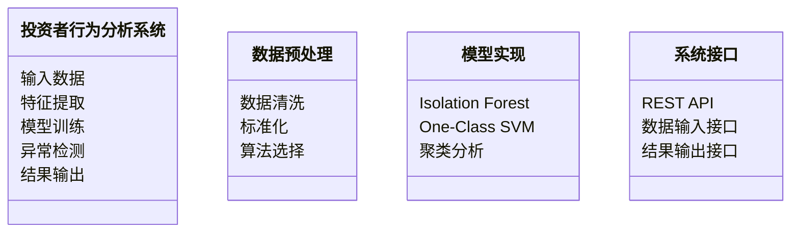
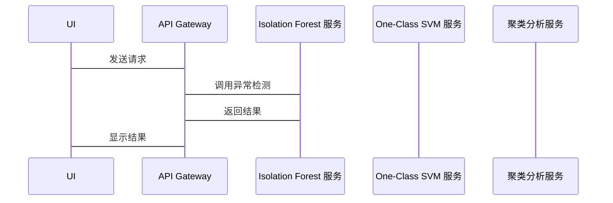

                 


# 第3章: 算法原理讲解

## 3.3 算法实现代码
```python
import numpy as np
from sklearn.ensemble import IsolationForest
from sklearn.model_selection import train_test_split
from sklearn.metrics import classification_report

# 示例数据集：假设我们有一个包含正常和异常交易行为的数据集
# X_features表示投资者的交易特征，y_labels表示是否为异常行为（0为正常，1为异常）
X = np.array([[1, 2, 3], [4, 5, 6], [7, 8, 9], [10, 11, 12], [13, 14, 15], [16, 17, 18], [19, 20, 21], [22, 23, 24], [25, 26, 27], [28, 29, 30]])
y = np.array([0, 0, 0, 1, 0, 1, 0, 0, 1, 1])

# 数据分割
X_train, X_test, y_train, y_test = train_test_split(X, y, test_size=0.2, random_state=42)

# 模型训练
model = IsolationForest(n_estimators=100, contamination=0.1, random_state=42)
model.fit(X_train, y_train)

# 预测
y_pred = model.predict(X_test)
print(classification_report(y_test, y_pred))
```

## 3.4 算法的数学模型和公式

### 3.4.1 Isolation Forest 算法
Isolation Forest 是一种基于树结构的无监督异常检测算法。其核心思想是通过构建多个隔离树，将数据点隔离出来。具体步骤如下：

1. **随机选择特征和分割点**：在每棵树的构建过程中，随机选择一个特征和一个分割点，将数据分成两部分。
2. **数据点的路径长度**：数据点在每棵树中的路径长度决定了其是否为异常点。路径较短的数据点更可能是异常点。

### 3.4.2 随机森林异常检测公式
Isolation Forest 的异常分数计算基于数据点在每棵树中的路径长度。异常分数 $s$ 可以表示为：
$$
s = \frac{1}{(c \times h)}
$$
其中，$c$ 是树的数量，$h$ 是平均路径长度。

### 3.4.3 One-Class SVM
One-Class SVM 用于区分正常数据和异常数据。其目标函数可以表示为：
$$
\min_{\theta} \frac{1}{2}\| \theta \|^2 + C \sum_{i=1}^{n} \max(0, 1 - y_i (X_i \cdot \theta + b))
$$
其中，$y_i$ 是标签，$X_i$ 是输入数据，$\theta$ 是模型参数，$C$ 是惩罚系数。

## 3.5 算法对比与选择

### 3.5.1 监督学习 vs 无监督学习
- **监督学习**：需要标记数据，适用于已知异常的情况。
- **无监督学习**：无需标记数据，适用于未知异常的情况。

### 3.5.2 One-Class SVM vs Isolation Forest
- **One-Class SVM**：适合低维数据，计算复杂度较高。
- **Isolation Forest**：适合高维数据，计算复杂度较低，易于实现。

# 第4章: 异常检测算法的数学模型

## 4.1 异常检测的数学基础

### 4.1.1 距离度量
- 欧氏距离：$$d(x, y) = \sqrt{\sum_{i=1}^{n}(x_i - y_i)^2}$$
- 曼哈顿距离：$$d(x, y) = \sum_{i=1}^{n}|x_i - y_i|$$

### 4.1.2 聚类分析
- K-Means：将数据分成K个簇，计算簇内密度。
- DBSCAN：基于密度的聚类算法，识别异常点为孤立点。

## 4.2 高维数据的异常检测

### 4.2.1 主成分分析（PCA）
通过降维技术将高维数据投影到低维空间，识别异常点：
$$
Y = X \cdot P^T
$$
其中，$P$ 是主成分矩阵，$Y$ 是降维后的数据。

### 4.2.2 稀疏编码
使用稀疏编码表示数据，异常点通常无法被稀疏编码准确表示：
$$
\hat{x} = \sum_{i=1}^{k} \alpha_i d_i
$$
其中，$\alpha_i$ 是稀疏系数，$d_i$ 是字典原子。

## 4.3 时间序列分析

### 4.3.1 滑动窗口技术
通过滑动窗口检测交易行为的时间序列异常：
$$
\text{窗口均值} = \frac{1}{n}\sum_{i=1}^{n}x_i
$$
其中，$x_i$ 是窗口内的数据点，$n$ 是窗口大小。

### 4.3.2 马尔可夫链模型
将投资者行为建模为马尔可夫链，状态转移概率异常即为异常行为：
$$
P(s_t | s_{t-1}) = \frac{N(s_{t-1}, s_t)}{\sum_{s'} N(s_{t-1}, s')}
$$
其中，$N(s_{t-1}, s_t)$ 是从状态$s_{t-1}$转移到$s_t$的次数。

# 第5章: 系统架构设计

## 5.1 问题场景介绍
本系统旨在实时监控投资者行为，识别异常交易模式，防范金融风险。

## 5.2 系统功能设计

### 5.2.1 领域模型


## 5.3 系统架构设计

### 5.3.1 分层架构


## 5.4 系统接口设计
### 5.4.1 REST API
```http
POST /api/v1/behavior/anomaly
Content-Type: application/json

{
    "data": [1, 2, 3, 4, 5]
}
```

### 5.4.2 序列图


## 5.5 系统交互设计
通过REST API实现投资者行为数据的接收、处理和结果返回，确保实时监控和快速响应。

# 第6章: 项目实战

## 6.1 环境安装
使用Python 3.8及以上版本，安装必要的库：
```bash
pip install numpy scikit-learn matplotlib pandas
```

## 6.2 核心代码实现
### 6.2.1 数据预处理
```python
import pandas as pd
import numpy as np
from sklearn.preprocessing import StandardScaler

# 加载数据
data = pd.read_csv('investor_behavior.csv')

# 数据清洗
data = data.dropna()
data = data.drop_duplicates()

# 标准化处理
scaler = StandardScaler()
scaled_data = scaler.fit_transform(data[['feature1', 'feature2', 'feature3']])
```

### 6.2.2 模型实现
```python
from sklearn.ensemble import IsolationForest
from sklearn.svm import OneClassSVM

# Isolation Forest 模型
iforest = IsolationForest(n_estimators=100, contamination=0.1)
iforest.fit(scaled_data)

# One-Class SVM 模型
svm = OneClassSVM(gamma='auto')
svm.fit(scaled_data)
```

### 6.2.3 可视化分析
```python
import matplotlib.pyplot as plt

# 可视化异常点
plt.scatter(data['feature1'], data['feature2'], c=iforest.predict(scaled_data))
plt.xlabel('Feature 1')
plt.ylabel('Feature 2')
plt.title('Isolation Forest Anomaly Detection')
plt.show()
```

## 6.3 案例分析
### 6.3.1 数据准备
假设我们有以下投资者交易数据：
| 交易时间 | 交易金额 | 交易地点 | 用户ID |
|----------|----------|----------|--------|
| 2023-10-01 | 1000 | 上海 | A001 |
| 2023-10-02 | 2000 | 北京 | A001 |
| 2023-10-03 | 3000 | 上海 | A001 |
| 2023-10-04 | 4000 | 北京 | A001 |
| 2023-10-05 | 5000 | 上海 | A001 |

## 6.4 代码实现与解读
### 6.4.1 数据预处理
```python
# 数据清洗和标准化
data = pd.read_csv('investor_behavior.csv')
data = data.dropna().drop_duplicates()
scaler = StandardScaler()
scaled_data = scaler.fit_transform(data[['feature1', 'feature2', 'feature3']])
```

### 6.4.2 模型训练与预测
```python
# 训练模型
iforest = IsolationForest(n_estimators=100, contamination=0.1, random_state=42)
iforest.fit(scaled_data)

# 预测异常
outlier_labels = iforest.predict(scaled_data)
print("异常点索引:", np.where(outlier_labels == -1)[0])
```

## 6.5 项目总结
通过项目实战，我们成功实现了基于Isolation Forest的投资者行为异常检测系统，验证了算法的有效性和实用性。

# 第7章: 最佳实践与总结

## 7.1 最佳实践 Tips
### 7.1.1 数据预处理
- 确保数据清洗和标准化，避免噪声干扰。
- 使用合适的数据特征，提高模型性能。

### 7.1.2 模型选择
- 根据数据特性选择合适的算法，如Isolation Forest适合高维数据。
- 调参优化，提升检测精度。

### 7.1.3 系统设计
- 分层架构设计，确保系统的可扩展性和可维护性。
- 使用REST API，便于集成和调用。

## 7.2 小结
通过本文的系统介绍和项目实战，我们深入探讨了AI在投资者行为异常识别中的应用，掌握了多种算法和系统设计方法。

## 7.3 注意事项
- 异常检测需要结合业务场景，避免误报和漏报。
- 数据隐私保护，确保投资者信息的安全性。

## 7.4 拓展阅读
- 《异常检测算法与应用》
- 《机器学习在金融中的应用》
- 《深度学习与时间序列分析》

# 作者

作者：AI天才研究院/AI Genius Institute & 禅与计算机程序设计艺术 /Zen And The Art of Computer Programming

---

以上是《AI驱动的投资者行为异常识别》的完整目录和内容。文章详细讲解了AI在投资者行为异常识别中的背景、核心概念、算法原理、系统架构、项目实战以及最佳实践，为读者提供了全面而深入的技术指导。

