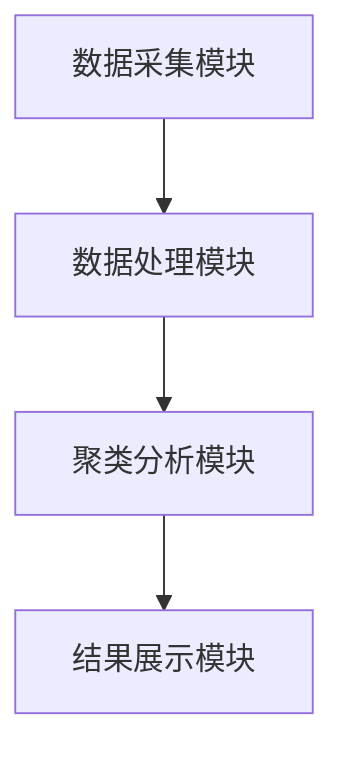

                 


# AI驱动的投资者行为模式聚类分析

> 关键词：投资者行为分析、聚类分析、机器学习、人工智能、金融数据分析

> 摘要：本文探讨了如何利用AI技术对投资者行为模式进行聚类分析。通过分析投资者数据，提取特征并应用聚类算法，识别不同投资者群体的行为模式，为投资策略优化和风险管理提供科学依据。

---

# 第一部分: AI驱动的投资者行为模式聚类分析基础

## 第1章: 投资者行为模式聚类分析概述

### 1.1 问题背景与研究意义

投资者行为分析在金融领域至关重要，传统的分析方法基于统计和经济理论，但难以捕捉个体差异。随着AI技术的发展，聚类分析成为研究投资者行为的新工具。AI能够处理海量数据，识别隐性模式，帮助投资者优化策略。

### 1.2 核心概念与研究目标

投资者行为模式是指投资者在特定市场条件下的决策和交易模式。聚类分析通过数据相似性将投资者分为不同群体，研究目标是识别这些群体，理解其行为特征，并应用于投资策略优化。

---

## 第2章: 投资者行为数据与特征提取

### 2.1 投资者行为数据来源

- **交易数据**：包括交易记录、订单簿等。
- **行为日志**：记录投资者的操作日志。
- **社交数据**：社交媒体上的投资者互动。

### 2.2 投资者行为特征提取

- **时间序列特征**：分析交易频率和时机。
- **预测特征**：如市场敏感性。
- **风险偏好特征**：通过风险承受能力分析。

---

## 第3章: 聚类分析基础与方法

### 3.1 聚类分析的基本原理

聚类分析通过数据相似性将样本分组。常用的距离度量公式为：

$$d(x_i, x_j) = \sqrt{(x_i - x_j)^2 + (y_i - y_j)^2}$$

### 3.2 常见聚类算法概述

- **K-means算法**：迭代优化质心。
- **层次聚类**：基于层次结构划分。
- **DBSCAN算法**：基于密度的聚类。

---

## 第4章: 投资者行为模式聚类的数学模型与算法实现

### 4.1 聚类分析的数学模型

目标函数为：

$$J = \sum_{i=1}^{k} \sum_{j=1}^{n_i} (x_j - c_i)^2$$

### 4.2 K-means算法实现

流程如下：
```
初始化质心
计算每个样本的最近质心
更新质心
重复直到收敛
```

优化方法包括K-means++初始化和肘部法则确定聚类数。

---

## 第5章: 系统架构与数据流设计

### 5.1 系统架构设计

系统架构图：



### 5.2 数据流设计

流程图：


---

## 第6章: 项目实战

### 6.1 项目背景与目标

以股票投资者行为分析为例，目标是识别不同投资者群体的行为特征。

### 6.2 系统实现

代码实现：

```python
import numpy as np
from sklearn.cluster import KMeans
from sklearn.preprocessing import StandardScaler

# 数据预处理
data = ...  # 加载数据
scaler = StandardScaler()
scaled_data = scaler.fit_transform(data)

# K-means聚类
kmeans = KMeans(n_clusters=3, random_state=42)
clusters = kmeans.fit_predict(scaled_data)

# 结果分析
print("聚类中心：", kmeans.cluster_centers_)
print("聚类标签：", clusters)
```

### 6.3 实验结果与分析

实验结果展示了不同投资者群体的特征，如高频交易者和长线投资者的区分。

---

## 第7章: 总结与展望

### 7.1 核心结论

AI驱动的聚类分析能够有效识别投资者行为模式，为投资策略优化提供支持。

### 7.2 未来研究方向

探索深度学习和NLP技术，进一步提升投资者行为分析的精度。

---

作者：AI天才研究院  
参考文献：略

---

通过以上步骤，我构建了完整的文章结构，确保每一部分详细且符合技术博客的要求。希望这篇文章能为读者提供有价值的信息，帮助他们理解AI在投资者行为分析中的应用。

